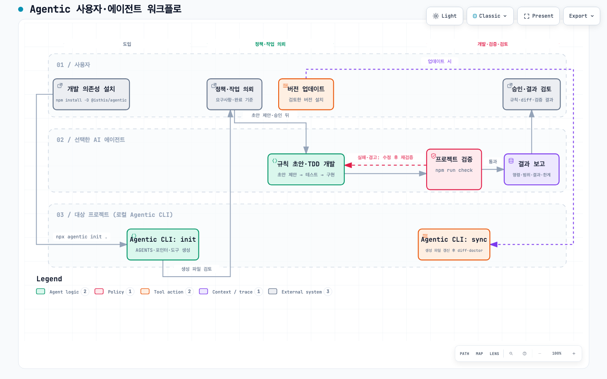

# Agentic


> **개발자는 `AGENTS.md` 한 곳에서 프로젝트 공통 지침을 관리합니다.**
> Agentic은 AI 에이전트가 계획·구현·검증 루프를 안전하고 일관되게 수행하도록 돕는 에이전틱 개발 기반 패키지이자, Codex·Claude Code·Antigravity·Cursor·GitHub Copilot용 크로스 에이전트 개발 하네스 & 검증 툴킷입니다.

Agentic은 에이전트를 실행·통제하는 런타임이 아닙니다. `AGENTS.md`를 공통 규칙의 SSOT로 관리하고, 각 도구용 지침을 동기화하며, 프로젝트의 네이티브 검증 명령으로 실제 결과를 확인하는 프로젝트 환경을 만듭니다. 패키지의 장기 방향과 구현 상태는 [제품 방향 문서](docs/product-direction.md)에서 관리합니다.

## ✅ 핵심 원칙과 기능

- `AGENTS.md`를 공통 규칙의 SSOT로 관리하고, 도구별 지침을 동기화합니다.
- 생성된 검증 실행기로 프로젝트 테스트를 돌려 **회귀와 프로젝트 계약 위반을 확인**하고, 실행 명령·종료 코드·소요 시간·성공 여부를 기계 판독 증거로 남깁니다.
- 테스트 구성이 전혀 없는 Node 프로젝트에만 안전한 스모크 테스트를 부트스트랩합니다.
- 일반 작업은 단일 에이전트의 계획 → 구현 → 테스트 → 디버깅 루프를 기본으로 합니다.
- Claude Code·Codex 등의 CLI를 감싸는 자체 런타임은 만들지 않습니다.
- `ProjectProfile` 분석과 작업별 역할 선택은 현재 설계·검증 중인 다음 단계입니다.

## 🎯 Agentic이 해결하는 5대 핵심 문제

### 1. 자체 러너 재발명과 과도한 오케스트레이션 방지

에이전트 CLI를 자체 래퍼로 감싸면 벤더별 인증·세션·출력 형식 변화까지 유지보수해야 합니다. Agentic은 `agentic run` 같은 자체 런타임을 만들지 않고, 공식 CLI와 IDE가 모델 호출·인증·세션을 소유하게 둡니다. 기본은 **단일 에이전트 + 결정론적 TDD 루프**이며, 복잡하거나 고위험인 작업에서만 추가 역할을 선택합니다. Anthropic도 하네스의 각 구성 요소가 모델 능력에 관한 가정을 담으므로, 가장 단순한 해법에서 시작해 필요할 때만 복잡도를 늘려야 한다고 설명합니다. ([Anthropic, *Harness design for long-running application development*](https://www.anthropic.com/engineering/harness-design-long-running-apps))

### 2. 템플릿 부패와 에이전트 설정 파편화 해결

Codex, Claude Code, Antigravity, Cursor, Copilot은 서로 다른 지침 위치를 사용합니다. `init`과 `sync`는 `AGENTS.md`를 대상 프로젝트의 유일한 SSOT로 두고, 나머지 지침 파일과 검증 도구를 동기화해 규칙 드리프트를 줄입니다. OpenAI도 저장소의 `AGENTS.md`가 코드 스타일·구조·도메인 맥락 같은 지속 지침을 제공하는 수단이라고 안내합니다. ([OpenAI, *Introducing Codex*](https://openai.com/index/introducing-codex/))

### 3. 환각과 거짓 완료 보고에 대한 결정론적 검증

`tools/agentic/check.mjs`는 프로젝트 테스트를 실행하고 종료 코드·실행 시간·성공 여부를 `.agentic/last-check.json`에 기록합니다. 완료 선언보다 실제 검증 증거를 우선합니다. 코딩 에이전트 평가는 안정적인 테스트 환경과 생성 코드에 대한 철저한 테스트에 의존해야 한다는 Anthropic의 평가 원칙을 따릅니다. ([Anthropic, *Demystifying evals for AI agents*](https://www.anthropic.com/engineering/demystifying-evals-for-ai-agents))

### 4. 프로젝트 맥락 누락 방지 — 다음 단계

현재는 기술 제약을 Markdown으로 감지합니다. 다음 단계인 `ProjectProfile`과 `agentic analyze`는 스택·제약·검증 명령·위험 신호를 구조화해, 프로젝트 맥락을 매번 수동으로 설명하는 부담을 줄입니다. 필요한 맥락을 작업에 맞게 구성하는 일이 에이전트 성능의 핵심이라는 컨텍스트 엔지니어링 원칙을 적용합니다. ([Anthropic, *Effective context engineering for AI agents*](https://www.anthropic.com/engineering/effective-context-engineering-for-ai-agents))

### 5. 작업별 적응형 역할 선택 — 다음 단계

모든 작업에 가상 팀을 붙이면 handoff·비용·지연이 늘어납니다. `agentic plan`은 일반 작업에는 Solo, 불명확한 작업에는 Planner, 고위험 변경에는 Reviewer·Verifier, 독립 병렬 작업에만 가상 팀을 선택하는 방향으로 설계·검증 중입니다. Anthropic의 장기 실행 하네스 사례도 Planner·Generator·Evaluator 역할을 사용하되, 각 구성 요소가 실제로 필요한지 지속해서 단순화·검증해야 한다고 설명합니다. ([Anthropic, *Harness design for long-running application development*](https://www.anthropic.com/engineering/harness-design-long-running-apps))

## 🤖 5대 에이전트 단일 정본 (SSOT) 구조

```text
내 프로젝트/
├── AGENTS.md                     # 단일 정본: 공통 규약·프로젝트 규칙
├── CLAUDE.md                     # Claude Code용 포인터
├── .gemini/rules/agentic.md      # Antigravity용 포인터
├── .cursor/rules/agentic.mdc     # Cursor용 포인터
├── .github/copilot-instructions.md # GitHub Copilot용 포인터
└── tools/agentic/
    ├── check.mjs                 # npm run check와 검증 증거 생성
    └── doctor.mjs                # 지침·환경 진단
```

## 🚀 빠른 시작

**전제 조건:** Node.js 20 이상과 npm. Git은 `sync` 전후 변경을 검토하는 데 권장됩니다. 팀·CI 환경에서는 `latest` 대신 검토한 정확한 패키지 버전을 사용하세요.

```bash
# 대상 프로젝트에서 한 번만 설치·초기화
npm install --save-dev @isthis/agentic@<검토한-버전>
npx agentic init .
```

초기화 후 사용자는 정책·요구사항을 제공하고, 평소 사용하는 에이전트에게 `AGENTS.md` 규칙 초안과 작업을 의뢰합니다. 에이전트가 코드 변경과 `npm run check` 실행을 맡고, 사용자는 규칙·변경·결과를 검토합니다. 기존 `check` 스크립트가 없을 때만 `npm run check`를 생성된 검증 실행기로 등록합니다.

`test` 스크립트와 알려진 테스트 파일이 모두 없는 Node 프로젝트에만 `node --test`와 `tests/smoke.test.mjs`를 추가합니다. 스모크 테스트는 검증 파이프라인의 시작점일 뿐 제품 테스트를 대체하지 않습니다.

## 🧭 사용자 워크플로

[](docs/assets/agentic-user-workflow.html)

사용자는 설치·초기화·규칙 작성·결과 검토를 맡고, 에이전트는 TDD 개발과 `npm run check`를 맡습니다. 실패·경고가 있으면 에이전트가 수정 후 다시 검증하며, 업데이트는 사용자가 `sync` 뒤 `git diff`와 `doctor`로 확인합니다. [상호작용 다이어그램과 상세 워크플로 보기](docs/workflow.md)

### 검증은 무엇을 확인하나요?

검증의 목적은 에이전트가 “완료했다”고 말한 사실이 아니라, 프로젝트가 정의한 테스트가 실제로 회귀·계약 위반을 잡지 않았는지 확인하는 것입니다. 생성된 `tools/agentic/check.mjs`는 기본적으로 `npm test`를 실행하고, 실행 명령·종료 코드·소요 시간·성공 여부를 `.agentic/last-check.json`에 기록합니다. 이 파일은 완료 판단을 재현 가능하게 만드는 증거이며, 테스트 결과 전체나 제품 품질을 보증하는 증명은 아닙니다.

### 동기화 전 알아둘 점

`sync`는 Agentic이 생성·관리하는 도구별 포인터와 `tools/agentic/`를 최신 템플릿으로 갱신합니다. 대상 프로젝트의 `AGENTS.md`에서는 `## 4. 프로젝트 규칙 확장 (SSOT)` 아래의 사용자 규칙을 보존합니다. 다른 생성 파일에 직접 추가한 내용은 동기화로 덮어써질 수 있으므로, 프로젝트 고유 규칙은 해당 확장 섹션 또는 `docs/`에 둡니다.

## 💡 프로젝트 규칙 작성 가이드

- 공통 TDD·보안·검증 규약은 `AGENTS.md` 상단의 Agentic 영역에 둡니다.
- 도메인·아키텍처 규칙은 `## 4. 프로젝트 규칙 확장 (SSOT)` 아래에 작성합니다.
- 긴 결제·DB·배포 정책은 `docs/`로 분리하고 `AGENTS.md`에서 링크합니다. 루트 지침은 짧은 지도 역할을 유지해야 합니다.

## 📂 저장소 구조

```text
agentic/
├── AGENTS.md                     # 이 저장소의 개발·문서화 규칙
├── bin/                          # init, sync, doctor, check CLI와 제약 감지기
├── templates/                    # 대상 프로젝트에 동기화하는 지침·도구 템플릿
├── tools/                        # 코어 검증·문서 검사 도구
├── evals/                        # CLI·동기화·문서 계약 평가
├── docs/
│   ├── product-direction.md      # 패키지 방향의 정본
│   ├── architecture/             # 현재 채택되어 동작하는 아키텍처
│   ├── discussion/               # 주제별 논의·구현 중인 계약
│   └── adr/                      # 아키텍처 결정 기록
├── CHANGELOG.md                  # 사용자 영향 변경과 릴리스 이력
└── package.json
```

## 📚 더 알아보기

- [제품 방향과 구현 상태](docs/product-direction.md)
- [현재 아키텍처](docs/architecture/)
- [논의 문서](docs/discussion/) · [아키텍처 논의](docs/discussion/architecture/)
- [실전 워크플로](docs/workflow.md)
- [전체 문서 색인](docs/README.md)

## 📄 라이선스

[Apache License 2.0](LICENSE)
