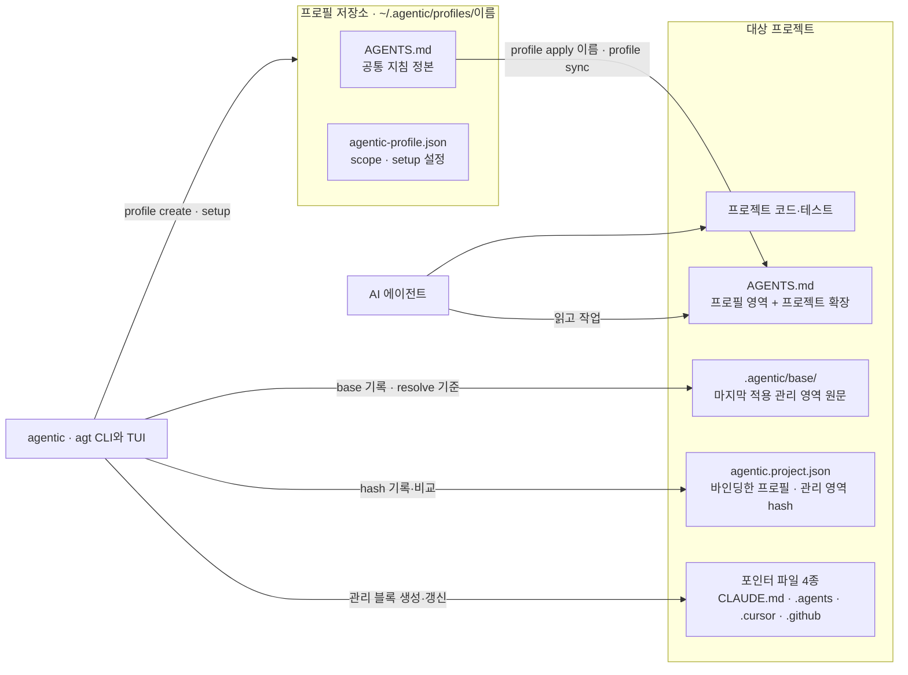

# 현재 아키텍처

이 문서는 현재 구현되어 채택된 구조만 기록한다. 후속 개선 계약은 [`discussion/architecture/`](../discussion/architecture/)에서 관리한다. 기능별 내부 코드 로직(apply/sync·관리 영역 병합·hash·안전한 파일 쓰기 등)은 [기능 구현 메커니즘](implementation-mechanics.md)이, 프로필에 배포되는 공통 지침 목록은 [지침 카탈로그](guidance-catalog.md)가 정본이다.

<!-- agentic-doc-sources: bin, lib, package.json, templates, tools -->
<!-- agentic-doc-sources-sha256: 5b5cbaefd3bd3f63c7903385bba92b36f4c4346b9ef223f568a13a0a24d150dd -->

Agentic은 개인·조직별 에이전틱 개발 지침을 프로필로 생성·설정하고 이를 프로젝트와 여러 AI 에이전트에 안전하게 적용·동기화한다.

## 현재 구조



프로필 저장소의 `AGENTS.md`가 공통 지침의 정본이고 CLI는 이를 대상 프로젝트의 `AGENTS.md`와 포인터 파일로 적용한다. 에이전트는 프로젝트 파일만 읽으며 Agentic은 에이전트를 실행하지 않는다.

- **프로필 관리:** CLI는 옵션 기반 또는 TUI 방식으로 프로필을 생성·목록화·조회·설정·삭제한다. 프로필에는 `personal`, `company`, `team`, `workspace` scope가 있으며 `profile list --scope <scope>`로 필터링할 수 있다.
- **TUI 경로:** TUI의 `profile list`는 scope를 먼저 선택한 뒤 프로필을 고르고 설정·프로젝트 적용·동기화·충돌 해결·상세 보기·삭제 메뉴를 제공한다. 같은 목록에서 새 프로필도 만들 수 있다. `profile setup`만 실행하면 `scope · 이름` 형식의 목록에서 프로필을 고른다. 각 기능은 CLI 명령과 TUI 경로를 모두 제공한다.
- **적용과 보존:** 적용 시 프로젝트 `AGENTS.md`의 확장 섹션과 에이전트별 산출물의 사용자 영역을 보존하고 `AGENTS.md`의 프로필 소유 영역과 에이전트별 산출물의 Agentic 관리 블록만 `apply/sync` 때 갱신한다. 확장 섹션 제목은 한국어·영어 로케일을 모두 인식한다. 확장 섹션이 없는 기존 `AGENTS.md`는 `## Existing project guidance` 아래로 옮겨 보존하고 관리 마커가 없는 기존 에이전트별 파일은 기존 내용을 보존한 채 관리 블록을 추가한다. 템플릿이 frontmatter로 시작하는 Cursor·Antigravity 규칙 파일은 frontmatter를 관리 블록 밖 파일 맨 앞에 두고, 파일 맨 앞에 이미 있는 frontmatter는 보존한다([ADR 0009](../adr/0009-agent-rule-frontmatter.md)).
- **수동 변경 감지와 충돌 해결:** 두 관리 영역의 hash를 `agentic.project.json`에, 관리 영역 원문을 `.agentic/base/`에 기록한다. 기록된 영역이 바뀌면 `apply`와 `sync`는 파일을 쓰기 전에 중단하고, `--dry-run`은 충돌 파일과 diff를 보여 준 뒤 종료 코드 1로 끝난다. `profile resolve`는 마지막 적용본을 기준으로 관리 영역 안의 편집을 밖으로 옮기고 관리 영역을 새로 만든다. 마지막 적용본을 알 수 없으면 멈추고, `--discard`를 주면 `.agentic/backups/`에 백업한 뒤 새로 만든다. 결정 근거는 [ADR 0008](../adr/0008-managed-conflict-recovery.md)이다.
- **삭제와 재동기화:** 프로필 삭제는 해당 프로필 원본만 제거하고 이미 적용된 프로젝트 파일은 변경하지 않는다. `profile sync`는 `agentic.project.json`에 기록된 프로필을 사용한다.

현재 구현에서 프로필은 로컬 파일 시스템의 `~/.agentic/profiles/<name>`에 보관한다. Git 원격 저장소를 프로필로 등록·공유·pull·push하는 기능은 아직 현재 아키텍처에 포함되지 않으며 [프로필 모델 논의](../discussion/architecture/topics/profile-model.md)의 후속 단계다.

## 저장소 파일 구조

```text
agentic/
├── .github/                    # CI·배포·Dependabot·커뮤니티 운영 설정
├── .editorconfig               # 편집기 공통 형식 규칙
├── .gitattributes              # Git 줄바꿈·바이너리 판정 규칙
├── .nvmrc                      # 기여자 기본 Node.js 메이저 버전
├── bin/
│   ├── agentic.mjs              # CLI 진입점: lib/cli.mjs의 run() 호출
│   └── agt.mjs                  # agentic CLI 별칭
├── lib/
│   ├── cli.mjs                  # 인자·로케일 해석과 명령 분기, 오류 종료
│   ├── args.mjs                 # 플래그 헬퍼
│   ├── help.mjs                 # 도움말 출력
│   ├── runtime.mjs              # 실행한 bin 이름과 패키지 루트
│   ├── home.mjs                 # 프로필 홈·설정 파일 위치와 로케일 저장
│   ├── contracts.mjs            # CLI·TUI·profile list 세 경로 동등성 계약
│   ├── fs-utils.mjs             # 원자적 텍스트 파일 교체·심볼릭 링크 보호
│   ├── i18n/                    # 로케일 해석·ko/en 메시지·배포 지침 문구
│   ├── profile/                 # 프로필 저장소(store)·지침 설정(setup)
│   ├── project/                 # apply·sync·resolve, 변경 계획·병합·충돌·VS Code merge
│   └── tui/                     # 메인·프로필 관리 화면
├── templates/
│   ├── profile/AGENTS.md        # 새 프로필의 초기 지침 템플릿(영어는 AGENTS.en.md)
│   └── ...                      # 에이전트별 지침 포인터 템플릿
├── evals/                       # CLI·문서·패키지 산출물 평가
├── tools/
│   ├── check-docs.mjs           # 링크·ADR·discussion·README 계약과 문서 소스 해시·근거 게이트
│   ├── check-release.mjs        # 릴리스 태그·버전·CHANGELOG 일치 검사
│   ├── check-syntax.mjs         # bin·lib·tools·evals 문법 검사
│   ├── discussion-record.mjs    # Implemented 논의 문서에 구현 기록 제목이 있는지 판정
│   ├── doc-evidence.mjs         # references.md 확인일과 ADR 근거 필드 규칙
│   ├── doc-source-path.mjs      # 문서 소스 해시에 넣을 경로를 OS와 무관하게 / 형식으로 계산
│   └── package-smoke.mjs        # 실제 tarball 설치 후 핵심 명령 실행
├── docs/
│   ├── README.md                # 문서 탐색 시작점
│   ├── product-direction.md     # 제품 방향 정본
│   ├── architecture/            # 현재 채택된 구조
│   ├── discussion/              # 구현 계획·논의·계약
│   ├── adr/                     # 장기 설계 결정 기록
│   ├── usage-guide.md           # 설치부터 동기화까지의 사용 가이드
│   ├── workflow.md              # 사용 절차 요약과 명령 소유권
│   ├── cli-reference.md         # 명령·옵션·TUI·자동화 정본
│   ├── implementation-principles.md # npm·Node.js·CLI 원리와 구현의 연결
│   ├── repository-operations.md # 품질 게이트·릴리스·보안 운영
│   └── references.md            # 외부 근거와 비교 자료
├── AGENTS.md                    # 이 저장소 개발 규칙 정본
├── README.md                    # npm 패키지 소개(영어는 README.en.md)
├── CHANGELOG.md                 # 사용자 영향 변경 이력
├── CONTRIBUTING.md              # 기여 절차와 품질 게이트
├── SECURITY.md                  # 보안 신고·안전한 사용 정책
├── CODE_OF_CONDUCT.md           # 커뮤니티 행동 규범
├── LICENSE                      # Apache-2.0 라이선스
├── package.json                 # npm 패키지·CLI·스크립트 정의
└── pnpm-lock.yaml               # 저장소 개발 의존성 잠금
```

배포 패키지에는 `bin/`, `lib/`, `templates/`, `README.md`, `LICENSE`와 런타임 의존성만 포함된다. `docs/`, `evals/`, `tools/`와 저장소 개발 문서는 npm 사용자의 설치 대상에서 제외된다.

## 소유권

| 영역 | 소유자 | 설명 |
| --- | --- | --- |
| 패키지 템플릿 | Agentic 저장소 | 기본 포인터와 프로젝트 도구의 배포 원본 |
| 프로필 `AGENTS.md` | 사용자·조직 | 선택된 공통 지침 정본 |
| 프로젝트 `AGENTS.md` | 대상 프로젝트 | 적용된 공통 지침과 프로젝트 도메인 지침을 담는 최종 지침 파일 |
| 프로젝트 `.agentic/` | Agentic이 쓰고 대상 프로젝트가 커밋 | `base/`는 마지막 적용 관리 영역 원문, `backups/`는 `resolve --discard` 백업이며 `.gitignore`로 커밋에서 제외 |
| 프로젝트 코드·테스트 | 대상 프로젝트 | 제품 동작과 도메인 검증 |

## 패키지 내부 검증

이 저장소의 `pnpm run check`는 문법 검사, 문서 계약 검사, CLI 평가를 실행한다. 대상 프로젝트에 검증 실행기나 테스트를 주입하지 않는다. 프로필 지침에 검증 규칙을 선택하는 기능과 대상 프로젝트의 실제 검증은 별도 책임이다.
