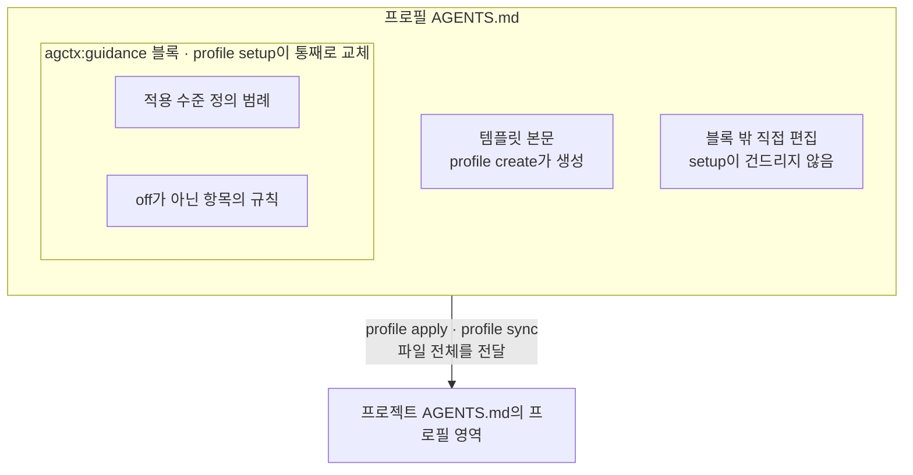

# 지침 카탈로그 (배포되는 공통 지침)

이 문서는 agctx가 프로필에 넣어 배포하는 공통 지침의 정본 목록이다. 각 항목이 무엇을 왜 요구하는지를 여기서 정한다. 산출물에 실제로 들어가는 문자열은 `src/i18n/index.ts`의 `guidance` 상수에 있다. 이 문서와 그 상수는 같은 내용을 가리켜야 한다.

<!-- agctx-doc-sources: src/i18n/index.ts, src/profile/setup.ts -->
<!-- agctx-doc-sources-sha256: 61528e84da7b2efd72a5b297c05c524e6548ac7b05890297799e30940d3fb436 -->

## 지침이 만들어지는 두 경로

프로필의 `AGENTS.md`에 지침이 들어가는 길은 두 가지다.

1. **`profile setup`이 관리하는 블록.** `setup`은 아래 6개 항목을 골라 `<!-- agctx:guidance:start --> … <!-- agctx:guidance:end -->` 블록으로 프로필 `AGENTS.md`에 쓴다. 이 블록은 `setup`을 다시 돌릴 때 통째로 교체된다.
2. **사용자가 직접 편집.** 프로필의 `AGENTS.md`는 일반 텍스트 파일이다. 관리 블록 **바깥**에 원하는 지침을 직접 써도 된다. `setup`은 블록 안만 교체하므로 바깥 내용은 보존되고 `profile apply`로 적용할 때 프로필 `AGENTS.md` 전체가 프로젝트로 전달된다.

한 파일 안에서 `setup`이 교체하는 블록과 사용자가 직접 쓴 내용이 공존하고, 적용할 때는 둘을 구분하지 않고 파일 전체가 프로젝트로 넘어간다.

`setup`은 시작점이다. 6개 항목은 자주 쓰는 기본 뼈대를 빠르게 켜는 용도이고 팀·프로젝트에 필요한 두터운 지침은 프로필 `AGENTS.md`를 직접 편집해 채운다.

## 지침 항목 6개

아래는 현재 배포되는 항목과 문구다. 각 항목의 규칙 문구는 수준과 무관하게 하나다. `off`면 그 항목이 산출물에서 빠지고, 모든 항목이 `off`면 블록 안에 범례도 넣지 않는다. 수준이 무엇을 요구하는지는 아래 범례가 정한다.

| 항목 | 목적 | 배포 문구 |
| --- | --- | --- |
| 하네스 동작 | 작업을 계획하고 실제 검증 결과를 보고하는 기본 작업 방식 | 작업을 작은 단위로 계획한 뒤 변경마다 프로젝트의 검증 명령을 실행해 실제 결과를 보고한다. 기본 작업 방식은 작게 유지하고 복잡한 자동화나 도구는 필요할 때만 더한다. 말이나 추론이 아니라 실행 결과로 판단한다. |
| TDD | 실패 테스트부터 시작하는 Red-Green-Refactor 개발 방식 | 구현 전에 실패하는 테스트를 먼저 쓴다. 통과시키는 최소 코드를 쓴 뒤 테스트를 유지하며 정리한다(Red-Green-Refactor). |
| 변경 검토 | 변경 범위와 위험을 확인하고 필요하면 독립 리뷰를 거치는 방식 | 변경의 범위와 위험을 먼저 확인한다. 보안·데이터·공개 인터페이스가 얽히면 독립적인 리뷰를 거친다. |
| 검증 | 프로젝트의 검증 명령을 실행하고 결과를 기록하는 방식 | 프로젝트가 선택한 검증 명령을 실행하고 그 출력을 근거로 남긴다. 실행 결과는 실행 사실일 뿐 요구사항 충족이나 품질 전체의 증명이 아니다. |
| 문서화 | 계약·정책·구조 변경을 정본 문서에 반영하는 방식 | 다른 사람이 관찰하거나 의존하는 계약·정책·구조가 바뀌면 관련 정본 문서를 같은 변경에서 갱신한다. 루트 지침에는 고신호 정보만 두고 상세는 링크로 찾게 한다. |
| 보안 | 비밀값 보호와 외부 변경 승인에 관한 규칙 | 비밀값을 출력하거나 커밋하지 않는다. 외부로 나가는 작업이나 권한이 필요한 작업은 실행 전에 사용자 승인을 받는다. |

기본값은 모든 항목이 `recommended`다. 항목 선택 계약과 재실행 정책은 [setup과 지침 옵션](../discussion/architecture/topics/setup-and-guidance.md)에서 관리한다. 하네스 문구의 "작게 유지하고 필요할 때만 더한다"는 [references.md](../references.md)의 하네스 연구를 따른 것이다.

## 적용 수준 (off / recommended / strict)

- `off`: 이 항목을 프로필 지침에서 뺀다.
- `recommended`: 기본값이다. 일반적으로 지키되 합당한 이유가 있으면 예외를 두고 그 이유를 기록한다.
- `strict`: 예외 없이 항상 적용한다. 위반을 발견하면 작업을 멈추고 해결한 뒤 진행한다.

두 수준의 정의는 `src/i18n/index.ts`의 `levelDefinitions` 상수 한 곳에 있고 `setup` 산출물의 "## 적용 수준 정의" 범례와 setup TUI 힌트가 같은 문구를 공유한다. 규칙 문구는 항목마다 하나다. 그 항목을 얼마나 엄격히 지킬지를 이 수준이 정한다. 강제(빌드 차단 등)는 각 프로젝트 하네스의 몫이고 이 패키지의 범위 밖이다. 근거와 대안은 [ADR 0005](../adr/0005-guidance-level-semantics.md)와 [지침 적용 수준의 의미 정의](../discussion/architecture/topics/guidance-level-semantics.md)에 있다.
