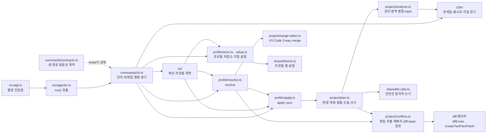
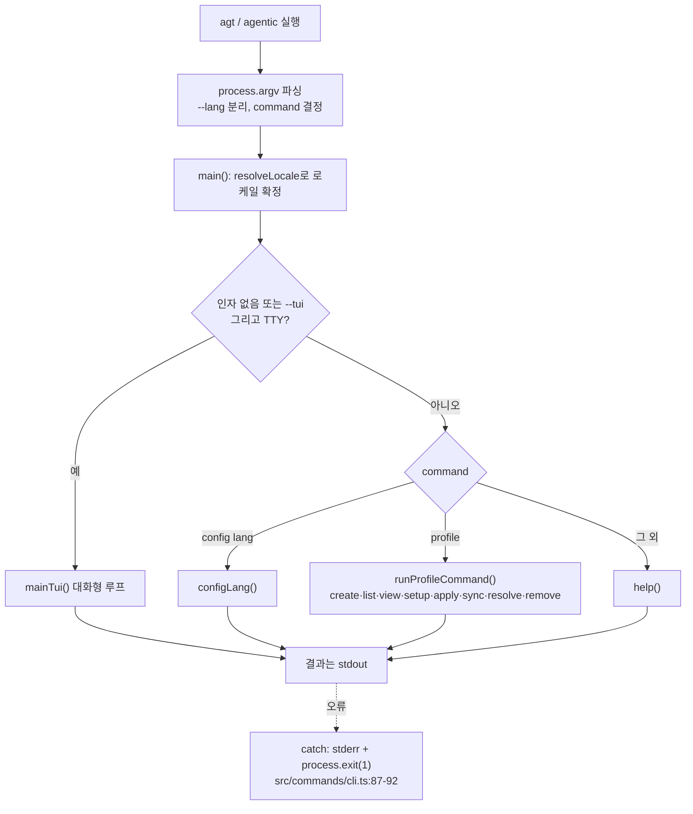
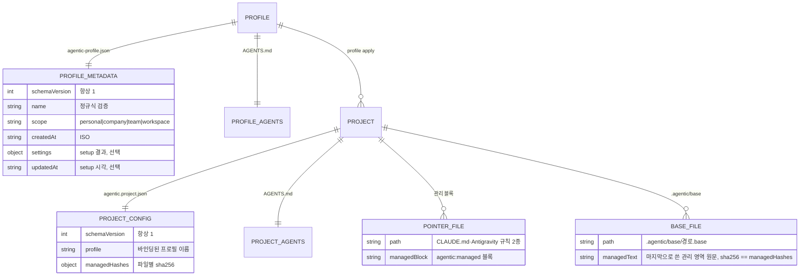
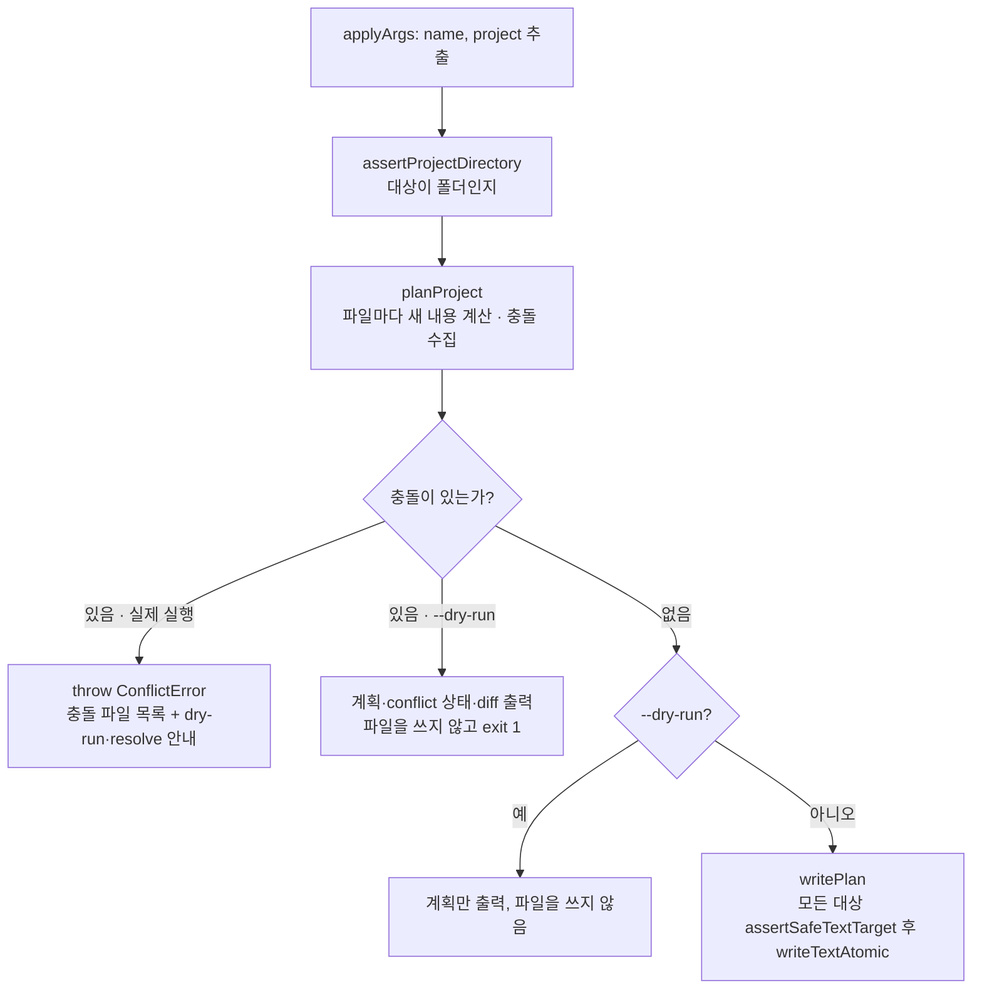
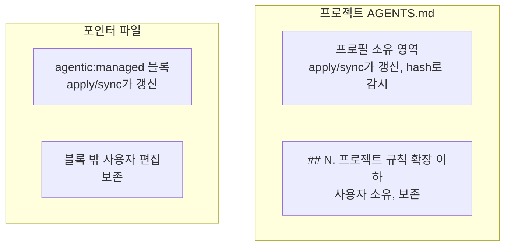
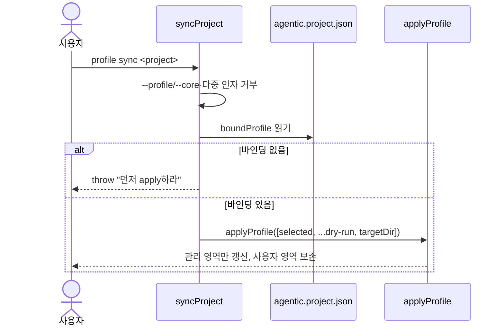
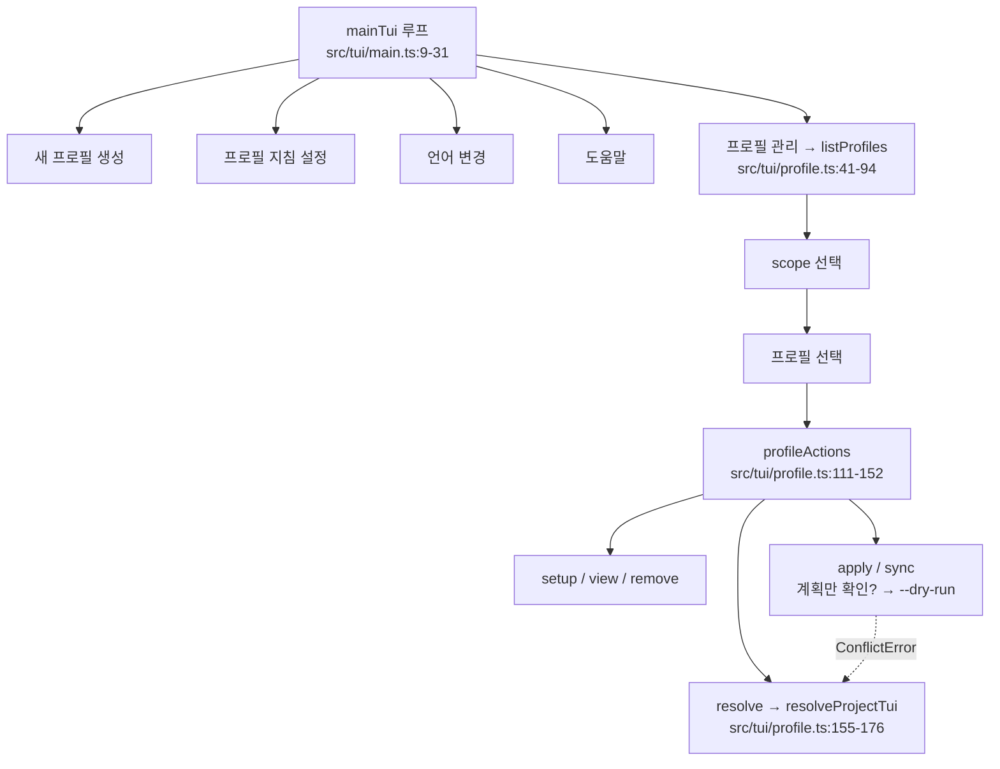
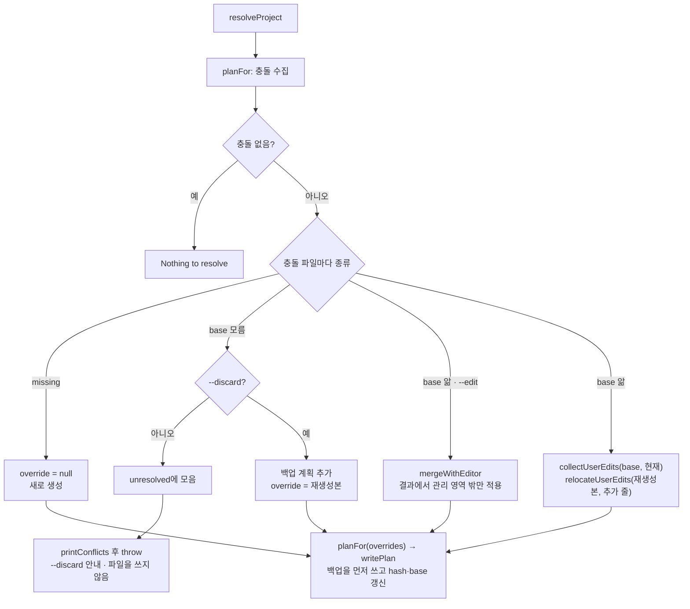

# 기능 구현 메커니즘

**문서 유형:** 내부 동작 메커니즘 (유지보수자용). 현재 구현된 각 기능이 코드 안에서 어떻게 동작하는지를 기능 단위로 설명한다. npm·Node.js·CLI가 왜 그렇게 도는지의 일반 원리는 [구현 원리](../implementation-principles.md)에, 현재 구조·소유권의 정본은 [현재 아키텍처](README.md)에 있다. 이 문서는 그 사이, 이 패키지 고유의 로직을 기능별로 채운다.

**작성·검증 기준:** `@isthis/agentic` `0.2.0` · 2026-09-15 · 아래 소스 해시 마커가 가리키는 소스

> 이 문서는 코드의 `파일:줄` 위치를 다수 인용하고, 핵심 로직은 코드블록으로 함께 싣는다(예: `src/profile/apply.ts:123-140`). 줄 번호와 코드블록은 **아래 마커의 해시를 마지막으로 기록한 시점의 소스 기준**이며 코드가 바뀌면 어긋날 수 있다. 인용을 신뢰하기 전에 현재 코드에서 직접 확인하라. 이 문서는 항상 **현재 구현**을 설명하는 단일 정본이며 과거 버전의 설명은 git 이력에서 확인한다. 코드가 바뀌면 이 문서와 위 기준선을 같은 변경에서 갱신한다. 인용한 소스가 바뀌면 `pnpm run check`가 실패하도록 소스 해시 게이트가 걸려 있다([공개 저장소 운영](../repository-operations.md)의 "문서 소스 해시 게이트" 참고).

<!-- agentic-doc-sources: src -->
<!-- agentic-doc-sources-sha256: 01e7b7606f0955f4b27a9f74e42a19458745ba142b7a03257808732d114107a2 -->

## 읽는 법

- 다루는 것은 **CLI 소스(`src/`)의 로직**이다. 배포본 `dist/`는 이 소스를 컴파일한 것이라 동작이 같다. 각 절은 하나의 기능·메커니즘을 맡고 `src/` 모듈의 실제 함수에 대응한다. 다이어그램은 흐름을, 코드블록은 그 흐름을 만드는 실제 구현을 보여 준다.
- 다루지 않는 것: 생태계 일반 원리([구현 원리](../implementation-principles.md)), 현재 구조·파일 트리·소유권 표([현재 아키텍처](README.md)), 사용자 관점 명령·옵션([CLI Reference](../cli-reference.md)), 사용 흐름([사용자 워크플로](../workflow.md)). 여기서는 이 계약들을 다시 정의하지 않고 원리 설명에 필요한 만큼만 인용한다.
- 마커: 프로필 지침용 `<!-- agentic:guidance:* -->`와 프로젝트 산출물용 `<!-- agentic:managed:* -->`는 서로 다른 계층이다. 아래에서 구분해 적는다.

## 모듈 지도

`src/`의 모듈이 서로를 어떻게 부르는지 먼저 본다. 폴더는 역할별로 나뉜다: `commands/`(인자 해석·명령 분기·도움말), `profile/`(프로필 명령), `project/`(적용 엔진), `i18n/`(로케일·메시지), `tui/`(대화형 화면), `shared/`(프로필 홈·안전한 쓰기·실행 정보·공용 타입).



그림에 없는 `shared/types.ts`는 모듈이 함께 쓰는 타입(프로필 메타데이터, 프로젝트 설정, 계획 파일, 충돌)만 정의한다. 다른 모듈은 이 파일을 `import type`으로만 가져오므로, 컴파일하면 그 import가 지워져 실행 중에는 불러오지 않는다.

## 1. 진입점과 명령 분기

두 진입점 `src/agentic.ts`와 `src/agt.ts` 중 `agt`는 본체를 불러오는 한 줄이다: `import './agentic.ts';`(`src/agt.ts:3`). `src/agentic.ts`도 `commands/cli.ts`의 `run()`을 부르기만 한다(`src/agentic.ts:3-5`). 로직은 모두 역할별 폴더에 있고, 모듈을 불러오는 것만으로는 CLI가 실행되지 않는다. 설치본에서는 컴파일한 `dist/agt.js`·`dist/agentic.js`가 같은 일을 한다.

인자를 읽고 `command`를 정하는 부분은 `main(argv)` 맨 앞에 있다(`src/commands/cli.ts:59-63`).

```ts
setInvokedAs(argv[1]);                         // 실행한 bin 이름(agentic/agt) 기억
const rawArgs = argv.slice(2);
const langFlag = parseFlag(rawArgs, 'lang');   // --lang 값을 먼저 분리
const args = stripFlag(rawArgs, 'lang');       // 나머지에서 --lang 제거
const command = args[0] || 'help';
```

- **플래그 헬퍼**: 값 읽기 `parseFlag`(`src/commands/args.ts:1-6`), 존재 여부 `hasFlag`(`src/commands/args.ts:8-10`), 제거 `stripFlag`(`src/commands/args.ts:12-18`). `--dry-run`·`--discard`·`--edit`·`--scope`·`--yes` 등이 모두 이 헬퍼를 거친다.
- **호출 이름 판별**: `invokedAs`는 `process.argv[1]`의 파일명에서 확장자(`.js`·`.ts`·`.mjs`)를 뗀 값이다(`setInvokedAs`, `src/shared/runtime.ts:10-12`). 설치본(`dist/agt.js`)과 저장소 실행(`src/agt.ts`) 모두 `agt`가 된다. 도움말의 명령 이름·제목과 충돌 오류가 안내하는 명령 이름을 `agt`/`agentic`에 맞춰 바꾼다(`help()`, `src/commands/help.ts:5-9`).

`main()`은 로케일을 확정한 뒤 아래 표준 입력·명령 조건으로 분기한다(`src/commands/cli.ts:75-83`).

```ts
if ((!args.length || command === '--tui') && process.stdin.isTTY) {
  await mainTui();
} else if (command === 'config' && args[1] === 'lang') {
  configLang(args[2]);
} else if (command === 'profile') {
  await runProfileCommand(args.slice(1));
} else {
  help();
}
```



## 2. 로케일 해석과 저장

우선순위는 `resolveLocale`에 고정돼 있다(`src/i18n/index.ts:43-49`).

```ts
export function resolveLocale({ flag = null, env = null, saved = null, isTTY = false }: LocaleInputs = {}): Locale | null {
  if (flag != null) return validated('--lang', flag);                   // 1) --lang
  if (env != null && env !== '') return validated('AGENTIC_LANG', env); // 2) 환경변수
  if (isLocale(saved)) return saved;                                    // 3) 저장된 선택
  if (!isTTY) return DEFAULT_LOCALE;                                    // 4a) 비TTY면 기본값 ko
  return null;                                                          // 4b) TTY면 물어봄
}
```

- `--lang`·`AGENTIC_LANG`의 잘못된 값은 예외이고 저장된 잘못된 값은 무시한다.
- `null`이 오면 `main()`이 `promptLocale()`로 한 번 묻고 `saveLocale`로 저장한다(`src/commands/cli.ts:70-73`).
- **저장 위치**: `.agentic/config.json`(`configPath`, `src/shared/home.ts:66`). `config lang <ko|en>`은 `configLang`이 같은 경로에 저장한다(`src/commands/cli.ts:15-19`).
- `t()`는 키를 찾고 없으면 `ko`로, 그것도 없으면 키 문자열을 그대로 돌려준다(`src/i18n/index.ts:57-64`).

## 3. 프로필 저장소 모델

`profileHome()`(`src/shared/home.ts:52-63`)이 기준 위치를 정한다: `AGENTIC_HOME`이 있으면 그 아래, 없으면 `os.homedir()` 아래의 `.agentic/profiles`. 언어 설정 `config.json`은 그 위 `.agentic/`에 둔다. `AGENTIC_HOME`으로 저장 위치를 바꿀 수 있고 테스트·스모크가 이를 쓴다. `.agentic/profiles`가 없고 이전 `.agentic-profiles`나 `.agentic-cores`가 있으면 최초 접근 때 한 번 폴더를 `.agentic/profiles`로 옮기고 `config.json`을 `.agentic/`로 올린다. Core 시절 홈은 각 메타데이터도 `agentic-profile.json`으로 바꾼다(`migrateFlatHome`, `src/shared/home.ts:23-46`). best-effort이며 실패하면 크래시하지 않고 새 홈으로 진행한다.

프로필 저장소와 적용 결과물의 온디스크 배치는 다음과 같다.

```text
$AGENTIC_HOME 또는 ~/            대상 프로젝트/
└── .agentic/                   ├── AGENTS.md              (프로필 영역 + 프로젝트 확장)
    ├── config.json  (locale)   ├── agentic.project.json   (profile, managedHashes)
    └── profiles/               ├── CLAUDE.md              (관리 블록)
        └── <name>/             ├── .agents/rules/agentic.md
            ├── agentic-profile.json└── .agentic/         (base/*.base · backups/ · .gitignore)
            └── AGENTS.md
```

메타데이터 스키마와 프로젝트 설정의 관계를 ERD로 보면 이렇다.



- **이름 규칙**: `validateProfileName`의 정규식 `^[a-z0-9][a-z0-9-]{0,63}$`(`src/profile/store.ts:11`, `17-21`).
- **읽기·목록**: `readProfile`(`src/profile/store.ts:33-47`)이 메타데이터·`AGENTS.md` 존재와 `isValidProfileMetadata`(`src/profile/store.ts:23-31`)를 검사한다. `getProfiles`(`src/profile/store.ts:61-74`)는 `scope:name`으로 정렬해 돌려준다.

## 4. profile create

`createProfile`(`src/profile/store.ts:49-59`)은 이름·scope를 검증하고 폴더를 만든 뒤 메타데이터와 지침 템플릿을 기록한다.

```ts
fs.mkdirSync(profileDir, { recursive: true });
writeTextAtomic(path.join(profileDir, PROFILE_METADATA_FILE),
  JSON.stringify({ schemaVersion: 1, name, scope, createdAt: new Date().toISOString() }, null, 2) + '\n');
const profileTemplate = fs.readFileSync(path.join(PACKAGE_ROOT,
  getLocale() === 'en' ? 'templates/profile/AGENTS.en.md' : 'templates/profile/AGENTS.md'), 'utf8');
writeTextAtomic(path.join(profileDir, 'AGENTS.md'), profileTemplate.replaceAll('{{PROFILE_NAME}}', name));
```

대화형 경로는 `createProfileTui`(`src/tui/profile.ts:11-39`)가 이름·scope·확인을 물은 뒤 같은 `createProfile`을 부른다.

## 5. profile setup: 지침 블록 기록

기본값은 6개 항목 모두 `recommended`다(`guidanceDefaults`, `src/profile/setup.ts:8`): `harness`·`tdd`·`review`·`verification`·`documentation`·`security`. `setupProfile`(`src/profile/setup.ts:17-43`)은 항목마다 `--<key>`(없으면 기존 설정 → 기본값)를 읽어 `off`/`recommended`/`strict`를 검증하고, `off`가 아닌 항목만 블록으로 만든다. 항목이 하나라도 있으면 맨 앞에 적용 수준 정의 범례를 붙인 뒤 마커로 감싼다(`src/profile/setup.ts:32-37`). 범례 문구는 `guidanceLevelDefinitions`가 돌려주는 상수이며 setup TUI 힌트와 같다. 모든 항목이 `off`면 블록 안은 비어 있다.

```ts
const definitions = guidanceLevelDefinitions(getLocale());
const legend = `## ${_('setup.legend.title')}\n\n- recommended: ${definitions.recommended}\n- strict: ${definitions.strict}\n\n${_('setup.legend.intro')}`;
const start = '<!-- agentic:guidance:start -->';
const end = '<!-- agentic:guidance:end -->';
const body = blocks.length ? [legend, ...blocks].join('\n\n') : '';
const block = `${start}\n\n${body}\n\n${end}`;
const pattern = new RegExp(`${start}[\\s\\S]*?${end}`, 'm');
writeTextAtomic(profile.instructionsPath,
  pattern.test(current) ? current.replace(pattern, block) : `${current.trimEnd()}\n\n${block}\n`);
```

기존 블록이 있으면 정규식으로 교체하고 없으면 프로필 `AGENTS.md` 끝에 덧붙인다. 선택 결과는 메타데이터의 `settings`와 `updatedAt`에도 기록한다(`src/profile/setup.ts:41`). 이 `guidance` 마커는 **프로필** `AGENTS.md` 안의 것으로, 프로젝트 산출물의 `managed` 마커([7절](#7-관리-영역-병합과-hash))와 다른 계층이다.

## 6. profile apply: 변경 계획과 적용

`applyProfile`(`src/profile/apply.ts:123-140`)이 핵심이다. `applyArgs`(`src/profile/apply.ts:54-57`)로 `name`(첫 위치인자)과 `project`(둘째, 없으면 `.`)를 뽑고, `planFor`(`src/profile/apply.ts:80-92`)가 프로필·프로젝트 설정·프로젝트 이름을 모아 `planProject`(`src/project/plan.ts:68-108`)에 넘긴다. 계획 계산은 충돌을 throw하지 않고 모으며, 충돌이 없을 때만 쓴다. 전체 파이프라인은 다음과 같다.



`planProject`는 `AGENTS.md`와 포인터 2종마다 새 내용과 충돌 여부를 계산한다(`src/project/plan.ts:70-81`).

```ts
const existing = overridden ? overrides.get(relativePath) ?? null : readIfExists(path.join(targetDir, relativePath));
const regenerated = regenerate(existing);            // mergeAgentsMd 또는 mergeManagedDocument
const currentRegion = managedRegion(kind, existing); // 지금 파일의 관리 영역
const nextRegion = managedRegion(kind, regenerated); // Agentic이 쓸 관리 영역
const recordedHash = overridden ? null : recordedHashFor(projectConfig, relativePath);
const conflict = recordedHash && regionHash(currentRegion) !== recordedHash
  ? { kind: existing === null ? 'missing' as const : 'edited' as const, base: knownBase(targetDir, relativePath, recordedHash, nextRegion) }
  : null;
```

한 파일이라도 충돌이면 쓰기 전에 멈추므로 어떤 파일도 바뀌지 않는다. dry-run에서는 `agentic.project.json`을 포함해 아무 파일도 쓰지 않는다. `apply`도 `sync`와 같은 계산을 거치므로 같은 프로필로 다시 적용해도 충돌은 풀리지 않는다. 충돌 표시와 복구는 [14절](#14-관리-영역-충돌-표시와-profile-resolve)에 있다.

- **포인터 파일 2종**(`POINTER_TEMPLATES`, `src/project/plan.ts:15-18`): `CLAUDE.md`, `.agents/rules/agentic.md`. Cursor·Copilot 파일은 만들지 않는다([ADR 0011](../adr/0011-supported-agents.md)). 템플릿의 `{{PROJECT_NAME}}`을 채운 뒤 `mergeManagedDocument`로 관리 블록만 병합한다(`src/project/plan.ts:84-87`).
- **계획 파일 순서**(`src/project/plan.ts:89-105`): 관리 파일 3개, 각 관리 영역의 base 파일 `.agentic/base/<경로>.base`, `.agentic/.gitignore`(`backups/`), 마지막으로 `agentic.project.json`이다. `agentic.project.json`은 레거시 `core` 키를 제거하고 `{ schemaVersion: 1, profile: name, managedHashes }`를 기록한다.
- **출력**: `printPlan`(`src/profile/apply.ts:94-102`)이 계획 요약과 파일별 상태를 한 줄씩 출력한다.

## 7. 관리 영역 병합과 hash

`src/project/analyzer.ts`가 사용자 영역과 Agentic 관리 영역을 분리한다. `AGENTS.md`는 프로필 소유 영역과 프로젝트 확장이 한 파일에 공존한다.



`AGENTS.md`의 병합은 확장 헤더를 기준으로 위아래를 가른다(`mergeAgentsMd`, `src/project/analyzer.ts:20-38`).

- **확장 헤더 인식**: `EXTENSION_HEADER`(`src/project/analyzer.ts:12`)가 한국어 `프로젝트 규칙 확장`과 영어 `Project rule extensions` 제목을 모두 인식한다. 헤더 바로 아래의 안내 문구는 두 로케일의 `scaffold.extBody`를 모두 걷어 낸 뒤 나머지를 사용자 규칙으로 옮긴다(`src/project/analyzer.ts:13`, `src/project/analyzer.ts:31-34`). 헤더를 한 로케일로만 인식하면 다른 로케일 프로젝트에서 확장 영역이 관리 영역으로 계산돼 동기화가 멈춘다.
- **헤더가 없는 기존 파일**: 기존 내용 전체를 `## Existing project guidance` 아래로 옮겨 보존한다(`src/project/analyzer.ts:24-26`). hash를 계산할 때도 이 제목 아래는 관리 영역에서 뺀다(`extractAgentsManagedDocument`, `src/project/analyzer.ts:44-51`).

포인터 파일은 마커 블록만 바꾼다.

```ts
// src/project/analyzer.ts:70-80 — 관리 블록만 교체하거나 없으면 덧붙이고, 템플릿 frontmatter는 블록 밖 맨 앞에 둔다
const template = managedContent.trim();
const frontmatter = template.match(LEADING_FRONTMATTER)?.[0] || '';
const managedBlock = `${start}\n${template.slice(frontmatter.length).trim()}\n${end}`;
const withFrontmatter = (content: string) => (frontmatter ? `${frontmatter}\n${content}` : content);
if (!existingContent || typeof existingContent !== 'string') return withFrontmatter(`${managedBlock}\n`);
const pattern = new RegExp(`${start}[\\s\\S]*?${end}`, 'm');
const merged = pattern.test(existingContent)
  ? `${existingContent.replace(pattern, managedBlock).trimEnd()}\n`
  : `${existingContent.trimEnd()}\n\n${managedBlock}\n`;
return LEADING_FRONTMATTER.test(existingContent) ? merged : withFrontmatter(merged);
```

- **frontmatter 위치**: Antigravity 규칙은 파일 첫 줄의 frontmatter(`trigger`)로 로드 방식을 정한다. 그래서 템플릿 frontmatter(`LEADING_FRONTMATTER`, `src/project/analyzer.ts:58`)는 관리 블록과 관리 hash 밖, 파일 맨 앞에 둔다. 파일 맨 앞에 frontmatter가 이미 있으면 사용자의 것으로 보고 보존한다. 결정 근거는 [ADR 0009](../adr/0009-agent-rule-frontmatter.md)에 있다.

`hashAgentsManagedDocument`(`src/project/analyzer.ts:53-56`)와 `hashManagedDocument`(`src/project/analyzer.ts:90-93`)가 각각 관리 영역·관리 블록만 `sha256`한다. 이 hash를 `agentic.project.json`에 저장해 두고 다음 `apply`/`sync` 때 사용자가 관리 영역을 밖에서 손댔는지 감지한다(`createHash`, `src/project/analyzer.ts:1`). 이는 이 패키지가 **자기 산출물의 드리프트를 감지하는 방식** 그대로다.

## 8. profile sync

`syncProject`(`src/profile/apply.ts:147-162`)은 프로젝트가 이미 바인딩된 프로필을 다시 적용하되 **프로필을 절대 바꾸지 않는다.**

```ts
if (parseFlag(values, 'profile') || parseFlag(values, 'core')) {
  throw new Error('profile sync does not switch profiles. To switch, use `agentic profile apply <name> <project>`.');
}
// ...위치 인자 2개 이상도 거부...
const selected = boundProfile(readProjectConfig(selectionPath)); // profile 또는 레거시 core
if (!selected) throw new Error('profile sync requires a project already applied ...');
applyProfile([selected, ...(hasFlag(values, 'dry-run') ? ['--dry-run'] : []), targetDir]);
```



즉 `sync`는 "`apply`를 현재 바인딩된 프로필로 다시 부르는 것"이다.

## 9. 안전한 파일 쓰기

`src/shared/fs-utils.ts`가 프로젝트 파일 교체의 안전장치다. 쓰기 직전 대상과 그 부모 경로를 검사한다.

```ts
// src/shared/fs-utils.ts:15-17 — 심볼릭 링크·비정규 파일 거부
const stat = fs.lstatSync(target);
if (stat.isSymbolicLink()) throw new Error(`Refusing to replace symbolic link: ${target}`);
if (!stat.isFile()) throw new Error(`Refusing to replace non-regular file: ${target}`);
```

교체는 같은 폴더의 임시 파일을 거쳐 `rename`으로 원자적으로 이뤄진다.

```ts
// src/shared/fs-utils.ts:55-61 — 임시 파일 작성 후 rename, finally로 잔여물 제거
const temporary = path.join(path.dirname(target), `.${path.basename(target)}.agentic-${randomUUID()}.tmp`);
try {
  fs.writeFileSync(temporary, content, { encoding: 'utf8', mode });
  fs.renameSync(temporary, target);
} finally {
  if (fs.existsSync(temporary)) fs.unlinkSync(temporary);
}
```

- `boundary`가 주어지면 대상 부모를 `boundary`까지 거슬러 올라가며 심볼릭 링크 부모·비디렉터리 부모를 거부한다(`src/shared/fs-utils.ts:23-40`). 아직 없는 대상(`ENOENT`)은 통과시킨다.
- 기존 파일 권한 모드를 `lstat`로 읽어 보존한다(`src/shared/fs-utils.ts:46-52`, 기본 `0o666`). 다만 `fs.writeFileSync`는 생성 시 umask를 적용하므로 권한 비트가 항상 그대로 보존된다는 보장은 아니다.

## 10. dry-run · 로그 · 종료 코드

- **dry-run**: `apply`/`sync`에 `--dry-run`을 주면 계획만 출력하고 파일을 바꾸지 않는다(`src/profile/apply.ts:131-137`). 충돌이 있으면 계획 뒤에 diff를 출력하고 종료 코드 1로 끝난다([14절](#14-관리-영역-충돌-표시와-profile-resolve)). TUI에서도 적용·동기화 전 "계획만 확인"을 고르면 `--dry-run`이 붙는다(`profileActions`, `src/tui/profile.ts:111-152`).
- **로그**: `printPlan`(`src/profile/apply.ts:94-102`)이 계획 요약과 파일별 `create`/`update`/`unchanged`/`conflict` 상태를 한 줄씩 출력한다.
- **종료 코드**: 최상위 `catch`가 오류를 내고 `process.exit(1)`로 끝낸다(`run`, `src/commands/cli.ts:87-92`). 성공하면 기본 0이다.

## 11. TUI 흐름 배선

화면은 `@clack/prompts`의 `intro`/`select`/`text`/`confirm`/`note`/`outro`로 그린다(`src/tui/profile.ts:3`). 프롬프트는 사용자가 취소하면 심볼을 돌려주는데 clack의 `isCancel`은 자기 취소 심볼만 타입에서 걷어 낸다. 그래서 모든 화면은 심볼 전체를 걷어 내는 `cancelled`(`src/tui/cancel.ts`)로 취소를 검사한다. 인자가 없고 TTY이면 `mainTui`(`src/tui/main.ts:9-31`) 루프가 열린다.



비대화형에서는 `listProfiles`가 `[scope]` 목록만 출력하고(`src/tui/profile.ts:90-93`), `createProfileTui`·`setupProfileTui`는 표준 입력(`fs.readFileSync(0, 'utf8')`)을 줄 단위로 읽어 처리한다(`src/tui/profile.ts:13`, `src/tui/profile.ts:201`). 파이프·CI·스모크 테스트 경로다.

## 12. 기능 인터페이스 동등성 계약

`src/commands/contracts.ts`의 `PROFILE_OPERATION_CONTRACT`(`src/commands/contracts.ts:13-22`)가 8개 작업마다 세 실행 경로를 선언한다.

```ts
export const PROFILE_OPERATION_CONTRACT: readonly ProfileOperation[] = [
  { id: 'create', cli: 'profile create', tui: 'profile list → 새 프로필 생성', profileList: true },
  { id: 'list',   cli: 'profile list',   tui: 'profile list',                 profileList: true },
  { id: 'view',   cli: 'profile view <name>', tui: 'profile list → 상세 보기', profileList: true },
  // setup·apply·sync·resolve·remove 동일한 형태로 이어짐
];
```

`AGENTS.md`의 "기능 인터페이스 동등성"(모든 사용자 기능은 CLI 명령·TUI 흐름·`profile list` 메뉴 세 경로에서 실행 가능) 규칙을 코드로 표현한 것이다. 이 계약은 `evals/interface-parity.test.ts`가 강제한다.

## 13. 검증 하네스와의 대응

각 메커니즘은 대응하는 eval로 강제된다(파일명 기준). 검증의 목적·증거 범위·한계 정본은 [현재 아키텍처](README.md)와 [공개 저장소 운영](../repository-operations.md)이다.

| 메커니즘 | 대응 eval |
| --- | --- |
| 안전한 파일 쓰기([9절](#9-안전한-파일-쓰기)) | `evals/file-safety.test.ts` |
| 관리 영역 병합·hash([7절](#7-관리-영역-병합과-hash)) | `evals/sync-merge.test.ts` |
| 세 경로 동등성([12절](#12-기능-인터페이스-동등성-계약)) | `evals/interface-parity.test.ts` |
| 프로필 생성·설정·apply/sync | `evals/profile.test.ts` |
| 충돌 표시·base·resolve([14절](#14-관리-영역-충돌-표시와-profile-resolve)) | `evals/conflict-resolve.test.ts`, `evals/conflicts.test.ts` |
| 로케일 해석([2절](#2-로케일-해석과-저장)) | `evals/i18n.test.ts` |
| 배포 파일 경계 | `evals/package-contents.test.ts` |
| 문서 계약·저장소 운영 | `evals/docs-check.test.ts`, `evals/repository-operations.test.ts` |

## 14. 관리 영역 충돌: 표시와 profile resolve

충돌 판정과 복구는 세 모듈이 나눠 맡는다. `src/project/plan.ts`가 충돌을 모으고, `src/project/conflicts.ts`가 편집을 추출·재배치하며, `src/project/merge-editor.ts`가 VS Code를 연다. 이 셋을 부르는 명령은 `src/profile/resolve.ts`다. 결정 근거는 [ADR 0008](../adr/0008-managed-conflict-recovery.md)이다.

- **마지막 적용본(base):** `planProject`는 관리 파일마다 `.agentic/base/<경로>.base`(`baseFilePath`, `src/project/conflicts.ts:16-18`)와 `.agentic/.gitignore`를 계획에 넣는다(`src/project/plan.ts:100-103`). 충돌이 나면 `knownBase`(`src/project/plan.ts:47-52`)가 base 파일 hash가 기록과 같은지, 아니면 지금 다시 만든 관리 영역 hash가 기록과 같은지 확인해 base를 돌려준다. 둘 다 아니면 `null`이다. 기록 키는 `/` 경로이며 `recordedHashFor`(`src/project/plan.ts:38-41`)가 이전 Windows 기록의 `\` 키도 읽는다.
- **표시:** 실제 `apply`·`sync`는 `conflictError`(`src/profile/apply.ts:71-78`)가 만든 `ConflictError`(`src/profile/apply.ts:62-69`)를 던진다. 메시지에는 충돌 파일 목록과 `profile sync --dry-run`·`profile resolve` 명령이 들어간다. `--dry-run`은 `printPlan`이 충돌 파일을 `conflict`로 표시하고 `printConflicts`(`src/profile/apply.ts:104-121`)가 diff를 출력한 뒤 같은 오류를 던져 종료 코드 1로 끝난다. diff는 jsdiff `createTwoFilesPatch`를 감싼 `formatDiff`(`src/project/conflicts.ts:77-79`)가 만든다.
- **resolve:** `resolveProject`(`src/profile/resolve.ts:62-123`)는 충돌 파일마다 복구 내용을 정해 `overrides`에 담고 같은 `planFor`로 계획을 다시 세워 쓴다. override한 파일은 기록 hash와 비교하지 않으므로 두 번째 계획에는 충돌이 없다. 풀 수 없는 파일이 하나라도 있으면 쓰기 전에 throw한다.



사용자 편집은 base와 현재 관리 영역의 줄 단위 diff로 구하고(`collectUserEdits`, `src/project/conflicts.ts:52-60`), 추가·수정한 줄을 관리 영역 밖으로 옮긴다(`relocateUserEdits`, `src/project/conflicts.ts:67-75`). 추가된 줄의 앞뒤 빈 줄은 버리고, 지운 줄은 빈 줄을 뺀 개수만 보고한다.

```ts
for (const part of diffLines(withTrailingNewline(base), withTrailingNewline(current))) {
  if (part.added) addedLines.push(...splitLines(part.value));
  else if (part.removed) removedLines.push(...splitLines(part.value));
}
// relocateUserEdits: AGENTS.md는 확장 섹션 끝, 포인터 파일은 관리 블록 바로 아래
if (kind === 'agents' || index === -1) return `${content.trimEnd()}\n\n${block}\n`;
```

- **`--edit`:** `mergeWithEditor`(`src/profile/resolve.ts:29-55`)는 `withBaseRegion`(`src/profile/resolve.ts:18-22`)으로 현재 파일의 관리 영역만 base로 바꾼 사본을 base 파일로 삼아 `mergeInVsCode`(`src/project/merge-editor.ts:30-56`)를 부른다. 편집기를 열기 전에 `resolve.edit.guide` 문구로 확인 순서를 출력한다(ko·en, `src/i18n/messages-ko.ts`·`src/i18n/messages-en.ts`). 결과 파일은 자동 해결과 같은 내용(`automaticResolution`, `src/profile/resolve.ts:12-15`)으로 채워 두므로 Result 창은 사용자 줄이 이미 관리 영역 밖으로 옮겨진 상태로 열린다. `mergeInVsCode`는 임시 폴더에 현재·Agentic·base·결과 파일을 쓰고 `code --wait --merge`를 실행한다(Windows는 `code.cmd`). 편집기를 닫으면 결과 파일을 새 내용으로 삼아 계획을 다시 세우므로 관리 영역은 다시 만들어지고 밖의 내용만 남는다. 결과의 관리 영역이 재생성본과 다르면 적용하지 않은 변경을 diff로 출력하고 임시 폴더를 남기며, 관리 마커(`AGENTS.md`는 확장 섹션 제목)가 없으면 throw한다([ADR 0010](../adr/0010-edit-merge-regenerates-managed-area.md)).
- **TUI:** `profileActions`(`src/tui/profile.ts:111-152`)는 `resolve` 메뉴를 `resolveProjectTui`(`src/tui/profile.ts:155-176`)로 보낸다. `apply`·`sync`가 `ConflictError`로 멈추면 오류를 보여 주고 해결로 이어갈지 묻는다. `resolveProjectTui`는 먼저 `--dry-run`으로 계획을 보여 준 뒤 자동 해결·`--edit`·`--discard` 중 하나를 고르게 한다.

## 관련 문서

- [구현 원리](../implementation-principles.md): npm·Node.js·CLI 일반 원리와 이 패키지의 연결(생태계 관점)
- [현재 아키텍처](README.md): 현재 구현된 구조·소유권·검증 경계의 정본
- [제품 방향](../product-direction.md): 목표·범위·단계별 완료 기준
- [사용자 워크플로](../workflow.md): 프로필 생성부터 프로젝트 적용까지의 사용 흐름
- [CLI Reference](../cli-reference.md): 명령어·옵션·TUI·자동화 방식
- [공개 저장소 운영](../repository-operations.md): 품질 게이트·릴리스·보안 정책, 문서 소스 해시 게이트
