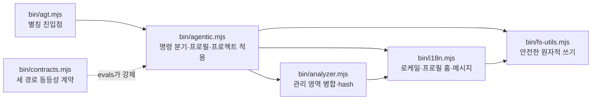
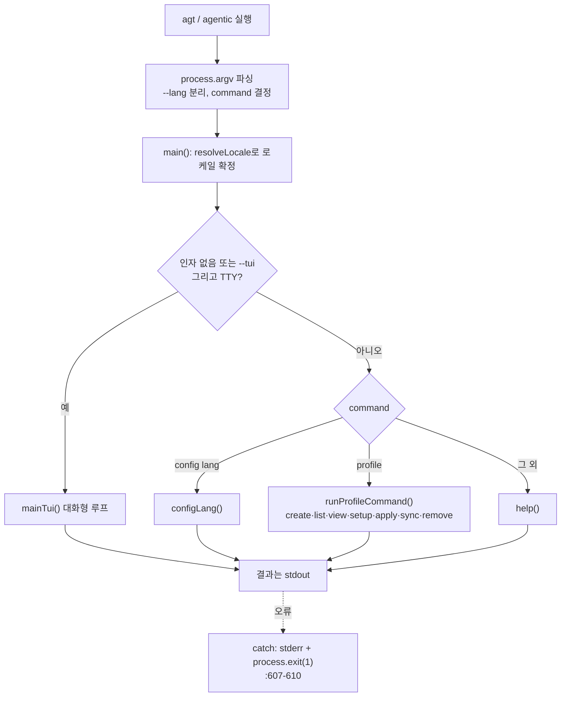
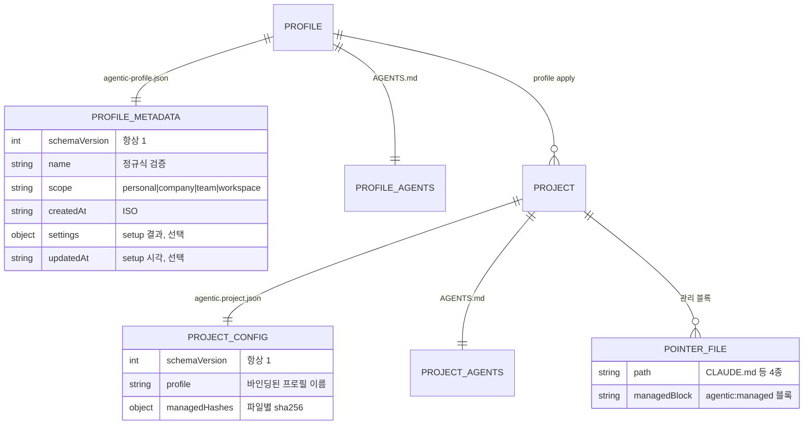
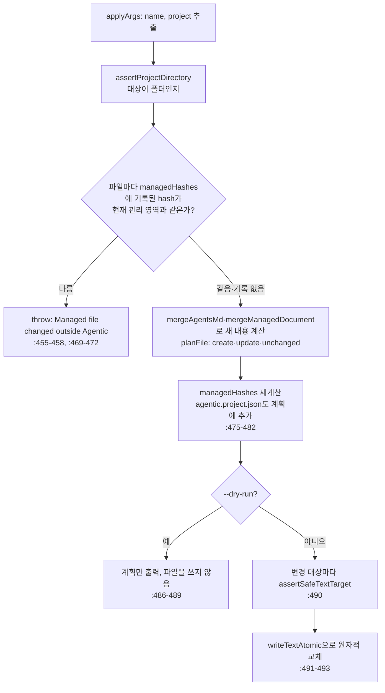
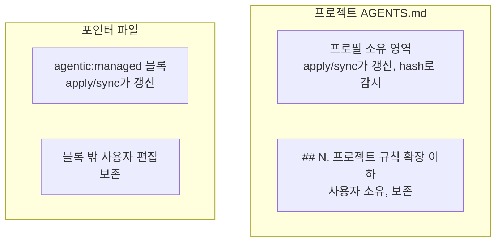
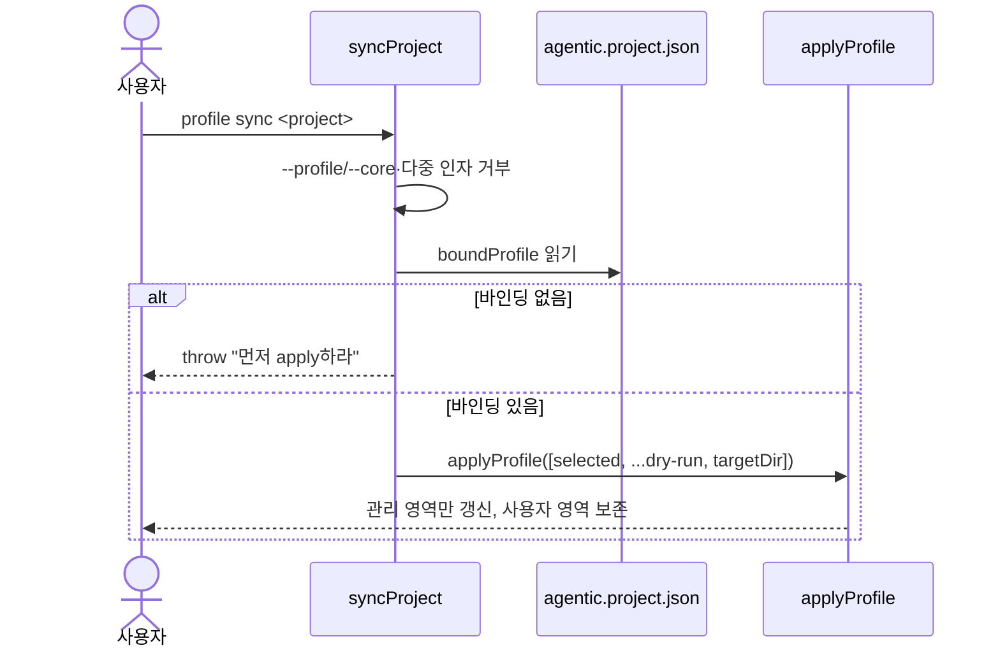
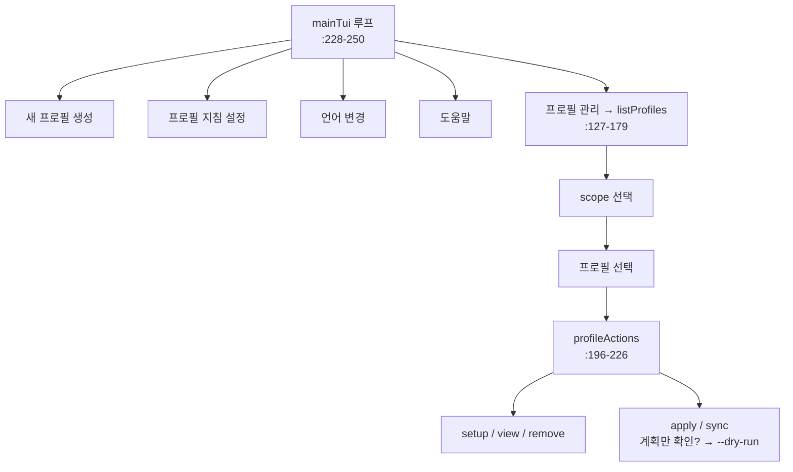

# 기능 구현 메커니즘

**문서 유형:** 내부 동작 메커니즘 (유지보수자용). 현재 구현된 각 기능이 코드 안에서 어떻게 동작하는지를 기능 단위로 설명한다. npm·Node.js·CLI가 왜 그렇게 도는지의 일반 원리는 [구현 원리](../implementation-principles.md)에, 현재 구조·소유권의 정본은 [현재 아키텍처](README.md)에 있다. 이 문서는 그 사이, 이 패키지 고유의 로직을 기능별로 채운다.

**작성·검증 기준:** `@isthis/agentic` `0.2.0` · 2026-09-14 · 아래 소스 해시 마커가 가리키는 소스

> 이 문서는 코드의 `파일:줄` 위치를 다수 인용하고, 핵심 로직은 코드블록으로 함께 싣는다(예: `bin/agentic.mjs:438-495`). 줄 번호와 코드블록은 **아래 마커의 해시를 마지막으로 기록한 시점의 소스 기준**이며 코드가 바뀌면 어긋날 수 있다. 인용을 신뢰하기 전에 현재 코드에서 직접 확인하라. 이 문서는 항상 **현재 구현**을 설명하는 단일 정본이며 과거 버전의 설명은 git 이력에서 확인한다. 코드가 바뀌면 이 문서와 위 기준선을 같은 변경에서 갱신한다. 인용한 소스가 바뀌면 `pnpm run check`가 실패하도록 소스 해시 게이트가 걸려 있다([공개 저장소 운영](../repository-operations.md)의 "문서 소스 해시 게이트" 참고).

<!-- agentic-doc-sources: bin/agentic.mjs, bin/agt.mjs, bin/analyzer.mjs, bin/contracts.mjs, bin/fs-utils.mjs, bin/i18n.mjs -->
<!-- agentic-doc-sources-sha256: 591da7cc1623c2725aa044eb8a1566b39e5f527a855c29aa59d0da18ae275b27 -->

## 읽는 법

- 다루는 것은 **배포되는 CLI(`bin/`)의 로직**이다. 각 절은 하나의 기능·메커니즘을 맡고 `bin/*.mjs`의 실제 함수에 대응한다. 다이어그램은 흐름을, 코드블록은 그 흐름을 만드는 실제 구현을 보여 준다.
- 다루지 않는 것: 생태계 일반 원리([구현 원리](../implementation-principles.md)), 현재 구조·파일 트리·소유권 표([현재 아키텍처](README.md)), 사용자 관점 명령·옵션([CLI Reference](../cli-reference.md)), 사용 흐름([사용자 워크플로](../workflow.md)). 여기서는 이 계약들을 다시 정의하지 않고 원리 설명에 필요한 만큼만 인용한다.
- 마커: 프로필 지침용 `<!-- agentic:guidance:* -->`와 프로젝트 산출물용 `<!-- agentic:managed:* -->`는 서로 다른 계층이다. 아래에서 구분해 적는다.

## 모듈 지도

배포되는 `bin/`의 모듈이 서로를 어떻게 부르는지 먼저 본다.



## 1. 진입점과 명령 분기

두 진입점 `bin/agentic.mjs`와 `bin/agt.mjs` 중 `agt`는 본체를 불러오는 한 줄이다: `import './agentic.mjs';`(`bin/agt.mjs:3`).

인자를 읽고 `command`를 정하는 부분은 다음과 같다(`bin/agentic.mjs:15-19`).

```js
const rawArgs = process.argv.slice(2);
const langFlag = parseFlag(rawArgs, 'lang');   // --lang 값을 먼저 분리
const args = stripFlag(rawArgs, 'lang');       // 나머지에서 --lang 제거
const command = args[0] || 'help';
const invokedAs = path.basename(process.argv[1] || 'agentic').replace(/\.mjs$/, '');
```

- **플래그 헬퍼**: 값 읽기 `parseFlag`(`:38-41`), 존재 여부 `hasFlag`(`:43-45`), 제거 `stripFlag`(`:47-53`). `--dry-run`·`--scope`·`--yes` 등이 모두 이 헬퍼를 거친다.
- **호출 이름 판별**: `invokedAs`는 `process.argv[1]`의 파일명에서 `.mjs`를 뗀 값이다(`:19`). 도움말의 명령 이름·제목을 `agt`/`agentic`에 맞춰 바꾼다(`help()`, `:544-547`).

`main()`은 로케일을 확정한 뒤 아래 표준 입력·명령 조건으로 분기한다(`bin/agentic.mjs:596-604`).

```js
if ((!args.length || command === '--tui') && process.stdin.isTTY) {
  await mainTui();
} else if (command === 'config' && args[1] === 'lang') {
  configLang(args[2]);
} else if (command === 'profile') {
  await runProfileCommand(args.slice(1));
} else {
  help();
}
```



## 2. 로케일 해석과 저장

우선순위는 `resolveLocale`에 고정돼 있다(`bin/i18n.mjs:91-97`).

```js
export function resolveLocale({ flag = null, env = null, saved = null, isTTY = false } = {}) {
  if (flag != null) return validated('--lang', flag);          // 1) --lang
  if (env != null && env !== '') return validated('AGENTIC_LANG', env); // 2) 환경변수
  if (saved && SUPPORTED_LOCALES.includes(saved)) return saved; // 3) 저장된 선택
  if (!isTTY) return DEFAULT_LOCALE;                            // 4a) 비TTY면 기본값 ko
  return null;                                                  // 4b) TTY면 물어봄
}
```

- `--lang`·`AGENTIC_LANG`의 잘못된 값은 예외이고 저장된 잘못된 값은 무시한다.
- `null`이 오면 `main()`이 `promptLocale()`로 한 번 묻고 `saveLocale`로 저장한다(`bin/agentic.mjs:592-595`).
- **저장 위치**: `profileHome()/config.json`(`configPath`, `bin/i18n.mjs:53-55`). `config lang <ko|en>`은 `configLang`이 같은 경로에 저장한다(`bin/agentic.mjs:538-542`).
- `t()`는 키를 찾고 없으면 `ko`로, 그것도 없으면 키 문자열을 그대로 돌려준다(`bin/i18n.mjs:272-279`).

## 3. 프로필 저장소 모델

`profileHome()`(`bin/i18n.mjs:61-73`)이 기준 위치를 정한다: `AGENTIC_HOME`이 있으면 그 아래, 없으면 `os.homedir()` 아래의 `.agentic/profiles`. 언어 설정 `config.json`은 그 위 `.agentic/`에 둔다. `AGENTIC_HOME`으로 저장 위치를 바꿀 수 있고 테스트·스모크가 이를 쓴다. `.agentic/profiles`가 없고 이전 `.agentic-profiles`나 `.agentic-cores`가 있으면 최초 접근 때 한 번 폴더를 `.agentic/profiles`로 옮기고 `config.json`을 `.agentic/`로 올린다. Core 시절 홈은 각 메타데이터도 `agentic-profile.json`으로 바꾼다(`migrateFlatHome`, `:32-59`). best-effort이며 실패하면 크래시하지 않고 새 홈으로 진행한다.

프로필 저장소와 적용 결과물의 온디스크 배치는 다음과 같다.

```text
$AGENTIC_HOME 또는 ~/            대상 프로젝트/
└── .agentic/                   ├── AGENTS.md              (프로필 영역 + 프로젝트 확장)
    ├── config.json  (locale)   ├── agentic.project.json   (profile, managedHashes)
    └── profiles/               ├── CLAUDE.md              (관리 블록)
        └── <name>/             ├── .agents/rules/agentic.md
            ├── agentic-profile.json├── .cursor/rules/agentic.mdc
            └── AGENTS.md       └── .github/copilot-instructions.md
```

메타데이터 스키마와 프로젝트 설정의 관계를 ERD로 보면 이렇다.



- **이름 규칙**: `validateProfileName`의 정규식 `^[a-z0-9][a-z0-9-]{0,63}$`(`bin/agentic.mjs:23-27`).
- **읽기·목록**: `readProfile`(`:55-69`)이 메타데이터·`AGENTS.md` 존재와 `isValidProfileMetadata`(`:29-36`)를 검사한다. `getProfiles`(`:112-125`)는 `scope:name`으로 정렬해 돌려준다.

## 4. profile create

`createProfile`(`bin/agentic.mjs:71-81`)은 이름·scope를 검증하고 폴더를 만든 뒤 메타데이터와 지침 템플릿을 기록한다.

```js
fs.mkdirSync(profileDir, { recursive: true });
writeTextAtomic(path.join(profileDir, PROFILE_METADATA_FILE),
  JSON.stringify({ schemaVersion: 1, name, scope, createdAt: new Date().toISOString() }, null, 2) + '\n');
const profileTemplate = fs.readFileSync(path.join(PACKAGE_ROOT,
  locale === 'en' ? 'templates/profile/AGENTS.en.md' : 'templates/profile/AGENTS.md'), 'utf8');
writeTextAtomic(path.join(profileDir, 'AGENTS.md'), profileTemplate.replaceAll('{{PROFILE_NAME}}', name));
```

대화형 경로는 `createProfileTui`(`:83-110`)가 이름·scope·확인을 물은 뒤 같은 `createProfile`을 부른다.

## 5. profile setup: 지침 블록 기록

기본값은 6개 항목 모두 `recommended`다(`guidanceDefaults`, `bin/agentic.mjs:285`): `harness`·`tdd`·`review`·`verification`·`documentation`·`security`. `setupProfile`(`:287-313`)은 항목마다 `--<key>`(없으면 기존 설정 → 기본값)를 읽어 `off`/`recommended`/`strict`를 검증하고, `off`가 아닌 항목만 블록으로 만든다. 항목이 하나라도 있으면 맨 앞에 적용 수준 정의 범례를 붙인 뒤 마커로 감싼다(`:302-307`). 범례 문구는 `guidanceLevelDefinitions`가 돌려주는 상수이며 setup TUI 힌트와 같다. 모든 항목이 `off`면 블록 안은 비어 있다.

```js
const definitions = guidanceLevelDefinitions(locale);
const legend = `## ${_('setup.legend.title')}\n\n- recommended: ${definitions.recommended}\n- strict: ${definitions.strict}\n\n${_('setup.legend.intro')}`;
const start = '<!-- agentic:guidance:start -->';
const end = '<!-- agentic:guidance:end -->';
const body = blocks.length ? [legend, ...blocks].join('\n\n') : '';
const block = `${start}\n\n${body}\n\n${end}`;
const pattern = new RegExp(`${start}[\\s\\S]*?${end}`, 'm');
writeTextAtomic(profile.instructionsPath,
  pattern.test(current) ? current.replace(pattern, block) : `${current.trimEnd()}\n\n${block}\n`);
```

기존 블록이 있으면 정규식으로 교체하고 없으면 프로필 `AGENTS.md` 끝에 덧붙인다. 선택 결과는 메타데이터의 `settings`와 `updatedAt`에도 기록한다(`:311`). 이 `guidance` 마커는 **프로필** `AGENTS.md` 안의 것으로, 프로젝트 산출물의 `managed` 마커([7절](#7-관리-영역-병합과-hash))와 다른 계층이다.

## 6. profile apply: 변경 계획과 적용

`applyProfile`(`bin/agentic.mjs:438-495`)이 핵심이다. `applyArgs`(`:433-436`)로 `name`(첫 위치인자)과 `project`(둘째, 없으면 `.`)를 뽑는다. 전체 파이프라인은 다음과 같다.



hash 검사는 파일마다 계획을 세우기 직전에 실행되므로 한 파일이라도 다르면 어떤 파일도 쓰지 않는다. dry-run에서는 `agentic.project.json`을 포함해 아무 파일도 쓰지 않는다. `apply`도 `sync`와 같은 검사를 거치므로 같은 프로필로 다시 적용해도 중단이 풀리지 않는다. 사용자용 복구 절차는 [사용 가이드](../usage-guide.md#관리-영역을-고쳐서-멈췄을-때)에 있다.

수동 변경 감지의 핵심은 이 검사다(`AGENTS.md`는 `:454-458`, 포인터 파일은 `:468-472`이 같은 형태).

```js
const previousAgentsHash = projectConfig.managedHashes?.['AGENTS.md'];
if (previousAgentsHash && hashAgentsManagedDocument(existingAgents) !== previousAgentsHash) {
  throw new Error('Managed file changed outside Agentic: AGENTS.md');
}
```

- **포인터 파일 4종**(`:461-466`): `CLAUDE.md`, `.agents/rules/agentic.md`, `.cursor/rules/agentic.mdc`, `.github/copilot-instructions.md`. 각각 `renderAdapter`(`:426-430`) → `mergeManagedDocument`로 관리 블록만 병합한다.
- **`agentic.project.json`**: 레거시 `core` 키를 제거하고 `{ schemaVersion: 1, profile: name, managedHashes }`를 기록한다(`:481-482`).
- **출력**: 계획 요약과 파일별 상태를 한 줄씩 출력한다(`:484-485`).

## 7. 관리 영역 병합과 hash

`bin/analyzer.mjs`가 사용자 영역과 Agentic 관리 영역을 분리한다. `AGENTS.md`는 프로필 소유 영역과 프로젝트 확장이 한 파일에 공존한다.



`AGENTS.md`의 병합은 확장 헤더를 기준으로 위아래를 가른다(`mergeAgentsMd`, `bin/analyzer.mjs:21-39`).

- **확장 헤더 인식**: `EXTENSION_HEADER`(`:12`)가 한국어 `프로젝트 규칙 확장`과 영어 `Project rule extensions` 제목을 모두 인식한다. 헤더 바로 아래의 안내 문구는 두 로케일의 `scaffold.extBody`를 모두 걷어 낸 뒤 나머지를 사용자 규칙으로 옮긴다(`:13`, `:32-35`). 헤더를 한 로케일로만 인식하면 다른 로케일 프로젝트에서 확장 영역이 관리 영역으로 계산돼 동기화가 멈춘다.
- **헤더가 없는 기존 파일**: 기존 내용 전체를 `## Existing project guidance` 아래로 옮겨 보존한다(`:25-27`). hash를 계산할 때도 이 제목 아래는 관리 영역에서 뺀다(`extractAgentsManagedDocument`, `:47-54`).

포인터 파일은 마커 블록만 바꾼다.

```js
// analyzer.mjs:68-78 — 관리 블록만 교체하거나 없으면 덧붙인다
const start = '<!-- agentic:managed:start -->';
const end = '<!-- agentic:managed:end -->';
const managedBlock = `${start}\n${managedContent.trim()}\n${end}`;
if (!existingContent || typeof existingContent !== 'string') return `${managedBlock}\n`;
const pattern = new RegExp(`${start}[\\s\\S]*?${end}`, 'm');
if (pattern.test(existingContent)) return `${existingContent.replace(pattern, managedBlock).trimEnd()}\n`;
return `${existingContent.trimEnd()}\n\n${managedBlock}\n`;
```

`hashAgentsManagedDocument`(`:56-59`)와 `hashManagedDocument`(`:87-90`)가 각각 관리 영역·관리 블록만 `sha256`한다. 이 hash를 `agentic.project.json`에 저장해 두고 다음 `apply`/`sync` 때 사용자가 관리 영역을 밖에서 손댔는지 감지한다(`createHash`, `bin/analyzer.mjs:1`). 이는 이 패키지가 **자기 산출물의 드리프트를 감지하는 방식** 그대로다.

## 8. profile sync

`syncProject`(`bin/agentic.mjs:502-517`)은 프로젝트가 이미 바인딩된 프로필을 다시 적용하되 **프로필을 절대 바꾸지 않는다.**

```js
if (parseFlag(values, 'profile') || parseFlag(values, 'core')) {
  throw new Error('profile sync does not switch profiles. To switch, use `agentic profile apply <name> <project>`.');
}
// ...위치 인자 2개 이상도 거부...
const selected = boundProfile(readProjectConfig(selectionPath)); // profile 또는 레거시 core
if (!selected) throw new Error('profile sync requires a project already applied ...');
applyProfile([selected, ...(hasFlag(values, 'dry-run') ? ['--dry-run'] : []), targetDir]);
```



즉 `sync`는 "`apply`를 현재 바인딩된 프로필로 다시 부르는 것"이다.

## 9. 안전한 파일 쓰기

`bin/fs-utils.mjs`가 프로젝트 파일 교체의 안전장치다. 쓰기 직전 대상과 그 부모 경로를 검사한다.

```js
// fs-utils.mjs:12-18 — 심볼릭 링크·비정규 파일 거부
const stat = fs.lstatSync(target);
if (stat.isSymbolicLink()) throw new Error(`Refusing to replace symbolic link: ${target}`);
if (!stat.isFile()) throw new Error(`Refusing to replace non-regular file: ${target}`);
```

교체는 같은 폴더의 임시 파일을 거쳐 `rename`으로 원자적으로 이뤄진다.

```js
// fs-utils.mjs:52-58 — 임시 파일 작성 후 rename, finally로 잔여물 제거
const temporary = path.join(path.dirname(target), `.${path.basename(target)}.agentic-${randomUUID()}.tmp`);
try {
  fs.writeFileSync(temporary, content, { encoding: 'utf8', mode });
  fs.renameSync(temporary, target);
} finally {
  if (fs.existsSync(temporary)) fs.unlinkSync(temporary);
}
```

- `boundary`가 주어지면 대상 부모를 `boundary`까지 거슬러 올라가며 심볼릭 링크 부모·비디렉터리 부모를 거부한다(`:21-38`). 아직 없는 대상(`ENOENT`)은 통과시킨다.
- 기존 파일 권한 모드를 `lstat`로 읽어 보존한다(`:43-49`, 기본 `0o666`). 다만 `fs.writeFileSync`는 생성 시 umask를 적용하므로 권한 비트가 항상 그대로 보존된다는 보장은 아니다.

## 10. dry-run · 로그 · 종료 코드

- **dry-run**: `apply`/`sync`에 `--dry-run`을 주면 계획만 출력하고 파일을 바꾸지 않는다(`bin/agentic.mjs:486-489`). TUI에서도 적용·동기화 전 "계획만 확인"을 고르면 `--dry-run`이 붙는다(`:219-224`).
- **로그**: 계획 요약과 파일별 `create`/`update`/`unchanged` 상태를 한 줄씩 출력한다(`:484-485`).
- **종료 코드**: 최상위 `catch`가 오류를 내고 `process.exit(1)`로 끝낸다(`:607-610`). 성공하면 기본 0이다.

## 11. TUI 흐름 배선

화면은 `@clack/prompts`의 `intro`/`select`/`text`/`confirm`/`note`/`outro`로 그린다(`bin/agentic.mjs:7`). 인자가 없고 TTY이면 `mainTui`(`:228-250`) 루프가 열린다.



비대화형에서는 `listProfiles`가 `[scope]` 목록만 출력하고(`:175-178`), `createProfileTui`·`setupProfileTui`는 표준 입력(`fs.readFileSync(0, 'utf8')`)을 줄 단위로 읽어 처리한다(`:85`, `:317`). 파이프·CI·스모크 테스트 경로다.

## 12. 기능 인터페이스 동등성 계약

`bin/contracts.mjs`의 `PROFILE_OPERATION_CONTRACT`(`:5-13`)가 7개 작업마다 세 실행 경로를 선언한다.

```js
export const PROFILE_OPERATION_CONTRACT = [
  { id: 'create', cli: 'profile create', tui: 'profile list → 새 프로필 생성', profileList: true },
  { id: 'list',   cli: 'profile list',   tui: 'profile list',                 profileList: true },
  { id: 'view',   cli: 'profile view <name>', tui: 'profile list → 상세 보기', profileList: true },
  // setup·apply·sync·remove 동일한 형태로 이어짐
];
```

`AGENTS.md`의 "기능 인터페이스 동등성"(모든 사용자 기능은 CLI 명령·TUI 흐름·`profile list` 메뉴 세 경로에서 실행 가능) 규칙을 코드로 표현한 것이다. 이 계약은 `evals/interface-parity.test.mjs`가 강제한다.

## 13. 검증 하네스와의 대응

각 메커니즘은 대응하는 eval로 강제된다(파일명 기준). 검증의 목적·증거 범위·한계 정본은 [현재 아키텍처](README.md)와 [공개 저장소 운영](../repository-operations.md)이다.

| 메커니즘 | 대응 eval |
| --- | --- |
| 안전한 파일 쓰기([9절](#9-안전한-파일-쓰기)) | `evals/file-safety.test.mjs` |
| 관리 영역 병합·hash([7절](#7-관리-영역-병합과-hash)) | `evals/sync-merge.test.mjs` |
| 세 경로 동등성([12절](#12-기능-인터페이스-동등성-계약)) | `evals/interface-parity.test.mjs` |
| 프로필 생성·설정·apply/sync | `evals/profile.test.mjs` |
| 로케일 해석([2절](#2-로케일-해석과-저장)) | `evals/i18n.test.mjs` |
| 배포 파일 경계 | `evals/package-contents.test.mjs` |
| 문서 계약·저장소 운영 | `evals/docs-check.test.mjs`, `evals/repository-operations.test.mjs` |

## 관련 문서

- [구현 원리](../implementation-principles.md): npm·Node.js·CLI 일반 원리와 이 패키지의 연결(생태계 관점)
- [현재 아키텍처](README.md): 현재 구현된 구조·소유권·검증 경계의 정본
- [제품 방향](../product-direction.md): 목표·범위·단계별 완료 기준
- [사용자 워크플로](../workflow.md): 프로필 생성부터 프로젝트 적용까지의 사용 흐름
- [CLI Reference](../cli-reference.md): 명령어·옵션·TUI·자동화 방식
- [공개 저장소 운영](../repository-operations.md): 품질 게이트·릴리스·보안 정책, 문서 소스 해시 게이트
