# 기능 구현 메커니즘

**문서 유형:** 내부 동작 메커니즘 (유지보수자용). 현재 구현된 각 기능이 코드 안에서 어떻게 동작하는지를 기능 단위로 설명한다. npm·Node.js·CLI가 왜 그렇게 도는지의 일반 원리는 [구현 원리](../implementation-principles.md)에, 현재 구조·소유권의 정본은 [현재 아키텍처](README.md)에 있다. 이 문서는 그 사이, 이 패키지 고유의 로직을 기능별로 채운다.

**작성·검증 기준:** `agent-context-manager`(게시 전) · 2026-09-15 · 아래 소스 해시 마커가 가리키는 소스

> 이 문서는 코드의 `파일:줄` 위치를 다수 인용하고, 핵심 로직은 코드블록으로 함께 싣는다(예: `src/commands/handlers.ts:63-94`). 줄 번호와 코드블록은 **아래 마커의 해시를 마지막으로 기록한 시점의 소스 기준**이며 코드가 바뀌면 어긋날 수 있다. 인용을 신뢰하기 전에 현재 코드에서 직접 확인하라. 이 문서는 항상 **현재 구현**을 설명하는 단일 정본이며 과거 버전의 설명은 git 이력에서 확인한다. 코드가 바뀌면 이 문서와 위 기준선을 같은 변경에서 갱신한다. 인용한 소스가 바뀌면 `pnpm run check`가 실패하도록 소스 해시 게이트가 걸려 있다([공개 저장소 운영](../repository-operations.md)의 "문서 소스 해시 게이트" 참고).

<!-- agctx-doc-sources: src -->
<!-- agctx-doc-sources-sha256: a34dd87c3b88027774a5a16fb14ef7013303fc7a35c18d0b5af74120be462534 -->

## 읽는 법

- 다루는 것은 **CLI 소스(`src/`)의 로직**이다. 배포본 `dist/`는 이 소스를 컴파일한 것이라 동작이 같다. 각 절은 하나의 기능·메커니즘을 맡고 `src/` 모듈의 실제 함수에 대응한다. 다이어그램은 흐름을, 코드블록은 그 흐름을 만드는 실제 구현을 보여 준다.
- 다루지 않는 것: 생태계 일반 원리([구현 원리](../implementation-principles.md)), 현재 구조·파일 트리·소유권 표([현재 아키텍처](README.md)), 사용자 관점 명령·옵션·종료 코드 표([CLI Reference](../cli-reference.md)), 사용 흐름([사용자 워크플로](../workflow.md)). 여기서는 이 계약들을 다시 정의하지 않고 원리 설명에 필요한 만큼만 인용한다.
- 마커: 프로필 지침용 `<!-- agctx:guidance:* -->`와 프로젝트 산출물용 `<!-- agctx:managed:* -->`는 서로 다른 계층이다. 아래에서 구분해 적는다.

## 모듈 지도

`src/`의 모듈이 서로를 어떻게 부르는지 먼저 본다. 폴더는 역할별로 나뉜다: `commands/`(명령 등록부·옵션 검사·처리기·출력·도움말), `profile/`(프로필 명령과 Git 프로필), `project/`(적용 엔진·APM 생성 파일 판정·하위 폴더 연결 파일), `check.ts`(저장소 검사), `explain.ts`(에이전트별 지침 로드 판정), `verify/`(세션 기록 판독·probe), `repos/`(여러 저장소 목록·상태·동기화·PR), `i18n/`(로케일·메시지), `tui/`(대화형 화면), `shared/`(프로필 홈·안전한 쓰기·git 실행·숨은 문자 검사·종료 코드·공용 타입).

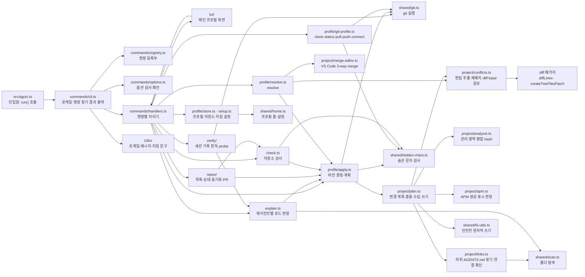

그림에 없는 `commands/output.ts`(stdout·stderr 분리와 결과 문서)와 `shared/errors.ts`(종료 코드와 `CliError`)는 거의 모든 모듈이 쓴다. `shared/types.ts`는 모듈이 함께 쓰는 타입만 정의하고 다른 모듈이 `import type`으로만 가져오므로, 컴파일하면 그 import가 지워져 실행 중에는 불러오지 않는다.

## 1. 진입점과 명령 분기

진입점 `src/agctx.ts`는 `commands/cli.ts`의 `run()`을 부르기만 한다(`src/agctx.ts:3-5`). 모듈을 불러오는 것만으로는 CLI가 실행되지 않는다. 설치본에서는 컴파일한 `dist/agctx.js`가 같은 일을 한다.

`main(argv)`(`src/commands/cli.ts:34-64`)는 전역 옵션을 먼저 떼어 낸 뒤 등록부에서 명령을 찾는다.

```ts
const rawArgs = argv.slice(2);
setJsonMode(hasFlag(rawArgs, 'json'));
const langFlag = parseFlag(rawArgs, 'lang');
const args = stripFlag(rawArgs, 'lang').filter(value => value !== '--json');
await resolveActiveLocale(langFlag);
// … 인자가 없거나 --tui면 TTY이고 --json이 아닐 때 mainTui(), 아니면 help()
const command = findCommand(args);
if (!command) throw unknownCommand(args);
const rest = args.slice(command.words.length);
// … --help면 commandHelp(command)
const parsed = checkArguments(command, rest);
const outcome = await HANDLERS[command.id](parsed);
```

- **명령 찾기:** `findCommand`(`src/commands/registry.ts:82-88`)는 입력 앞부분과 단어가 가장 많이 맞는 명령을 고른다. 맞는 명령이 없으면 `unknownCommand`(`src/commands/cli.ts:23-27`)가 `suggestCommands`(`src/commands/registry.ts:91-99`)의 편집 거리 결과로 비슷한 명령을 붙여 사용법 오류(64)를 던진다.
- **도움말:** `help()`(`src/commands/help.ts:7-18`)와 `commandHelp()`(`src/commands/help.ts:21-29`)는 등록부의 `usageLine`(`src/commands/registry.ts:76-79`)과 명령별 종료 코드 목록으로 출력한다.
- **플래그 헬퍼:** `parseFlag`·`hasFlag`·`stripFlag`(`src/commands/args.ts:1-18`)는 전역 옵션을 떼어 낼 때와 `profile setup`의 수준 옵션을 읽을 때 쓴다. `stripFlag`는 옵션과 바로 뒤의 값을 함께 떼어 내므로 값을 받는 `--lang`에만 쓰고, 값이 없는 `--json`은 그 토큰만 걸러 낸다. 명령 옵션은 `checkArguments`가 등록부를 기준으로 해석한다([12절](#12-기능-인터페이스-동등성-계약)).
- **결과 출력:** `run()`(`src/commands/cli.ts:67-86`)은 `--json`이면 결과 문서를 stdout에 쓰고, 아니면 처리기가 돌려준 경고를 stderr에 쓴다. 오류는 `CliError`가 지닌 종료 코드를 `process.exitCode`에 넣고 `Error:`·`Next:` 두 줄(또는 JSON 문서)로 출력한다. `CliError`가 아닌 예외는 `internal` 코드와 종료 코드 70으로 바꾼다.

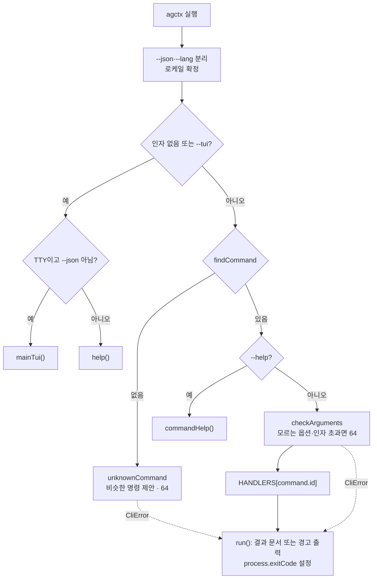

## 2. 로케일 해석과 저장

우선순위는 `resolveLocale`에 고정돼 있다(`src/i18n/index.ts:43-49`).

```ts
export function resolveLocale({ flag = null, env = null, saved = null, isTTY = false }: LocaleInputs = {}): Locale | null {
  if (flag != null) return validated('--lang', flag);                   // 1) --lang
  if (env != null && env !== '') return validated('AGCTX_LANG', env); // 2) 환경변수
  if (isLocale(saved)) return saved;                                    // 3) 저장된 선택
  if (!isTTY) return DEFAULT_LOCALE;                                    // 4a) 비TTY면 기본값 en
  return null;                                                          // 4b) TTY면 물어봄
}
```

- `--lang`·`AGCTX_LANG`의 잘못된 값은 예외이고 저장된 잘못된 값은 무시한다.
- `resolveActiveLocale`(`src/commands/cli.ts:14-21`)은 `--json`이면 터미널이어도 `isTTY`를 거짓으로 넘겨 묻지 않는다. `null`이 오면 `promptLocale()`로 한 번 묻고 `saveLocale`로 저장한다.
- **저장 위치:** agctx 데이터 폴더의 `config.json`이다(`configPath`, `src/shared/home.ts:20-22`). `config lang <ko|en>`은 처리기(`src/commands/handlers.ts:342-347`)가 `saveLocale`(`src/shared/home.ts:37-41`)로 같은 경로에 저장한다.
- `t()`는 키를 찾고 없으면 기본 로케일(`en`)로, 그것도 없으면 키 문자열을 그대로 돌려준다(`src/i18n/index.ts:57-64`). 두 카탈로그의 키 집합이 같은지와 코드가 찾는 키가 모두 있는지는 `evals/messages.test.ts`가 검사한다.

## 3. 프로필 저장소 모델

`agctxHome()`(`src/shared/home.ts:11-13`)가 데이터 폴더를 정한다: `AGCTX_HOME`이 있으면 그 폴더, 없으면 `os.homedir()` 아래의 `.agctx`다. 프로필은 그 아래 `profiles/`(`profileHome`, `src/shared/home.ts:16-18`), 언어 설정은 `config.json`에 있다. 테스트·스모크는 `AGCTX_HOME`으로 임시 폴더를 쓴다. 이름을 바꾸기 전의 홈(`~/.agentic` 등)은 읽거나 옮기지 않는다([ADR 0013](../adr/0013-rename-agent-context-manager.md)).

프로필 저장소와 적용 결과물의 온디스크 배치는 다음과 같다.

```text
$AGCTX_HOME 또는 ~/.agctx/      대상 프로젝트/
├── config.json  (locale)       ├── AGENTS.md              (프로필 영역 + 프로젝트 확장)
└── profiles/                   ├── agctx.project.json     (profile, projectName, source, pin, managedHashes)
    └── <name>/                 ├── CLAUDE.md              (관리 블록)
        ├── .git/  (Git 프로필)  ├── .agents/rules/agctx.md
        ├── profile.json        └── .agctx/                (base/*.base · backups/ · .gitignore)
        └── AGENTS.md
```

데이터 폴더의 `repos.json`은 이 컴퓨터에서 프로필을 적용한 저장소 목록이다([19절](#19-여러-저장소-목록과-repos-명령)).

메타데이터 스키마와 프로젝트 설정의 관계를 ERD로 보면 이렇다.

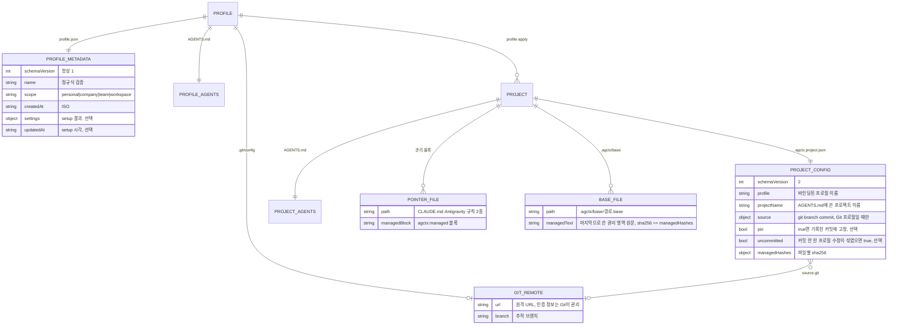

- **이름 규칙:** `PROFILE_NAME` 정규식 `^[a-z0-9][a-z0-9-]{0,63}$`(`src/profile/store.ts:13`)을 `validateProfileName`(`src/profile/store.ts:19-23`)이 검사하고 틀리면 64로 멈춘다.
- **읽기·목록:** `readProfile`(`src/profile/store.ts:35-53`)이 메타데이터·`AGENTS.md` 존재와 `isValidProfileMetadata`(`src/profile/store.ts:25-33`)를 검사한다. `getProfiles`(`src/profile/store.ts:69-82`)는 메타데이터가 올바른 프로필만 `scope:name` 순서로 돌려준다.
- `agctx.project.json`의 `schemaVersion` 1로 기록된 프로젝트도 그대로 읽는다(`readProjectConfig`, `src/profile/apply.ts:45-54`). 다음 `apply`·`sync`가 2로 기록한다.

## 4. profile create

`createProfile`(`src/profile/store.ts:55-67`)은 이름·scope를 검증하고 폴더를 만든 뒤 메타데이터와 지침 템플릿을 기록한다.

```ts
fs.mkdirSync(profileDir, { recursive: true });
const metadata: ProfileMetadata = { schemaVersion: 1, name, scope, createdAt: new Date().toISOString() };
writeTextAtomic(path.join(profileDir, PROFILE_METADATA_FILE), JSON.stringify(metadata, null, 2) + '\n');
const profileTemplate = fs.readFileSync(path.join(PACKAGE_ROOT, getLocale() === 'ko' ? 'templates/profile/AGENTS.ko.md' : 'templates/profile/AGENTS.md'), 'utf8');
writeTextAtomic(path.join(profileDir, 'AGENTS.md'), profileTemplate.replaceAll('{{PROFILE_NAME}}', name));
```

이름을 생략하면 처리기(`src/commands/handlers.ts:97-106`)가 `createProfileTui`(`src/tui/profile.ts:33-61`)를 부른다. 터미널에서는 이름·scope·확인을 묻고, 터미널이 아니면 stdin의 첫 줄을 이름, 둘째 줄을 scope로 읽는다(`src/tui/profile.ts:34-38`). 읽은 이름이 비었거나 `--json` 실행이면 사용법 오류(64)로 멈춘다.

## 5. profile setup: 지침 블록 기록

기본값은 6개 항목 모두 `recommended`다(`guidanceDefaults`, `src/profile/setup.ts:10`): `harness`·`tdd`·`review`·`verification`·`documentation`·`security`. `setupProfile`(`src/profile/setup.ts:19-46`)은 항목마다 `--<key>`(없으면 기존 설정 → 기본값)를 읽어 `off`/`recommended`/`strict`를 검증하고(틀리면 64), `off`가 아닌 항목만 블록으로 만든다. 항목이 하나라도 있으면 맨 앞에 적용 수준 정의 범례를 붙인 뒤 마커로 감싼다(`src/profile/setup.ts:34-39`). 범례 문구는 `guidanceLevelDefinitions`가 돌려주는 상수이며 setup TUI 힌트와 같다. 모든 항목이 `off`면 블록 안은 비어 있다.

```ts
const definitions = guidanceLevelDefinitions(getLocale());
const legend = `## ${_('setup.legend.title')}\n\n- recommended: ${definitions.recommended}\n- strict: ${definitions.strict}\n\n${_('setup.legend.intro')}`;
const start = '<!-- agctx:guidance:start -->';
const end = '<!-- agctx:guidance:end -->';
const body = blocks.length ? [legend, ...blocks].join('\n\n') : '';
const block = `${start}\n\n${body}\n\n${end}`;
const current = fs.readFileSync(profile.instructionsPath, 'utf8');
const pattern = new RegExp(`${start}[\\s\\S]*?${end}`, 'm');
writeTextAtomic(profile.instructionsPath, (pattern.test(current) ? current.replace(pattern, block) : `${current.trimEnd()}\n\n${block}\n`));
```

기존 블록이 있으면 정규식으로 교체하고 없으면 프로필 `AGENTS.md` 끝에 덧붙인다. 선택 결과는 메타데이터의 `settings`와 `updatedAt`에도 기록한다(`src/profile/setup.ts:43`). 이 `guidance` 마커는 **프로필** `AGENTS.md` 안의 것으로, 프로젝트 산출물의 `managed` 마커([7절](#7-관리-영역-병합과-hash))와 다른 계층이다. Git 프로필이라면 `setup`의 결과는 커밋하지 않은 변경으로 남고, 커밋과 `profile push`는 사용자가 한다.

## 6. profile apply: 변경 계획과 적용

`profile apply` 처리기(`src/commands/handlers.ts:127-132`)와 `profile sync` 처리기(`src/commands/handlers.ts:133-137`)는 둘 다 `applyOrSync`(`src/commands/handlers.ts:63-94`)를 부른다. 차이는 프로필 이름을 인자로 받는지(apply), 프로젝트에 기록된 이름을 쓰는지(sync)와 고정을 어떻게 다루는지뿐이다. `planFor`(`src/profile/apply.ts:120-137`)가 프로필을 읽고, 대상이 폴더인지 확인하고, `agctx.project.json`을 읽고, 쓸 프로필 내용과 버전 기록을 정한 뒤([16절](#16-적용-버전-기록과-고정)) 숨은 문자를 검사하고 `planProject`(`src/project/plan.ts:72-143`)에 넘긴다. 계획 계산은 충돌을 throw하지 않고 모으며, 충돌이 없을 때만 쓴다.

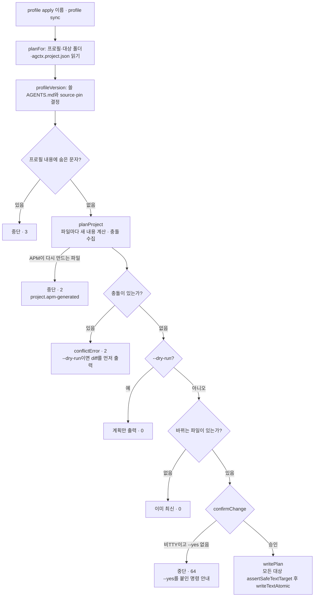

`planProject`는 `AGENTS.md`, 포인터 2종, 하위 폴더 연결 파일마다 새 내용과 충돌 여부를 계산한다(`src/project/plan.ts:74-89`).

```ts
const existing = overridden ? overrides.get(relativePath) ?? null : readIfExists(path.join(targetDir, relativePath));
if (apmRegenerates(relativePath, existing)) { /* … project.apm-generated 오류, 종료 코드 2 (23절) */ }
const regenerated = regenerate(existing);            // mergeAgentsMd 또는 mergeManagedDocument
const currentRegion = managedRegion(kind, existing); // 지금 파일의 관리 영역
const nextRegion = managedRegion(kind, regenerated); // agctx가 쓸 관리 영역
const recordedHash = overridden ? null : recordedHashFor(projectConfig, relativePath);
const conflict = recordedHash && regionHash(currentRegion) !== recordedHash
  ? { kind: existing === null ? 'missing' as const : 'edited' as const, base: knownBase(targetDir, relativePath, recordedHash, nextRegion) }
  : null;
```

한 파일이라도 충돌이면 쓰기 전에 멈추므로 어떤 파일도 바뀌지 않는다. dry-run에서는 `agctx.project.json`을 포함해 아무 파일도 쓰지 않는다. `apply`도 `sync`와 같은 계산을 거치므로 같은 프로필로 다시 적용해도 충돌은 풀리지 않는다. 충돌 표시와 복구는 [14절](#14-관리-영역-충돌-표시와-profile-resolve)에 있다.

- **포인터 파일 2종**(`POINTER_TEMPLATES`, `src/project/plan.ts:19-22`): `CLAUDE.md`, `.agents/rules/agctx.md`. Cursor·Copilot 파일은 만들지 않는다([ADR 0011](../adr/0011-supported-agents.md)). 템플릿의 `{{PROJECT_NAME}}`을 채운 뒤 `mergeManagedDocument`로 관리 블록만 병합한다(`src/project/plan.ts:92-95`).
- **하위 폴더 연결 파일**(`src/project/plan.ts:97-117`): 하위 `AGENTS.md`마다 `templates/CLAUDE.link.md`로 연결 파일을 계획하고 사람이 둔 파일에 대한 경고를 모은다([23절](#23-apm-생성-파일과-모노레포-연결-파일)).
- **계획 파일 순서**(`src/project/plan.ts:119-140`): 관리 파일(`AGENTS.md`, 포인터 2종, 연결 파일), 각 관리 영역의 base 파일 `.agctx/base/<경로>.base`, `.agctx/.gitignore`(`backups/`), 마지막으로 `agctx.project.json`이다.
- **`agctx.project.json`의 키 순서:** 기존 설정에서 agctx가 쓰는 키를 모두 걷어 낸 뒤 같은 순서로 다시 붙인다. 그래야 바뀐 것이 없는 `sync`가 파일을 다시 쓰지 않는다(`src/project/plan.ts:134-140`).

```ts
const { schemaVersion: _schemaVersion, profile: _profile, projectName: _projectName, source: _source, pin: _pin, uncommitted: _uncommitted, managedHashes: _managedHashes, ...kept } = projectConfig;
const version = {
  ...(record.source ? { source: record.source } : {}),
  ...(record.pin ? { pin: true } : {}),
  ...(record.uncommitted ? { uncommitted: true } : {})
};
planFile('agctx.project.json', JSON.stringify({ ...kept, schemaVersion: 2, profile: profileName, projectName, ...version, managedHashes }, null, 2) + '\n');
```

- **프로젝트 이름:** `AGENTS.md`에 쓰는 프로젝트 이름은 `package.json`의 `name`, 기록한 `projectName`, 폴더 이름 순서로 정하고 적용할 때 기록한다(`getProjectName`, `src/profile/apply.ts:26-35`). 팀원이 다른 이름의 폴더로 clone하거나 `repos pr`이 임시 worktree에서 렌더링해도 같은 파일이 나온다.
- **저장소 목록:** 파일을 썼거나 이미 최신이면 `repos.json`에 경로·프로필·고정 여부를 기록한다(`remember`, `src/commands/handlers.ts:32-40`). 목록을 쓰지 못해도 적용은 성공으로 끝나고 경고만 남긴다. dry-run과 확인 거절은 기록하지 않는다.
- **출력과 경고:** `printPlan`(`src/profile/apply.ts:139-147`)이 계획 요약과 파일별 상태를 한 줄씩 출력한다. 고정한 프로젝트에 `--pin` 없이 `apply`하면 풀린다는 경고와, 연결 파일에 관한 계획의 경고를 계획보다 먼저 stderr에 출력한다(`src/commands/handlers.ts:67-68`). `--json`이면 경고를 결과 문서의 `warnings`에 담는다.

## 7. 관리 영역 병합과 hash

`src/project/analyzer.ts`가 사용자 영역과 agctx 관리 영역을 분리한다. `AGENTS.md`는 프로필 소유 영역과 프로젝트 확장이 한 파일에 공존한다.

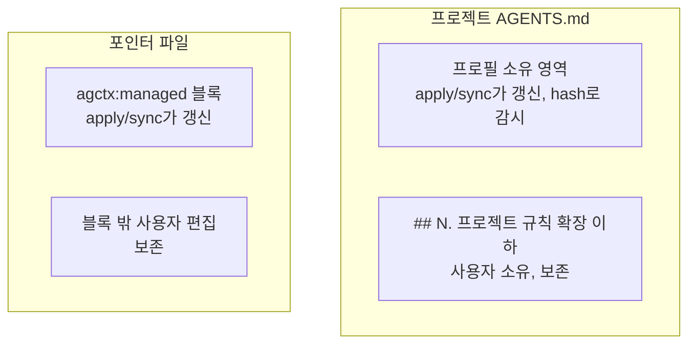

`AGENTS.md`의 병합은 확장 헤더를 기준으로 위아래를 가른다(`mergeAgentsMd`, `src/project/analyzer.ts:20-38`).

- **확장 헤더 인식**: `EXTENSION_HEADER`(`src/project/analyzer.ts:12`)가 한국어 `프로젝트 규칙 확장`과 영어 `Project rule extensions` 제목을 모두 인식한다. 헤더 바로 아래의 안내 문구는 두 로케일의 `scaffold.extBody`를 모두 걷어 낸 뒤 나머지를 사용자 규칙으로 옮긴다(`src/project/analyzer.ts:13`, `src/project/analyzer.ts:31-34`). 헤더를 한 로케일로만 인식하면 다른 로케일 프로젝트에서 확장 영역이 관리 영역으로 계산돼 동기화가 멈춘다.
- **헤더가 없는 기존 파일**: 기존 내용 전체를 `## Existing project guidance` 아래로 옮겨 보존한다(`src/project/analyzer.ts:24-26`). hash를 계산할 때도 이 제목 아래는 관리 영역에서 뺀다(`extractAgentsManagedDocument`, `src/project/analyzer.ts:44-51`).

포인터 파일은 마커 블록만 바꾼다.

```ts
// src/project/analyzer.ts:70-80 — 관리 블록만 교체하거나 없으면 덧붙이고, 템플릿 frontmatter는 블록 밖 맨 앞에 둔다
const template = managedContent.trim();
const frontmatter = template.match(LEADING_FRONTMATTER)?.[0] || '';
const managedBlock = `${start}\n${template.slice(frontmatter.length).trim()}\n${end}`;
const withFrontmatter = (content: string) => (frontmatter ? `${frontmatter}\n${content}` : content);
if (!existingContent || typeof existingContent !== 'string') return withFrontmatter(`${managedBlock}\n`);
const pattern = new RegExp(`${start}[\\s\\S]*?${end}`, 'm');
const merged = pattern.test(existingContent)
  ? `${existingContent.replace(pattern, managedBlock).trimEnd()}\n`
  : `${existingContent.trimEnd()}\n\n${managedBlock}\n`;
return LEADING_FRONTMATTER.test(existingContent) ? merged : withFrontmatter(merged);
```

- **frontmatter 위치**: Antigravity 규칙은 파일 첫 줄의 frontmatter(`trigger`)로 로드 방식을 정한다. 그래서 템플릿 frontmatter(`LEADING_FRONTMATTER`, `src/project/analyzer.ts:58`)는 관리 블록과 관리 hash 밖, 파일 맨 앞에 둔다. 파일 맨 앞에 frontmatter가 이미 있으면 사용자의 것으로 보고 보존한다. 결정 근거는 [ADR 0009](../adr/0009-agent-rule-frontmatter.md)에 있다.

`hashAgentsManagedDocument`(`src/project/analyzer.ts:53-56`)와 `hashManagedDocument`(`src/project/analyzer.ts:90-93`)가 각각 관리 영역·관리 블록만 `sha256`한다. 이 hash를 `agctx.project.json`에 저장해 두고 다음 `apply`/`sync`와 `check` 때 사용자가 관리 영역을 밖에서 손댔는지 감지한다(`createHash`, `src/project/analyzer.ts:1`). 이는 이 패키지가 **자기 산출물의 드리프트를 감지하는 방식** 그대로다.

## 8. profile sync

`profile sync` 처리기(`src/commands/handlers.ts:133-137`)는 프로젝트가 이미 바인딩된 프로필을 다시 적용하되 **프로필을 절대 바꾸지 않는다.** 전환은 `apply`의 몫이다.

```ts
const targetDir = projectDir(parsed.positional[0]);
const name = boundProfile(targetDir, 'profile sync'); // 기록된 profile, 없으면 64
return applyOrSync(parsed, name, targetDir, 'keep', `agctx profile sync ${targetDir} --yes`);
```

- **전환 거부:** 등록부에서 `profile sync`의 위치 인자는 `[<project>]` 하나이고 `--profile` 옵션이 없다. 그래서 `sync <name> <project>`나 `sync --profile x`는 `checkArguments`가 64로 멈추며, 이 명령에 등록한 `misuseHint`가 `apply`로 전환하라고 안내한다(`src/commands/options.ts:32-36`, `48-50`).
- **바인딩 없음:** `boundProfile`(`src/profile/apply.ts:169-173`)이 `agctx.project.json`에서 프로필 이름을 찾지 못하면 먼저 `apply`하라는 사용법 오류(64)를 던진다.
- **고정 유지:** `pin`에 `'keep'`을 넘기므로 고정한 프로젝트는 기록한 커밋의 내용으로, 고정하지 않은 프로젝트는 보관함의 현재 내용으로 다시 만든다([16절](#16-적용-버전-기록과-고정)).

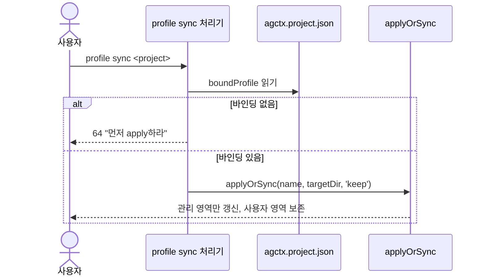

즉 `sync`는 "`apply`를 현재 바인딩된 프로필과 기존 고정 상태로 다시 부르는 것"이다.

## 9. 안전한 파일 쓰기

`src/shared/fs-utils.ts`가 프로젝트 파일 교체의 안전장치다. 쓰기 직전 대상과 그 부모 경로를 검사한다.

```ts
// src/shared/fs-utils.ts:15-17 — 심볼릭 링크·비정규 파일 거부
const stat = fs.lstatSync(target);
if (stat.isSymbolicLink()) throw new Error(`Refusing to replace symbolic link: ${target}`);
if (!stat.isFile()) throw new Error(`Refusing to replace non-regular file: ${target}`);
```

교체는 같은 폴더의 임시 파일을 거쳐 `rename`으로 원자적으로 이뤄진다.

```ts
// src/shared/fs-utils.ts:55-61 — 임시 파일 작성 후 rename, finally로 잔여물 제거
const temporary = path.join(path.dirname(target), `.${path.basename(target)}.agctx-${randomUUID()}.tmp`);
try {
  fs.writeFileSync(temporary, content, { encoding: 'utf8', mode });
  fs.renameSync(temporary, target);
} finally {
  if (fs.existsSync(temporary)) fs.unlinkSync(temporary);
}
```

- `boundary`가 주어지면 대상 부모를 `boundary`까지 거슬러 올라가며 심볼릭 링크 부모·비디렉터리 부모를 거부한다(`src/shared/fs-utils.ts:23-40`). 아직 없는 대상(`ENOENT`)은 통과시킨다.
- 기존 파일 권한 모드를 `lstat`로 읽어 보존한다(`src/shared/fs-utils.ts:46-52`, 기본 `0o666`). 다만 `fs.writeFileSync`는 생성 시 umask를 적용하므로 권한 비트가 항상 그대로 보존된다는 보장은 아니다.
- 이 검사들이 던지는 오류는 `CliError`가 아니므로 종료 코드 70으로 끝난다.

## 10. dry-run · 로그 · 종료 코드

- **dry-run:** `apply`/`sync`에 `--dry-run`을 주면 계획을 출력하고 확인 단계 전에 돌아간다(`src/commands/handlers.ts:77-80`). 충돌이 있으면 계획 뒤에 diff를 출력하고 종료 코드 2로 끝난다([14절](#14-관리-영역-충돌-표시와-profile-resolve)). `resolve`·`pull`·`push`의 `--dry-run`도 쓰기 전에 돌아간다.
- **로그:** `printPlan`(`src/profile/apply.ts:139-147`)이 계획 요약과 파일별 `create`/`update`/`unchanged`/`conflict` 상태를 한 줄씩 출력한다. 사람용 문장은 `say()`(`src/commands/output.ts:20-22`)가 쓰며 `--json`이면 stderr로 보낸다. 경고는 `warn()`(`src/commands/output.ts:25-27`)이 항상 stderr에 쓴다.
- **결과 문서:** `--json`이면 `run()`이 `envelope()`(`src/commands/output.ts:45-55`)의 결과를 stdout에 한 번만 쓴다.

```ts
return {
  schemaVersion: 1,
  command,
  exitCode: outcome.exitCode,
  ok: outcome.exitCode === 0,
  data: outcome.data ?? null,
  warnings: outcome.warnings ?? [],
  errors: error ? [{ code: error.code, message: error.message, hint: error.hint }] : []
};
```

- **종료 코드:** 번호는 `EXIT`(`src/shared/errors.ts:2-11`)에 있고 뜻은 [CLI Reference](../cli-reference.md#종료-코드)가 정본이다. 결과 상태(1·2·3)는 처리기가 `outcome.exitCode`로 돌려주거나(`check`) 오류로 던지고(충돌·숨은 문자), 호출 실패(64·69·70)는 `CliError`로 던진다. 여러 결과가 겹치면 `worstExitCode`(`src/shared/errors.ts:16-19`)가 3 > 2 > 1 순서로 고른다. 성공하면 0이다.

## 11. TUI 흐름 배선

화면은 `@clack/prompts`의 `intro`/`select`/`text`/`confirm`/`note`/`outro`로 그린다(`src/tui/profile.ts:3`). 프롬프트는 사용자가 취소하면 심볼을 돌려주는데 clack의 `isCancel`은 자기 취소 심볼만 타입에서 걷어 낸다. 그래서 모든 화면은 심볼 전체를 걷어 내는 `cancelled`(`src/tui/cancel.ts`)로 취소를 검사한다. 인자가 없고 TTY이면 `mainTui`(`src/tui/main.ts:17-43`) 루프가 열린다. 각 단계는 `runTuiStep`(`src/tui/profile.ts:18-25`)으로 감싸 `CliError`를 화면에 보여 주고 메뉴로 돌아온다.

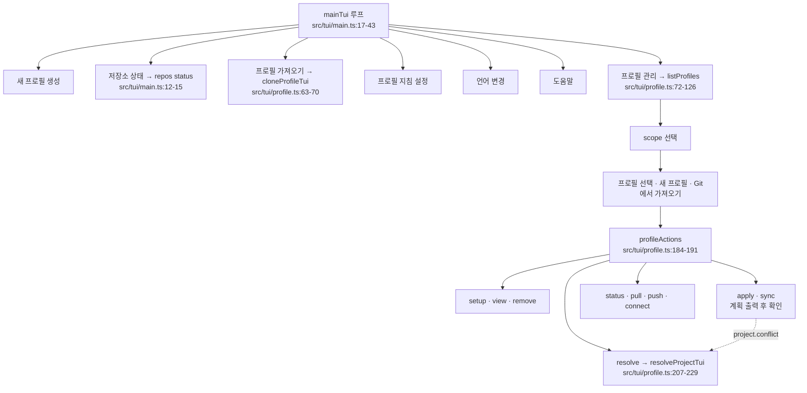

- `profileActions`의 선택지는 등록부에서 만든 `PROFILE_MENU_COMMANDS`(`src/tui/profile.ts:31`)이고, 선택하면 `MENU_ACTIONS`(`src/tui/profile.ts:144-182`)가 경로·URL을 물은 뒤 CLI와 같은 `HANDLERS`를 부른다. 그래서 TUI의 적용·동기화도 계획을 출력한 뒤 `confirmChange`로 확인을 받는다.
- `apply`·`sync`가 `project.conflict` 오류로 멈추면 `withConflictRecovery`(`src/tui/profile.ts:194-204`)가 오류를 보여 주고 해결로 이어갈지 묻는다.
- `pull`은 먼저 `--dry-run`으로 들어올 커밋을 보여 준 뒤 받을지 묻는다(`src/tui/profile.ts:166-173`).

비대화형에서는 `listProfiles`가 `[scope]` 목록만 출력하고(`src/tui/profile.ts:122-125`), `createProfileTui`·`setupProfileTui`는 표준 입력(`fs.readFileSync(0, 'utf8')`)을 줄 단위로 읽어 처리한다(`src/tui/profile.ts:35`, `src/tui/profile.ts:254`). 파이프·CI·스모크 테스트 경로이며 `--json` 실행에서는 쓰지 않는다.

## 12. 기능 인터페이스 동등성 계약

명령 목록의 정본은 `COMMANDS`(`src/commands/registry.ts:48-71`)다. 항목마다 `CommandSpec`(`src/commands/registry.ts:26-41`)의 필드를 채운다.

```ts
{ id: 'profile.apply', words: ['profile', 'apply'], args: ['<name>', '[<project>]'], options: [dryRun, { name: 'pin' }, yes], exitCodes: [...common, EXIT.conflict, EXIT.hiddenCharacters, EXIT.unavailable], surface: 'profile', changes: 'repository', tui: 'actions.apply.label', profileMenu: 'actions.apply.label' },
{ id: 'check', words: ['check'], args: ['[<project>]'], options: [{ name: 'refresh' }], exitCodes: [...common, EXIT.behind, EXIT.conflict, EXIT.hiddenCharacters, EXIT.unavailable], surface: 'repository', changes: 'none' },
```

- **표면(surface):** `profile` 명령은 `tui`와 `profileMenu`를 반드시 가진다. `repository`(`check`)와 `global`(도움말·언어 설정) 명령은 CLI만 필수다. 기준과 이유는 [ADR 0016](../adr/0016-command-contract.md)과 [구현 계약](../discussion/architecture/topics/implementation-contracts.md#인터페이스-동등성)에 있다.
- **옵션 검사:** `checkArguments`(`src/commands/options.ts:20-52`)는 등록부의 옵션과 전역 옵션(`--json`·`--lang`·`--help`)만 받는다. 모르는 옵션은 앞 세 글자가 같은 옵션을 제안하고, 값이 필요한 옵션에 값이 없거나 위치 인자가 등록부보다 많으면 64로 멈춘다.
- **확인:** 파일을 바꾸거나 원격으로 보내는 처리기는 쓰기 직전에 `confirmChange`를 부른다(`src/commands/options.ts:64-71`).

```ts
export async function confirmChange(parsed: ParsedArguments, question: string, retry: string): Promise<boolean> {
  if (parsed.options.yes === true) return true;
  if (!canPrompt()) {
    throw usageError('confirm.required', _('error.confirm.required'), _('hint.confirm.yes', { command: retry }));
  }
  const answer = await confirm({ message: question, initialValue: false });
  return !isCancel(answer) && answer === true;
}
```

`canPrompt()`(`src/commands/options.ts:55-57`)는 stdin이 TTY이고 `--json`이 아닐 때만 참이다. 처리기는 `retry`에 `--yes`를 붙인 명령을 넘기므로 오류의 `Next:` 줄을 그대로 실행할 수 있다.

- **평가:** `evals/interface-parity.test.ts`가 `profile` 명령의 `tui`·`profileMenu`, `PROFILE_MENU_COMMANDS`와 `MENU_ACTIONS`의 일치, `repository` 명령 목록, 전체 명령 id를 검사한다. `evals/messages.test.ts`는 등록부에서 만드는 메시지 키(`command.<id>.summary`, `exit.<code>`, 메뉴 항목)가 두 카탈로그에 있는지 검사한다.

## 13. 검증 하네스와의 대응

각 메커니즘은 대응하는 eval로 강제된다(파일명 기준). 검증의 목적·증거 범위·한계 정본은 [현재 아키텍처](README.md)와 [공개 저장소 운영](../repository-operations.md)이다.

| 메커니즘 | 대응 eval |
| --- | --- |
| 안전한 파일 쓰기([9절](#9-안전한-파일-쓰기)) | `evals/file-safety.test.ts` |
| 관리 영역 병합·hash([7절](#7-관리-영역-병합과-hash)) | `evals/sync-merge.test.ts` |
| 명령 등록부와 세 경로 동등성([12절](#12-기능-인터페이스-동등성-계약)) | `evals/interface-parity.test.ts`, `evals/messages.test.ts` |
| 종료 코드·`--json`·`--yes`·`--help`(10절·12절) | `evals/command-contract.test.ts` |
| 프로필 생성·설정·apply/sync | `evals/profile.test.ts` |
| Git 프로필·버전 기록·고정([15절](#15-git-프로필-명령)·[16절](#16-적용-버전-기록과-고정)) | `evals/git-profile.test.ts` |
| check([17절](#17-check)) | `evals/command-contract.test.ts`, `evals/git-profile.test.ts`, `evals/repos.test.ts` |
| 여러 저장소 목록·상태·동기화·PR([19절](#19-여러-저장소-목록과-repos-명령)) | `evals/repos.test.ts` |
| 숨은 문자([18절](#18-숨은-문자-검사)) | `evals/hidden-chars.test.ts`, `evals/git-profile.test.ts` |
| 충돌 표시·base·resolve([14절](#14-관리-영역-충돌-표시와-profile-resolve)) | `evals/conflict-resolve.test.ts`, `evals/conflicts.test.ts` |
| 로케일 해석([2절](#2-로케일-해석과-저장)) | `evals/i18n.test.ts` |
| 배포 파일 경계 | `evals/package-contents.test.ts` |
| 문서 계약·저장소 운영 | `evals/docs-check.test.ts`, `evals/repository-operations.test.ts` |

## 14. 관리 영역 충돌: 표시와 profile resolve

충돌 판정과 복구는 세 모듈이 나눠 맡는다. `src/project/plan.ts`가 충돌을 모으고, `src/project/conflicts.ts`가 편집을 추출·재배치하며, `src/project/merge-editor.ts`가 VS Code를 연다. 이 셋을 부르는 명령은 `src/profile/resolve.ts`다. 결정 근거는 [ADR 0008](../adr/0008-managed-conflict-recovery.md)이고 종료 코드는 [ADR 0016](../adr/0016-command-contract.md)을 따른다.

- **마지막 적용본(base):** `planProject`는 관리 파일마다 `.agctx/base/<경로>.base`(`baseFilePath`, `src/project/conflicts.ts:16-18`)와 `.agctx/.gitignore`를 계획에 넣는다(`src/project/plan.ts:130-133`). 충돌이 나면 `knownBase`(`src/project/plan.ts:49-54`)가 base 파일 hash가 기록과 같은지, 아니면 지금 다시 만든 관리 영역 hash가 기록과 같은지 확인해 base를 돌려준다. 둘 다 아니면 `null`이다. 기록 키는 운영체제와 관계없이 `/`로 구분한 경로다(`recordedHashFor`, `src/project/plan.ts:41-43`).
- **표시:** 실제 `apply`·`sync`는 `conflictError`(`src/profile/apply.ts:58-64`)가 만든 `project.conflict` 오류(종료 코드 2)를 던진다. 메시지에는 충돌 파일 목록이, 다음 단계에는 `profile sync --dry-run`·`profile resolve` 명령이 들어간다. `--dry-run`은 `printPlan`이 충돌 파일을 `conflict`로 표시하고 `printConflicts`(`src/profile/apply.ts:149-166`)가 diff를 출력한 뒤 같은 오류를 던진다. diff는 jsdiff `createTwoFilesPatch`를 감싼 `formatDiff`(`src/project/conflicts.ts:77-79`)가 만든다.
- **resolve:** `resolveProject`(`src/profile/resolve.ts:68-126`)는 충돌 파일마다 복구 내용을 정해 `overrides`에 담는다. 풀 수 없는 파일이 하나라도 있으면 쓰기 전에 `resolve.unknown-base` 오류(2)를 던지고(`src/profile/resolve.ts:107-110`), 파일마다 할 일을 출력한 뒤 확인을 받는다(`src/profile/resolve.ts:111-119`). 승인하면 같은 `planFor`로 계획을 다시 세워 쓴다. override한 파일은 기록 hash와 비교하지 않으므로 두 번째 계획에는 충돌이 없다.

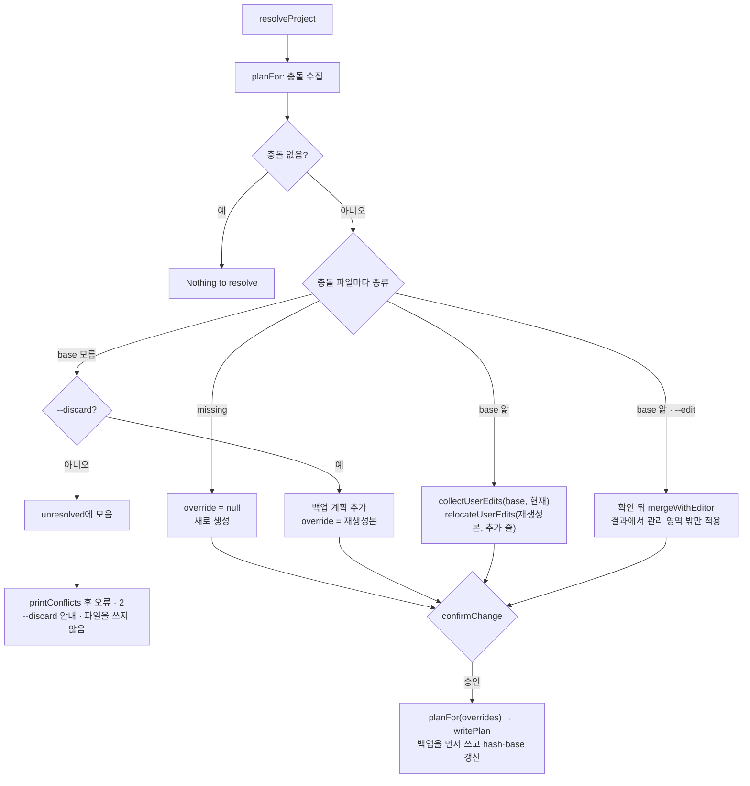

사용자 편집은 base와 현재 관리 영역의 줄 단위 diff로 구하고(`collectUserEdits`, `src/project/conflicts.ts:52-60`), 추가·수정한 줄을 관리 영역 밖으로 옮긴다(`relocateUserEdits`, `src/project/conflicts.ts:67-75`). 추가된 줄의 앞뒤 빈 줄은 버리고, 지운 줄은 빈 줄을 뺀 개수만 보고한다.

```ts
for (const part of diffLines(withTrailingNewline(base), withTrailingNewline(current))) {
  if (part.added) addedLines.push(...splitLines(part.value));
  else if (part.removed) removedLines.push(...splitLines(part.value));
}
// relocateUserEdits: AGENTS.md는 확장 섹션 끝, 포인터 파일은 관리 블록 바로 아래
if (kind === 'agents' || index === -1) return `${content.trimEnd()}\n\n${block}\n`;
```

- **`--edit`:** `mergeWithEditor`(`src/profile/resolve.ts:28-54`)는 `withBaseRegion`(`src/profile/resolve.ts:18-22`)으로 현재 파일의 관리 영역만 base로 바꾼 사본을 base 파일로 삼아 `mergeInVsCode`(`src/project/merge-editor.ts:32-58`)를 부른다. 편집기를 열기 전에 `resolve.edit.guide` 문구로 확인 순서를 출력하고, 경계 문구는 파일 종류에 따라 `resolve.edit.boundary.pointer`·`agents` 키에서 고른다. 결과 파일은 자동 해결과 같은 내용(`automaticResolution`, `src/profile/resolve.ts:12-15`)으로 채워 두므로 Result 창은 사용자 줄이 이미 관리 영역 밖으로 옮겨진 상태로 열린다. `mergeInVsCode`는 임시 폴더에 현재·agctx·base·결과 파일을 쓰고 `code --wait --merge`를 실행한다(Windows는 `code.cmd`, `src/project/merge-editor.ts:45-48`). `code`를 실행할 수 없으면 `vscode.unavailable` 오류(69)를 던진다(`src/project/merge-editor.ts:49-52`). 편집기를 닫으면 결과 파일을 새 내용으로 삼아 계획을 다시 세우므로 관리 영역은 다시 만들어지고 밖의 내용만 남는다. 결과의 관리 영역이 재생성본과 다르면 적용하지 않은 변경을 diff로 출력하고 임시 폴더를 남기며, 관리 마커(`AGENTS.md`는 확장 섹션 제목)가 없으면 멈춘다([ADR 0010](../adr/0010-edit-merge-regenerates-managed-area.md)).
- **TUI:** 관리 메뉴의 `resolve`는 `resolveProjectTui`(`src/tui/profile.ts:207-229`)로 간다. 먼저 `--dry-run`으로 계획을 보여 준 뒤 자동 해결·`--edit`·`--discard` 중 하나를 고르게 한다.

## 15. Git 프로필 명령

Git 프로필은 프로필 폴더 자체가 Git 작업 트리인 프로필이다. 원격 URL과 추적 브랜치는 `.git/config`가 정본이고 `profile.json`에는 기록하지 않는다. 결정은 [ADR 0017](../adr/0017-git-profile-sharing.md)에 있다.

**git 실행.** 모든 Git 호출은 `git()`(`src/shared/git.ts:19-38`)을 거친다.

```ts
const env = process.stdin.isTTY ? process.env : { ...process.env, GIT_TERMINAL_PROMPT: '0' };
const result = spawnSync('git', args, { cwd: options.cwd, encoding: 'utf8', env });
if (result.error) {
  if ((result.error as NodeJS.ErrnoException).code === 'ENOENT') {
    throw new CliError('git.missing', _('error.git.missing'), { exitCode: EXIT.unavailable, hint: _('hint.git.install') });
  }
  throw result.error;
}
// … 실패하면 원격·인증 오류(REMOTE_FAILURE)는 69, 그 밖은 70
```

- 셸 문자열을 만들지 않고 인자 배열로 실행하므로 URL이나 브랜치 이름이 셸에서 해석되지 않는다. 사용자의 Git 설정·credential helper를 그대로 쓴다.
- 터미널이 아니면 `GIT_TERMINAL_PROMPT=0`으로 인증 질문에서 멈추지 않게 한다([외부 근거](../references.md#cli-계약과-지침-공급망-근거)).
- `isGitRoot`(`src/shared/git.ts:41-52`)는 폴더에 `.git`이 있을 때만 `git rev-parse --show-toplevel`을 실행하고 실제 경로를 비교한다. `.git`이 없는 로컬 프로필은 `git`이 설치되지 않은 컴퓨터에서도 동작한다.
- `resolveRemoteLocation`(`src/shared/git.ts:58-61`)은 명령줄에 준 원격이 이미 있는 로컬 경로면 현재 폴더 기준 절대 경로로 바꾼다. `git`은 프로필 폴더에서 실행되므로 상대 경로를 그대로 넘기면 프로필 폴더 기준으로 해석되기 때문이다. URL은 입력한 그대로 둔다.
- `sanitizeRemoteUrl`(`src/shared/git.ts:64-74`)은 URL 형식 주소의 사용자 이름·비밀번호를 지운 뒤 기록하고 출력한다.

**status.** `profileGitState`(`src/profile/git-profile.ts:43-72`)는 브랜치, HEAD 커밋, `git status --porcelain` 결과, 원격 URL을 읽는다. `--refresh`일 때만 `git fetch`로 네트워크에 접속한다. `branch.<브랜치>.remote`·`merge` 설정이 가리키는 원격 추적 ref가 있으면 `git rev-list --left-right --count HEAD...<ref>`로 앞섬·뒤처짐을 센다. 처리기(`src/commands/handlers.ts:161-170`)는 뒤처졌으면 `profile pull`을, 앞섰으면 `profile push`를 다음 명령으로 출력한다.

**clone.** `cloneProfile`(`src/profile/git-profile.ts:74-105`)은 받은 저장소를 검증한 뒤에만 등록한다.

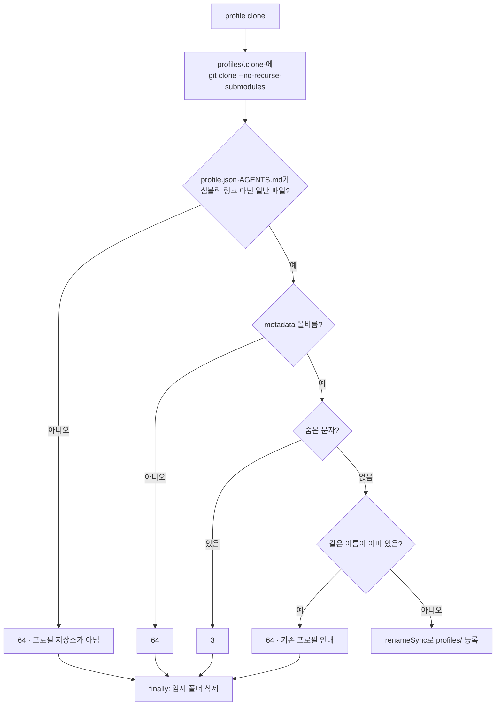

이름은 받은 `profile.json`의 `name`을 쓴다. 등록 전에 실패하면 임시 폴더만 지우므로 `profiles/`에 반쯤 받은 프로필이 남지 않는다.

**pull.** `pullProfile`(`src/profile/git-profile.ts:124-145`)은 fetch한 뒤 순서대로 멈춘다: 연결되지 않았거나 추적 브랜치가 없으면 64, 커밋하지 않은 변경이 있으면 2, 앞서면서 뒤처졌으면(갈라짐) 2. 들어올 커밋과 파일 목록을 구하고, `git show <upstream>:profile.json`·`AGENTS.md`로 받을 내용을 먼저 검증·검사한다. `--dry-run`이면 여기서 돌아가고, 아니면 `git merge --ff-only`만 실행한다. 처리기는 받은 뒤 `profile sync`와 고정한 프로젝트의 `apply --pin`을 안내한다(`src/commands/handlers.ts:171-181`).

**push.** `planPush`(`src/profile/git-profile.ts:154-163`)는 fetch한 뒤 분리된 HEAD면 64, 커밋하지 않은 변경이 있으면 2, 원격보다 뒤처졌으면 2로 멈추고 보낼 커밋 목록을 만든다. 처리기(`src/commands/handlers.ts:182-199`)가 목록을 출력하고 확인을 받으면 `pushProfile`(`src/profile/git-profile.ts:165-171`)이 `git push <remote> HEAD:refs/heads/<branch>`를 실행한다. agctx는 `git add`·`git commit`을 실행하지 않는다.

**connect.** `connectProfile`(`src/profile/git-profile.ts:173-190`)은 프로필 폴더가 Git 저장소가 아니면 `git init`·`add`·`commit` 명령을 안내하고 64로 멈춘다. `origin`이 다른 URL을 가리키면 64로 멈추고, `git ls-remote --heads`로 원격에 접근할 수 있는지 확인한 뒤 `origin`과 `branch.<브랜치>.remote`·`merge`를 설정한다.

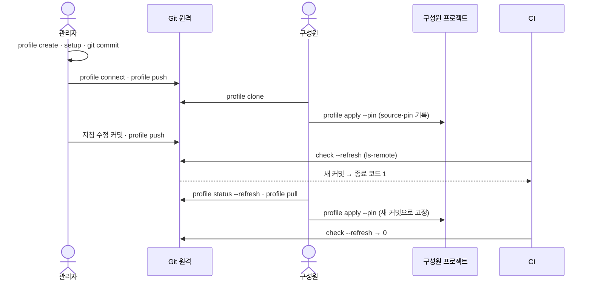

다섯 명령은 프로젝트 파일을 읽거나 쓰지 않는다. 프로젝트에 반영하는 일은 사용자가 따로 실행하는 `apply`·`sync`가 맡는다.

## 16. 적용 버전 기록과 고정

`profileVersion`(`src/profile/apply.ts:79-109`)이 `apply`·`sync`가 쓸 프로필 내용과 기록할 버전을 정한다.

| 경우 | 쓰는 `AGENTS.md` | `agctx.project.json`에 기록하는 것 |
| --- | --- | --- |
| 프로필 폴더가 Git 저장소가 아님 | 보관함의 파일 | `source` 없음. `--pin`이거나 고정한 프로젝트의 `sync`면 64 |
| `apply`(고정 안 함) | 보관함의 파일 | `source { git, branch, commit: HEAD }`. `AGENTS.md`·`profile.json`에 커밋 안 한 수정이 있으면 `uncommitted: true` |
| `apply --pin` | 보관함의 파일 | `source`와 `pin: true`. 커밋 안 한 수정이 있거나 커밋이 없으면 64 |
| 고정한 프로젝트의 `sync` | `git show <기록한 커밋>:AGENTS.md` | 기록한 `source`와 `pin` 유지. 커밋이 로컬에 없으면 69와 `profile pull` 안내 |
| 고정하지 않은 프로젝트의 `sync` | 보관함의 파일 | `apply`(고정 안 함)와 같음 |

```ts
if (pin === 'keep' && projectConfig.pin === true) {
  const commit = projectConfig.source?.commit;
  const shown = commit && /^[0-9a-f]{7,64}$/i.test(commit) ? git(['show', `${commit}:AGENTS.md`], { cwd: dir, allowFailure: true }) : null;
  if (!commit || !shown || shown.status !== 0) {
    throw new CliError('pin.commit-missing', _('error.pin.commit-missing', { name, commit: (commit ?? '').slice(0, 7) }), { exitCode: EXIT.unavailable, hint: _('hint.profile.pull', { name }) });
  }
  return { content: shown.stdout, source: { ...projectConfig.source, git: remote ?? projectConfig.source?.git ?? null, branch: projectConfig.source?.branch ?? branch, commit }, uncommitted: false, pin: true };
}
```

- `agctx.project.json`은 저장소에 커밋되는 파일이므로 기록한 커밋 값을 믿지 않는다. 16진수 커밋 이름일 때만 `git show`에 넘기고, 아니면 커밋이 없는 경우와 같이 69로 멈춘다. `--`로 시작하는 값이 `git` 옵션으로 해석되지 않게 하려는 것이다.
- 고정한 프로젝트를 새 커밋으로 옮기는 명령은 `apply --pin`뿐이다. `sync`는 고정 커밋을 바꾸지 않고, `--pin` 없는 `apply`는 고정을 푼다([6절](#6-profile-apply-변경-계획과-적용)의 경고).
- `source.git`에는 `sanitizeRemoteUrl`로 인증 정보를 지운 URL을 기록한다. 기록 결과는 `planProject`가 `record`로 받아 파일에 쓴다(`src/profile/apply.ts:134`, `src/project/plan.ts:134-140`).

## 17. check

`checkProject`(`src/check.ts:61-126`)는 파일을 바꾸지 않고 저장소가 기록한 버전과 맞는지 판정한다. 처리기(`src/commands/handlers.ts:208-213`)는 결과를 `종류 파일 설명` 한 줄씩 출력하고 보고서의 종료 코드를 돌려준다.

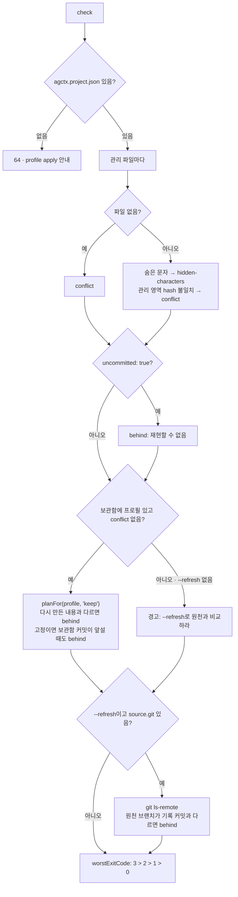

- 보관함의 프로필과 비교할 때는 `apply`와 같은 `planFor`를 `'keep'`으로 부르므로 고정한 프로젝트는 기록한 커밋으로 다시 만든 결과와 비교한다(`src/check.ts:95`).
- 고정한 프로젝트는 보관함 프로필의 HEAD가 기록한 커밋보다 앞서 있으면(`git merge-base --is-ancestor`) 뒤처짐으로 판정한다(`newerStoreCommit`, `src/check.ts:48-53`). `profile pull`로 새 커밋을 받은 구성원이 `check`로 바로 알 수 있게 하려는 것이며, 설계안의 뒤처짐 정의(적용한 뒤 보관함의 프로필이 바뀜)를 따른다.
- CI처럼 보관함이 없는 곳에서는 `--refresh`가 `git ls-remote -- <source.git> refs/heads/<branch>`를 실행한다(`src/check.ts:109`). 원격 접근이 실패하면 `git()`이 69를 던진다.
- 원격 조회 방법은 `CheckOptions.remoteHead`(`src/check.ts:55-59`)로 바꿀 수 있다. `repos status`는 이것으로 같은 원천·브랜치를 한 번만 조회한다.
- 결과는 `CheckReport`(`src/check.ts:26-35`)로 돌려주며 `--json`이면 이 보고서가 결과 문서의 `data`가 된다.

## 18. 숨은 문자 검사

`findHiddenCharacters`(`src/shared/hidden-chars.ts:37-58`)는 문자열을 코드 포인트 단위로 읽으며 줄·열과 함께 아래 범위를 찾는다. 파일 맨 앞의 U+FEFF(BOM)는 허용한다.

```ts
const RANGES: ReadonlyArray<readonly [from: number, to: number, kind: HiddenCharacter['kind']]> = [
  [0x202a, 0x202e, 'bidi-control'],
  [0x2066, 0x2069, 'bidi-control'],
  [0x200b, 0x200d, 'zero-width'],
  [0x2060, 0x2060, 'zero-width'],
  [0xfeff, 0xfeff, 'zero-width'],
  [0xe0000, 0xe007f, 'tag'],
  [0xe0100, 0xe01ef, 'variation-selector']
];
```

- `describeHiddenCharacters`(`src/shared/hidden-chars.ts:61-63`)가 `파일:줄:열 U+XXXX 종류` 형식으로 바꾼다.
- `assertNoHiddenCharacters`(`src/profile/git-profile.ts:36-41`)는 찾은 것이 있으면 `profile.hidden-characters` 오류(3)를 던진다. clone(`src/profile/git-profile.ts:95`)과 pull(`src/profile/git-profile.ts:141`)은 받을 `profile.json`·`AGENTS.md`를, `planFor`(`src/profile/apply.ts:125`)는 프로젝트에 쓸 프로필 내용을 검사한다.
- `check`는 오류를 던지지 않고 관리 파일 전체에서 찾은 위치를 `hidden-characters` 결과로 모은다(`src/check.ts:79-81`). 관리 영역 밖 사람이 쓴 부분도 에이전트가 읽기 때문이다.
- 범위를 고른 근거와 확인하지 못한 부분은 [외부 근거](../references.md#cli-계약과-지침-공급망-근거)에 있다.

## 19. 여러 저장소 목록과 repos 명령

`repos` 명령은 이 컴퓨터에서 프로필을 적용한 저장소들을 한 번에 다룬다. 저장소 단위 기능이라 표면은 `repository`이고, TUI 메인 메뉴에는 읽기 전용 `저장소 상태`만 둔다. 결정과 안전 계약은 [ADR 0018](../adr/0018-multi-repository-sync.md)에 있다.

**목록.** 목록 파일은 `$AGCTX_HOME/repos.json`이다. `recordRepo`(`src/repos/registry.ts:58-62`)는 폴더의 실제 경로(`repoKey`, `src/repos/registry.ts:50-56`)를 키로 항목 하나만 남기고 경로 순으로 원자적으로 쓴다. 파일 형식이 깨졌으면 `readRepos`(`src/repos/registry.ts:26-41`)가 64로 멈추고, `pruneRepos`(`src/repos/registry.ts:70-75`)는 폴더가 없어진 항목만 지운다.

**status.** `reposStatus`(`src/repos/status.ts:29-57`)는 항목마다 `checkProject`를 부르고 보고서의 종료 코드를 상태(`ok`·`behind`·`conflict`·`hidden-characters`)로 바꾼다. 폴더가 없으면 `missing`(0), 검사가 오류를 던지면 `error`와 그 종료 코드를 남긴다. `--refresh`의 원격 조회는 원천 URL과 브랜치 쌍마다 한 번만 한다. 처리기(`src/commands/handlers.ts:277-293`)는 뒤처진 저장소가 고정됐는지에 따라 `repos sync` 또는 `profile pull` 후 `repos pr`을 다음 명령으로 안내하고, 전체 종료 코드는 가장 심각한 값이다.

**sync.** `planReposSync`(`src/repos/sync.ts:59-89`)가 모든 저장소의 계획을 먼저 세운다.

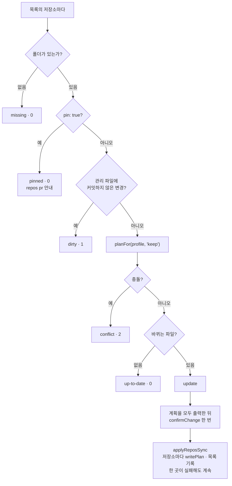

- `uncommittedManagedFiles`(`src/repos/sync.ts:42-47`)는 저장소가 Git 작업 트리 안에 있을 때만 `git status --porcelain --untracked-files=no`로 `AGENTS.md`·`CLAUDE.md`·`.agents/rules/agctx.md`·`agctx.project.json`과 `managedHashes`에 기록한 연결 파일을 본다(`managedFiles`, `src/repos/sync.ts:30-32`). 추적하지 않는 파일은 막지 않고, Git 저장소가 아니면 `git`을 실행하지 않는다.
- `applyReposSync`(`src/repos/sync.ts:92-103`)는 저장소마다 쓰기와 목록 기록을 하고, 한 저장소의 오류를 그 항목의 `error`로 남긴 채 다음 저장소로 넘어간다. 처리기(`src/commands/handlers.ts:294-318`)는 계획을 출력하고 한 번 확인한 뒤 결과가 바뀐 항목만 다시 출력한다. 저장소마다 계획의 경고는 경로를 붙여 경고로 돌려준다.

**pr.** `prepareReposPrs`(`src/repos/pr.ts:232-266`)가 대상마다 임시 작업 공간을 만들어 계획하고, 확인을 받은 뒤 `openPullRequests`(`src/repos/pr.ts:289-312`)가 커밋·push·PR을 만든다.

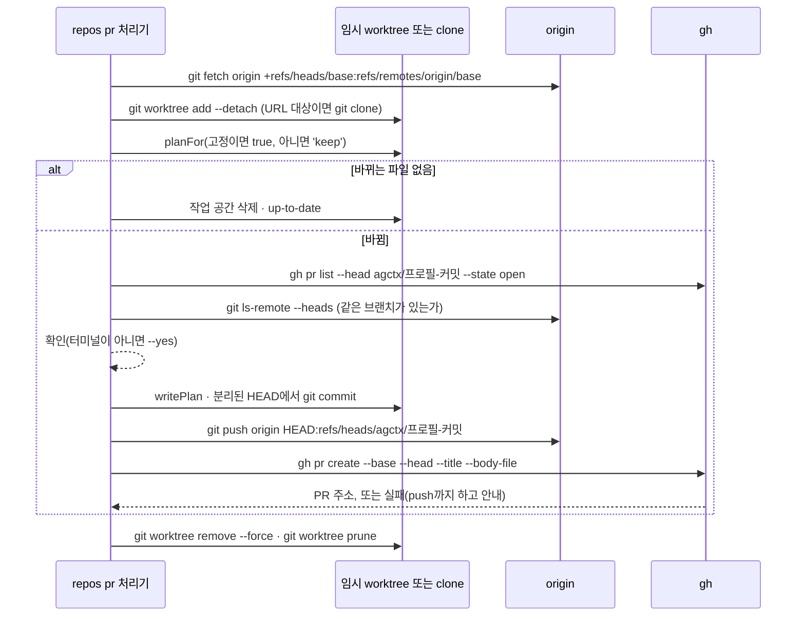

- `worktreeFor`(`src/repos/pr.ts:108-138`)는 사용자 작업 폴더에 연결된 분리 worktree를 임시 폴더에 만들고 원격 base 브랜치를 체크아웃한다. base는 `--base`, `origin/HEAD`, 현재 브랜치의 추적 브랜치, 현재 브랜치 순서로 정한다(`defaultBase`, `src/repos/pr.ts:97-105`). 커밋은 분리된 HEAD에서 만들고 `HEAD:refs/heads/<브랜치>`로 push하므로 사용자 저장소의 작업 폴더·체크아웃·로컬 브랜치는 바뀌지 않는다.
- `--targets` 파일의 줄은 대상 파일이 있는 폴더 기준으로 경로를 푼다. 작업 폴더(`.git`이 있는 폴더)는 그대로 쓰고, bare 저장소 경로와 URL은 `cloneFor`(`src/repos/pr.ts:141-154`)가 임시 폴더에 clone한다(`targetsFrom`, `src/repos/pr.ts:76-91`). 임시 clone은 저장소 목록에 기록하지 않는다.
- `planTarget`(`src/repos/pr.ts:194-223`)은 고정한 저장소를 `planFor(..., true)`로 프로필의 현재 커밋에 다시 고정하고, 고정하지 않은 저장소는 보관함 내용으로 동기화한다. 브랜치 이름은 `agctx/<프로필>-<커밋 7자리>`이고 Git에 연결하지 않은 프로필이면 내용 해시로 만든다. 같은 브랜치에 열린 PR이 있거나 원격에 같은 브랜치가 있으면 만들지 않으므로, 예약 봇이 매일 실행해도 PR이 쌓이지 않는다.
- `gh`(`src/repos/pr.ts:163-170`)는 `GH_PROMPT_DISABLED=1`로 질문 없이 실행하고, Windows에서는 `gh.exe`와 `.cmd` 래퍼를 모두 찾도록 셸을 거친다. `gh`가 없거나 GitHub 저장소가 아니어서 PR을 만들지 못하면 push까지 한 상태를 `pushed`로 남기고, 원격이 GitHub이면 비교 페이지 주소를 함께 알려 준다.
- PR 본문(`pullRequestBody`, `src/repos/pr.ts:274-286`)에는 프로필·원천·버전 범위·고정 여부·프로필 커밋 목록(`git log --oneline <기록>..<새 커밋>`)·바뀐 파일을 적는다.
- 모든 임시 worktree와 clone은 처리기의 `finally`에서 지운다(`src/commands/handlers.ts:319-341`).

## 20. explain: 에이전트별 지침 로드 판정

`explainPath`(`src/explain.ts:349-369`)는 시작 폴더의 실제 경로와 그 위의 Git 루트(`projectRoot`, `src/explain.ts:72-77`)를 구하고, 에이전트마다 수집기에 파일과 판정을 모은다. `agctx.project.json`의 관리 영역 hash 키에 있는 파일은 `origin: 'agctx-managed'`로 표시한다(`add`, `src/explain.ts:149-163`). 처리기(`src/commands/handlers.ts:214-228`)는 에이전트마다 파일과 판정을 한 줄씩 출력하고 보고서의 종료 코드를 돌려준다.

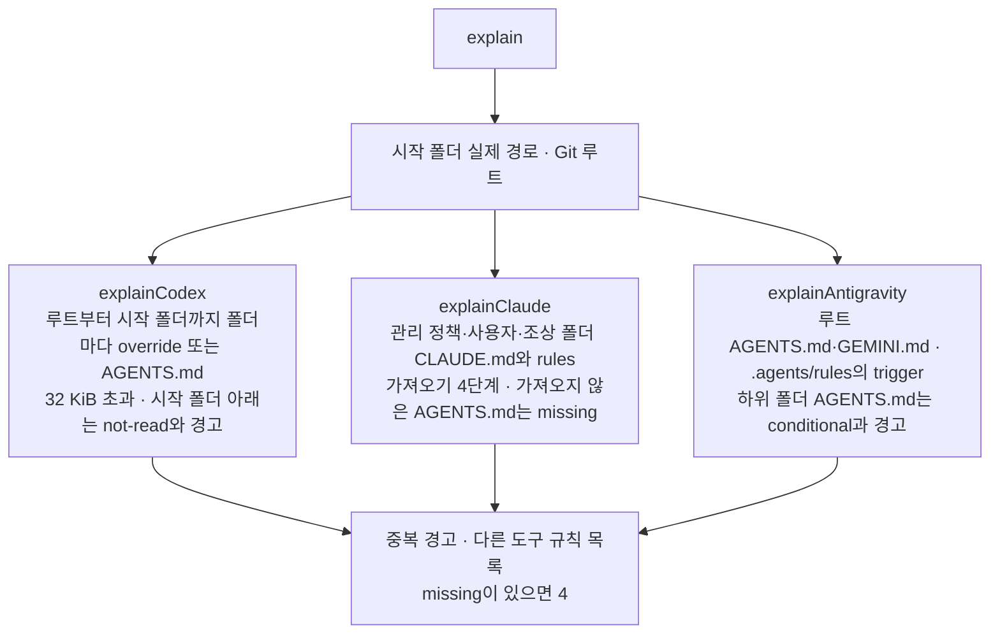

- **Codex**(`explainCodex`, `src/explain.ts:165-196`): `CODEX_HOME`의 `AGENTS.override.md`나 `AGENTS.md`를 사용자 파일로 넣는다. `chain`(`src/explain.ts:80-83`)이 만든 루트부터 시작 폴더까지의 폴더마다 비지 않은 `AGENTS.override.md`를, 없으면 `AGENTS.md`를 고르고 크기를 더한다. 합이 `CODEX_MAX_BYTES`(32 KiB)를 넘는 파일은 `not-read`와 경고로 둔다. 시작 폴더 아래의 `AGENTS.md`는 `filesBelow`(`src/shared/scan.ts:12-35`)로 찾아 `not-read`와 "그 폴더에서 시작해야 읽는다"는 경고를 붙인다. `filesBelow`는 `.git`·`node_modules`·`dist` 같은 폴더와 안에 `.git`이 있는 중첩 저장소를 건너뛰고, 폴더 5000개까지만 본다.
- **Claude Code**(`explainClaude`, `src/explain.ts:204-275`): 관리 정책 파일, `CLAUDE_CONFIG_DIR`의 `CLAUDE.md`와 `rules/`, 시작 폴더와 모든 조상 폴더의 `CLAUDE.md`·`.claude/CLAUDE.md`·`CLAUDE.local.md`, 루트부터 시작 폴더까지의 `.claude/rules/`를 시작할 때 읽는 파일로 넣는다. `paths` frontmatter가 있는 규칙은 `conditional`이다. 그다음 가져오기를 따라간다(`src/explain.ts:234-257`).

```ts
const trusted = (file: string) => file.startsWith(configDir + path.sep) || file === managedPolicyClaudeFile();
// …
const external = item.status === 'read' && !item.trusted && !imported.startsWith(target + path.sep);
const scope: FileScope = imported.startsWith(collector.root + path.sep) ? 'project' : 'user';
const reason = external ? _('explain.reason.claude.external-import', { file: importer }) : _('explain.reason.claude.import', { file: importer });
const entry = add(collector, imported, external ? 'conditional' : item.status, scope, reason);
```

  - `claudeImports`(`src/explain.ts:127-135`)는 코드 블록과 코드 스팬을 지운 뒤 `@경로`를 찾아 가져오는 파일 기준으로 풀고, 실제로 있는 파일만 돌려준다. 가져오기는 `CLAUDE_IMPORT_DEPTH`(4)단계까지 따라간다.
  - 사용자 수준 파일과 관리 정책 파일에서 시작한 가져오기는 믿는다. 프로젝트 수준 파일이 시작 폴더 밖을 가져오면 `conditional`과 경고로 두고, 그 파일이 다시 가져오는 파일도 `conditional`을 이어받는다.
  - 시작 폴더 아래의 `CLAUDE.md`는 `on-demand`로 넣고 그 가져오기도 `on-demand`로 따라간다. 마지막으로 루트부터 시작 폴더까지와 그 아래의 비지 않은 `AGENTS.md` 가운데 아직 목록에 없는 파일을 `not-read`와 `missing`으로 둔다(`src/explain.ts:263-274`). 그 폴더에 사람이 둔 `CLAUDE.md`가 있으면 그 파일이 가져오지 않는다고, 없으면 `profile sync`로 연결 파일을 만들 수 있다고 안내한다.
- **Antigravity**(`explainAntigravity`, `src/explain.ts:277-304`): `~/.gemini/GEMINI.md`와 루트 `AGENTS.md`·`GEMINI.md`를 읽는 파일로 넣는다. 루트 `.agents/rules/*.md`는 `frontmatter`(`src/explain.ts:109-124`)가 읽은 `trigger`로 나눈다. `always_on`은 `read`, `glob`과 `trigger` 없음은 `not-read`와 `missing`, 그 밖의 값은 `conditional`이다. 루트 아래 폴더의 `AGENTS.md`는 `conditional`과 경고로 둔다.
- **중복**(`duplicateFindings`, `src/explain.ts:324-337`): 에이전트마다 `read`·`conditional`·`on-demand` 파일의 규칙 줄(`ruleLines`, `src/explain.ts:307-317`: 목록 기호를 뗀 24자 이상 줄 가운데 제목·주석·가져오기가 아닌 줄)을 모아, 둘 가운데 하나가 `read`인 두 파일이 `DUPLICATE_LINES`(3)줄 이상 겹치면 경고한다. APM이 `paths: "**"`로 옮긴 `.claude/rules` 규칙처럼 조건부 파일이 루트 `AGENTS.md`와 겹치는 경우도 잡는다.
- 다른 도구의 규칙 위치는 `UNSUPPORTED`(`src/explain.ts:59`) 가운데 루트에 있는 것만 보고한다(`src/explain.ts:366`). 어느 에이전트에든 `missing`이 있으면 종료 코드는 `EXIT.deliveryMissing`(4)이다(`src/explain.ts:367-368`).
- 로드 규칙의 근거는 [외부 근거](../references.md#에이전트-지침-로드와-전달-확인-근거)에 있다. 이유 문구에 `(measured)`가 붙은 판정은 공식 문서가 아니라 실측에 기댄다.

## 21. verify: 세션 기록 판독과 probe

`verifyPath`(`src/verify/index.ts:53-80`)는 `explainPath`를 먼저 부르고, 에이전트마다 상태가 `read`인 프로젝트 파일을 기대 파일로, `conditional`·`on-demand`인 프로젝트 파일을 선택 파일로 나눈다. `judged`(`src/verify/index.ts:37-41`)가 받았는지 판정하는 함수로 결과를 만든다.

```ts
function judged(base: AgentVerification, expected: ExplainedFile[], optional: ExplainedFile[], received: (file: ExplainedFile) => boolean): AgentVerification {
  const delivered = [...expected, ...optional].filter(received).map(file => file.path);
  const missing = expected.filter(file => !received(file)).map(file => file.path);
  return { ...base, delivered, missing, status: missing.length ? 'fail' : 'pass', exitCode: missing.length ? EXIT.deliveryMissing : EXIT.ok };
}
```

**세션 기록.** `fromSessionLog`(`src/verify/index.ts:43-51`)는 기록을 찾은 뒤, 기대 파일 가운데 수정 시각이 기록이 지침을 불러온 시각보다 늦은 파일이 있으면 판정하지 않고 `stale`로 남긴다.

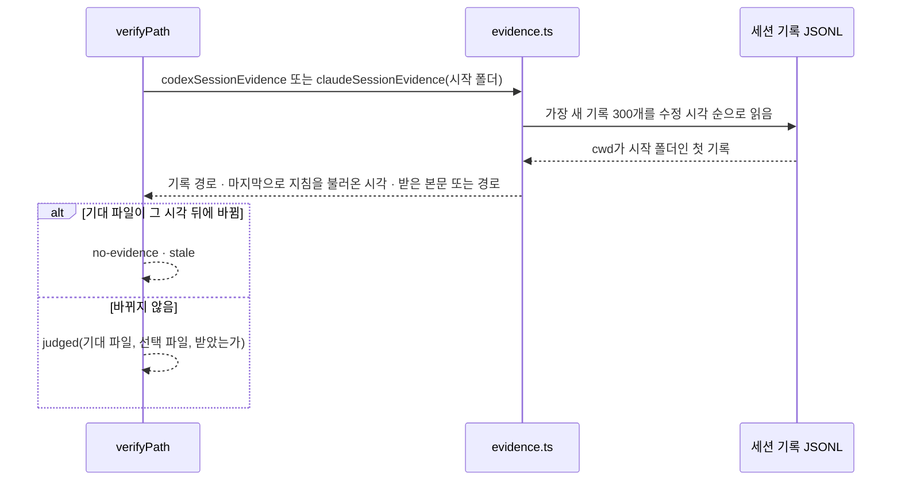

- Codex(`codexSessionEvidence`, `src/verify/evidence.ts:90-118`)는 `session_meta`·`turn_context`의 `cwd`로 기록을 고르고, `world_state`의 `agents_md.text`나 `# AGENTS.md instructions`를 담은 메시지 가운데 마지막 것을 받은 지침으로 본다. `codexReceived`(`src/verify/evidence.ts:167-173`)는 공백을 하나로 모은 뒤 파일 내용이 그 본문에 있는지 보고, 1200자를 넘는 파일은 앞 600자와 끝 400자로 본다.
- Claude Code(`claudeSessionEvidence`, `src/verify/evidence.ts:121-162`)는 `CLAUDE_CONFIG_DIR/projects` 아래에서 시작 폴더 경로의 영숫자가 아닌 문자를 `-`로 바꾼 폴더를 찾고, 없으면 마지막 경로 조각이 같은 폴더를 본다. `instructions` 첨부가 나올 때마다 받은 목록을 새로 만들고 그 뒤의 `nested_memory` 경로를 더하므로, 대화를 압축해 지침을 다시 불러온 세션은 마지막 목록으로 판정한다.
- 기록 형식은 공개 계약이 아니므로 판독기는 `evals/verify.test.ts`의 fixture가 고정한 필드만 쓴다. Antigravity는 판독기가 없어 기록 증거가 없다.

**probe.** `probeAgent`(`src/verify/probe.ts:41-76`)는 임시 폴더에 `git init`한 사본 저장소를 만들고, `explain`이 본 프로젝트 파일마다 표지 줄을 붙여 복사한다.

```ts
explanation.files.filter(file => file.scope === 'project').forEach((file, index) => {
  const copy = path.join(scratchRoot, path.relative(root, file.absolutePath));
  fs.mkdirSync(path.dirname(copy), { recursive: true });
  const marker = `AGCTX-PROBE-${token}-${index + 1}`;
  markers.set(marker, file.path);
  fs.writeFileSync(copy, `${fs.readFileSync(file.absolutePath, 'utf8').trimEnd()}\n\n${MARKER} ${marker}\n`);
});
```

- `commandFor`(`src/verify/probe.ts:28-32`)가 에이전트별 명령을 만들고, `run`(`src/verify/probe.ts:34-39`)이 사본의 시작 폴더에서 5분 제한으로 실행한다. Windows에서는 npm이 설치한 `.cmd` 파일을 실행하려고 셸을 거친다.
- 실행 파일이 없으면(`ENOENT`) `verify.agent-missing`을, 0이 아닌 코드로 끝나면 `verify.agent-failed`를 종료 코드 69로 던지고, `verifyPath`가 이를 그 에이전트의 `error`로 담는다. 표지가 stdout에 나온 파일만 받은 것으로 보며, 사본은 `finally`에서 지운다.
- 처리기(`src/commands/handlers.ts:229-265`)는 `--probe`면 실행 전에 확인을 받는다. 터미널이 아니고 `--yes`도 없으면 `--dry-run`을 안내하는 공통 확인 오류 대신, 에이전트 사용량을 쓴다고 알리는 오류를 같은 `confirm.required` 코드로 던진다. 결과를 출력한 뒤에는 `no-evidence`인 Codex·Claude Code의 다음 단계를 한 줄로 묶고, Antigravity의 다음 단계는 따로 경고로 돌려준다.

## 22. 에이전트용 스킬 생성

`skills/agctx/SKILL.md`와 `skills/agctx-author/SKILL.md`의 본문은 사람이 쓰고, `<!-- agctx:commands:start -->`와 `<!-- agctx:commands:end -->` 사이의 명령 목록만 `tools/generate-skills.ts`가 만든다.

```ts
export function commandList(ids: readonly string[] | null): string {
  return COMMANDS
    .filter(command => command.id !== 'help' && (!ids || ids.includes(command.id)))
    .map(command => `- \`${usageLine(command)}\`: ${summaries[`command.${command.id}.summary`]}`)
    .join('\n');
}
```

- `SKILLS`(`tools/generate-skills.ts:25-28`)가 스킬마다 넣을 명령을 정한다. `agctx`는 `help`를 뺀 모든 명령, `agctx-author`는 프로필 조회·설정·상태·받기·올리기와 `check`·`repos status`·`repos sync`·`repos pr`이다. 줄은 등록부의 `usageLine`과 영어 메시지 카탈로그의 명령 요약으로 만든다(`commandList`, `tools/generate-skills.ts:32-37`).
- `renderSkill`(`tools/generate-skills.ts:39-44`)은 표지 사이만 바꾼다. `node tools/generate-skills.ts`는 파일을 다시 쓰고 `--check`는 목록이 다르면 1로 끝난다. `evals/skills.test.ts`가 같은 함수로 최신인지 검사하므로, 등록부를 바꾸고 목록을 다시 만들지 않으면 `pnpm run check`가 실패한다.
- 호출 정책은 스킬 파일에 있다. `agctx-author`의 frontmatter `disable-model-invocation: true`는 Claude Code가, `agents/openai.yaml`의 `policy.allow_implicit_invocation: false`는 Codex가 읽는다. `tools/skills-smoke.ts`는 skills CLI로 임시 프로젝트에 설치해 두 파일이 설치 위치에 함께 들어가는지 확인한다.

## 23. APM 생성 파일과 모노레포 연결 파일

두 기능 모두 `planProject` 안에서 동작하므로 `apply`·`sync`·`resolve`·`check`·`repos sync`·`repos pr`이 같은 판정을 받는다. 결정은 [ADR 0020](../adr/0020-apm-coexistence-and-monorepo-links.md)에 있다.

**APM 생성 파일.** `describe`가 파일을 읽은 직후 `apmRegenerates`(`src/project/apm.ts:13-19`)로 확인하고, 참이면 계획을 세우지 않고 `CliError`를 던진다(`src/project/plan.ts:77-80`).

```ts
export function apmRegenerates(relativePath: string, content: string | null): boolean {
  if (content === null) return false;
  const name = relativePath.split('/').pop();
  const markers = name === 'AGENTS.md' ? AGENTS_MARKERS : name === 'CLAUDE.md' ? CLAUDE_MARKERS : [];
  const header = new Set(content.split(/\r?\n/).slice(0, HEADER_LINES).map(line => line.trim()));
  return markers.some(marker => header.has(marker));
}
```

- 표시 문자열과 "처음 다섯 줄 가운데 한 줄과 정확히 같음"이라는 조건은 APM 0.30.0의 판정을 그대로 옮겼다([외부 근거](../references.md#apm과-함께-쓰기-근거)). 표시가 다섯째 줄 아래에 있으면 APM도 사람이 쓴 파일로 보므로 agctx는 평소처럼 병합한다.
- 오류 코드는 `project.apm-generated`, 종료 코드는 2다. `AGENTS.md`면 `managed_section` 전환 절차를, `CLAUDE.md`면 파일을 옮기고 다시 적용하라는 안내를 붙인다.
- APM `managed_section` 블록은 따로 처리하지 않는다. 확장 영역 아래에 두면 `mergeAgentsMd`가 사용자 규칙으로 옮겨 싣고([7절](#7-관리-영역-병합과-hash)) 관리 영역 hash에도 들어가지 않으므로, `evals/apm-coexistence.test.ts`가 그 블록이 한 바이트도 바뀌지 않는지 검사한다.

**연결 파일.** 포인터 2종을 계획한 뒤 하위 `AGENTS.md`마다 연결 파일을 계획한다(`src/project/plan.ts:97-117`).

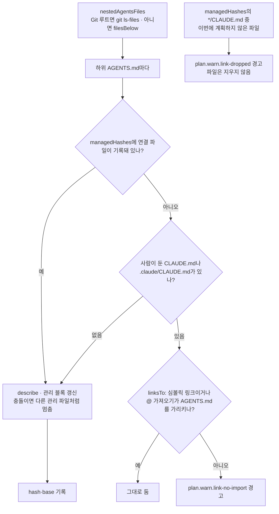

- `nestedAgentsFiles`(`src/project/links.ts:28-33`)는 프로젝트 폴더에 `.git`이 있으면 `gitListed`(`src/project/links.ts:17-25`)가 `git ls-files -z --cached --others --exclude-standard -- '*AGENTS.md'`로 추적 파일과 무시하지 않은 새 파일을 받는다. Git이 아니거나 `git`이 실패하면 `filesBelow`(`src/shared/scan.ts:12-35`)로 찾는다. 두 경우 모두 경로 가운데 `SKIPPED_FOLDERS`에 든 폴더가 있으면 뺀다.
- `personLink`(`src/project/links.ts:36-46`)는 `lstat`으로 확인하므로 끊어진 심볼릭 링크도 사람이 둔 파일로 본다. `linksTo`(`src/project/links.ts:49-53`)는 코드 블록과 코드 스팬을 지운 뒤 `@경로`를 그 파일 기준으로 풀어 비교한다.
- 연결 파일의 hash 키는 `services/payments/CLAUDE.md`처럼 `/` 경로이고 kind는 `pointer`다. 그래서 `check`의 관리 영역 검사, `profile resolve`의 편집 옮기기, `.agctx/base/` 기록을 루트 포인터와 똑같이 받는다.
- 계획의 경고는 `ProjectPlan.warnings`에 담긴다. `applyOrSync`가 계획보다 먼저 stderr에 출력하고 `--json`이면 결과 문서의 `warnings`로 보낸다(`src/commands/handlers.ts:67-68`). `repos sync`는 저장소 경로를 붙여 모은다(`src/commands/handlers.ts:299`).

## 관련 문서

- [구현 원리](../implementation-principles.md): npm·Node.js·CLI 일반 원리와 이 패키지의 연결(생태계 관점)
- [현재 아키텍처](README.md): 현재 구현된 구조·소유권·검증 경계의 정본
- [제품 방향](../product-direction.md): 목표·범위·단계별 완료 기준
- [사용자 워크플로](../workflow.md): 프로필 생성부터 프로젝트 적용까지의 사용 흐름
- [CLI Reference](../cli-reference.md): 명령어·옵션·종료 코드·TUI·자동화 방식
- [공개 저장소 운영](../repository-operations.md): 품질 게이트·릴리스·보안 정책, 문서 소스 해시 게이트
