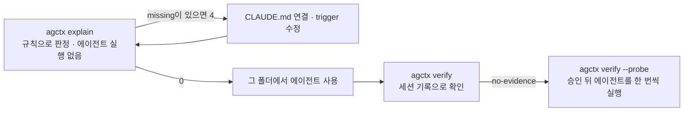

# 에이전트가 읽는 지침 파일

<!-- agctx-doc-sources: src/explain.ts, src/i18n/messages-en.ts -->
<!-- agctx-doc-sources-sha256: ee7f04a50defa3473befd4d7bd119f147be367f9e2cf9512fd2e71b88d6f6023 -->

파일을 만들었다고 해서 에이전트가 그 파일을 읽는 것은 아니다. 에이전트마다 지침 파일을 찾는 규칙이 다르고, 같은 에이전트도 시작한 폴더에 따라 읽는 파일이 달라진다. 하위 폴더마다 `AGENTS.md`를 두는 모노레포에서 특히 차이가 크다. 결정과 근거는 [ADR 0019](../adr/0019-explain-verify-and-agent-skills.md)에 있다.



`explain`은 에이전트를 실행하지 않고 판정하므로 CI에서도 돌릴 수 있다. `verify`는 에이전트가 실제로 지침을 받았다는 증거를 본다.

## 읽는 파일 보기

아래는 `team-backend` 프로필을 적용한 모노레포에 `services/payments/AGENTS.md`와 `trigger: glob` 규칙을 더하고, 결제 서비스 폴더에서 에이전트를 시작한다고 보고 실행한 결과다. 긴 줄은 줄였고 전체 출력은 [CLI Reference](../reference/cli.md#explain)에 있다.

```bash
$ agctx explain services/payments
Codex · started in services/payments
  read         AGENTS.md  one file per folder from the project root to the start folder
  read         services/payments/AGENTS.md  one file per folder from the project root to the start folder

Claude Code · started in services/payments
  read         CLAUDE.md  start folder or a folder above it, read at launch
  conditional  AGENTS.md  imported by CLAUDE.md from outside the start folder; read only after external imports are approved
  not-read     services/payments/AGENTS.md  Claude Code reads CLAUDE.md, not AGENTS.md, and no CLAUDE.md imports this file
  warning      CLAUDE.md imports AGENTS.md from outside the start folder. …
  missing      Claude Code never reads services/payments/AGENTS.md. Run agctx profile sync to add a CLAUDE.md that imports it, or add one with @AGENTS.md yourself.

Antigravity · started in services/payments
  read         AGENTS.md  workspace root file (measured)
  read         .agents/rules/agctx.md  trigger: always_on
  not-read     .agents/rules/payments.md  trigger: glob is not delivered at session start (measured)
  conditional  services/payments/AGENTS.md  AGENTS.md in a subfolder; …
  missing      Antigravity does not load .agents/rules/payments.md at session start. Use trigger: always_on for rules every task needs.
  warning      Antigravity did not receive services/payments/AGENTS.md at session start when measured. …
…
```

- **Codex**는 프로젝트 루트부터 시작 폴더까지 폴더마다 `AGENTS.md`를 하나씩 읽으므로 두 파일을 모두 받는다. 저장소 루트에서 시작하면 `services/payments/AGENTS.md`는 읽지 않으며, `agctx explain --agent codex .`이 이를 경고한다.
- **Claude Code**는 `AGENTS.md`를 직접 읽지 않는다. 이 예시는 `AGENTS.md`를 적용한 뒤에 만들어서 아직 연결 파일이 없다. `agctx profile sync`를 실행하면 `services/payments/CLAUDE.md` 연결 파일이 생겨 결제 서비스 규칙을 받는다([모노레포에서 쓰기](../guides/monorepo.md)). `@AGENTS.md` 한 줄을 담은 파일을 직접 두어도 된다. 하위 폴더에서 시작하면 루트 `CLAUDE.md`가 가져오는 루트 `AGENTS.md`도 시작 폴더 밖의 파일이 되므로, 그 프로젝트를 대화형으로 처음 시작할 때 뜨는 승인 창에서 허용해야 읽는다. 승인한 적이 없는 사본에서 `claude -p`로 실행했을 때는 이 파일을 받지 않았다([외부 근거](../references.md#에이전트-지침-로드와-전달-확인-근거)).
- **Antigravity**는 실측에서 루트 `AGENTS.md`와 `trigger: always_on` 규칙만 세션 시작에 받았고, `glob` 규칙과 하위 폴더 `AGENTS.md`는 받지 않았다. 모든 작업에 필요한 규칙은 루트 `AGENTS.md`나 `always_on` 규칙에 둔다.

`services/payments/CLAUDE.md`를 만들고 `.agents/rules/payments.md`의 `trigger: glob`을 `trigger: always_on`으로 고친 뒤 다시 확인하면, `missing`이 사라지고 경고만 남아 0으로 끝난다.

```bash
$ printf '@AGENTS.md\n' > services/payments/CLAUDE.md
$ agctx explain --agent claude,antigravity services/payments
Claude Code · started in services/payments
  read         CLAUDE.md  start folder or a folder above it, read at launch
  read         services/payments/CLAUDE.md  start folder or a folder above it, read at launch
  conditional  AGENTS.md  imported by CLAUDE.md from outside the start folder; read only after external imports are approved
  read         services/payments/AGENTS.md  imported by services/payments/CLAUDE.md
  warning      CLAUDE.md imports AGENTS.md from outside the start folder. …

Antigravity · started in services/payments
  read         AGENTS.md  workspace root file (measured)
  read         .agents/rules/agctx.md  trigger: always_on
  read         .agents/rules/payments.md  trigger: always_on
  conditional  services/payments/AGENTS.md  AGENTS.md in a subfolder; …
  warning      Antigravity did not receive services/payments/AGENTS.md at session start when measured. …
…
```

에이전트를 시작하는 폴더가 여러 곳이면 폴더마다 `explain`을 실행한다. `missing`이 있을 때만 4로 끝나므로 CI 단계로 둘 수 있지만, 이 저장소의 CI에서 실행해 본 설정은 아니다.
