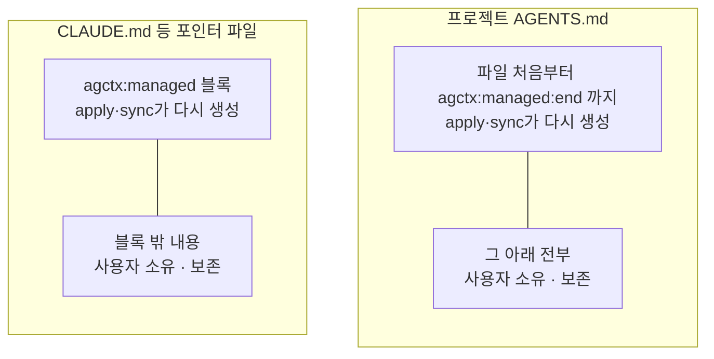
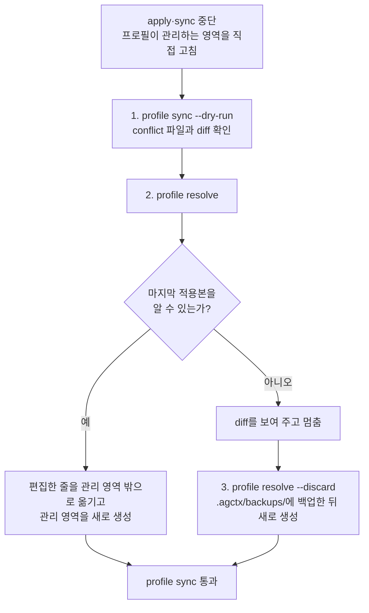

# 관리 영역과 확장 영역

<!-- agctx-doc-sources: src/project -->
<!-- agctx-doc-sources-sha256: c2df67edc67c9da9bdf49fec6c37e58cde1f6ea1df81cffd8b11cb1f880fcfb7 -->

적용된 파일은 agctx가 다시 만드는 영역과 사용자가 소유하는 영역으로 나뉜다.



적용된 `AGENTS.md`에서 줄마다 주인은 이렇다.

```text
# Profile: team                              ← 프로필 것
이 프로필의 공통 에이전틱 개발 지침을 관리한다.   ← 프로필 것
## Project context                           ← 프로필 것
- **Project:** repo                          ← 프로필 것

<!-- agctx:managed:end -->                   ← 프로필 것 (경계)

## 4. 프로젝트 규칙 확장 (SSOT)                ← 여기부터 사용자 것
이 프로젝트에만 적용되는 도메인 규칙은…          ← 사용자 것 (처음 적용할 때 써 준 안내)

- 배포 전에 QA를 받는다.                       ← 사용자 것
```

마커 한 줄이 경계이고 마커 자체도 관리 영역에 들어간다. 그 아래는 전부 사용자 것이므로, 확장 섹션의 제목을 자기 말로 바꾸거나 안내 한 줄을 지워도 `sync`가 되돌리지 않는다. 처음 적용할 때 쓸 자리를 알려 주려고 한 번 써 주는 것뿐이다. 이 결정의 이유는 [ADR 0034](../adr/0034-managed-end-marker-in-agents-md.md)에 있다.

마커가 없는 `AGENTS.md`는 agctx가 마커를 넣기 전에 만든 파일이다. 그때까지는 확장 섹션 제목으로 경계를 찾고, `profile sync` 한 번이면 마커가 들어간다.

무엇을 고치면 어떤 판정이 나오는지는 이렇다(2026-09-20 실측).

| 고친 곳 | `agctx check` | 다음에 할 일 |
| --- | --- | --- |
| 마커 아래에 규칙을 더하거나 고침 | 통과(0) | 없음. `sync`도 필요 없다 |
| 확장 섹션 제목이나 안내 한 줄을 고치거나 지움 | 통과(0) | 없음. 마커 아래는 사용자 것이다 |
| 마커 위(프로필 영역)를 고침 | 충돌(2) | `profile resolve`. 고친 내용을 마커 아래로 옮긴다 |
| 마커 줄을 지움 | 충돌(2) | `profile sync`로 되돌린다. 마커가 없으면 확장 섹션 제목으로 경계를 찾고, 그 제목도 없으면 파일 전체가 관리 영역이 된다 |
| 편집기가 저장하면서 파일 전체를 다시 포맷 | 통과(0) | 없음. 아래 설명을 참고한다 |

마지막 줄은 사람이 고치지 않아도 파일의 글자가 달라지는 자리라 따로 설명한다. 편집기가 저장할 때 Markdown을 다시 포맷하면 마커 아래만 고쳤더라도 위쪽 관리 영역의 글자가 함께 바뀐다. agctx는 두 가지로 이것을 걸러낸다. 첫째, 관리 영역에 쓰는 내용을 흔한 포매터가 만들어 내는 형태로 맞춰 둔다. 순서 없는 목록 기호는 `-`만 쓰고, 제목 뒤에는 빈 줄을 두며, 줄 끝 공백과 연속된 빈 줄을 남기지 않는다. 이 형태를 지키는지는 저장소 평가가 검사하므로 새 템플릿이 들어와도 어긋난 채로 배포되지 않는다. 둘째, 지금 관리 영역이 `.agctx/base/`의 원문과 **표현만** 다르면 사람이 고친 것으로 보지 않는다. 목록 기호, 줄 끝 공백, 블록 사이의 빈 줄, 줄 끝 문자, 문단 안의 줄바꿈이 대상이고 낱말은 비교 그대로 본다. 문단 안의 줄바꿈이 대상인 것은 Markdown이 그것을 공백으로 읽기 때문이다. 문단을 정해진 너비로 다시 접는 설정(Prettier의 `proseWrap: always`)을 써도 낱말과 그 차례는 그대로이므로 충돌하지 않는다. 줄바꿈에 뜻이 있는 코드 블록은 그대로 비교한다. 원문을 알 수 없으면 해시만 비교하므로 지금까지처럼 충돌한다.

포매터 설정을 무엇으로 두든 적용된 파일을 포맷 대상에서 뺄 필요가 없다([근거](../references.md#포매터가-관리-영역을-바꾸는-범위)). 낱말이나 그 차례가 바뀌면 그때는 사람의 편집이므로 지금까지처럼 멈춘다.

agctx가 다시 만드는 곳은 `AGENTS.md`의 프로필 영역과 포인터 파일의 관리 블록뿐이다. 사용자 내용은 확장 섹션 아래나 관리 블록 밖에 두어야 동기화 뒤에도 남는다. 예외가 하나 있다. `.agents/rules/agctx.md`는 관리 블록 위, 파일 맨 앞에 frontmatter(`---` 두 줄 사이에 적는 설정)를 둔다. Antigravity는 파일 첫 줄부터 시작하는 frontmatter의 `trigger: always_on`을 보고 이 규칙을 항상 읽기 때문이다. 그래서 agctx는 파일 맨 앞에 frontmatter가 없을 때만 템플릿의 frontmatter를 넣고, 사람이 이미 둔 frontmatter는 고치지 않는다.

프로젝트의 도메인 규칙은 `AGENTS.md`의 마커 아래에 직접 쓴다. 처음 적용할 때 표시 언어에 맞춰 `## 4. 프로젝트 규칙 확장 (SSOT)` 또는 `## 4. Project rule extensions (SSOT)`을 써 주지만, 그 아래는 사용자 영역이므로 제목을 바꾸든 절을 더 나누든 상관없다.

마커가 아직 없는 파일에서만 이 제목이 경계 노릇을 한다. 그때는 두 언어의 제목을 모두 인식하고 번호와 점이 없거나 제목 단계가 `###`로 바뀌어도 같은 경계로 보지만, 제목을 못 찾으면 파일 전체를 관리 영역으로 보므로 확장 영역에 쓴 내용까지 충돌로 판정된다. `profile sync`로 마커를 넣으면 이 제약이 사라진다.

- **초안 만들기:** agctx는 코드베이스를 분석해 이 섹션을 채우지 않는다. 초안이 필요하면 Claude Code나 Codex의 `/init`으로 만든 뒤, 사람이 다듬어 이 확장 섹션으로 옮긴다. 지침에 무엇을 둘지와 그 근거는 [ADR 0006](../adr/0006-no-codebase-analysis-guidance.md)에 있다.
- **어디에 둘지:** 여러 에이전트가 공통으로 읽는 파일은 `AGENTS.md`이므로, 에이전트들이 함께 따를 규칙은 `<!-- agctx:managed:end -->` 아래에 둔다. Claude Code에만 줄 지침을 `CLAUDE.md`에 남기려면 `<!-- agctx:managed:start -->`와 `<!-- agctx:managed:end -->` 사이의 관리 블록 밖에 둔다.
- **관리 영역 안을 고쳤을 때:** 다음 `apply`·`sync`가 `프로필이 관리하는 영역을 직접 고친 파일이 있습니다`로 멈추고 어떤 파일도 쓰지 않는다. `agctx profile resolve <project>`를 실행하면 그 편집을 관리 영역 밖으로 옮기고 관리 영역을 다시 만들어 푼다. 자세한 절차는 바로 아래 [관리 영역을 고쳐서 멈췄을 때](#관리-영역을-고쳐서-멈췄을-때)에 있다.

## 관리 영역을 고쳐서 멈췄을 때

<!-- agctx-doc-sources: src/profile/resolve.ts -->
<!-- agctx-doc-sources-sha256: 03a416e8203688c5519068e098f4d72d0733b592aa60d2689de753e96c10edbc -->

`apply`·`sync`가 `프로필이 관리하는 영역을 직접 고친 파일이 있습니다: <파일>`로 멈추면, agctx가 마지막으로 쓴 관리 영역과 지금 파일의 관리 영역이 다르다는 뜻이다.

- 멈춘 시점에는 어떤 파일도 쓰지 않았다.
- 오류 메시지 아래에 차이를 볼 명령과 푸는 명령이 함께 나온다.
- 줄 끝 문자(LF·CRLF)만 다른 것은 차이로 보지 않는다. Git for Windows처럼 `core.autocrlf` 설정으로 파일을 CRLF 줄 끝으로 체크아웃해도, agctx는 LF로 맞춰 비교한다. 파일을 다시 쓸 때는 그 파일이 쓰던 CRLF를 유지한다.



1. `agctx profile sync --dry-run <project>`로 무엇이 달라졌는지 본다. 충돌 파일은 `conflict`로 표시되고 diff가 함께 나오며 종료 코드는 2다.
2. `agctx profile resolve <project>`를 실행한다. 관리 영역 안에서 추가·수정한 줄은 포인터 파일이면 관리 블록 바로 아래로, `AGENTS.md`면 마커 아래 파일 끝으로 옮겨진다. 관리 영역은 현재 프로필로 새로 만들어진다. 관리 영역 안에서 지운 줄은 되살아나며 몇 줄인지 알려 준다. `--dry-run`을 붙이면 옮길 줄만 보여 주고 파일을 바꾸지 않는다.
3. 마지막 적용본을 알 수 없으면 resolve가 멈춘다. `.agctx/base/`가 없는 상태에서 프로필까지 바뀐 경우다. 남길 내용을 직접 관리 영역 밖으로 옮긴 뒤 `agctx profile resolve --discard <project>`를 실행한다. 현재 파일을 `.agctx/backups/<시각>/`에 복사한 뒤 관리 영역을 새로 만든다.
4. 줄 단위로 직접 고르고 싶으면 `agctx profile resolve --edit <project>`로 VS Code 3-way merge 편집기를 연다. 편집기를 열기 전에 터미널이 아래 확인 순서를 출력한다.
   1. 위쪽 `current-<파일>` 창에서 강조된 영역은 관리 영역 안에서 고쳤던 원래 위치다. 위쪽 두 창은 읽기 전용이고, 수락 버튼은 누르지 않는다.
   2. 아래쪽 Result 창에는 그 줄이 관리 영역 밖(`<!-- agctx:managed:end -->` 아래)으로 이미 옮겨져 있다. 남길 내용이 모두 관리 영역 밖에 있는지 확인하고 필요하면 고친 뒤 저장한다.
   3. 탭을 닫을 때 "파일에 처리되지 않은 충돌이 포함되어 있습니다" 경고가 뜨면 Result 창을 다시 확인하고 `충돌과 함께 닫기`(Close with Conflicts)를 누른다. 저장한 결과가 적용된다.

   agctx는 결과에서 관리 영역 밖의 내용만 가져오고 관리 영역은 다시 만들므로, 저장할 때 포매터가 관리 영역을 바꿔도 된다. 관리 영역 안에 남긴 변경은 적용되지 않으며 diff와 merge 결과 파일 경로로 알려 준다. `code` 명령이 PATH에 있어야 한다.

`.agctx/base/`는 마지막으로 적용한 관리 영역 원문이다. `resolve`는 이 원문과 지금 파일을 비교해 사람이 고친 줄을 찾는다. git에 커밋해 두면 팀원도 같은 원문을 기준으로 충돌을 푼다. `.agctx/base/`를 지워도 다음 `apply`·`sync`가 다시 만든다. 다만 지운 상태에서 관리 영역을 고쳤고 프로필까지 바뀌었다면, 고친 줄과 프로필 변경을 구분할 기준이 없어서 `--discard`로만 풀 수 있다. TUI에서는 `profile list`의 `프로젝트 충돌 해결` 메뉴에서 같은 선택지를 고른다. 결정 근거는 [ADR 0008](../adr/0008-managed-conflict-recovery.md)에 있다.
