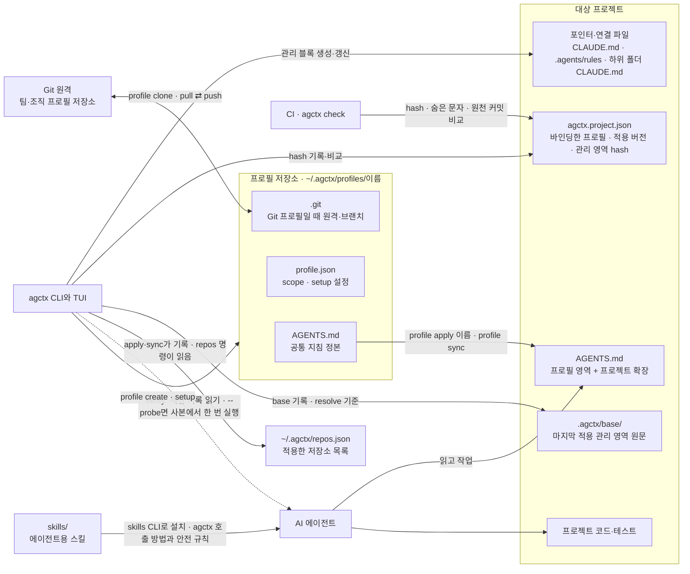

# 현재 아키텍처

이 문서는 현재 구현되어 채택된 구조만 기록한다. 후속 개선 계약은 [`discussion/architecture/`](../discussion/architecture/)에서 관리한다. 기능별 구현 위치와 그 이유를 가리키는 안내도는 [기능 구현 메커니즘](implementation-mechanics.md)이, 프로필에 배포되는 공통 지침 목록은 [지침 카탈로그](../reference/guidance-catalog.md)가 정본이다.


agctx는 개인·조직별 에이전트 컨텍스트를 프로필로 생성·설정하고 이를 프로젝트와 여러 AI 에이전트에 안전하게 적용·동기화한다.

## 현재 구조

<!-- agctx-doc-sources: src/agctx.ts, src/check.ts, src/explain.ts, src/commands, src/profile, src/project, src/repos, src/verify, src/i18n, src/tui, src/shared, tools -->
<!-- agctx-doc-sources-sha256: c03180f24157d814d747a96022ec579119594fef8fdb9d75e0b9a97ff6457074 -->



프로필 저장소의 `AGENTS.md`가 공통 지침의 정본이고 CLI는 이를 대상 프로젝트의 `AGENTS.md`와 포인터 파일로 적용한다. 팀은 프로필 폴더를 Git 원격으로 주고받고, CI는 프로필 보관함 없이 `agctx check`로 저장소가 기록한 버전과 맞는지 확인한다. 에이전트는 프로젝트 파일만 읽는다. agctx는 에이전트 세션 기록을 읽기만 하고, 사용자가 `verify --probe`로 요청할 때만 임시 사본에서 에이전트 CLI를 한 번 실행한다.

- **프로필 관리:** CLI는 옵션 기반 또는 TUI 방식으로 프로필을 생성·목록화·조회·설정·삭제한다. 프로필에는 `personal`, `company`, `team`, `workspace` scope가 있으며 `profile list --scope <scope>`로 필터링할 수 있다.
- **명령 계약:** 모든 명령은 `src/commands/registry.ts`의 등록부에 있고, 도움말·옵션 검사·프로필 관리 메뉴가 이 목록을 읽는다. 결과는 종료 코드(뒤처짐 1, 충돌 2, 숨은 문자 3, 사용법 오류 64, 외부 도구 69, 그 밖 70)와 `--json` 결과 문서로 알린다. 파일을 바꾸거나 원격으로 보내는 명령은 터미널이 아니면 `--yes`가 있어야 진행한다. 결정은 [ADR 0016](../adr/0016-command-contract.md)이다.
- **TUI 경로:** TUI의 `profile list`는 scope를 먼저 선택한 뒤 프로필을 고르고 설정·프로젝트 적용·동기화·충돌 해결·상세 보기·삭제와 Git 상태·받기·올리기·연결 메뉴를 제공한다. 프로젝트 적용은 Git 프로필이면 커밋에 고정할지 묻고, 이미 고정한 프로젝트는 고정 유지를 기본으로 둔다. 같은 목록에서 새 프로필을 만들거나 Git에서 프로필을 가져올 수 있다. `profile setup`만 실행하면 `scope · 이름` 형식의 목록에서 프로필을 고른다. 모든 명령은 CLI와 TUI를 모두 제공하고, 특정 프로필을 다루는 기능은 프로필 관리 메뉴도 제공한다([ADR 0025](../adr/0025-every-command-in-cli-and-tui.md)). 저장소를 다루는 `check`·`explain`·`verify`·`repos`는 첫 화면의 프로젝트 점검과 여러 저장소 메뉴에서 실행한다. 옵션을 질문으로 받는 TUI 흐름은 답을 CLI 토큰으로 바꿔 CLI와 같은 옵션 검사와 처리기로 실행한다(`src/tui/commands.ts`).
- **적용과 보존:** 적용 시 프로젝트 `AGENTS.md`의 확장 섹션과 에이전트별 산출물의 사용자 영역을 보존하고 `AGENTS.md`의 프로필 소유 영역과 에이전트별 산출물의 agctx 관리 블록만 `apply/sync` 때 갱신한다. 확장 섹션 제목은 한국어·영어 로케일을 모두 인식한다. 확장 섹션이 없는 기존 `AGENTS.md`는 `## Existing project guidance` 아래로 옮겨 보존하고 관리 마커가 없는 기존 에이전트별 파일은 기존 내용을 보존한 채 관리 블록을 추가한다. 템플릿이 frontmatter로 시작하는 Antigravity 규칙 파일은 frontmatter를 관리 블록 밖 파일 맨 앞에 두고, 파일 맨 앞에 이미 있는 frontmatter는 보존한다([ADR 0009](../adr/0009-agent-rule-frontmatter.md)). 모노레포에서는 하위 `AGENTS.md`마다 같은 폴더에 `@AGENTS.md`를 가져오는 관리 블록 `CLAUDE.md`를 만들고, 사람이 둔 `CLAUDE.md`는 쓰지 않는다. Microsoft APM 기본 모드가 만든 `AGENTS.md`·`CLAUDE.md`에는 쓰지 않고 멈추며, 확장 영역에 둔 APM `managed_section` 블록은 사용자 내용으로 보존한다([ADR 0020](../adr/0020-apm-coexistence-and-monorepo-links.md)).
- **수동 변경 감지와 충돌 해결:** 두 관리 영역의 hash를 `agctx.project.json`에, 관리 영역 원문을 `.agctx/base/`에 기록한다. 기록된 영역이 바뀌면 `apply`와 `sync`는 파일을 쓰기 전에 종료 코드 2로 중단하고, `--dry-run`은 충돌 파일과 diff를 보여 준 뒤 같은 코드로 끝난다. `profile resolve`는 마지막 적용본을 기준으로 관리 영역 안의 편집을 밖으로 옮기고 관리 영역을 새로 만든다. 마지막 적용본을 알 수 없으면 멈추고, `--discard`를 주면 `.agctx/backups/`에 백업한 뒤 새로 만든다. 결정 근거는 [ADR 0008](../adr/0008-managed-conflict-recovery.md)이다.
- **삭제와 재동기화:** 프로필 삭제는 해당 프로필 원본만 제거하고 이미 적용된 프로젝트 파일은 변경하지 않는다. `profile sync`는 `agctx.project.json`에 기록된 프로필을 사용한다.

- **Git 공유와 적용 버전:** 프로필 폴더가 Git 작업 트리이면 `profile clone`·`status`·`pull`·`push`·`connect`로 원격과 주고받는다. 이 명령들은 사용자의 Git 인증으로 `git`을 실행하고 프로젝트 파일은 건드리지 않는다. clone·pull은 받을 `profile.json`·`AGENTS.md`를 검증하고 숨은 문자를 검사한 뒤에만 반영하며, pull은 fast-forward만 한다. `apply`·`sync`는 적용한 프로필의 `source { git, branch, commit }`와 고정 여부(`pin`)를 `agctx.project.json`에 기록하고, 고정한 프로젝트의 `sync`는 기록한 커밋의 `AGENTS.md`로 다시 만든다. 결정은 [ADR 0017](../adr/0017-git-profile-sharing.md)이다.
- **저장소 검사:** `agctx check`는 파일을 바꾸지 않고 관리 영역 hash(충돌 2), 관리 파일의 숨은 문자(3), 프로필이나 원천 저장소보다 뒤처졌는지(1)를 판정한다. 보관함이 없는 CI에서는 `--refresh`가 `git ls-remote`로 원천 브랜치의 최신 커밋과 비교한다.
- **여러 저장소:** `apply`·`sync`가 적용한 저장소를 `~/.agctx/repos.json`에 기록하고, `repos status`·`sync`·`pr`이 이 목록이나 `--targets` 파일의 저장소를 한 번에 다룬다. `repos pr`은 사용자 작업 폴더 대신 임시 worktree(URL은 임시 clone)에서 커밋해 push하고 `gh`로 PR을 연다. 렌더링이 폴더 이름에 흔들리지 않도록 프로젝트 이름을 `agctx.project.json`에 기록한다. 결정은 [ADR 0018](../adr/0018-multi-repository-sync.md)이다.
- **전달 확인:** `agctx explain`은 에이전트마다 문서화된 로드 규칙과 실측으로, 한 폴더에서 시작한 에이전트가 읽는 지침 파일을 판정하고, 확인한 에이전트 가운데 하나라도 받지 못하는 파일(`missing`)이 있으면 4로 끝난다(`src/explain.ts`의 `explainPath`<!--s:869edbdafbce-->). `agctx verify`는 Codex·Claude Code 세션 기록에서 그 파일들이 실제로 들어갔는지 확인한다. `--probe`를 주면 확인을 받은 뒤, 파일마다 표지 줄을 붙인 임시 사본에서 에이전트 CLI를 도구 없이 한 번씩 실행한다. `explain`은 같은 규칙이 두 파일로 한 에이전트에 들어가는 중복도 경고한다([ADR 0020](../adr/0020-apm-coexistence-and-monorepo-links.md)). 결정은 [ADR 0019](../adr/0019-explain-verify-and-agent-skills.md)다.
- **에이전트용 스킬:** 저장소 `skills/`에 진단·갱신용 `agctx`와 게시용 `agctx-author` 스킬이 있다. 명령 목록은 `tools/generate-skills.ts`가 등록부에서 만들고 평가가 최신인지 검사한다. 스킬은 npm 패키지에 넣지 않고 사용자가 skills CLI로 저장소에서 전역(`-g`)에 설치한다. skills CLI는 저장소 전체를 순회하므로, 기여자용 `.agents/skills/repo-docs`는 frontmatter의 `metadata.internal: true`로 사용자 설치에서 뺀다.

프로필은 로컬 파일 시스템의 `~/.agctx/profiles/<name>`에 보관하며, 이 폴더가 Git 저장소이면 원격과 공유할 수 있다. 원격 저장소의 권한·리뷰·보호 규칙은 Git 호스트가 맡는다.

## 저장소 파일 구조

<!-- agctx-doc-sources: package.json, tsconfig.json, tsconfig.build.json, templates -->
<!-- agctx-doc-sources-sha256: c1176365b0076074a6333c396941f708044e8531ba7065b5e4f28f013d111333 -->

```text
agent-context-manager/
├── .github/                    # CI·배포·Dependabot·커뮤니티 운영 설정
├── .editorconfig               # 편집기 공통 형식 규칙
├── .gitattributes              # Git 줄바꿈·바이너리 판정 규칙
├── .nvmrc                      # 기여자 기본 Node.js 메이저 버전
├── src/                         # TypeScript 소스. 배포할 때 dist/로 컴파일
│   ├── agctx.ts                 # CLI 진입점: commands/cli.ts의 run() 호출
│   ├── commands/                # 명령 등록부(registry)·옵션 검사·처리기·stdout/stderr·JSON 출력·도움말
│   ├── profile/                 # 프로필 명령: store(create·list·view·remove)·setup·apply(버전 결정·계획)·resolve·git-profile(clone·status·pull·push·connect)
│   ├── project/                 # 적용 엔진: 변경 계획·관리 영역 병합과 hash·충돌 편집·VS Code merge·하위 폴더 연결 파일·APM 생성 파일 판정
│   ├── check.ts                 # 저장소 검사(check): 관리 영역 hash·숨은 문자·뒤처짐
│   ├── explain.ts               # 에이전트별 지침 로드 판정(explain)
│   ├── verify/                  # 지침 전달 확인(verify): 세션 기록 판독·probe
│   ├── repos/                   # 여러 저장소: 목록(repos.json)·상태·동기화·임시 worktree PR
│   ├── i18n/                    # 로케일 해석·ko/en 메시지·배포 지침 문구
│   ├── tui/                     # 메인·프로필 관리 화면
│   └── shared/                  # 프로필 홈·원자적 파일 쓰기·git 실행·숨은 문자 검사·폴더 탐색·종료 코드·실행 정보·공용 타입
├── templates/
│   ├── profile/AGENTS.md        # 새 프로필의 초기 지침 템플릿(한국어는 AGENTS.ko.md)
│   └── ...                      # 에이전트별 지침 포인터·하위 폴더 연결 파일(CLAUDE.link.md) 템플릿
├── skills/                      # 에이전트용 스킬: agctx(진단·갱신)·agctx-author(게시·PR)
├── .agents/skills/repo-docs/    # 이 저장소 기여자용 스킬(metadata.internal): 문서 변경 절차
│                             # (Claude Code용 링크는 .claude/skills/repo-docs)
├── evals/                       # CLI·문서·패키지 산출물 평가
├── tools/
│   ├── build.ts                 # src/를 dist/로 컴파일(prepack에서 실행)
│   ├── check-docs.ts            # 링크·ADR·discussion·README 계약과 문서 소스 해시·근거 게이트
│   ├── check-release.ts         # 릴리스 태그·버전·CHANGELOG 일치 검사
│   ├── discussion-record.ts     # 논의 문서의 상태와 구현 기록 제목이 맞는지 판정
│   ├── discussion-roots.ts      # docs/discussion 아래에서 topics/를 가진 논의 영역 목록
│   ├── discussion-topics.ts     # 논의 주제 상태의 정본 docs/discussion/topics.json 읽기, 필드 검사, 주제 문서의 중요도 읽기
│   ├── doc-evidence.ts          # references.md 확인일과 ADR 근거 필드 규칙
│   ├── doc-source-path.ts       # 문서 소스 해시에 넣을 경로를 OS와 무관하게 / 형식으로 계산
│   ├── doc-citations.ts         # 문서가 코드를 가리키는 형식 검사(줄 번호 금지·이름 존재·지문 표지)
│   ├── doc-sources.ts           # 절 단위 핀 읽기, 핀 범위 규칙, 해시에서 뺄 해시 줄·생성 블록
│   ├── generate-discussion-status.ts # topics.json에서 논의 상태 줄·색인 표·README 목록 생성(--check로 검사)
│   ├── generate-progress.ts     # PROGRESS.md의 최근 기록(git log)과 구현 중인 주제 표(topics.json) 생성
│   ├── generate-reference.ts    # 명령 등록부에서 레퍼런스의 생성 블록 생성(--check로 검사)
│   ├── generate-skills.ts       # 명령 등록부에서 스킬의 명령 목록 생성(--check로 검사)
│   ├── package-smoke.ts         # 실제 tarball 설치 후 핵심 명령 실행
│   ├── symbol-source.ts         # 인용한 심볼·JSON 키·YAML 블록을 잘라 내 지문 계산
│   └── skills-smoke.ts          # skills CLI로 스킬을 임시 프로젝트에 설치해 위치 확인
├── docs/
│   ├── README.md                # 문서 입구: 사용 흐름·사용자 문서·기여자 문서·ADR 색인
│   ├── getting-started/         # 설치와 빠른 시작
│   ├── guides/                  # 상황별 사용 절차
│   ├── concepts/                # 동작 원리와 이유
│   ├── reference/               # CLI·종료 코드·파일 형식·지원 에이전트·문제 해결
│   ├── faq.md                   # 자주 묻는 질문
│   ├── contributing/            # 제품 방향·아키텍처·테스트·릴리스·문서 게이트·에이전트 추가
│   ├── discussion/              # 논의 영역별 계획·계약(architecture: 패키지 기능, repository: 저장소 운영)과 상태 정본 topics.json
│   ├── adr/                     # 장기 설계 결정 기록
│   └── references.md            # 외부 근거와 비교 자료
├── AGENTS.md                    # 이 저장소 개발 규칙 정본
├── README.md                    # npm 패키지 소개(영어는 README.en.md)
├── CHANGELOG.md                 # 사용자 영향 변경 이력
├── CONTRIBUTING.md              # 기여 절차와 품질 게이트
├── SECURITY.md                  # 보안 신고·안전한 사용 정책
├── CODE_OF_CONDUCT.md           # 커뮤니티 행동 규범
├── LICENSE                      # MIT 라이선스
├── package.json                 # npm 패키지·CLI·스크립트 정의
├── pnpm-lock.yaml               # 저장소 개발 의존성 잠금
├── tsconfig.json                # src·evals·tools 형식 검사 설정(파일을 만들지 않음)
└── tsconfig.build.json          # src → dist 컴파일 설정
```

배포 패키지에는 `src/`를 컴파일한 `dist/`, `templates/`, `README.md`, `LICENSE`와 런타임 의존성만 포함된다. `dist/`는 커밋하지 않고 `npm pack`·`npm publish` 직전의 `prepack`이 만든다. `src/`, `docs/`, `evals/`, `tools/`, `skills/`와 저장소 개발 문서는 npm 사용자의 설치 대상에서 제외된다. 컴파일해서 배포하는 이유는 [ADR 0012](../adr/0012-typescript-source.md)에 있다.

## 소유권

| 영역 | 소유자 | 설명 |
| --- | --- | --- |
| 패키지 템플릿 | agctx 저장소 | 기본 포인터와 프로젝트 도구의 배포 원본 |
| 프로필 `AGENTS.md` | 사용자·조직 | 선택된 공통 지침 정본 |
| 프로필 Git 원격 | 사용자·조직(Git 호스트) | 권한·리뷰·변경 이력. agctx는 사용자의 Git 인증으로 clone·pull·push만 실행 |
| 프로젝트 `AGENTS.md` | 대상 프로젝트 | 적용된 공통 지침과 프로젝트 도메인 지침을 담는 최종 지침 파일 |
| 프로젝트 `agctx.project.json` | agctx가 쓰고 대상 프로젝트가 커밋 | 바인딩한 프로필, 프로젝트 이름, 적용 버전(`source`·`pin`·`uncommitted`), 관리 영역 hash |
| `~/.agctx/repos.json` | 사용자(이 컴퓨터) | agctx가 쓰는 적용한 저장소 목록. 어떤 저장소에도 커밋하지 않는다 |
| 프로젝트 `.agctx/` | agctx가 쓰고 대상 프로젝트가 커밋 | `base/`는 마지막 적용 관리 영역 원문, `backups/`는 `resolve --discard` 백업이며 `.gitignore`로 커밋에서 제외 |
| 하위 폴더 `CLAUDE.md` 연결 파일 | agctx가 쓰고 대상 프로젝트가 커밋 | 관리 블록만 agctx 소유. 사람이 둔 `CLAUDE.md`는 사람 소유이며 agctx가 쓰지 않는다 |
| 저장소 `skills/` | agctx 저장소 | 에이전트용 스킬 원본. 사용자가 skills CLI로 설치한 사본은 설치한 프로젝트나 사용자가 관리 |
| 에이전트 세션 기록 | 각 에이전트 | `verify`가 읽기만 한다. agctx는 쓰거나 지우지 않는다 |
| 프로젝트 코드·테스트 | 대상 프로젝트 | 제품 동작과 도메인 검증 |

## 패키지 내부 검증

이 저장소의 `pnpm run check`는 TypeScript 형식 검사, 문서 계약 검사, CLI 평가를 실행한다. 대상 프로젝트에 검증 실행기나 테스트를 주입하지 않는다. 프로필 지침에 검증 규칙을 선택하는 기능과 대상 프로젝트의 실제 검증은 별도 책임이다.
