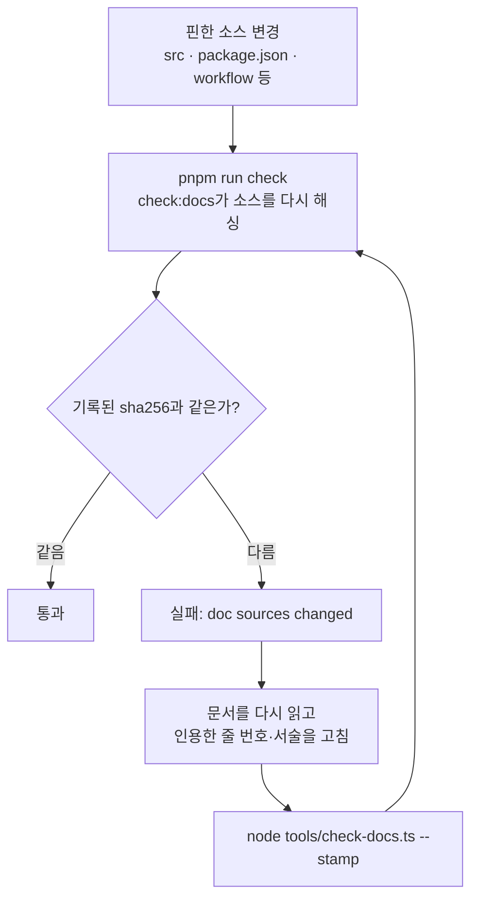

# 문서 게이트

<!-- agctx-doc-sources: tools/check-docs.ts, tools/doc-evidence.ts, tools/doc-source-path.ts, tools/discussion-record.ts, tools/generate-reference.ts, evals/reference-docs.test.ts, tools/doc-sources.ts, evals/doc-examples.test.ts -->
<!-- agctx-doc-sources-sha256: 545710d32cfbeadb081c1047d87356a4816c7f5102d7145fcf4cf27e8ffb5718 -->

`pnpm run check`의 `check:docs`는 문서가 코드와 근거에서 멀어지지 않게 두 게이트와 링크·색인 검사를 실행한다. 문서를 어디에 둘지와 작성 규칙은 루트 [`AGENTS.md`](../../AGENTS.md)의 문서 규칙을 따른다.

## 문서 소스 해시 게이트

현재 코드 동작을 서술하는 문서는 인용·서술하는 소스 파일 목록과 그 sha256을 문서 상단 HTML 주석 마커로 고정한다. `pnpm run check`의 `check:docs`가 마커의 소스를 다시 해싱해 기록된 값과 다르면 실패한다. 현재 대상은 코드 동작이나 실제 출력을 싣는 `getting-started/`·`guides/`·`concepts/`·`reference/`의 문서(`concepts/why-agctx.md` 제외), `contributing/`의 `architecture.md`·`implementation-mechanics.md`·`guidance-catalog.md`·`implementation-principles.md`·`testing.md`·`releasing.md`·`doc-gate.md`·`adapters.md`, 그리고 루트 `README.md`·`README.en.md`이다. 제품 방향·논의·ADR·변경 이력·기여 정책처럼 코드에 매이지 않는 문서와 배포·생성되는 산출물(`templates/`, `.agents/`, `.github/` 등)은 대상이 아니다.

게이트는 소스가 바뀌었다는 사실만 알린다. 문서를 고치는 단계를 건너뛰고 `--stamp`만 실행해도 다시 통과하므로, 문서가 정확한지는 사람이 확인해야 한다.

- 마커는 `<!-- agctx-doc-sources: <쉼표로 구분한 경로> -->`와 `<!-- agctx-doc-sources-sha256: <64자리 hex> -->` 두 줄이다. 경로에는 파일뿐 아니라 디렉터리도 넣을 수 있다. 디렉터리를 넣으면 그 아래 모든 파일을 해싱하므로 안에서 파일이 추가·삭제·수정되면 목록을 고치지 않아도 게이트가 걸린다.
- 해시가 어긋나면 문서를 다시 읽어 드리프트를 고친 뒤 `node tools/check-docs.ts --stamp`로 해시를 다시 기록한다. 이 갱신이 재검증했다는 표시다.
- 인용하는 소스가 늘거나 줄면 마커의 목록도 같은 변경에서 갱신한다. 다만 디렉터리로 고정한 범위 안에서 파일이 늘거나 줄면 목록 갱신 없이 자동 반영된다.
- stamp만 다시 기록한 변경을 자동으로 잡아내는 리뷰는 아직 구현되지 않았다. 계획은 [문서 정확성 자동 리뷰 논의](../discussion/architecture/topics/doc-accuracy-review.md)에 있다.

### 핀 범위와 예시 검사

- 소스는 모듈 단위로 핀한다. `src` 폴더 전체를 핀하면 파일 하나만 바꿔도 모든 문서가 한꺼번에 실패해 다시 읽지 않고 stamp하게 되므로, `check:docs`가 이를 오류로 막는다. `src/commands`처럼 모듈 폴더나 파일을 나열한다.
- `src` 아래의 모든 파일은 적어도 한 문서의 핀에 들어가야 한다. 새 모듈이나 새 최상위 파일을 더했는데 어느 문서도 핀하지 않으면 `check:docs`가 그 파일을 알린다. 규칙은 `tools/doc-sources.ts`에 있다.
- 빠른 시작의 명령 예시는 `evals/doc-examples.test.ts`가 격리한 폴더에서 다시 실행해 줄마다 대조한다. 해시 게이트는 다시 읽으라고 알릴 뿐이지만, 이 검사는 예시가 실제 출력과 달라진 순간을 잡는다. 예시에 쓸 수 있는 명령은 `agctx`와 `mkdir`이다.

## 문서 근거 게이트

외부 사실의 출처가 언제 확인됐는지 남기고, 새 결정이 근거를 밝히도록 `check:docs`가 두 가지를 검사한다. 검사 로직은 `tools/doc-evidence.ts`에 있다.

- **확인일:** `docs/references.md`에서 코드 블록 밖의 외부 링크(`http`·`https`)가 들어 있는 줄은 같은 줄에 `확인일: YYYY-MM-DD`가 있어야 한다. 목록 항목은 줄 끝에, 표 행은 마지막 칸 안에 붙인다.
- **ADR 근거:** 번호가 0009 이상인 ADR은 머리말에 `* **근거:**`(또는 `* **Evidence:**`)가 있어야 한다. 값에는 링크를 두거나, 외부 사실에 기대지 않는 결정이면 `외부 근거 없음: <이유>`(또는 `No external evidence: <reason>`)를 적는다. 0008 이전 ADR은 검사하지 않는다.

게이트는 형식만 확인한다. 링크한 문서에 그 주장이 실제로 있는지는 확인일을 붙이는 사람이 직접 열어 확인해야 하며, 외부 링크가 살아 있는지도 검사하지 않는다.

## 생성하는 레퍼런스

명령 등록부에서 뽑을 수 있는 내용은 사람이 옮겨 적지 않고 생성한다. `docs/reference/cli.md`의 명령 표와 명령마다의 사용법·종료 코드 줄, `docs/reference/exit-codes.md`의 명령별 종료 코드 표는 `<!-- agctx:generated:<이름>:start -->`와 `<!-- agctx:generated:<이름>:end -->` 사이에 있다. `node tools/generate-reference.ts`가 명령 등록부(`src/commands/registry.ts`)와 한국어 메시지 카탈로그의 명령 요약·종료 코드 이름으로 이 블록을 다시 쓰고, `--check`를 주면 다를 때 1로 끝난다.

- `evals/reference-docs.test.ts`가 생성 결과와 파일 내용이 같은지, 명령마다 자기 절 안에 사용법 블록이 있는지 검사한다. 명령·옵션·종료 코드를 바꾸고 다시 생성하지 않으면 `pnpm run check`가 실패한다.
- 표지 밖의 설명·예시·표는 사람이 쓰며, 해시 게이트가 다시 읽게 한다.
- 새 명령을 등록하면 CLI Reference에 그 명령의 `###` 절과 사용법 표지를 먼저 만든 뒤 생성한다.
