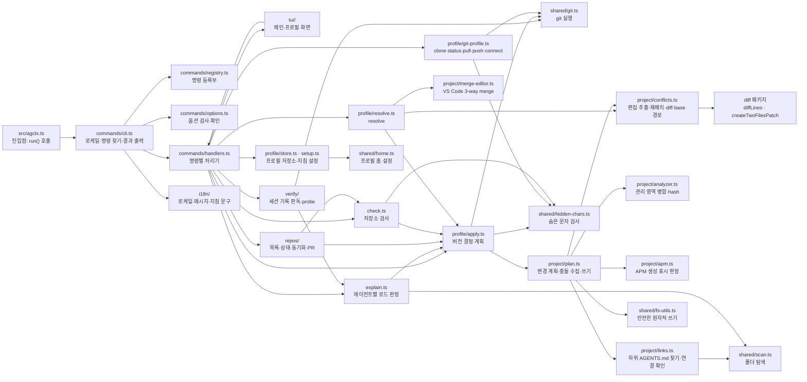

# 기능 구현 메커니즘

**문서 유형:** 안내도 (유지보수자용). 기능마다 **어느 파일의 어느 이름에 구현돼 있고, 왜 그렇게 정했으며, 무엇이 그 동작을 지키는지**를 알려 준다. 동작을 문장으로 다시 설명하지 않는다. 코드가 무엇을 하는지는 코드와 그 옆 주석이 정본이고, 왜 그렇게 하는지는 ADR이 정본이다.

npm·Node.js·CLI의 일반 원리는 [구현 원리](implementation-principles.md)에, 현재 구조·소유권의 정본은 [현재 아키텍처](architecture.md)에 있다.

## 읽는 법

- 이 문서는 코드를 복사하지 않는다. 줄 번호와 코드 발췌를 두지 않고 파일과 이름으로 가리킨다. 이유와 측정은 [문서가 코드를 인용하는 방식](../discussion/repository/topics/code-citation-style.md)에 있다.
- 이름은 편집기의 심볼 찾기나 `rg -n "export function planProject" src`처럼 찾는다.
- 각 절은 기능 하나를 맡고, 절 번호는 다른 문서가 링크로 가리키므로 바뀌지 않는다.
- 다루지 않는 것: 사용자 관점의 명령·옵션·종료 코드([CLI Reference](../reference/cli.md)), 사용 흐름([문서 입구](../README.md)), 검증의 범위와 한계([현재 아키텍처](architecture.md), [문서 게이트](doc-gate.md)).

## 모듈 지도

`src/`의 폴더는 역할별로 나뉜다. `commands/`는 명령 등록부·옵션 검사·처리기·출력·도움말, `profile/`은 프로필 명령과 Git 프로필, `project/`는 적용 엔진과 APM·모노레포 판정, `check.ts`는 저장소 검사, `explain.ts`는 에이전트별 지침 로드 판정, `verify/`는 세션 기록 판독과 probe, `repos/`는 여러 저장소 다루기, `i18n/`은 로케일과 메시지, `tui/`는 대화형 화면, `shared/`는 프로필 홈·안전한 쓰기·git 실행·숨은 문자 검사·종료 코드·공용 타입이다.

그림에 없는 `commands/output.ts`(stdout·stderr 분리)와 `shared/errors.ts`(종료 코드와 `CliError`)는 거의 모든 모듈이 쓴다. `shared/types.ts`는 공용 타입만 정의하고 `import type`으로만 쓰이므로 컴파일하면 사라진다.

## 1. 진입점과 명령 분기

설치본과 저장소가 같은 경로로 명령을 찾도록, 진입점은 실행만 맡고 명령 해석은 한 곳에 모은다.

- 진입점: `src/agctx.ts`. 설치본에서는 컴파일한 `dist/agctx.js`가 같은 일을 한다.
- 전역 옵션 분리와 명령 찾기: `src/commands/cli.ts`의 `main`<!--s:31d0505f3375-->·`run`<!--s:2fd759cbfca9-->, `src/commands/args.ts`의 `stripFlag`<!--s:3a20e16f337b-->
- 명령 조회와 오타 제안: `src/commands/registry.ts`의 `findCommand`<!--s:0188bf109bd7-->·`suggestCommands`<!--s:a5d7e05ff2dd-->·`usageLine`<!--s:1e6aea3c47c2-->, `src/commands/cli.ts`의 `unknownCommand`<!--s:d1b142bc79c2-->

## 2. 로케일 해석과 저장

같은 명령이 사람에게는 고른 언어로, 자동화에는 예측 가능한 언어로 보이도록 우선순위를 한 함수에 고정한다.

- 우선순위 판정: `src/i18n/index.ts`의 `resolveLocale`<!--s:d0f579814d15-->
- 실행 시 해석과 저장: `src/commands/cli.ts`의 `resolveActiveLocale`<!--s:9d3fde15a5f9-->, `src/shared/home.ts`의 `saveLocale`<!--s:4f6c7f18d7d7-->(`config.json`)
- 이유: [ADR 0002](../adr/0002-locale-i18n.md), 기본 영어는 [ADR 0014](../adr/0014-default-locale-english.md)
- 지키는 평가: `evals/i18n.test.ts`, `evals/messages.test.ts`

## 3. 프로필 저장소 모델

프로필은 사용자 홈의 보관함에 있고 프로젝트 파일과 섞이지 않는다. 테스트와 스모크는 `AGCTX_HOME`으로 보관함을 옮겨 실제 홈을 건드리지 않는다.

- 보관함 경로: `src/shared/home.ts`의 `agctxHome`<!--s:e54fff59419c-->·`profileHome`<!--s:6a22b8ad5c16-->
- 읽기·검증: `src/profile/store.ts`의 `getProfiles`<!--s:fb51185a75a0-->·`readProfile`<!--s:b0e88d759f98-->·`validateProfileName`<!--s:a47dd8437ed4-->·`isValidProfileMetadata`<!--s:f115d5169b00-->
- 이유: [ADR 0007](../adr/0007-profile-home-layout.md), 이름 변경은 [ADR 0013](../adr/0013-rename-agent-context-manager.md)

## 4. profile create

빈 프로필을 만들고 지침 템플릿을 넣는다. CLI와 TUI가 같은 함수를 쓴다.

- 생성: `src/profile/store.ts`의 `createProfile`<!--s:122be23580b0-->
- TUI 흐름: `src/tui/profile.ts`의 `createProfileTui`<!--s:151f4e01035f-->
- 지키는 평가: `evals/profile.test.ts`

## 5. profile setup: 지침 블록 기록

지침 항목을 켜고 끈 결과를 프로필의 `AGENTS.md` 안 표지 사이에만 기록한다. 사람이 쓴 부분은 건드리지 않는다.

- 항목 정의와 기록: `src/profile/setup.ts`의 `guidanceDefaults`<!--s:b4d095fe641d-->·`setupProfile`<!--s:605737432754-->·`GUIDANCE_KEYS`<!--s:0dc6917d6bee-->
- 이유: 항목과 근거 등급은 [ADR 0026](../adr/0026-guidance-items-and-evidence-tiers.md), 값을 켜고 끄는 둘로 줄인 것은 [ADR 0028](../adr/0028-guidance-on-off.md)
- 지키는 평가: `evals/guidance-levels.test.ts`, `evals/guidance-budget.test.ts`

## 6. profile apply: 변경 계획과 적용

`apply`는 프로젝트에 쓸 프로필을 정하고, `sync`는 이미 정해진 프로필을 다시 적용한다. 둘 다 무엇을 바꿀지 계획으로 먼저 보여 준다.

- 공통 처리기: `src/commands/handlers.ts`의 `applyOrSync`<!--s:7f638fb19dcc-->
- 계획 수립: `src/profile/apply.ts`의 `planFor`<!--s:e2c25e47f058-->, `src/project/plan.ts`의 `planProject`<!--s:5f4e271f284f-->
- 계획 출력: `src/profile/apply.ts`의 `printPlan`<!--s:2465899d134d-->
- 이유: 지원 에이전트 범위는 [ADR 0011](../adr/0011-supported-agents.md)
- 지키는 평가: `evals/profile.test.ts`, `evals/sync-merge.test.ts`

## 7. 관리 영역 병합과 hash

한 파일 안에서 agctx가 소유한 영역과 사용자가 쓴 영역을 나눠, 관리 영역만 다시 쓰고 사용자 영역은 보존한다. 관리 영역의 hash를 `agctx.project.json`에 기록해 사람이 고쳤는지 판정한다.

- 영역 분리: `src/project/analyzer.ts`의 `EXTENSION_HEADER`<!--s:3b2e4de464c8-->와 영역 판정 함수
- 병합·hash 기록: `src/project/plan.ts`의 `managedRegion`<!--s:31135cae2bb1-->·`regionHash`<!--s:0ba5bd911327-->
- 줄 끝 정규화: `src/shared/fs-utils.ts`의 `toLf`<!--s:ef4ef3119fe3-->
- 이유: 규칙 파일 머리말은 [ADR 0009](../adr/0009-agent-rule-frontmatter.md), 편집 병합이 관리 영역을 다시 만드는 계약은 [ADR 0010](../adr/0010-edit-merge-regenerates-managed-area.md)
- 지키는 평가: `evals/sync-merge.test.ts`, `evals/conflicts.test.ts`

## 8. profile sync

`sync`는 프로젝트에 기록된 프로필만 다시 적용하고 프로필을 바꾸지 않는다. 프로필 전환은 `apply`의 몫이다.

- 기록된 프로필 읽기: `src/profile/apply.ts`의 `boundProfile`<!--s:1958415c5899-->
- 처리기: `src/commands/handlers.ts`의 `applyOrSync`<!--s:7f638fb19dcc-->
- 지키는 평가: `evals/profile.test.ts`

## 9. 안전한 파일 쓰기

프로젝트 파일을 바꿀 때 심볼릭 링크와 비정규 파일을 거부하고, 같은 폴더의 임시 파일을 거쳐 원자적으로 교체한다. 기존 파일이 CRLF면 CRLF로 다시 쓴다. 이 검사들이 던지는 오류는 `CliError`가 아니므로 종료 코드 70으로 끝난다.

- 대상·부모 경로 검사: `src/shared/fs-utils.ts`의 `assertSafeTextTarget`<!--s:d1ff5389600c-->
- 원자적 교체와 줄 끝 보존: 같은 파일의 `writeTextAtomic`·`toLf`
- 지키는 평가: `evals/file-safety.test.ts`

## 10. dry-run · 로그 · 종료 코드

무엇이 바뀔지 먼저 보고 멈출 수 있어야 하고, 자동화는 종료 코드로 판단할 수 있어야 한다.

- 계획 출력: `src/profile/apply.ts`의 `printPlan`<!--s:2465899d134d-->
- 사람용·기계용 출력 분리: `src/commands/output.ts`의 `say`<!--s:b99734f31558-->·`warn`<!--s:971ab0d30f97-->
- 종료 코드: `src/shared/errors.ts`의 `EXIT`<!--s:88a0b0937cc7-->·`worstExitCode`<!--s:19cf5d94edad-->·`CliError`<!--s:76aca91de17f-->
- 이유: [ADR 0016](../adr/0016-command-contract.md)
- 지키는 평가: `evals/command-contract.test.ts`

## 11. TUI 흐름 배선

TUI는 CLI와 다른 경로가 아니라 같은 명령을 부르는 화면이다. 취소는 모든 화면에서 같은 함수로 처리한다.

- 메인 화면: `src/tui/main.ts`의 `mainTui`<!--s:696e75813252-->·`MAIN_MENU_ENTRIES`<!--s:b93acb043bdc-->·`MAIN_ACTIONS`<!--s:3ade767ccca1-->
- 프로필 화면: `src/tui/profile.ts`의 `runTuiStep`<!--s:f2d08b8be72f-->·`PROFILE_MENU_COMMANDS`<!--s:b714686efe22-->·`MENU_ACTIONS`<!--s:5113f6accc94-->·`pinPrompt`<!--s:8cb0fc3f19da-->·`withConflictRecovery`<!--s:c73f4a905108-->
- 저장소 화면: `src/tui/repository.ts`의 `REPOS_MENU_COMMANDS`<!--s:f58f2199bf19-->
- 명령 실행: `src/tui/commands.ts`의 `commandTokens`<!--s:b9863ab66014-->·`runFromTui`<!--s:f460439c5187-->
- 취소 처리: `src/tui/cancel.ts`의 `cancelled`<!--s:d632c458039e-->
- 이유: [ADR 0025](../adr/0025-every-command-in-cli-and-tui.md)
- 지키는 평가: `evals/tui-commands.test.ts`, `evals/tui-pin.test.ts`

## 12. 기능 인터페이스 동등성 계약

명령의 정본은 등록부 하나다. 등록부에 적은 표면과 항목에 따라 CLI·TUI·에이전트가 같은 명령을 같은 계약으로 쓴다.

- 등록부와 항목 형식: `src/commands/registry.ts`의 `COMMANDS`<!--s:72e9937f5204-->·`CommandSpec`<!--s:7270a46bc11c-->·`agentPolicy`<!--s:2a17e53b8c57-->
- 옵션·인자 검사: `src/commands/options.ts`의 `checkArguments`<!--s:c85976406f8a-->
- 이유: [ADR 0016](../adr/0016-command-contract.md), [ADR 0025](../adr/0025-every-command-in-cli-and-tui.md), 에이전트 표면은 [ADR 0029](../adr/0029-agent-surface-contract.md)
- 지키는 평가: `evals/interface-parity.test.ts`, `evals/tui-commands.test.ts`, `evals/messages.test.ts`, `evals/agent-surface.test.ts`

## 13. 검증 하네스와의 대응

각 기능은 대응하는 평가로 강제된다. 검증의 목적·증거 범위·한계의 정본은 [현재 아키텍처](architecture.md)와 [문서 게이트](doc-gate.md)다.

| 기능 | 대응 평가 |
| --- | --- |
| 안전한 파일 쓰기([9절](#9-안전한-파일-쓰기)) | `evals/file-safety.test.ts` |
| 관리 영역 병합·hash([7절](#7-관리-영역-병합과-hash)) | `evals/sync-merge.test.ts` |
| 명령 등록부와 세 경로 동등성([12절](#12-기능-인터페이스-동등성-계약)) | `evals/interface-parity.test.ts`, `evals/messages.test.ts`, `evals/agent-surface.test.ts` |
| 종료 코드·`--json`·`--yes`·`--help`([10절](#10-dry-run-로그-종료-코드)·[12절](#12-기능-인터페이스-동등성-계약)) | `evals/command-contract.test.ts` |
| 프로필 생성·설정·apply/sync | `evals/profile.test.ts` |
| Git 프로필·버전 기록·고정([15절](#15-git-프로필-명령)·[16절](#16-적용-버전-기록과-고정)) | `evals/git-profile.test.ts` |
| check([17절](#17-check)) | `evals/command-contract.test.ts`, `evals/git-profile.test.ts`, `evals/repos.test.ts` |
| 여러 저장소 목록·상태·동기화·PR([19절](#19-여러-저장소-목록과-repos-명령)) | `evals/repos.test.ts` |
| 숨은 문자([18절](#18-숨은-문자-검사)) | `evals/hidden-chars.test.ts`, `evals/git-profile.test.ts` |
| 충돌 표시·base·resolve([14절](#14-관리-영역-충돌-표시와-profile-resolve)) | `evals/conflict-resolve.test.ts`, `evals/conflicts.test.ts` |
| 로케일 해석([2절](#2-로케일-해석과-저장)) | `evals/i18n.test.ts` |
| explain·verify([20절](#20-explain-에이전트별-지침-로드-판정)·[21절](#21-verify-세션-기록-판독과-probe)) | `evals/explain.test.ts`, `evals/verify.test.ts` |
| 배포 파일 경계 | `evals/package-contents.test.ts` |
| 문서 계약·저장소 운영 | `evals/docs-check.test.ts`, `evals/repository-operations.test.ts` |

## 14. 관리 영역 충돌: 표시와 profile resolve

사람이 관리 영역을 고쳤으면 덮어쓰지 않고 멈춘다. 마지막 적용본을 `.agctx/base/`에 남겨 두어 3-way 병합으로 복구한다.

- 충돌 수집과 base 판정: `src/project/plan.ts`의 `planProject`<!--s:5f4e271f284f-->·`knownBase`<!--s:f7bb47b56e0a-->
- 충돌 표시: `src/profile/apply.ts`의 `conflictError`<!--s:80d94978e353-->·`printConflicts`<!--s:51d931dd55c1-->, `src/project/conflicts.ts`의 `formatDiff`<!--s:a24f886b7b75-->·`baseFilePath`<!--s:4a36f8b8ecfd-->
- 복구 명령: `src/profile/resolve.ts`의 `resolveProject`<!--s:47497f6548f1-->·`mergeWithEditor`<!--s:e89084f0da6c-->·`withBaseRegion`<!--s:e1ff5455598d-->, `src/project/merge-editor.ts`의 `mergeInVsCode`<!--s:43c7b8ec7fbd-->
- TUI 복구: `src/tui/profile.ts`의 `resolveProjectTui`<!--s:9b0a5336057e-->
- 이유: [ADR 0008](../adr/0008-managed-conflict-recovery.md), 편집 병합 계약은 [ADR 0010](../adr/0010-edit-merge-regenerates-managed-area.md)
- 지키는 평가: `evals/conflict-resolve.test.ts`, `evals/conflicts.test.ts`

## 15. Git 프로필 명령

프로필 폴더 자체가 Git 작업 트리인 프로필을 다룬다. 원격 URL과 추적 브랜치는 `.git/config`가 정본이고 `profile.json`에 적지 않는다.

- git 실행: `src/shared/git.ts`의 `git`<!--s:76da3647da6c-->·`isGitRoot`<!--s:4793c559c904-->·`isRemoteFailure`<!--s:59e32fcf9095-->·`resolveRemoteLocation`<!--s:7de80492b458-->·`sanitizeRemoteUrl`<!--s:6198db3b36d0-->
- 명령: `src/profile/git-profile.ts`의 `profileGitState`<!--s:4563a8072ab4-->·`cloneProfile`<!--s:a06bddab7f34-->·`pullProfile`<!--s:18cbb0fcea6a-->·`planPush`<!--s:c2c8482d1908-->·`pushProfile`<!--s:d8baf776795b-->·`connectProfile`<!--s:cf0d84764ea1-->
- 이유: [ADR 0017](../adr/0017-git-profile-sharing.md)
- 지키는 평가: `evals/git-profile.test.ts`

## 16. 적용 버전 기록과 고정

저장소가 프로필의 어느 버전을 쓰고 있는지 기록한다. 고정한 저장소는 기록한 버전에 머물고 PR로만 올라간다.

- 버전 결정과 기록: `src/profile/apply.ts`의 `profileVersion`<!--s:faf7d0c1c28e-->
- 기록 위치: 프로젝트의 `agctx.project.json`
- 이유: [ADR 0017](../adr/0017-git-profile-sharing.md), [ADR 0018](../adr/0018-multi-repository-sync.md)
- 지키는 평가: `evals/git-profile.test.ts`

## 17. check

파일을 바꾸지 않고 저장소가 기록한 버전·관리 영역과 맞는지 판정한다.

- 판정: `src/check.ts`의 `checkProject`<!--s:804c3569fd69-->·`CheckReport`<!--s:a295dda2a352-->
- 처리기: `src/commands/handlers.ts`의 check 처리기
- 지키는 평가: `evals/command-contract.test.ts`, `evals/git-profile.test.ts`, `evals/repos.test.ts`

## 18. 숨은 문자 검사

보이지 않는 문자가 지침에 섞여 에이전트에게 다른 내용이 전달되는 것을 막는다. 파일 맨 앞의 BOM은 허용한다.

- 검출과 설명: `src/shared/hidden-chars.ts`의 `findHiddenCharacters`<!--s:5f84af97e1dd-->·`describeHiddenCharacters`<!--s:1c6d888af488-->
- 검사 지점: `src/profile/git-profile.ts`의 `assertNoHiddenCharacters`<!--s:f16188b33a09-->, `src/profile/apply.ts`의 `planFor`<!--s:e2c25e47f058-->, `src/check.ts`의 `checkProject`<!--s:804c3569fd69-->
- 지키는 평가: `evals/hidden-chars.test.ts`, `evals/git-profile.test.ts`

## 19. 여러 저장소 목록과 repos 명령

이 컴퓨터에서 프로필을 적용한 저장소들을 한 번에 다룬다. 사용자 폴더와 로컬 브랜치를 건드리지 않고, PR은 임시 작업 트리에서 만든다.

- 목록: `src/repos/registry.ts`의 `recordRepo`<!--s:d0ebe8e035c2-->·`readRepos`<!--s:a6b3d03a8775-->·`pruneRepos`<!--s:bc7f4adae753-->·`repoKey`<!--s:3c27b00aca40-->(`$AGCTX_HOME/repos.json`)
- 상태: `src/repos/status.ts`의 `reposStatus`<!--s:c359004cb28a-->
- 동기화: `src/repos/sync.ts`의 `planReposSync`<!--s:95de47d0d399-->·`uncommittedManagedFiles`<!--s:c8310a2d869f-->·`applyReposSync`<!--s:088bbe4ba272-->
- PR: `src/repos/pr.ts`의 `prepareReposPrs`<!--s:ed2658015e6e-->·`openPullRequests`<!--s:bfb408734e13-->·`worktreeFor`<!--s:529e099ce155-->·`cloneFor`<!--s:dd735cad591b-->·`planTarget`<!--s:8a97e0011da0-->·`gh`<!--s:5fb4e93e0e50-->
- 이유: [ADR 0018](../adr/0018-multi-repository-sync.md)
- 지키는 평가: `evals/repos.test.ts`

## 20. explain: 에이전트별 지침 로드 판정

에이전트마다 어떤 파일을 읽는지가 달라서, 적용한 지침이 실제로 그 에이전트에게 닿는지 판정해 보여 준다.

- 판정: `src/explain.ts`의 `explainPath`<!--s:869edbdafbce-->·`chain`<!--s:36d1abe799a8-->·`claudeImports`<!--s:8058289819b6-->·`frontmatter`<!--s:4c013ce172d1-->·`UNSUPPORTED`<!--s:6cd57ca1d739-->
- 폴더 탐색: `src/shared/scan.ts`의 `filesBelow`<!--s:896ffb39ffb1-->
- 이유: [ADR 0019](../adr/0019-explain-verify-and-agent-skills.md), 지원 에이전트는 [ADR 0011](../adr/0011-supported-agents.md)
- 지키는 평가: `evals/explain.test.ts`

## 21. verify: 세션 기록 판독과 probe

판정에 그치지 않고 실제 세션 기록이나 probe 실행으로 지침이 전달됐는지 확인한다.

- 확인: `src/verify/index.ts`의 `verifyPath`<!--s:c18241053bba-->·`judged`<!--s:f89533a7aea8-->·`fromSessionLog`<!--s:d75a6f7c2be5-->
- 증거 판독: `src/verify/evidence.ts`의 `codexReceived`<!--s:9119337ada2d-->
- probe 실행: `src/verify/probe.ts`의 `probeAgent`<!--s:3da48391762e-->·`commandFor`<!--s:56dec108487d-->·`run`<!--s:24ea092578f1-->
- 이유: [ADR 0019](../adr/0019-explain-verify-and-agent-skills.md)
- 지키는 평가: `evals/verify.test.ts`

## 22. 에이전트용 스킬 생성

스킬 파일의 본문은 사람이 쓰고, 명령 목록은 명령 등록부에서 생성한다. 어느 명령이 어느 스킬에 들어가는지는 명령의 에이전트 정책이 정한다.

- 스킬 목록과 생성: `tools/generate-skills.ts`의 `SKILLS`<!--s:bcadeaf70618-->·`commandList`<!--s:ca389d7a6f61-->·`renderSkill`<!--s:0458b04cffbb-->
- 대상 파일: `skills/agctx/SKILL.md`, `skills/agctx-author/SKILL.md`의 `<!-- agctx:commands:start -->` 표지 사이
- 설치 확인: `tools/skills-smoke.ts`
- 이유: [ADR 0019](../adr/0019-explain-verify-and-agent-skills.md), 정책 기반 선택은 [ADR 0029](../adr/0029-agent-surface-contract.md), 한국어 스킬은 [ADR 0030](../adr/0030-korean-skills.md)
- 지키는 평가: `evals/skills.test.ts`

## 23. APM 생성 파일과 모노레포 연결 파일

다른 도구가 생성한 파일을 덮어쓰지 않고, 하위 폴더의 `AGENTS.md`에는 Claude Code가 읽을 연결 파일을 만든다. 두 판정 모두 계획 단계에서 이뤄지므로 `apply`·`sync`·`resolve`·`check`·`repos sync`·`repos pr`이 같은 결과를 받는다.

- APM 판정: `src/project/apm.ts`의 `apmRegenerates`<!--s:da649d06fcee-->
- 연결 파일: `src/project/links.ts`의 `nestedAgentsFiles`<!--s:32d5177409d3-->·`gitListed`<!--s:d6f104dd3987-->·`personLink`<!--s:18256865bfef-->·`linksTo`<!--s:f5261965aca7-->
- 폴더 탐색: `src/shared/scan.ts`의 `filesBelow`<!--s:896ffb39ffb1-->
- 이유: [ADR 0020](../adr/0020-apm-coexistence-and-monorepo-links.md)
- 지키는 평가: `evals/apm-coexistence.test.ts`, `evals/monorepo-links.test.ts`

## 관련 문서

- [구현 원리](implementation-principles.md): npm·Node.js·CLI 일반 원리와 이 패키지의 연결
- [현재 아키텍처](architecture.md): 현재 구현된 구조·소유권·검증 경계의 정본
- [CLI Reference](../reference/cli.md): 명령·옵션·종료 코드의 사양
