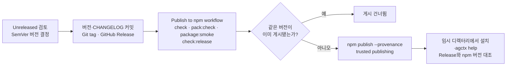

# 릴리스와 저장소 운영

이 문서는 agctx 저장소를 공개 npm 패키지 프로젝트로 관리하는 현재 운영 계약이다. 제품 기능의 정본은 [`product-direction.md`](product-direction.md), 현재 코드 구조의 정본은 [`architecture.md`](architecture.md), 외부 근거는 [`references.md`](../references.md)에 둔다. 문서 변경 절차는 [구현 계약 및 문서 규칙](../discussion/architecture/topics/implementation-contracts.md)을 따른다.

<!-- agctx-doc-sources: package.json, tsconfig.json, .github/workflows, .github/dependabot.yml, .github/CODEOWNERS, tools/build.ts, tools/check-docs.ts, tools/package-smoke.ts -->
<!-- agctx-doc-sources-sha256: 9e29dc5231544e190a081c31a1913f722ba5aefe040e00141cc23e7a69294a5a -->

`agent-context-manager`는 공개 GitHub 저장소와 npm registry로 배포하는 패키지다. 이 문서는 이후 릴리스도 같은 품질·보안 계약으로 운영하기 위한 기준이다.

## 품질 게이트

변경을 올리기 전의 검사 순서와 평가 작성 방법은 [테스트와 품질 게이트](testing.md)에, 문서 소스 해시 게이트와 근거 게이트는 [문서 게이트](doc-gate.md)에 있다.

## 릴리스

### 릴리스 전 점검

- GitHub repository가 Public이며 README·License·Contributing·Code of Conduct·Security가 실제 화면에서 노출되는지 확인한다.
- `repository.url`이 실제 공개 저장소 URL과 일치하는지 확인한다.
- npm에서 패키지 이름·scope 소유권과 public package 게시 권한을 확인한다.
- npm trusted publisher가 정확한 저장소와 `.github/workflows/publish.yml`에 연결되어 있는지 확인한다.
- 배포 전에 `pnpm run check`, `pnpm run pack:check`, `pnpm run package:smoke`, `pnpm run audit`를 실행한다.
- `skills/`의 파일 구성을 바꾸거나 스모크가 쓰는 skills CLI 버전을 올리면 `node tools/skills-smoke.ts`로 설치 위치를 확인한다. npm에서 skills CLI를 받아 실행하므로 `pnpm run check`에는 넣지 않는다.
- `npm publish` 자체도 `prepublishOnly`에서 `pnpm run check`와 `pnpm run pack:check`를 실행하므로, 검증되지 않은 로컬 게시를 기본적으로 차단한다.
- Release tag가 `package.json` 버전 및 `CHANGELOG.md` 항목과 일치하는지 `pnpm run check:release -- v<version>`으로 확인한다.

이 항목은 workflow 파일만으로 자동 완료되지 않는다. GitHub·npm 관리 화면의 실제 설정과 최초 게시 결과를 릴리스 기록에 남긴다.

Release를 게시하면 workflow가 검증을 다시 실행하고 같은 버전이 없을 때만 provenance와 함께 게시한다. 게시 뒤 확인은 사람이 한다.

1. 변경 내용을 `CHANGELOG.md`의 `Unreleased`에서 검토하고 버전을 Semantic Versioning에 맞게 결정한다.
2. 버전·변경 이력을 커밋하고 해당 버전의 Git tag와 GitHub Release를 만든다.
3. Release가 published 상태가 되면 `Publish to npm` workflow가 `check`·`pack:check`·`package:smoke`와 릴리스 버전 계약 `check:release`를 다시 실행한다.
4. 검사가 통과하고 같은 버전이 registry에 없으면 npm trusted publishing과 provenance를 사용해 `agent-context-manager`를 public으로 배포한다.
5. 배포 후 `npm install -g agent-context-manager`와 `agctx help`를 별도 임시 디렉터리에서 확인하고, GitHub Release와 npm 버전이 일치하는지 확인한다.

배포 workflow에는 장기 npm 토큰을 저장하지 않는다. npm trusted publishing을 사용할 수 없는 환경에서는 별도 보안 검토 없이 토큰 방식을 추가하지 않는다.

### 새 패키지 이름의 첫 게시

신뢰된 게시는 레지스트리에 이미 있는 패키지에만 연결할 수 있어서, 새 이름의 첫 버전은 위 workflow로 게시할 수 없다([외부 근거](../references.md#공개-npmgithub-저장소-운영-근거)). 첫 버전은 한 번만 아래 순서로 게시한다. Release를 먼저 만들면 workflow가 인증 없이 게시하려다 실패하므로 순서를 지킨다.

1. 버전·변경 이력 커밋을 main에 병합한다.
2. 패키지 소유자가 `npm login`으로 로그인한 컴퓨터에서 병합된 main을 체크아웃하고 `npm publish`를 실행한다. `prepublishOnly`가 `check`와 `pack:check`를 먼저 실행한다. 이 버전에는 provenance가 없다. 계정이 쓰기 작업에 2단계 인증을 요구하면 레지스트리에 올리기 직전에 브라우저 인증이나 일회용 비밀번호를 묻으므로 대화형 터미널에서 실행한다. 대화형이 아닌 셸에서는 인증 주소만 출력하고 `EOTP`로 멈춘다(npm 11.19.0에서 2026-09-16 실측, 아무것도 게시되지 않음).
3. npmjs.com 패키지 설정의 Trusted Publisher에 `IsthisLee/agent-context-manager` 저장소와 `publish.yml`을 연결한다. 명령줄로는 `npm trust github --repo IsthisLee/agent-context-manager --file publish.yml --allow-publish`이며 계정 2단계 인증이 필요하다. 화면에서 연결할 때는 허용 동작(allowed actions)에 `npm publish`도 선택한다. 2026-09-03 이후 만든 설정은 기본으로 `npm stage publish`만 허용해서, workflow의 `npm publish`가 provenance 서명까지 마친 뒤 `403 Forbidden … OIDC permission denied for this action`으로 거부된다(v0.3.1에서 실측). 설정을 고친 뒤에는 Release를 다시 만들지 않고 실패한 workflow를 다시 실행한다.
4. 같은 패키지 설정의 Publishing access에서 "Require two-factor authentication and disallow tokens"를 골라 토큰 게시를 막는다.
5. 같은 버전의 Git tag와 GitHub Release를 만든다. workflow는 검증을 다시 실행하고, 이미 게시된 버전이므로 게시 단계를 건너뛴다(`.github/workflows/publish.yml:35-47`).
6. 앞 절차의 5번처럼 임시 디렉터리에서 설치와 `agctx help`를 확인한다.

그다음 버전부터는 앞 절차의 1~5번대로 GitHub Release만 게시한다.

## 의존성과 보안

- Dependabot은 npm 의존성과 GitHub Actions 참조를 주기적으로 확인한다.
- 공개 저장소의 PR에는 Dependency Review를 활성화하고, 취약한 의존성 도입 여부를 검토한다.
- CodeQL workflow는 JavaScript 변경을 security-extended 쿼리로 분석한다.
- OpenSSF Scorecard workflow는 공급망 보안 지표를 주기적으로 계산해 결과를 code scanning에 업로드하고 OpenSSF API에 게시하며 README의 자동 계산 점수 뱃지를 갱신한다. 뱃지는 기본 브랜치에서 workflow가 처음 성공적으로 게시된 뒤에 값을 표시한다.
- GitHub의 secret scanning, push protection, code scanning을 저장소 설정에서 활성화한다.
- `SECURITY.md`의 비공개 신고 절차를 통해 취약점을 접수한다.
- GitHub Actions는 필요한 최소 권한만 선언한다. 배포 workflow와 Scorecard workflow가 `id-token: write`를 사용한다(각각 npm trusted publishing과 결과 게시).
- 모든 외부 GitHub Action은 검토한 버전의 불변 commit SHA로 고정하고 버전 주석을 함께 둔다. 모든 checkout 단계에서 `persist-credentials: false`를 사용해 workflow 작업 공간에 GitHub token을 유지하지 않는다.
- [`CODEOWNERS`](../../.github/CODEOWNERS)는 기본 브랜치와 저장소 자동화 변경의 기본 검토 소유자를 지정한다. 실제 병합 보호와 required review 적용은 GitHub 저장소 설정에서 별도로 활성화한다.

## 기여와 변경 관리

기여자는 [`CONTRIBUTING.md`](../../CONTRIBUTING.md), [`CODE_OF_CONDUCT.md`](../../CODE_OF_CONDUCT.md), [`SECURITY.md`](../../SECURITY.md)를 따른다. 사용자에게 보이는 CLI·TUI·파일 형식·설치·보안 변경은 README, 관련 정본 문서, `CHANGELOG.md`를 같은 변경에서 갱신한다. 되돌리기 어려운 공개 계약은 [`docs/adr/`](../adr/)에 기록한다.

## 운영상 한계

GitHub 저장소 설정(브랜치 보호, required status checks, secret scanning, code scanning, npm trusted publisher 연결)은 파일만으로 완성되지 않으며 저장소 관리자 설정이 필요하다. workflow 파일은 그 설정을 사용할 수 있는 실행 경로를 제공하지만 설정이 실제로 켜졌다는 증거는 GitHub 저장소 상태에서 별도로 확인해야 한다. 특히 CI의 `pnpm run check` 실패가 병합을 실제로 막으려면 브랜치 보호에서 이 검사를 required status check로 지정해야 한다.
