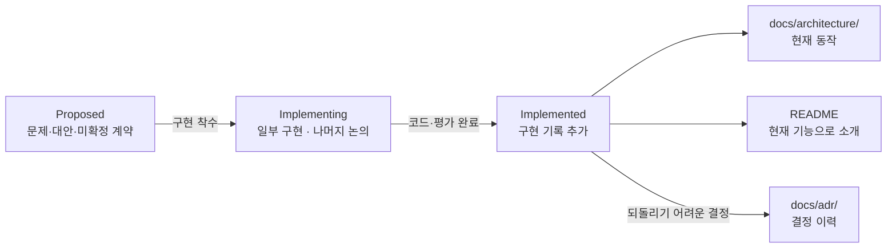

# 설계 논의

제품 방향을 구현 단계로 분해하고, 아직 결정이 필요하거나 구현 중인 계약을 기록한다. 확정된 제품 방향은 [`../product-direction.md`](../product-direction.md), 현재 동작은 [`../architecture/`](../architecture/)에 둔다.

## 논의 원칙

- 문서에 `현재 구현`과 `목표 계약`을 명시적으로 구분한다.
- 목표 계약은 코드·평가가 완료되기 전까지 현재 기능처럼 README에 쓰지 않는다.
- CLI 명령, 파일 형식, 프로필·프로젝트 소유권, 동기화·충돌 정책은 구현 전에 이곳에서 결정한다.
- 채택된 되돌리기 어려운 결정은 ADR로 승격한다.
- 구조·흐름·상태 변화·데이터 관계는 그림으로 먼저 보여 준다. 그림 형식과 작성 기준은 루트 [`AGENTS.md`](../../AGENTS.md)의 문서 규칙을 따른다.

## 문서 상태의 흐름

토픽 문서는 상태에 따라 내용이 머무는 곳이 달라진다.

토픽은 `Proposed`로 시작해 일부가 구현되면 `Implementing`, 코드와 평가가 끝나면 `Implemented`가 된다. 구현된 사실은 `docs/architecture/`와 README로 옮기며 되돌리기 어려운 결정은 ADR로 남긴다. 논의 문서에는 제안과 구현 기록이 이력으로 남는다.
