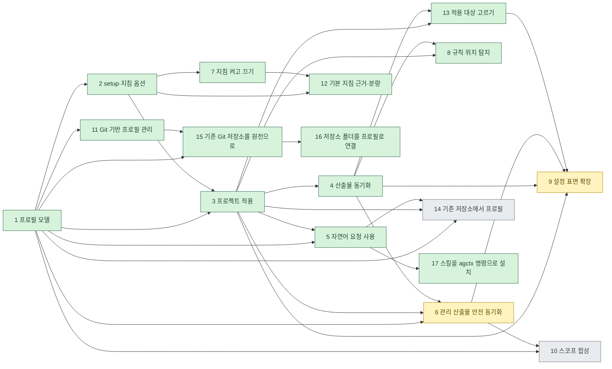

# agctx 아키텍처 구현 계획

이 문서는 제품 방향을 실제 구현 단계로 분해한 작업 지도다. 각 단계는 선행 계약·코드·평가·문서 갱신을 완료한 뒤 다음 단계로 넘어간다.

저장소 자체의 운영(문서 게이트·CI·PR 리뷰) 논의는 [저장소 운영 논의](../repository/README.md)에 둔다.

논의 문서의 명령·파일 이름은 2026-09-15 이름 변경([ADR 0013](../../adr/0013-rename-agent-context-manager.md))에 맞춰 고쳤다. `bin/*.mjs` 같은 코드 인용은 그 문서를 쓸 당시의 코드를 가리킨다.

## 단계

<!-- agctx:generated:topics:start -->
| 단계 | 주제 | 중요도 | 선행 단계 | 핵심 결과 | 상태 |
| --- | --- | --- | --- | --- | --- |
| 1 | [프로필 모델과 저장소](topics/profile-model.md) | Critical | — | named 프로필, scope, 경로, 소유권 계약 | Implemented |
| 2 | [setup과 지침 옵션](topics/setup-and-guidance.md) | High | 1 | 선택 가능한 규칙 preset과 프로필 `AGENTS.md` | Implemented |
| 3 | [프로젝트 적용](topics/project-application.md) | Critical | 1·2 | 선택 프로필을 프로젝트에 적용, 도메인 지침 분리 | Implemented |
| 4 | [에이전트 산출물 동기화](topics/agent-sync.md) | High | 3 | 도구별 포인터 생성·갱신·프로젝트 규칙 보존 | Implemented |
| 5 | [자연어 요청을 통한 agctx 사용](topics/agent-mediated-usage.md) | High | 1·3 | 사람용 TUI와 에이전트용 비대화형 CLI의 책임·안전 경계 | Implemented |
| 6 | [agctx 관리 산출물의 안전한 동기화](topics/managed-artifact-safety.md) | Critical | 1·3·4 | 관리 영역만 갱신하고 사용자 변경·충돌·복구를 보장하는 동기화 | Implementing |
| 7 | [지침 항목 켜고 끄기](topics/guidance-level-semantics.md) | Medium | 2 | 지침 항목마다 on·off 두 값만 받고, 켠 항목만 산출물에 넣음 | Implemented |
| 8 | [에이전트 규칙 위치 탐지](topics/agent-rule-discovery.md) | Medium | 3·4 | 적용 전 기존 규칙 위치를 스캔·보고해 가시성·동의 제공 | Implemented |
| 9 | [프로필 설정 표면 확장](topics/profile-config-surface.md) | Critical | 3·4·6·13 | 프로필이 MCP·skills·subagents·hooks까지 담고 멀티포맷 안전 병합으로 동기화 | Implementing |
| 10 | [스코프 확장과 지침 합성](topics/scope-composition.md) | Medium | 1·6 | 사용자 정의·공유 가능한 지침 계층과 프로젝트의 다계층 상속·병합 | Proposed |
| 11 | [Git 기반 프로필 관리](topics/git-profile-management.md) | Critical | 1 | 표준 Git 원격을 통한 프로필 공유·확인·안전한 갱신 | Implemented |
| 12 | [기본 지침의 근거 기준과 분량 예산](topics/guidance-evidence-and-budget.md) | High | 2·7 | 근거가 확인된 문장만 기본 지침에 두고 분량 예산·경고로 에이전트가 읽는 범위를 지킴 | Implemented |
| 13 | [적용할 에이전트와 대상 종류 고르기](topics/apply-selection.md) | High | 3·4 | 저장소마다 적용할 에이전트와 대상 종류를 골라 기록하고 sync·PR·CI가 같은 선택을 재현 | Implemented |
| 14 | [기존 저장소에서 프로필 만들기](topics/profile-import.md) | Medium | 1·3·5 | 기존 컨텍스트 파일에서 고른 부분을 복사해 프로필을 만들고, 초안은 사용자의 에이전트가 agctx 스킬 안내로 만듦 | Proposed |
| 15 | [기존 Git 저장소를 프로필 원천으로 쓰기](topics/existing-repository-source.md) | High | 1·11 | 규칙 파일을 옮기지 않고 `profile.json` 하나만 더해 기존 규칙 저장소를 `profile clone`으로 받고 `pull`로 따라감 | Implemented |
| 16 | [기존 저장소 폴더를 프로필로 연결하기](topics/profile-link.md) | High | 1·11·15 | 규칙 저장소 폴더에서 `profile link` 한 번으로 `profile.json`을 만들고 폴더를 보관함에 연결해 커밋 없이 적용 | Implemented |
| 17 | [에이전트 스킬을 agctx 명령으로 설치하기](topics/skill-install.md) | High | 5 | CLI 패키지에 든 스킬을 `agctx install`이 설치된 에이전트의 스킬 폴더에 복사하고, CLI와 버전이 어긋나면 모든 명령이 알림 | Implemented |
| — | [구현 계약 및 문서 규칙](topics/implementation-contracts.md) | — | — | 단계별 구현·검증·문서 정합성 규칙 | Active process |
<!-- agctx:generated:topics:end -->

> **중요도**는 각 토픽의 제안 요약을 요약한 값이다: Critical(다른 단계의 기반·데이터 안전 경계), High(사용자 경계·전달 경로), Medium(계약 확장이나 기존 모델 유지). **선행 단계**는 해당 제안이 의존하는 단계 번호다. 근거와 세부는 각 토픽 문서의 `## 제안 요약`을 본다.

표와 아래 그림의 색은 [`topics.json`](../topics.json)에서 `node tools/generate-discussion-status.ts`로 생성한다. 상태를 바꾸려면 표가 아니라 그 파일을 고친다.

## 단계 의존 관계

화살표는 선행 단계에서 후속 단계로 향한다. 초록은 Implemented, 노랑은 Implementing, 회색은 Proposed 단계다. 9단계와 10단계는 6단계에 의존하므로 6단계가 Implemented가 되기 전에는 착수하지 않는다. 13단계는 2026-09-16 제품 소유자 결정으로 9단계의 MCP보다 먼저 구현한다.

## 공통 구현 규칙

- 프로필의 공통 지침과 프로젝트의 도메인 지침은 서로 다른 저장 영역에 둔다.
- `AGENTS.md`는 공통 지침의 정본이다. 도구별 파일은 포인터 또는 생성 산출물이다.
- `profile setup`은 프로필만 변경하고 프로젝트 파일을 변경하지 않는다.
- `apply`·`profile sync`는 사용자가 명시한 프로젝트에만 작동한다. `AGENTS.md`의 프로필 소유 영역과 에이전트별 산출물의 agctx 관리 블록만 갱신하고 각 사용자 영역은 보존한다. 적용·동기화 전 `--dry-run` 계획을 확인할 수 있으며, 기록된 관리 영역을 수동 수정하면 중단한다.
- 외부 에이전트 런타임을 실행·파싱·래핑하지 않는다.
- TUI는 사람의 탐색·승인을 위한 경로로, 에이전트·CI는 명시적 인자를 사용하는 비대화형 CLI 경로로 구분한다. 자연어 해석은 호출하는 에이전트의 책임이며, 대상·범위·파괴적 승인 여부를 추측하지 않는다.

## 진행 순서

1. 프로필의 파일 형식과 경로를 확정하고 생성·목록·선택 평가를 작성한다.
2. `profile setup`의 비대화형 옵션과 기본값을 확정하고 규칙 preset 평가를 작성한다.
3. 프로젝트 적용과 도메인 지침 보존을 구현한다.
4. 에이전트별 산출물과 동기화·drift 검사를 구현한다.
5. 매 단계마다 `docs/product-direction.md`, README, workflow, CHANGELOG를 정합화한다.
