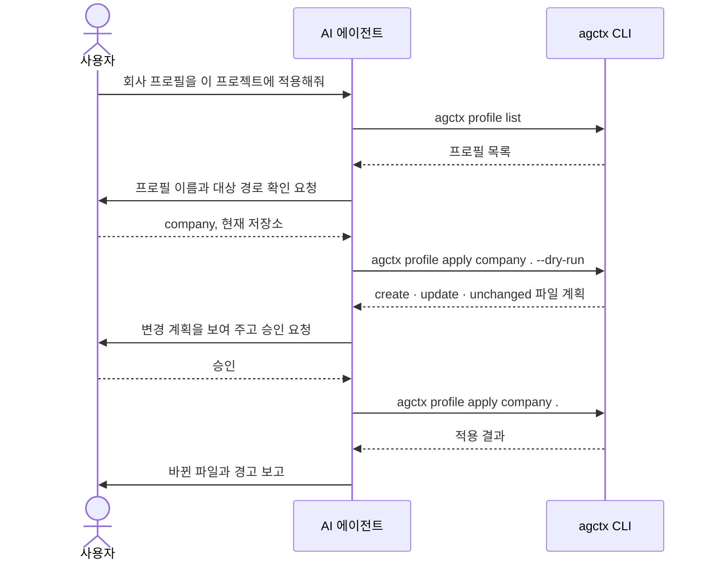
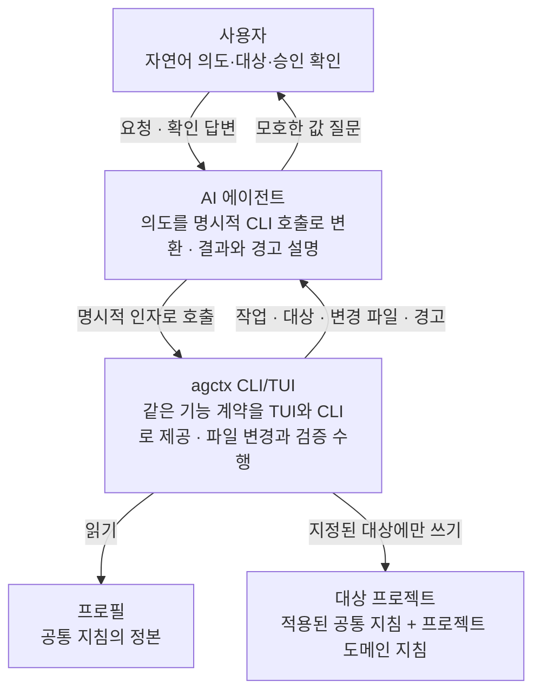

# 자연어 요청을 통한 agctx 사용

<!-- agctx:generated:status:start -->
**상태:** Implementing
<!-- agctx:generated:status:end -->

## 제안 요약

### 목적과 이유

| 항목 | 내용 |
| --- | --- |
| 제안 목표 | 사용자가 자연어로 요청해도 AI 에이전트가 agctx 기능을 안전하고 재현 가능하게 실행할 수 있는 사용 경계를 정의한다. |
| 제안 이유 | 현재 TUI는 사람에게 친화적이지만, 에이전트가 프롬프트를 안정적으로 선택·입력·해석하는 인터페이스는 아니다. 프로필 이름, 프로젝트 경로, 적용 범위, 변경 승인 여부를 자연어만으로 추론하게 하면 잘못된 대상 변경·중단·재실행이 발생할 수 있다. |

### 범위와 우선순위

| 항목 | 내용 |
| --- | --- |
| 대상 계층 | 사용자·AI 에이전트·agctx CLI/TUI·프로필·대상 프로젝트 |
| 결정할 것 | AI 에이전트용 비대화형 CLI 계약, 명시적 대상 지정, 기계 판독 출력, 승인·dry-run·종료 코드, 현재 프로젝트 자동 감지의 허용 범위 |
| 중요도 | High — 사용자 경험과 안전한 자동화의 경계를 결정하지만, 현재 프로필 모델과 TUI를 폐기하지 않는다. |

### 의존성과 실행 순서

| 항목 | 내용 |
| --- | --- |
| 선행 작업 | 현재 CLI 명령·TUI·`agctx profile list`의 기능 범위와 파일 소유권 계약 |
| 선행 제안 | [구현 계약 및 문서 규칙](implementation-contracts.md), [프로젝트 적용](project-application.md), [프로필 모델과 저장소](profile-model.md) |
| 후속 제안 | 비대화형 실행 계약·기계 판독 결과 스키마·적용 및 동기화 복구 정책 |
| 연관 제안 | [에이전트 산출물 동기화](agent-sync.md), [setup과 지침 옵션](setup-and-guidance.md) |
| 후속 작업 | 실제 배포 패키지 기준으로 에이전트가 각 명령을 호출하는 평가 시나리오를 추가하고, 안전한 오류·승인 흐름을 확정한다. |
| 권장 다음 작업 | 노출과 트리거 계약은 [ADR 0029](../../../adr/0029-agent-surface-contract.md)로 확정해 구현했다. 남은 것은 명령별 `data` 필드의 스키마를 문서로 정하는 일과, 배포한 npm 패키지를 임시 프로젝트에 설치해 에이전트가 스킬대로 agctx를 호출하는 시나리오 평가다. |

## 목차

- [현재 사용 방식](#현재-사용-방식)
- [자연어 요청에서 생기는 문제](#자연어-요청에서-생기는-문제)
- [계층별 책임](#계층별-책임)
- [권장 방향](#권장-방향)
- [비범위와 금지할 접근](#비범위와-금지할-접근)
- [결정·검증 항목](#결정검증-항목)
- [구현 기록](#구현-기록)

## 현재 사용 방식

현재 agctx는 사람과 에이전트가 사용할 수 있는 두 인터페이스를 제공한다.

| 사용자 | 권장 경로 | 역할 |
| --- | --- | --- |
| 사람 | `agctx`의 TUI, 필요하면 `agctx profile list` 관리 메뉴 | 프로필 선택, 지침 설정, 프로젝트 선택, 변경 승인 |
| AI 에이전트·CI | 명시적 인자와 옵션을 사용하는 CLI | 정해진 프로필·프로젝트를 대상으로 명령 실행, 결과 확인 |

TUI는 프롬프트와 선택 메뉴를 통해 사람의 판단을 돕는다. AI 에이전트가 자연어 요청을 받았다고 해서 TUI의 화살표 키·stdin 입력을 대신 조작하는 것이 현재의 안정적인 계약은 아니다. 에이전트는 사용자의 요청을 해석한 뒤 필요한 값을 확인하고, 현재 제공되는 CLI 명령을 명시적인 인자와 함께 호출해야 한다.

예를 들어 사용자가 “회사 프로필을 이 프로젝트에 적용해줘”라고 요청하면 에이전트는 회사 프로필의 정확한 이름과 대상 프로젝트 경로를 확인한 뒤, 적용 결과를 검토할 수 있는 명령으로 실행해야 한다. 프로필이나 경로를 추측해 조용히 선택하는 것은 agctx의 책임 경계가 아니다.

현재 CLI만으로 이 요청을 처리하면 다음 순서가 된다.

agctx가 관여하는 부분은 CLI 호출 세 번의 입력과 출력뿐이다. 프로필 이름과 대상 경로를 확인하는 일과 변경 계획을 승인받는 일은 에이전트와 사용자 사이에서 일어나며 agctx는 이를 대신 추론하지 않는다.

## 자연어 요청에서 생기는 문제

### 대상과 범위의 모호성

자연어의 “이 프로젝트”, “팀 프로필”, “동기화해줘”는 현재 작업 디렉터리, 프로필의 scope, 이미 적용된 프로젝트 중 무엇을 뜻하는지 명확하지 않을 수 있다. 잘못 해석하면 의도하지 않은 프로젝트의 `AGENTS.md`나 에이전트별 포인터가 변경된다.

### 대화형 입력과 실행 환경의 불일치

TUI는 TTY, stdin, 터미널 크기, 키 입력을 전제로 한다. 에이전트 실행·CI·로그 수집 환경은 비대화형인 경우가 많아 프롬프트가 멈추거나, 화면 문자열을 잘못 읽거나, 사용자의 승인 없이 다음 단계로 진행할 수 있다.

### 안전한 승인과 재실행

프로젝트 적용·동기화·프로필 삭제는 파일을 변경하거나 삭제한다. 자연어 요청만으로 승인 여부를 추론하면 위험하다. 실패 후 재실행했을 때 부분 변경을 다시 덮어쓰지 않도록 변경 목록, 소유권, 멱등성, 종료 상태가 분명해야 한다.

### 증거 확인의 부족

“적용했다”는 자연어 응답만으로는 어떤 프로필과 프로젝트를 대상으로 어떤 파일이 바뀌었는지 알 수 없다. 에이전트가 결과를 사용자에게 설명하려면 명령 결과에 작업 종류, 대상, 변경 파일, 경고, 실패 원인이 구조적으로 남아야 한다.

### 런타임 결합 위험

이 문제를 해결하기 위해 Claude Code·Codex 등의 CLI를 agctx가 다시 실행·파싱·래핑하는 런타임을 만들면, 각 도구의 플래그·출력·인증·스트리밍 형식 변화에 패키지가 종속된다. agctx는 에이전트 런타임을 통제하는 제품이 아니라, 에이전트가 참조할 프로젝트 개발 지침을 관리하는 패키지이므로 이 결합은 방향과 맞지 않는다.

## 계층별 책임

자연어는 사용자와 AI 에이전트 사이에서만 오간다. agctx CLI/TUI는 명시적 인자만 받아 실행한다. 적용·동기화에서 프로필은 읽기만 하고 지정된 프로젝트에만 쓴다.

- 사용자는 자연어 목표, 프로필 선택, 대상 프로젝트, 실제 변경 승인 여부를 결정한다.
- AI 에이전트는 모호한 값을 추측하지 않고 질문하거나 확인하며, TUI 화면을 흉내 내기보다 명시적 CLI를 호출한다.
- agctx는 지정된 대상 밖으로 나가지 않고, 프로필의 공통 지침과 프로젝트의 도메인 지침을 섞어 정본을 오염시키지 않는다.
- 프로필은 에이전트가 자연어를 이해하도록 만드는 프롬프트 저장소가 아니라 공통 개발 지침의 소유 경계다.
- 대상 프로젝트는 비즈니스 코드와 도메인 지침을 소유한다.

## 권장 방향

1. **TUI는 사람용 기본 경험으로 유지한다.** `agctx` 단독 실행, `profile list`의 선택·관리 메뉴, 경로 선택기는 사람이 프로필을 탐색하고 승인하기에 적합하다.
2. **에이전트·CI에는 비대화형 CLI를 기본 계약으로 둔다.** 프로필 이름, 프로젝트 경로, 변경 의도가 필요한 명령은 명시적 인자를 요구하고, 값이 없을 때 대화형 프롬프트로 몰래 전환하지 않는다.
3. **자연어 해석과 파일 변경을 분리한다.** 자연어를 명령으로 바꾸는 일은 호출자인 AI 에이전트의 책임이며, agctx는 해석된 명령의 대상·옵션·파일 소유권을 검증한다.
4. **결과를 기계와 사람이 모두 읽을 수 있게 한다.** 기본 출력은 간결한 요약으로 제공하되, 안정적인 `--json` 결과와 종료 코드의 필요성을 별도 계약으로 검토한다. 출력 스키마를 확정하기 전에는 화면 텍스트 파싱을 호환성 계약으로 삼지 않는다.
5. **변경 명령은 확인 가능한 단계를 갖는다.** 적용·동기화·삭제에는 dry-run, 변경 목록, 명시적 승인, 멱등성 중 어떤 조합을 보장할지 결정하고, 위험한 동작은 이름·대상·승인을 생략한 자동 실행을 허용하지 않는다.
6. **현재 작업 디렉터리 자동 감지는 보조 기능으로만 검토한다.** 사용자가 `.` 또는 명시적 프로젝트 식별자를 제공한 경우처럼 경계가 분명할 때만 편의 기능으로 삼고, 프로필·scope·프로젝트를 광범위하게 검색해 임의 선택하지 않는다.
7. **공통 기능은 인터페이스 동등성 계약을 따른다.** AI 호출에 CLI만 추가하더라도 같은 기능이 TUI와 `agctx profile list` 관리 메뉴에서 누락되지 않는지 판단한다. 다만 비대화형 실행·JSON 출력처럼 사람 메뉴에 부적합한 표현은 공통 기능의 안전한 보조 인터페이스로 예외를 명시할 수 있다.

## 비범위와 금지할 접근

- agctx가 사용자의 자연어를 직접 받는 상주 데몬이나 자체 에이전트 런타임을 만들지 않는다.
- pseudo-TTY로 TUI를 자동 조작하는 방식을 AI 통합의 기본 경로로 삼지 않는다.
- 프로필 이름, scope, 프로젝트 경로, 삭제 승인 여부를 불완전한 자연어에서 임의로 추론하지 않는다.
- 사용자 프로젝트를 몰래 스캔하거나, 현재 디렉터리와 가장 가까운 프로필을 자동 선택하지 않는다.
- AI 에이전트가 실행했다는 이유만으로 `--yes` 같은 파괴적 승인 옵션을 자동 부여하지 않는다.

## 결정·검증 항목

채택 전에 다음 항목을 별도 계약과 평가로 확정한다.

- 비대화형 모드의 명령별 필수 인자와 프롬프트 금지 규칙
- 표준 종료 코드와 `--json` 출력 필드·버전 호환 정책
- `profile apply`, `profile sync`, `remove`의 dry-run·승인·멱등성·부분 실패 처리
- 프로필·scope·프로젝트를 확인하는 방법과 안전한 자동 감지의 조건
- 자연어를 명령으로 변환하는 AI 에이전트의 책임과 사용자가 최종 승인해야 하는 변경
- 배포된 npm 패키지를 별도 임시 프로젝트에서 실행하는 에이전트 시나리오 평가
- TUI·CLI·`agctx profile list`의 기능 동등성 및 비대화형 예외를 검사하는 registry 평가

이 논의가 채택되면 `docs/reference/cli.md`, `docs/README.md`, `docs/contributing/architecture.md`, 관련 ADR을 같은 변경에서 갱신한다. 현재 문서는 “자연어만으로도 agctx가 자동으로 모든 결정을 대신한다”는 기능을 선언하지 않는다.

## 구현 기록

#### 구현 기록: 비대화형 명령 계약 (2026-09-15)

* **결정:** [ADR 0016](../../../adr/0016-command-contract.md). 모든 명령이 같은 종료 코드와 `--json` 결과 문서를 쓴다. 파일을 바꾸거나 원격으로 보내는 명령은 터미널이 아니면 `--yes`를 요구하고, 오류는 다음에 실행할 명령을 함께 출력한다.
* **구현:** `src/commands/registry.ts`(명령 등록부), `src/commands/options.ts`(옵션 검사·확인), `src/commands/output.ts`(stdout·stderr 분리와 결과 문서), `src/commands/cli.ts`(알 수 없는 명령 제안·오류 출력), `src/shared/errors.ts`(종료 코드). 사용법은 [CLI Reference](../../../reference/cli.md#공통-규칙)에 있다.
* **평가:** `evals/command-contract.test.ts` 10개, `evals/interface-parity.test.ts` 4개, `evals/messages.test.ts` 2개.
* **계획과 달라진 점:**
  - "결정·검증 항목"의 명령별 필수 인자와 프롬프트 금지 규칙은 명령마다 따로 정하지 않고 등록부의 위치 인자와 공통 확인 규칙으로 정했다.
  - 권장 방향 7번의 예외는 등록부의 표면으로 정했다. `profile` 명령만 세 경로가 필수이고 `repository`·`global` 명령은 CLI만 필수다.
  - `profile create`·`setup`이 stdin 줄 입력을 받는 기존 동작은 `--json`이 없을 때만 유지했다.
* **제약:** 명령별 `data` 필드의 스키마 문서는 아직 없다. `<project>`를 생략하면 현재 폴더를 쓰는 기존 동작은 그대로다. 배포 패키지를 에이전트가 호출하는 시나리오 평가는 아직 없다.
* **다음 단계:** 에이전트용 스킬과 지침 전달 확인 명령(종료 코드 4)을 설계한다.

#### 구현 기록: 에이전트용 스킬과 지침 전달 확인 (2026-09-16)

* **결정:** [ADR 0019](../../../adr/0019-explain-verify-and-agent-skills.md). 저장소에 스킬 두 개를 둔다. 진단·갱신용 `agctx`는 에이전트가 스스로 쓸 수 있고, 프로필 게시·PR용 `agctx-author`는 사용자가 이름으로 부를 때만 쓴다(Claude Code `disable-model-invocation: true`, Codex `allow_implicit_invocation: false`). 두 스킬은 쓰기 명령 앞에 `--dry-run` 결과를 보여 주고 사용자가 승인한 뒤에만 `--yes`를 붙이게 한다. 지침 파일이 에이전트에 닿는지는 `explain`(규칙 기반 판정)과 `verify`(세션 기록 판독, 요청하면 probe)로 확인하며, 받지 못한 파일이 있으면 종료 코드 4로 끝낸다.
* **구현:** `skills/agctx/SKILL.md`, `skills/agctx-author/SKILL.md`, `skills/agctx-author/agents/openai.yaml`, `tools/generate-skills.ts`(등록부에서 명령 목록 생성), `tools/skills-smoke.ts`(skills CLI 설치 확인), `src/explain.ts`, `src/verify/`. 사용법은 [CLI Reference](../../../reference/cli.md#verify)와 [에이전트에게 agctx를 맡기기](../../../guides/agent-skills.md)에 있다.
* **평가:** `evals/skills.test.ts` 3개, `evals/explain.test.ts` 4개, `evals/verify.test.ts` 6개. `node tools/skills-smoke.ts`로 skills CLI 1.5.26의 설치 위치를 확인했고, 설치된 Codex·Claude Code·Antigravity CLI로 `verify --probe`를 실행했다([외부 근거](../../../references.md#에이전트-지침-로드와-전달-확인-근거)).
* **계획과 달라진 점:**
  - "런타임 결합 위험"은 에이전트 CLI를 실행·파싱·래핑하는 런타임을 경계했다. `verify --probe`는 에이전트 CLI를 실행하고 출력에서 표지 줄만 찾지만, 사용자가 요청할 때 도구를 끄고 임시 사본에서 한 번만 실행하며 대화에는 끼어들지 않는다. CLI 옵션이 바뀌면 probe만 69로 실패하고 다른 명령에는 영향이 없다.
  - 스킬 본문 가운데 명령 목록만 등록부에서 만들고, 절차와 안전 규칙은 사람이 쓴다. 전부 생성하면 안전 규칙이 명령마다 반복돼 스킬이 길어지기 때문이다.
  - 실제 probe에서, 하위 폴더에서 시작한 Claude Code가 루트 `CLAUDE.md`의 `@AGENTS.md`를 승인 전에는 읽지 않았다. 그래서 `explain`이 이 파일을 `conditional`로 판정하고 경고하도록 바꿨다.
* **제약:** 배포 패키지를 에이전트가 스킬로 호출하는 시나리오 평가는 아직 없다. Antigravity 세션 기록은 읽지 못해 probe로만 확인한다. 명령별 `data` 필드의 스키마 문서도 아직 없다.
* **다음 단계:** 배포 패키지 기준 에이전트 시나리오 평가와 `data` 스키마 문서를 만든다.

#### 구현 기록: 에이전트 표면을 계약 아래 둠

**2026-09-18.** 상태는 Implementing 그대로다. 남은 것은 `data` 스키마와 시나리오 평가다.

- **확정:** [ADR 0029](../../../adr/0029-agent-surface-contract.md)가 에이전트를 CLI·TUI와 같은 계약 아래 두는 세 번째 표면으로 정했다. 제안과 달라진 점은 계약의 범위다. 이 문서는 "에이전트용 비대화형 CLI 계약"까지 다뤘고, ADR 0029는 거기에 **어느 명령을 에이전트에 노출하는가**와 **에이전트가 그 명령을 부를 이유가 있는가**를 더했다.
- **발견:** 스킬 소속이 `tools/generate-skills.ts`에 손으로 박힌 id 아홉 개였다. 그래서 `agctx` 스킬이 모델 호출 가능한데도 `profile push`·`repos pr`까지 싣고 있었고, 반대로 `profile create`는 명령 목록에 있으면서 시나리오가 없어 "프로필 만들어줘"가 스킬에 닿지 않았다. 에이전트는 `description`만 보고 스킬을 부를지 정하기 때문이다.
- **구현:** 등록부에 `AgentPolicy`(`auto`·`ask`·`never`)와 `agentPolicy(command)`를 넣었다. 정책은 `changes`에서 유도하고 예외 셋(`profile remove`·`config lang`·`help`)만 `agent: 'never'`로 적는다. `generate-skills.ts`가 정책으로 스킬 목록을 고른다.
- **실측:** `agctx` 스킬의 명령이 스물둘에서 **일곱**으로, `agctx-author`가 **열아홉**이 됐다. 시나리오는 각각 여섯과 일곱이다.
- **평가:** `evals/agent-surface.test.ts` 다섯 개가 정책 존재, 바꾸는 명령의 `auto` 금지, 정책에 맞는 스킬 소속, 두 스킬의 시나리오 덮음을 검사한다. 요구가 바뀌어 `evals/skills.test.ts`의 두 평가를 고쳤다.
