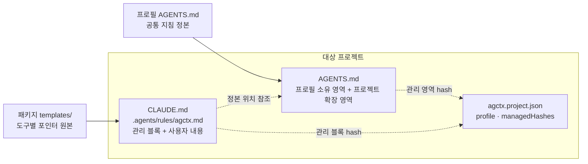

# 에이전트 산출물 동기화

**상태:** Implemented

## 제안 요약

### 목적과 이유

| 항목 | 내용 |
| --- | --- |
| 제안 목표 | 하나의 공통 정본에서 도구별 지침 산출물을 생성하고 변경을 투명하게 동기화한다. |
| 제안 이유 | Claude Code, Codex, Antigravity 등은 서로 다른 지침 파일 위치와 문법을 사용한다. |

### 범위와 우선순위

| 항목 | 내용 |
| --- | --- |
| 대상 계층 | 프로필·agctx CLI·대상 프로젝트·에이전트별 지침 파일 |
| 결정할 것 | 지원 어댑터, 포인터 방식, 생성 파일 소유권, drift 검사, 수동 편집 보호 |
| 중요도 | High — Goal 1-3의 실제 전달 경로 |

### 의존성과 실행 순서

| 항목 | 내용 |
| --- | --- |
| 선행 작업 | 프로젝트 적용 계약 |
| 선행 제안 | [프로젝트 적용](project-application.md) |
| 후속 제안 | 없음 |
| 연관 제안 | [setup과 지침 옵션](setup-and-guidance.md) |
| 후속 작업 | 어댑터별 fixture·생성 파일 manifest·충돌 시각화 평가 |
| 권장 다음 작업 | 지원 대상별 최소 포인터와 실제 해석 가능성 확인 |

## 목표 계약

프로필 `AGENTS.md`가 공통 지침 정본이다. 어댑터 파일은 가능한 경우 정본의 위치를 참조하고, 해당 도구가 참조를 지원하지 않으면 생성된 동기화 산출물로 관리한다.

공통 지침은 프로필 `AGENTS.md` 한 곳에서 온다. 도구별 파일은 패키지 템플릿으로 만든 포인터이며 프로젝트 `AGENTS.md`를 가리킨다. 적용할 때마다 agctx는 각 파일의 관리 영역만 바꾸고 그 hash를 `agctx.project.json`의 `managedHashes`에 기록한다. 파일별 판정 순서는 [agctx 관리 산출물의 안전한 동기화](managed-artifact-safety.md#현재-동작과-위험)에 그려 두었다.

동기화는 프로필 파일과 프로젝트 도메인 지침을 구분한다. 프로필을 업데이트해도 프로젝트의 도메인 규칙을 삭제하지 않는다. `AGENTS.md`는 프로필 소유 영역만 갱신하고 프로젝트 확장 영역은 보존하며, 다른 산출물은 agctx 관리 블록만 갱신한다. 관리 마커가 없는 기존 에이전트 파일도 기존 내용을 보존한 채 관리 블록을 추가하며, `--dry-run`으로 변경 계획을 먼저 확인할 수 있다. `AGENTS.md`의 프로필 영역과 다른 산출물의 관리 블록 hash를 바탕으로 수동 수정 충돌을 감지하고 동기화를 중단한다. 충돌 시각화·복구는 후속 안전 동기화 제안의 범위다.

agctx는 각 에이전트의 모델 호출·인증·세션·런타임을 실행하거나 감싸지 않는다. 담당 범위는 지침 파일을 생성하고 동기화하는 것까지다.

#### 구현 기록: 에이전트별 산출물 동기화

* **결정:** `CLAUDE.md`, `.agents/rules/`, `.cursor/rules/`, `.github/copilot-instructions.md`를 포인터 산출물로 관리한다. 이후 [ADR 0011](../../../adr/0011-supported-agents.md)로 `.cursor/rules/`와 `.github/copilot-instructions.md`는 만들지 않는다.
* **구현:** `profile apply`·`profile sync`가 선택 프로필과 프로젝트 확장 영역을 사용해 산출물을 생성하고, 관리 마커 내부만 갱신한다.
* **평가:** `evals/core.test.mjs`, `evals/sync-merge.test.mjs`에서 산출물과 규칙 보존을 확인.
* **제약:** 각 에이전트가 포인터를 해석하는 방식 자체는 agctx가 보장하지 않는다.
* **다음 단계:** 파일 manifest·충돌 시각화·복구는 현재 기본 동기화 범위에 포함하지 않는 후속 확장이다. 기본 drift 검사는 `agctx.project.json`의 관리 영역 hash로 제공한다.
