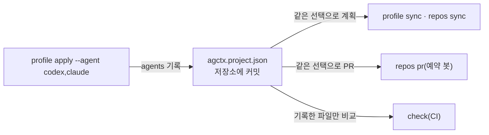

# 적용할 에이전트와 대상 종류 고르기

<!-- agctx:generated:status:start -->
**상태:** Implemented
<!-- agctx:generated:status:end -->

## 제안 요약

### 목적과 이유

| 항목 | 내용 |
| --- | --- |
| 제안 목표 | 저장소마다 프로필을 적용할 에이전트와 대상 종류(규칙·스킬·MCP·subagents·hooks)를 골라 `agctx.project.json`에 기록하고, 나중에 에이전트나 대상을 더하거나 뺄 수 있게 한다. |
| 제안 이유 | 지금 `profile apply`·`sync`는 지원 에이전트 세 곳의 파일을 늘 모두 만든다(`src/project/plan.ts:19`, `:92`). 팀이 쓰지 않는 에이전트의 파일도 저장소에 생긴다. 프로필이 MCP·hooks처럼 에이전트마다 설정 파일이 따로 있는 대상을 담게 되면([ADR 0021](../../../adr/0021-profile-scope-skills-mcp-subagents.md)·[ADR 0022](../../../adr/0022-profile-scope-hooks.md)), 쓰지 않는 에이전트의 설정까지 저장소에 들어간다. 또 hooks는 다른 개발자의 컴퓨터에서 실행될 동작이므로 저장소가 받을지 직접 고를 수 있어야 한다. |

### 범위와 우선순위

| 항목 | 내용 |
| --- | --- |
| 대상 계층 | 사용자·AI 에이전트·agctx CLI/TUI·대상 프로젝트 |
| 결정할 것 | 기록 필드 이름과 기본값, 옵션 형식, 에이전트·대상을 뺄 때 이미 쓴 파일의 처리, 고르지 않은 에이전트를 쓰는 사람에게 알리는 방법, 대상 종류 선택의 구현 시점 |
| 중요도 | High: 에이전트에 규칙이 닿는 경로를 사용자가 바꾸게 되고, 프로필 설정 표면 확장의 에이전트별 파일 위치가 이 기록에 기댄다. |

### 의존성과 실행 순서

| 항목 | 내용 |
| --- | --- |
| 선행 작업 | 연결 파일 목록(`POINTER_TEMPLATES`)과 관리 영역 hash 기록(`managedHashes`) |
| 선행 제안 | [프로젝트 적용](project-application.md), [에이전트 산출물 동기화](agent-sync.md) |
| 후속 제안 | [프로필 설정 표면 확장](profile-config-surface.md): MCP·hooks의 에이전트별 설정 파일을 이 기록대로 쓴다. |
| 연관 제안 | [에이전트 규칙 위치 탐지](agent-rule-discovery.md)의 `explain`, [agctx 관리 산출물의 안전한 동기화](managed-artifact-safety.md) |
| 후속 작업 | 에이전트 선택의 실패 평가(기록 유지, `sync`·`repos pr`의 같은 선택 재현, 뺀 에이전트의 관리 블록 제거)를 먼저 작성한다. |
| 권장 다음 작업 | 에이전트 고르기([ADR 0042](../../../adr/0042-choose-agents-per-repository.md))와 대상 종류 고르기([ADR 0044](../../../adr/0044-mcp-servers-in-profiles.md))를 모두 구현했다. hooks가 구현되면 `include`에 `hooks`를 더하고, 기록이 없을 때 hooks를 빼는 규칙을 그때 구현한다. |

## 목차

- [현재 동작](#현재-동작)
- [에이전트 고르기](#에이전트-고르기)
- [대상 종류 고르기](#대상-종류-고르기)
- [선택을 기록하는 이유](#선택을-기록하는-이유)
- [더하기와 빼기](#더하기와-빼기)
- [계층별 책임](#계층별-책임)
- [비범위](#비범위)
- [결정·검증 항목](#결정검증-항목)

## 현재 동작

`profile apply`는 적용할 에이전트를 묻지 않는다. 계획 단계는 `AGENTS.md`를 계획한 뒤 연결 파일 목록의 두 파일을 늘 계획한다(`src/project/plan.ts:91`~`95`). 아래는 `AGENTS.md`만 있던 저장소에 0.3.1로 실제로 실행한 출력이다.

```bash
$ agctx profile apply team-backend payments-api --dry-run
Dry-run: 바꿀 파일 8개
  update    AGENTS.md
  create    CLAUDE.md
  create    .agents/rules/agctx.md
  create    .agctx/base/AGENTS.md.base
  create    .agctx/base/CLAUDE.md.base
  create    .agctx/base/.agents/rules/agctx.md.base
  create    .agctx/.gitignore
  create    agctx.project.json
Dry-run: 파일을 바꾸지 않았습니다.
```

Claude Code를 쓰지 않는 팀에도 `CLAUDE.md`가 생기고, Antigravity를 쓰지 않는 팀에도 `.agents/rules/agctx.md`가 생긴다. 지금은 두 파일이 짧은 연결 파일이라 비용이 작다. 그러나 프로필이 MCP·hooks를 담으면 에이전트마다 설정 파일이 따로 생기므로, 쓰지 않는 에이전트의 설정까지 저장소에 들어간다.

## 에이전트 고르기

`AGENTS.md`는 고르는 대상이 아니다. 프로필 본문이 들어가는 정본이고, `CLAUDE.md`는 `@AGENTS.md`로 본문을 불러오며(`templates/CLAUDE.md`), Antigravity 규칙 파일도 작업을 시작할 때 `AGENTS.md`를 읽으라고 안내한다(`templates/antigravity-rules/agctx.md`). 그래서 Codex를 빼도 없어지는 파일이 없고, 에이전트 고르기가 실제로 정하는 것은 연결 파일과 이후 에이전트마다 따로 있는 설정 파일이다.

| 고른 에이전트 | 지금 agctx가 쓰는 파일 |
| --- | --- |
| Codex | `AGENTS.md`(어떤 선택이든 늘 씀) |
| Claude Code | `CLAUDE.md`, 하위 `AGENTS.md` 옆의 `CLAUDE.md` 연결 파일 |
| Antigravity | `.agents/rules/agctx.md` |

MCP·hooks 같은 대상이 구현되면 그 에이전트의 설정 파일이 이 표에 더해진다. 위치와 형식은 [프로필 설정 표면 확장](profile-config-surface.md)에서 정한다.

옵션은 `explain`·`verify`가 이미 쓰는 `--agent` 형식(쉼표로 여러 개, `all`)에 맞춘다. 옵션도 기록도 없으면 지금처럼 지원 에이전트 전부에 적용한다. 프로필을 다루는 기능이므로 CLI·TUI·프로필 관리 메뉴에서 모두 고를 수 있어야 하고, TUI는 지금 기록된 선택을 미리 체크해 보여 준다([인터페이스 동등성](implementation-contracts.md#인터페이스-동등성)).

제안 예시:

```bash
$ agctx profile apply team-backend payments-api --agent codex,claude
```

## 대상 종류 고르기

같은 방식으로 프로필에 든 대상 가운데 저장소가 받을 종류를 고른다. 지금 구현된 대상은 규칙뿐이라 고를 것이 없으므로, 기록 형식만 에이전트 고르기와 함께 정하고 규칙 밖의 대상이 처음 들어올 때 구현한다.

- 기록이 없으면 프로필에 든 대상 가운데 hooks를 뺀 전부를 받는다.
- hooks는 저장소가 명시적으로 고른 경우에만 받는다. 그러면 hooks를 받겠다는 동의가 `agctx.project.json`의 변경으로 PR diff에 남는다. 적용 전에 실행될 내용을 보여 주고 확인받는 조건은 [ADR 0022](../../../adr/0022-profile-scope-hooks.md)를 따른다.
- 에이전트와 대상 종류는 서로 독립된 두 목록으로 둔다. "Claude Code에는 MCP만, Codex에는 hooks만" 같은 칸별 선택은 표가 복잡해지는 데 비해 필요한 경우가 드물다.

제안 예시:

```json
{
  "profile": "team-backend",
  "agents": ["codex", "claude"],
  "include": ["rules", "mcp", "hooks"],
  "managedHashes": { "AGENTS.md": "…", "CLAUDE.md": "…" }
}
```

## 선택을 기록하는 이유

선택은 명령 옵션으로 끝나지 않고 반드시 `agctx.project.json`에 남아야 한다. 계획 단계가 연결 파일을 늘 계획하므로(`src/project/plan.ts:92`), 기록이 없으면 다른 팀원의 `profile sync`나 예약 봇의 `repos pr`이 뺀 파일을 다시 만든다.



한 번 고른 선택을 모든 경로가 같은 기록에서 읽는다. 기록은 커밋되므로 이 선택은 개발자 한 사람의 취향이 아니라 저장소 단위의 결정이 되고, 바꿀 때는 PR 리뷰를 거친다.

고르지 않은 에이전트를 쓰는 팀원도 있을 수 있다. 지금 `explain`은 그 에이전트가 읽을 파일이 없으면 누락으로 보고한다. 선택을 기록하면 "고르지 않음"과 "골랐는데 빠짐"을 나눠 보여 줘야 한다.

## 더하기와 빼기

- **더하기:** 새 목록으로 `apply`를 다시 실행하거나 TUI에서 체크를 더한다. 새 에이전트의 연결 파일을 만들고 기록한다.
- **빼기:** 뺀 에이전트의 파일에서 agctx 관리 블록만 지운다. 관리 블록 밖에 사람이 쓴 내용이 없을 때만 파일을 지우고, base 복사본과 hash 기록도 함께 정리한다. 무엇이 지워지는지 `--dry-run`과 확인 화면에 먼저 보여 준다.
- **사람이 둔 파일:** 관리 표지가 없는 `CLAUDE.md`처럼 사람이 만든 파일은 더하든 빼든 건드리지 않는다.

지원 에이전트에서 Cursor·Copilot을 뺄 때는 기존 파일을 지우지 않았다([ADR 0011](../../../adr/0011-supported-agents.md)). 그때는 패키지가 지원을 끊은 경우였고, 여기서는 사용자가 직접 빼기를 고른 경우이므로 관리 블록을 정리한다.

제안 예시:

```text
$ agctx profile apply team-backend payments-api --agent codex --dry-run
Dry-run: 바꿀 파일 …
  remove    CLAUDE.md
  remove    .agents/rules/agctx.md
  remove    .agctx/base/CLAUDE.md.base
  …
```

## 계층별 책임

- **사용자:** 저장소가 쓸 에이전트와 받을 대상 종류를 정하고, 뺄 때 dry-run 계획을 확인한다.
- **AI 에이전트:** 사용자가 말하지 않은 에이전트나 대상을 추측해 빼거나 더하지 않고, 명시적인 인자로 CLI를 호출한다.
- **agctx CLI/TUI:** 기록한 선택대로 계획·동기화하고, 빼는 파일은 관리 블록만 정리하며, hooks는 명시적으로 고른 경우에만 쓴다.
- **대상 프로젝트:** 선택 기록을 커밋하고 바꿀 때 PR로 리뷰한다.

## 비범위

- 개발자마다 다른 선택. 기록이 커밋되므로 선택은 저장소 단위로만 둔다.
- 에이전트와 대상 종류를 칸마다 따로 고르는 표.
- 지원 에이전트 수를 늘리는 일. [프로필 설정 표면 확장](profile-config-surface.md)의 넓이 축 비범위를 따른다.

## 결정·검증 항목

- 필드 이름(`agents`·`include` 가칭)과 기록이 없을 때의 기본값(에이전트 전부, 대상은 hooks를 뺀 전부).
- `--agent` 값 형식을 `explain`·`verify`와 같게 둘지.
- 뺄 때 파일을 지우는 조건과 base·hash 기록 정리, 되돌리는 방법.
- `explain`·`verify`가 고르지 않은 에이전트를 누락과 구분해 보고하는 방식.
- `profile sync`·`repos sync`·`repos pr`·`check`가 같은 선택을 재현하는지 확인하는 평가.
- 고정(`--pin`)한 저장소에서 선택만 바꿀 때 버전 기록을 어떻게 다룰지.
- TUI와 프로필 관리 메뉴의 선택 화면.

## 구현 기록

#### 구현 기록: 에이전트 고르기 (2026-09-22)

* **결정:** [ADR 0042](../../../adr/0042-choose-agents-per-repository.md). 필드 이름은 `agents`, 기록이 없으면 전부, `--agent all`은 키를 지운다. `--agent` 형식은 `explain`·`verify`와 같다.
* **구현:** 에이전트 이름과 해석은 `src/shared/agents.ts`의 `AGENT_IDS`·`parseAgents`·`recordedAgents`로 모았다. `--agent`와 기록에서 이번 선택을 정하는 것은 `src/profile/apply.ts`의 `agentSelection`이다. 연결 파일마다 받는 에이전트는 `src/project/plan.ts`의 `POINTER_TEMPLATES`에 적고, 빠진 에이전트의 파일에서 관리 블록을 지운 나머지는 같은 파일의 `withoutManagedBlock`이 만든다. `planProject`는 관리해 온 파일만 지우고, 지울 파일과 `.agctx/base/` 사본을 계획에 `remove`로 넣는다. `writePlan`이 파일을 지우고 그래서 빈 폴더도 지운다. `explain`은 `src/explain.ts`의 `explainPath`에서 에이전트마다 `selected`를 붙이고, `verify`는 `src/verify/index.ts`의 `agentsToVerify`로 확인할 에이전트를 정한다. TUI는 `src/tui/profile.ts`의 `agentPrompt`로 미리 체크할 목록을 읽고 `agentAnswer`로 `--agent` 값을 만든다.
* **평가:** `evals/agent-selection.test.ts` 10개. 고른 파일만 만들고 기록하는지, `sync`·`check`·`--agent` 없는 `apply`가 기록을 따르는지, 빼면 관리 블록만 지우고 사람이 쓴 내용은 남기는지, 고친 블록에서 멈추고 `resolve` 뒤 다시 적용되는지, 하위 폴더 연결 파일, 모르는 이름과 잘못된 기록, `explain`·`verify`의 `not-selected`, `repos sync`, TUI의 미리 체크와 답 변환, 프로젝트 밖을 가리키는 기록 경로, `explain` 안내의 `--agent` 값과 빈 `--agent`를 검사한다. 가상 터미널로 TUI의 선택 화면을 실제로 조작해 기록한 선택이 미리 체크되는 것을 확인했다.
* **결정·검증 항목의 처리:**
  - 뺄 때 파일을 지우는 조건: 관리해 온 파일만, 블록 밖에 사람이 쓴 내용이 없을 때. 파일을 만들 때 agctx가 붙인 템플릿 frontmatter만 남으면 지운다.
  - 고정한 저장소에서 선택만 바꾸기: `apply`로만 바꾸므로 `--pin`으로 지금 커밋에 다시 고정해야 한다(ADR 0042의 결과 절).
  - `explain`·`verify`의 보고: `explain`은 `not-selected` 판정, `verify`는 `not-selected` 상태.
* **계획과 달라진 점:** 고친 관리 블록이 있는 파일을 빼려 하면 멈추고 선택도 기록하지 않는다. 사용자는 `profile resolve`로 고친 줄을 블록 밖으로 옮긴 뒤 같은 `apply`를 다시 실행한다.
* **검수 반영:** 새 컨텍스트의 검수에서 `managedHashes`에 `../victim/CLAUDE.md`처럼 프로젝트 밖을 가리키는 키를 넣으면 빼는 에이전트의 파일로 보고 옆 저장소의 파일을 지우는 경로가 드러났다. `src/project/plan.ts`의 `assertManagedPaths`가 계획 전에 이런 키를 거부하고(`check`도 같다), `src/shared/fs-utils.ts`의 `assertSafeTextTarget`이 프로젝트 밖의 대상을 쓰거나 지우지 않게 했다. `explain`의 안내는 지금 고른 에이전트에 그 에이전트를 더한 `--agent` 값을 채워 보여 주고, `repos pr` 본문은 지우는 파일에 `(removed)`를 붙인다.
* **제약:** 대상 종류 고르기(`include`)는 구현하지 않았다. 관리 표지가 없는 사람이 쓴 파일은 빼도 건드리지 않는다.

#### 구현 기록: 대상 종류 고르기 (2026-09-22)

* **결정:** [ADR 0044](../../../adr/0044-mcp-servers-in-profiles.md). 규칙 밖의 첫 대상인 MCP와 함께 `include`를 구현했다. 값은 `rules`·`mcp`, 기록이 없으면 hooks를 뺀 전부, `--include all`은 키를 지운다.
* **구현:** `--include` 해석과 기록 검사는 `src/shared/agents.ts`의 `parseInclude`·`recordedInclude`가 하고, `src/profile/apply.ts`의 `planFor`가 선택에 따라 MCP 서버를 계획에 넘긴다. TUI는 `src/tui/profile.ts`의 `includePrompt`로 프로필에 `mcp.json`이 있을 때만 묻는다.
* **계획과 달라진 점:** `rules`는 뺄 수 없다. 모든 에이전트가 읽는 `AGENTS.md`가 규칙이기 때문이다. 에이전트와 대상 종류는 제안대로 독립된 두 목록이다.
* **평가:** `evals/mcp-apply.test.ts`의 `--include`·`--agent` 평가와 TUI 평가.
