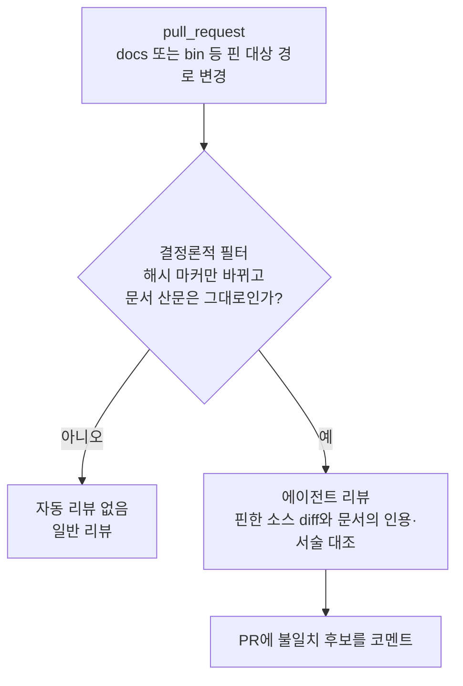

# 문서 정확성 자동 리뷰

**상태:** Proposed

## 제안 요약

### 목적과 이유

| 항목 | 내용 |
| --- | --- |
| 제안 목표 | 소스 해시 마커만 다시 기록하고 문서 산문은 그대로 둔 PR을 결정론적으로 골라내고, 그런 PR에 한해 에이전트가 문서와 코드의 일치를 리뷰해 PR에 남긴다. |
| 제안 이유 | [문서 소스 해시 게이트](../../../contributing/doc-gate.md#문서-소스-해시-게이트)는 인용한 소스가 바뀌면 문서를 다시 보게 강제하지만, `--stamp`로 해시만 다시 기록하면 산문을 고치지 않아도 통과한다. 2026-09-14 전수조사에서 실제 사례가 나왔다. ADR 0005 구현으로 `bin/agentic.mjs`에 줄이 추가됐지만 두 문서의 `파일:줄` 인용은 그대로 둔 채 해시만 다시 기록돼 있었다. |

### 범위와 우선순위

| 항목 | 내용 |
| --- | --- |
| 대상 계층 | 저장소 CI·PR 리뷰·문서 소스 해시 게이트 |
| 결정할 것 | 해시만 바뀐 PR의 판정 규칙, 리뷰 결과를 병합 조건으로 쓸지 참고용으로 둘지, 인증 방식과 비용 상한 |
| 중요도 | Medium: 사용자 기능과 데이터 안전에는 영향이 없고, 문서가 코드와 어긋나는 위험을 줄인다. |

### 의존성과 실행 순서

| 항목 | 내용 |
| --- | --- |
| 선행 작업 | 문서 소스 해시 게이트(구현됨), 마커가 실제 인용 소스를 빠짐없이 핀하는 상태 |
| 선행 제안 | 없음 |
| 후속 제안 | CI 검사를 required status check로 지정하는 브랜치 보호 설정 |
| 연관 제안 | [구현 계약 및 문서 규칙](implementation-contracts.md) |
| 후속 작업 | 판정 스크립트를 평가와 함께 만들고, 리뷰 workflow의 권한·비용 상한을 정한다. |
| 권장 다음 작업 | 모델 호출 없이 "해시 마커만 바뀐 PR"을 판정하는 결정론적 필터부터 만들고, 판정 결과를 PR에 표시하는 데서 멈춘다. |

## 목차

- [현재 동작과 한계](#현재-동작과-한계)
- [제안 동작](#제안-동작)
- [인증과 비용](#인증과-비용)
- [비범위](#비범위)
- [결정·검증 항목](#결정검증-항목)

## 현재 동작과 한계

- `check:docs`는 마커의 소스를 다시 해싱해 기록된 값과 비교한다. 값이 다르면 실패하고, `--stamp`는 현재 값을 기록한다.
- 게이트는 "소스가 바뀌었다"만 알 수 있고 "문서를 다시 읽었다"는 알 수 없다. 해시를 다시 기록한 사람이 문서를 고쳤는지는 리뷰어가 diff에서 직접 확인해야 한다.
- 마커가 인용 소스를 빠뜨리면 게이트 자체가 동작하지 않는다. 2026-09-14 조사에서는 워크플로·도구 파일을 인용하면서 핀하지 않은 문서가 세 개 있었다.

## 제안 동작

모델 호출은 필터가 고른 PR에만 쓴다. 필터는 모델 없이 diff만으로 판정하므로 평가로 고정할 수 있다.

## 인증과 비용

- 인증(계획): 저장된 API 키 대신 OIDC(Workload Identity Federation)로 인증해, 이 저장소가 npm 배포에 이미 쓰는 OIDC 방식과 맞춘다. 외부 액션은 commit SHA로 고정하고 권한은 최소로 선언한다.
- 전제: Anthropic 쪽에 federation rule과 service account를 등록해야 한다.
- 비용: 사용량은 API 종량제로 과금된다. 이 비용 때문에 현재는 구현하지 않았다.

## 비범위

- 문서를 자동으로 고치는 커밋은 만들지 않는다. 리뷰 코멘트까지만 남긴다.
- CI 실패로 병합을 막는 설정은 GitHub 브랜치 보호의 몫이며 저장소 파일로 보장되지 않는다([운영상 한계](../../../contributing/releasing.md#운영상-한계)).

## 결정·검증 항목

- "산문은 그대로"의 판정 기준: 마커 두 줄 외의 변경이 전혀 없을 때만인지, 공백 변경도 허용할지
- 리뷰 결과를 병합 조건으로 쓸지 여부
- 월 비용 상한과 초과 시 동작
- 필터 판정을 고정하는 평가 시나리오(마커만 변경, 산문도 변경, 마커 없는 문서)
