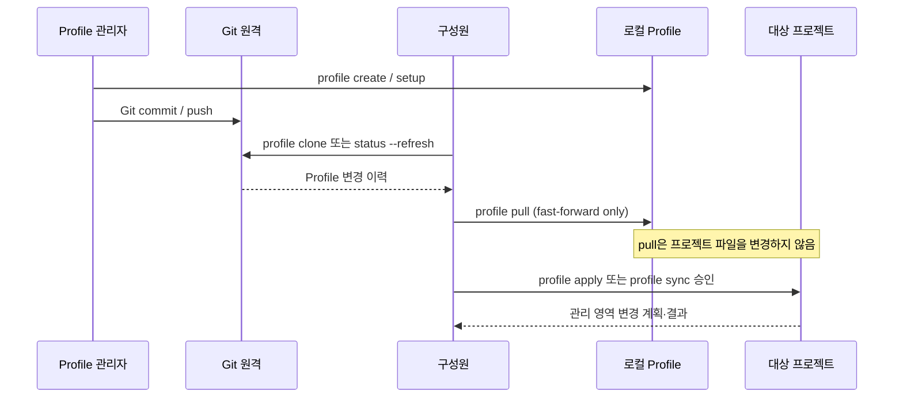

# Git 기반 프로필 관리

**상태:** Implemented

## 제안 요약

### 목적과 이유

| 항목 | 내용 |
| --- | --- |
| 제안 목표 | 개인·팀·조직이 공통 개발 지침 프로필을 표준 Git 원격으로 공유하고, 로컬에서 안전하게 확인·갱신·배포할 수 있게 한다. |
| 제안 이유 | 로컬 프로필만으로는 팀원이 같은 지침의 변경 이력·리뷰·권한을 공유할 수 없다. 각 프로젝트에 지침을 복사하면 drift가 생기고, 프로필 변경을 프로젝트에 자동 반영하면 사용자 파일을 예기치 않게 바꿀 위험이 있다. |

### 범위와 우선순위

| 항목 | 내용 |
| --- | --- |
| 대상 계층 | 프로필 관리자·구성원, agctx CLI/TUI, 로컬 프로필 저장소, 표준 Git 원격, 적용 대상 프로젝트 |
| 결정할 것 | 원격 연결 metadata, 추적 branch·revision 정책, `clone/status/pull/push/connect` 공개 계약, 초기 원격 publish 책임, Git 오류·인증·충돌 처리, 프로젝트 적용 revision 기록 |
| 중요도 | Critical — 조직 공유와 변경 이력의 기반이지만, 프로젝트 파일 보존 경계를 침해해서는 안 된다. |

### 의존성과 실행 순서

| 항목 | 내용 |
| --- | --- |
| 선행 작업 | [프로필 모델과 저장소](profile-model.md)의 이름·경로·소유권 계약 |
| 선행 제안 | [프로필 모델과 저장소](profile-model.md) |
| 후속 제안 | 원격 업데이트 알림·프로젝트 업데이트 PR 자동화(별도 제안), profile revision pinning·release 정책 |
| 연관 제안 | [프로젝트 적용](project-application.md), [agctx 관리 산출물의 안전한 동기화](managed-artifact-safety.md), [자연어 요청을 통한 agctx 사용](agent-mediated-usage.md) |
| 후속 작업 | CLI·TUI·프로필 목록 메뉴 동등성, 원격 변경 비교 UI, 적용 revision 기록, Git host별 선택적 자동화 검토 |
| 권장 다음 작업 | 없음. 지침 전달 확인은 [ADR 0019](../../../adr/0019-explain-verify-and-agent-skills.md)의 `explain`·`verify`로 구현했고, 적용 버전 기록 대신 지금 저장소에 있는 지침 파일을 기대값으로 삼았다. |

## 목차

- [문제와 핵심 원칙](#문제와-핵심-원칙)
- [책임 경계](#책임-경계)
- [사용자 흐름](#사용자-흐름)
- [공개 인터페이스](#공개-인터페이스)
- [저장소와 revision 계약](#저장소와-revision-계약)
- [안전 계약](#안전-계약)
- [업데이트 확인과 알림의 경계](#업데이트-확인과-알림의-경계)
- [비범위](#비범위)
- [구현 단계와 평가](#구현-단계와-평가)
- [결정할 사항](#결정할-사항)
- [구현 기록](#구현-기록)

## 문제와 핵심 원칙

Profile은 AI 에이전트가 프로젝트 개발 때 읽는 공통 지침의 정본이다. 개인은 여러 Profile을 재사용할 수 있고, 팀·조직은 같은 Profile을 Git 저장소로 공유할 수 있어야 한다. 그러나 Git 갱신 자체가 프로젝트 지침을 자동으로 바꾸면, 사용자 도메인 지침과 관리 영역의 소유권 경계가 무너진다.

따라서 이 제안의 핵심 원칙은 다음과 같다.

1. **Git은 Profile의 공유·이력·권한을 담당하고, agctx는 Profile과 프로젝트의 안전한 적용 경계를 담당한다.**
2. **원격 Profile 갱신과 프로젝트 동기화는 분리한다.** `profile pull`은 Profile만 갱신하며, 프로젝트 변경은 사용자가 별도로 `profile sync`를 승인할 때만 일어난다.
3. **Git의 표준 모델을 보존한다.** GitHub 전용 API나 별도 토큰 저장소를 만들지 않고 HTTPS·SSH 등 사용자의 Git 원격과 credential helper를 사용한다.
4. **자동 병합보다 중단·검토를 우선한다.** Profile 로컬 수정·관리 영역 충돌·불명확한 원격 상태에서는 변경하지 않고 이유와 다음 조치를 보여 준다.
5. **프로젝트 도메인 지침은 절대 Profile 원격으로 역전송하지 않는다.**

## 책임 경계

| 주체 | 책임 | 하지 않는 일 |
| --- | --- | --- |
| Profile 관리자 | 공통 지침 변경, Git commit·review·권한 관리, 원격 push 승인 | 구성원 프로젝트를 자동 수정하지 않음 |
| 구성원 | 신뢰할 원격 선택, Profile 갱신 검토, 프로젝트 `profile sync` 승인 | 조직 Profile의 변경을 자동 push하지 않음 |
| agctx | Profile clone·상태·안전한 갱신, 적용 revision 기록, CLI/TUI 변경 계획 제공 | 모델·세션·Git 호스팅 계정·토큰·프로젝트 코드를 관리하지 않음 |
| Git 호스트 | 원격 저장소, 인증, 권한, PR·보호 규칙, 변경 이력 | agctx 프로젝트 적용을 자동 실행하지 않음 |
| 대상 프로젝트 | 도메인 지침, 코드, 데이터, 실제 검증 명령 | 공통 Profile의 정본을 소유하지 않음 |

## 사용자 흐름



## 공개 인터페이스

새 기능은 [구현 계약 및 문서 규칙](implementation-contracts.md)의 인터페이스 동등성을 따른다. 각 기능은 직접 CLI, `agctx` 메인 TUI, `agctx profile list`에서 Profile을 선택한 관리 메뉴에 모두 등록한다.

| 명령 | 목적 | 기본 안전 동작 |
| --- | --- | --- |
| `agctx profile clone <url> [--name <name>] [--branch <branch>]` | 원격 Git Profile을 로컬 Profile 저장소에 복제 | 임시 경로에 복제·metadata 검증 후 원자적으로 등록; 프로젝트 미변경 |
| `agctx profile status [<name>] [--refresh]` | 원격 URL·branch·현재 revision·수정 상태·ahead/behind 표시 | 기본은 네트워크 미접속; `--refresh`만 원격 확인 |
| `agctx profile pull <name> [--dry-run]` | 추적 원격의 변경을 로컬 Profile에 반영 | 수정된 worktree는 중단, `--ff-only`만 허용, 프로젝트 미변경 |
| `agctx profile push <name> [--dry-run]` | 사용자가 이미 commit한 Profile 변경을 원격에 push | 자동 stage·commit 금지; 추적 원격과 push 대상 표시 |
| `agctx profile connect <name> <url> [--branch <branch>]` | 기존 Git Profile에 추적 원격을 등록 | Git 저장소·metadata·원격 연결을 검증하고, commit·push는 하지 않음 |

`profile create`, `profile setup`, `profile apply`, `profile sync`, `profile remove`의 기존 계약은 유지한다. 초기 원격 저장소 생성, Git 초기화와 첫 commit은 1차 범위에서 표준 Git 책임으로 둔다. TUI는 필요한 Git 상태와 다음 명령을 안내할 수 있지만, 사용자의 승인 없이 파일을 stage·commit하지 않는다.

## 저장소와 revision 계약

Git Profile은 기존 로컬 저장 위치 안의 독립 Git worktree다.

```text
~/.agctx/profiles/company/
├── .git/                     # Git이 소유하는 원격·인증 연결 정보
├── AGENTS.md                 # Profile 공통 지침 정본
└── profile.json      # 이식 가능한 Profile metadata
```

`profile.json`은 원격 URL이나 사용자별 인증 정보를 저장하지 않는다. 원격 연결과 tracking branch는 Git의 `.git/config`가 정본이다. Profile metadata에는 schema 호환성, 안정적인 Profile ID, 이름, scope, 설정을 기록한다.

프로젝트가 Git Profile을 적용하면 `agctx.project.json`에 Profile 이름과 함께 적용 당시 revision을 기록한다. 권장 형태는 다음과 같다.

```json
{
  "profile": "company",
  "profileRevision": {
    "kind": "git",
    "remote": "https://example.com/company-guidance.git",
    "branch": "main",
    "commit": "<40-character commit id>"
  }
}
```

로컬 전용 Profile은 `profileRevision`을 기록하지 않는다. revision은 추적·설명용이며, `profile sync`가 원격에서 자동 pull해야 한다는 뜻은 아니다.

## 안전 계약

### Clone과 연결

- Git 명령은 shell 문자열 결합이 아닌 인자 분리 실행으로 호출한다.
- clone은 최종 Profile 경로가 아닌 임시 경로에서 수행하고, `profile.json`·`AGENTS.md`·이름·scope·경로 안전성을 검증한 뒤에만 등록한다.
- submodule 재귀 복제, 패키지 설치, 원격 Profile이 포함한 임의 스크립트 실행은 하지 않는다.
- 이미 존재하는 Profile 이름, 심볼릭 링크 경로, 지원하지 않는 metadata schema는 변경 없이 거부한다.

### Status와 pull

- `status`는 기본적으로 로컬 Git 상태만 읽는다. `--refresh`는 명시적으로 fetch해 원격과 비교한다.
- `pull --dry-run`은 Profile 파일·Git ref를 변경하지 않고 원격 revision과 변경 요약만 보여 준다.
- pull 전 worktree가 수정됨, tracking branch가 없음, branch가 분기됨, metadata가 손상됨, 관리 중인 경로가 안전하지 않음 중 하나라도 발견하면 중단한다.
- 실제 pull은 `fetch` 후 fast-forward 가능한 경우에만 작업 트리를 갱신한다. merge·rebase·reset·강제 덮어쓰기는 제공하지 않는다.

### Push와 프로젝트 경계

- push는 이미 존재하는 commit만 전송한다. agctx는 `git add`, `git commit`, 자동 push를 수행하지 않는다.
- 미커밋 변경이 있으면 무엇이 전송되지 않는지 보여 주고 기본적으로 push를 중단한다.
- `clone`, `status`, `pull`, `push`, `connect`는 프로젝트 파일을 읽거나 변경하지 않는다.
- Profile 갱신 후 프로젝트 파일을 바꾸려면 사용자가 `profile sync <project>`를 별도로 실행하고, 기존 관리 영역 hash·dry-run·승인 계약을 통과해야 한다.

### 지침 공급망

Git Profile의 Markdown 지침은 AI 에이전트의 행동에 영향을 줄 수 있는 외부 입력이다. 따라서 신뢰할 수 있는 원격만 clone하고, pull 후에는 Profile diff를 검토한 뒤 프로젝트에 적용한다. Git의 권한·보호 branch·리뷰 규칙은 Git 호스트의 책임이며 agctx가 우회하지 않는다.

## 업데이트 확인과 알림의 경계

터미널 CLI만으로 사용자가 아무 명령도 실행하지 않아도 즉시 원격 변경을 알릴 수는 없다. 이를 위해서는 백그라운드 서비스 또는 Git host의 webhook·App 권한이 필요하다.

1차 구현은 `profile status --refresh`와 TUI의 명시적 새로고침으로 “업데이트 가능 · N commits behind”를 보여 준다. 자동 pull·자동 project sync·백그라운드 polling은 제공하지 않는다.

GitHub·GitLab 등 특정 호스트의 CI가 Profile 변경을 감지해 프로젝트 업데이트 PR을 만드는 기능은, 호스트 권한·비용·PR 소유권을 별도 결정한 후 후속 제안으로 다룬다.

## 비범위

- Profile 상속·조합·다계층 병합
- GitHub·GitLab 계정 생성, 원격 저장소 생성, 토큰 발급·저장
- Profile 변경을 감지한 자동 project sync 또는 자동 PR 생성
- 에이전트 런타임 실행·래핑·출력 파싱
- 프로젝트 코드·테스트·도메인 지침을 Profile 원격으로 수집·전송
- merge conflict를 agctx가 의미적으로 자동 해석·해결하는 기능

## 구현 단계와 평가

1. **Git 실행 기반:** Git 설치·버전·인자 분리 실행·오류 분류 helper와 실패 평가를 추가한다.
2. **원격 Profile 읽기:** 격리 bare Git 원격을 이용해 `clone`·metadata 검증·`status`·TUI/목록 메뉴 등록 평가를 작성하고 구현한다.
3. **안전한 갱신:** dirty worktree 중단, `--dry-run`, ahead/behind, fast-forward pull, 프로젝트 미변경 평가를 먼저 작성하고 구현한다.
4. **연결과 배포:** `connect`·`push`의 기존 commit 전용 계약과 인증·원격 거부 오류를 평가한다.
5. **적용 revision:** Git Profile을 `profile apply`/`profile sync`할 때 적용 commit 기록·표시를 추가하고, 기존 로컬 Profile 호환성을 평가한다.
6. **문서와 패키지 검증:** README의 현재/후속 기능 구분, CLI Reference·workflow·architecture 갱신, 설치된 npm tarball의 격리 smoke test를 완료한다.

최소 평가 시나리오는 다음을 포함한다.

- 유효한 원격 Profile clone과 손상 metadata 거부
- 같은 이름의 기존 Profile·심볼릭 링크 대상 거부
- `status`의 로컬 상태와 `--refresh`의 behind 표시
- 수정된 Profile에서 pull 중단, fast-forward pull 성공, merge 필요 상태 중단
- clone/pull/push가 프로젝트 파일을 변경하지 않음
- push가 uncommitted 변경을 commit·전송하지 않음
- Git 미설치·인증 실패·원격 접근 실패의 명확한 종료 코드와 안내
- 모든 새 기능의 CLI·메인 TUI·Profile 목록 관리 메뉴 동등성

## 결정할 사항

- Profile metadata에 안정적인 `id`를 언제 추가하고, 기존 Profile에 어떤 migration을 적용할지
- branch 추적만 1차에 지원할지, tag·commit pinning을 함께 지원할지
- `status --refresh`의 네트워크 timeout·오프라인 종료 코드·TUI 새로고침 UX
- 미커밋 변경이 있을 때 push를 일괄 거부할지, 명시적 `--allow-dirty`를 둘지
- Git 작업 중 Profile별 lock 파일과 동시 실행 정책
- Profile 저장소에 추가 문서·템플릿을 허용할지, `AGENTS.md`와 metadata만 지원할지
- 적용 revision을 사용자에게 어디에 표시하고, 프로젝트가 오래된 revision일 때 어떤 안내를 할지

이 제안이 채택되면 공개 명령·파일 형식·supply-chain 안전 경계를 ADR로 기록하고, 구현 완료 단계만 현재 아키텍처·CLI Reference·workflow·README의 제공 기능으로 승격한다.

## 구현 기록

#### 구현 기록: Git 프로필 명령·적용 버전 기록·고정·check (2026-09-15)

* **결정:** [ADR 0017](../../../adr/0017-git-profile-sharing.md). 표준 Git 원격과 사용자의 인증을 쓰고 `clone`·`status`·`pull`·`push`·`connect`는 프로젝트 파일을 건드리지 않는다. 적용한 버전은 `agctx.project.json`의 `source`·`pin`·`uncommitted`로 기록하고 저장소 검사는 `agctx check`가 맡는다. 종료 코드와 `--yes` 확인은 [ADR 0016](../../../adr/0016-command-contract.md)을 따른다.
* **구현:** `src/profile/git-profile.ts`(clone·status·pull·push·connect), `src/shared/git.ts`(인자 분리 실행·오류 분류·URL의 인증 정보 제거), `src/shared/hidden-chars.ts`(숨은 문자 검사), `src/profile/apply.ts`의 `profileVersion`(버전 기록·고정), `src/check.ts`, `src/commands/registry.ts`의 명령 등록, `src/tui/main.ts`·`src/tui/profile.ts`의 메뉴. 사용법은 [CLI Reference](../../../reference/cli.md)와 [빠른 시작](../../../getting-started/quick-start.md)에 있다.
* **평가:** `evals/git-profile.test.ts` 3개(bare 원격과 관리자·구성원 두 홈으로 clone과 프로젝트 미변경, 프로필 파일이 없거나 숨은 문자가 있는 저장소 거부, pull·`apply --pin`·`check --refresh`·고정한 프로젝트의 sync·고정 해제 경고·로컬 수정이 있을 때 pull 중단), `evals/hidden-chars.test.ts` 4개, `evals/command-contract.test.ts`의 check 시나리오 3개. 수동 E2E로 관리자 connect·push → 구성원 clone·`apply --pin` → 관리자 push → CI `check --refresh` 종료 코드 1 → 구성원 pull·`apply --pin` → `check --refresh` 종료 코드 0을 확인했다.
* **계획과 달라진 점:**
  - `profile clone`에 `--name`을 두지 않고 `profile.json`의 이름을 쓴다. 팀원마다 이름이 달라지면 저장소에 기록한 `profile`과 맞지 않기 때문이다. 저장소 하나에 프로필 하나만 받는다.
  - 적용 버전은 제안의 `profileRevision { kind, remote, branch, commit }` 대신 `source { git, branch, commit }`로 기록하고 `pin`·`uncommitted`를 더했다. 로컬 프로필은 `source`를 기록하지 않으므로 `kind`가 필요 없다.
  - "결정할 사항"의 commit 고정은 1차 범위에 넣었다(`apply --pin`). tag 고정은 넣지 않았다.
  - 커밋하지 않은 변경이 있으면 push를 거부하고 `--allow-dirty`는 두지 않았다. push는 원격보다 뒤처졌을 때도 멈춘다.
  - CI가 원격 변경을 확인하는 `agctx check --refresh`를 더했다. 자동 PR은 제안대로 만들지 않는다.
  - clone·pull로 받는 `profile.json`·`AGENTS.md`의 숨은 문자 검사를 더했다(종료 코드 3).
* **제약:** 잠금 파일이 없어 같은 프로필에 Git 명령을 동시에 실행하면 Git의 오류가 그대로 나온다. 네트워크 제한 시간이 없다. 프로필 metadata에는 아직 안정적인 `id`가 없다. 프로필 저장소에 둔 다른 문서·템플릿은 전달하지도 검사하지도 않는다.
* **다음 단계:** 여러 저장소의 상태를 한 번에 보고 동기화·PR을 만드는 기능에서 이 기록을 재사용한다.

#### 구현 기록: 여러 저장소 동기화와 프로필 갱신 PR (2026-09-15)

* **결정:** [ADR 0018](../../../adr/0018-multi-repository-sync.md). `apply`·`sync`가 적용한 저장소를 `~/.agctx/repos.json`에 기록하고, `repos status`·`sync`·`pr`이 한 번에 다룬다. `repos pr`은 사람이나 예약 봇이 명시적으로 실행하며, 임시 worktree에서 커밋·push한 뒤 `gh`로 PR을 연다.
* **구현:** `src/repos/registry.ts`·`status.ts`·`sync.ts`·`pr.ts`, `src/check.ts`의 보관함 커밋 비교와 원격 조회 공유, `src/profile/apply.ts`·`src/project/plan.ts`의 `projectName` 기록, `src/tui/main.ts`의 `저장소 상태` 메뉴.
* **평가:** `evals/repos.test.ts` 5개, `evals/command-contract.test.ts`의 다른 폴더 이름 복사본 1개. gh는 PATH의 가짜 명령으로 대신했다.
* **계획과 달라진 점:**
  - 이 문서의 비범위 "Profile 변경을 감지한 자동 project sync 또는 자동 PR 생성" 중 감지와 자동 실행은 여전히 하지 않는다. 대신 사용자가 실행하는 `repos pr`과 예약 워크플로 예시를 제공한다.
  - 고정한 프로젝트의 `check`는 보관함에 기록보다 새 커밋이 있으면 뒤처짐으로 판정하게 바꿨다. `profile pull` 직후 뒤처짐을 알 수 있어야 하기 때문이다.
  - 폴더 이름으로 정하던 프로젝트 이름을 `agctx.project.json`에 기록하게 했다. 다른 이름의 폴더로 clone한 팀원과 임시 worktree에서도 결과가 같아야 하기 때문이다.
* **제약:** 목록은 컴퓨터마다 따로 있고 잠금이 없다. GitHub가 아닌 호스트에서는 push까지만 한다. 실제 GitHub PR 생성은 가짜 gh 평가와 로컬 원격 실행으로만 확인했다.
* **다음 단계:** 적용 버전 기록을 에이전트 전달 확인의 기대값으로 쓴다.

#### 구현 기록: TUI 적용의 커밋 고정 질문 (2026-09-17)

* **결정:** [ADR 0016](../../../adr/0016-command-contract.md)의 동등성 기준. `profile apply`는 `profile` 표면 명령이므로 `--pin`도 TUI와 관리 메뉴에서 고를 수 있어야 한다. 그동안 TUI 적용은 항상 `--pin` 없이 실행해, 고정한 프로젝트를 메뉴에서 다시 적용하면 고정이 풀렸다. 그래서 질문의 기본값을 프로젝트에 기록된 고정 여부에 맞춘다.
* **구현:** `src/tui/profile.ts`의 `pinPrompt`가 프로필 폴더가 Git 저장소일 때만 질문을 켜고, 대상 프로젝트의 `agctx.project.json`이 `pin: true`면 Yes를 미리 고른다. `MENU_ACTIONS['profile.apply']`는 답이 Yes면 `{ pin: true }`로 CLI와 같은 처리기를 부른다. 질문 문구는 `actions.apply.pin`(en·ko)이다. 사용법은 [TUI로 쓰기](../../../guides/tui.md#프로젝트에-적용하기)에 있다.
* **평가:** `evals/tui-pin.test.ts` 3개(Git이 아닌 프로필은 묻지 않음, 새 프로젝트는 No 기본, 고정한 프로젝트는 Yes 기본). 격리한 `AGCTX_HOME`에서 pexpect로 TUI를 실행해 Yes 선택 시 `"pin": true` 기록, 고정한 프로젝트에서 `Enter`만 눌렀을 때 고정 유지, No 선택 시 고정 해제 경고, 커밋하지 않은 수정이 있을 때 오류로 멈추고 파일을 쓰지 않음을 확인했다.
* **계획과 달라진 점:** 없음.
* **제약:** 고정 해제 경고 문구는 CLI와 같아서 TUI에서도 `Add --pin to keep it pinned.`로 끝난다. 커밋하지 않은 수정이 있는지는 질문 전에 검사하지 않고, Yes를 고른 뒤 처리기의 오류로 알린다.
* **다음 단계:** 없음.

