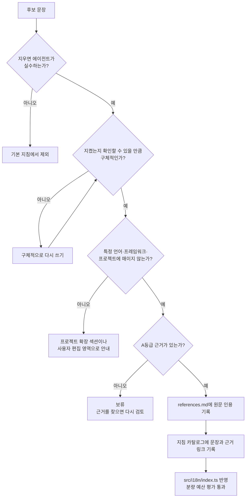
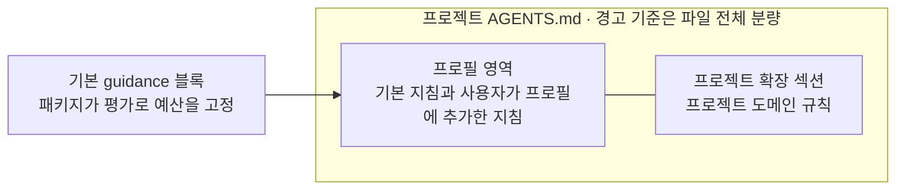

# 기본 지침의 근거 기준과 분량 예산

**상태:** Implementing

## 제안 요약

### 목적과 이유

| 항목 | 내용 |
| --- | --- |
| 제안 목표 | 패키지가 배포하는 기본 지침을 확실한 근거에 기반한 높은 품질의 출발점으로 만든다. 문장마다 근거를 추적할 수 있게 하고, 생성되는 지침과 프로젝트 지침 파일이 에이전트가 제대로 읽는 분량 안에 머물게 한다. |
| 제안 이유 | 기본 지침은 `profile setup`을 실행한 모든 사용자에게 같은 문구로 배포되고, 사용자는 이를 출발점으로 삼아 고쳐 쓴다. 그런데 지금 6개 항목 중 근거가 `references.md`에 기록된 문장은 일부뿐이고 TDD·변경 검토·보안 문장은 출처가 없다. 문구도 "실제 결과를 보고한다"처럼 에이전트의 기본 행동과 크게 다르지 않다. 반대로 문구를 늘리기만 하면 공식 문서가 경고하는 대로 규칙이 묻히고, Codex는 한도를 넘는 지침 파일을 더 읽지 않는다. |

### 범위와 우선순위

| 항목 | 내용 |
| --- | --- |
| 대상 계층 | 패키지 유지관리자 · 기본 지침 정본(`src/i18n/index.ts`, 지침 카탈로그) · `references.md` · agctx CLI(`apply`·`sync` 출력) · 사용자 |
| 결정할 것 | 기본 지침 문장의 채택 조건과 근거 등급, 문장별 근거를 기록하는 위치, 기본 지침 분량 예산의 단위와 수치, 프로젝트 지침 파일 분량 경고의 기준과 출력 방식, 별도 문서 분리를 옵션으로 제공할지 여부 |
| 비범위 | 모델 호출로 지침을 생성·요약·평가하는 기능, 사용자가 쓴 내용을 자동으로 자르거나 옮기는 기능, 적용 수준마다 다른 규칙 문구([ADR 0005](../../../adr/0005-guidance-level-semantics.md) 유지), 특정 언어·프레임워크 전용 지침 |
| 중요도 | High — 모든 사용자가 받는 기본 지침의 품질과 신뢰를 정하지만, 데이터 안전 경계는 바꾸지 않는다. |

### 의존성과 실행 순서

| 항목 | 내용 |
| --- | --- |
| 선행 작업 | [지침 카탈로그](../../../reference/guidance-catalog.md)로 배포 문구의 정본을 한 곳에 모은 작업, [ADR 0005](../../../adr/0005-guidance-level-semantics.md)의 적용 수준 정의 |
| 선행 제안 | [setup과 지침 옵션](setup-and-guidance.md) (Implemented), [지침 적용 수준의 의미 정의](guidance-level-semantics.md) (Implemented) |
| 후속 제안 | 항목별 문구 구체화(10개 항목마다), 필요할 때만 읽히는 지침 형태로의 분리([프로필 설정 표면 확장](profile-config-surface.md)에서 다룬다) |
| 연관 제안 | [스코프 확장과 지침 합성](scope-composition.md)(여러 계층을 합치면 분량도 합산된다), [문서 정확성 자동 리뷰](../../repository/topics/doc-accuracy-review.md) |
| 후속 작업 | 근거 기준 ADR 작성, 현재 6개 문장의 근거 감사 결과 확정, 지침 카탈로그에 근거 열 추가, 분량 예산 평가와 분량 경고 구현, `docs/product-direction.md`에 원칙 반영 |
| 권장 다음 작업 | 근거 기준·문구·분량 예산은 [ADR 0024](../../../adr/0024-guidance-evidence-and-budget.md)와 [ADR 0026](../../../adr/0026-guidance-items-and-evidence-tiers.md)으로 확정해 구현했다. 남은 것은 프로젝트 `AGENTS.md` 분량 경고다. `apply`·`sync`가 200줄 초과 또는 24 KiB 이상에서 경고만 내도록 구현하고 세 인터페이스 경로의 평가를 추가한다. |

## 목차

- [목적과 원칙](#목적과-원칙)
- [현재 동작과 빈 곳](#현재-동작과-빈-곳)
- [근거 기준](#근거-기준)
- [분량 예산과 경고](#분량-예산과-경고)
- [별도 문서 분리 옵션](#별도-문서-분리-옵션)
- [비범위와 금지할 접근](#비범위와-금지할-접근)
- [결정·검증 항목](#결정검증-항목)
- [영향과 문서 정합화](#영향과-문서-정합화)

## 목적과 원칙

agctx가 배포하는 기본 지침은 사용자가 에이전트 지침을 처음 갖추는 출발점이다. 사용자는 이 문구를 그대로 쓰거나 고쳐 쓰므로, 출발점의 품질이 곧 많은 프로젝트 지침의 품질이 된다. 그래서 이 제안은 다음 원칙을 세운다.

> **원칙: 패키지가 제공하는 기본 지침은 확실한 근거에 기반해 작성한다.**
> 기본 지침의 모든 문장은 확인할 수 있는 외부 근거를 하나 이상 가진다. 근거를 찾지 못한 문장은 좋아 보여도 기본 지침에 넣지 않고, 사용자가 프로필에 직접 추가하도록 남긴다.

이 원칙이 필요한 이유는 네 가지다.

1. **사용자는 기본 지침을 검증된 출발점으로 받아들인다.** 근거 없는 문장이 섞여 있으면 어느 문장을 믿고 어느 문장을 고칠지 판단할 수 없다.
2. **지침은 강제가 아니라 권고다.** Anthropic은 지침 파일을 "advisory"로, hooks를 "deterministic"으로 구분한다. 에이전트가 따를지 확실하지 않은 문장에 컨텍스트를 쓰려면, 그 문장이 효과를 낸다는 근거가 있어야 한다.
3. **문장이 많다고 품질이 높아지지 않는다.** Anthropic은 좋은 컨텍스트를 "smallest possible set of high-signal tokens"로 정의하고, 긴 지침 파일은 준수율을 낮춘다고 경고한다. 그래서 품질은 문장 수가 아니라 문장마다 가진 근거와 신호로 판단한다.
4. **사용자가 고쳐 쓸 때도 근거가 필요하다.** 문장별 출처가 남아 있으면 사용자는 자기 환경에 맞지 않는 문장을 근거를 보고 뺄 수 있다.

"품질이 높은 기본 지침"과 "간결한 기본 지침"은 충돌하지 않는다. 이 제안에서 높은 품질이란 에이전트의 행동을 실제로 바꾸고 근거가 확인된 문장만 담는다는 뜻이다. 인용한 외부 자료의 원문은 [참고 자료](../../../references.md#기본-지침의-근거와-분량에-관한-자료)에 있다.

## 현재 동작과 빈 곳

`profile setup`은 10개 항목의 문구를 프로필 `AGENTS.md`의 guidance 블록으로 생성한다. 배포 문구의 정본은 [지침 카탈로그](../../../reference/guidance-catalog.md)이고 실제 문자열은 `src/i18n/index.ts`의 `guidance` 상수에 있다.

2026-09-14 main `73d03c2`에서 측정한 분량은 다음과 같다.

| 측정 대상 | 줄 수 | 바이트 수 |
| --- | --- | --- |
| 모든 항목을 기본값(`recommended`)으로 생성한 프로필 `AGENTS.md` (ko) | 44 | 1,941 |
| 같은 조건의 프로필 `AGENTS.md` (en) | 44 | 1,762 |
| 모든 항목을 `strict`로 생성한 프로필을 적용한 프로젝트 `AGENTS.md` (ko) | 54 | 2,186 |

2026-09-14 main `73d03c2`에서 6개 문장을 `references.md`의 근거와 대조한 결과는 다음과 같았다.

| 항목 | 배포 문구의 핵심 | `references.md`에 기록된 근거 |
| --- | --- | --- |
| 하네스 동작 | 작게 계획하고 검증 결과를 보고한다. 기본 작업 방식은 작게 유지한다. | "작게 유지"만 Anthropic Harness 연구와 연결된다. 검증 결과를 보고하라는 문장은 출처가 없다. |
| TDD | 구현 전에 실패하는 테스트를 먼저 쓴다(Red-Green-Refactor). | 없음 |
| 변경 검토 | 변경의 범위와 위험을 먼저 확인하고, 위험하면 독립적인 리뷰를 거친다. | 없음 |
| 검증 | 검증 출력을 근거로 남긴다. 실행 결과는 품질 전체의 증명이 아니다. | 뒷 문장이 Anthropic Evals 설명과 일치하지만 카탈로그에서 연결되지 않는다. |
| 문서화 | 계약·정책·구조가 바뀌면 정본 문서를 갱신한다. 루트 지침에는 고신호 정보만 둔다. | 뒷 문장이 Anthropic Context Engineering과 일치하지만 카탈로그에서 연결되지 않는다. |
| 보안 | 비밀값을 출력·커밋하지 않고, 외부 작업은 승인을 받는다. | 없음 |

여기서 네 가지 빈 곳이 드러난다.

1. **근거를 추적할 수 없다.** 카탈로그에서 출처를 밝힌 곳은 하네스 문구의 한 구절뿐이고, TDD·변경 검토·보안은 `references.md`에도 근거가 없다.
2. **행동을 바꾸는 힘이 약한 문구가 있다.** "실제 결과를 보고한다"는 무엇을 보고할지 정하지 않는다. Anthropic은 "Format code properly" 대신 "Use 2-space indentation"처럼 지켰는지 확인할 수 있는 문장을 권한다.
3. **분량을 지키는 장치가 없다.** 기본 지침의 분량을 고정하는 평가가 없어 문구가 늘어나도 검사가 막지 않는다. 프로젝트 `AGENTS.md`가 에이전트의 한도를 넘어도 `apply`·`sync`는 알리지 않는다.
4. **참고 자료의 원칙과 공식 수치가 어긋난다.** `references.md`는 "특정 줄 수를 공식 기준으로 취급하지 않는다"고 적었지만, Claude Code 문서는 지침 파일마다 200줄 미만을 목표로 제시한다.

## 근거 기준

후보 문장은 아래 네 질문을 모두 통과해야 기본 지침에 들어간다.



근거가 없는 문장은 버리지 않고 보류한다. 근거를 찾으면 다시 검토하고, 그동안 필요한 사용자는 프로필에 직접 추가해 쓴다.

### 채택 조건

| 조건 | 판단 질문 | 조건의 근거 |
| --- | --- | --- |
| 기본 행동과 다름 | 이 문장을 지우면 에이전트가 실수하는가? | Anthropic best practices: "Would removing this cause Claude to make mistakes?" |
| 구체성 | 지켰는지 확인할 수 있는가? | Claude Code memory 문서의 "Use 2-space indentation" 예시 |
| 공통성 | 어떤 프로젝트에도 성립하는가? | 프로필의 공통 지침과 프로젝트 도메인 지침을 나누는 [제품 방향](../../../contributing/product-direction.md), 코드를 읽어 알 수 있는 내용은 빼라는 Anthropic 권고 |
| 근거 | 아래 등급의 근거가 있는가? | 이 제안의 원칙 |

### 근거 등급

[ADR 0024](../../../adr/0024-guidance-evidence-and-budget.md)가 아래 제안을 좁혀 확정했다. 표준 기관의 기술 문서(OWASP)를 A 등급에 넣고, 연구는 단독 근거로 쓰지 않는 보조로 내렸다. 이 분야 연구는 결과가 엇갈려(위 [프로젝트 지침 자동 생성에 관한 근거](../../../references.md#프로젝트-지침-자동-생성에-관한-근거)의 두 연구가 서로 다른 방향을 가리킨다) 좁은 조건의 결과가 넓은 결과를 이길 수 있기 때문이다.

| 등급 | 종류 | 예 | 기본 지침에 쓰는 방식 |
| --- | --- | --- | --- |
| A | 에이전트 제공사의 공식 문서와 공식 엔지니어링 글, 표준 기관의 기술 문서 | Claude Code best practices·memory 문서, Codex의 AGENTS.md 문서, Anthropic 엔지니어링 글, OWASP 치트시트 | 단독 근거로 채택할 수 있다. |
| 보조 | 측정 방법과 결과를 공개한 연구, 실무자 글, 다른 도구의 기본 규칙 | arXiv 2602.11988, Martin Fowler의 TDD 글 | 단독 근거로 쓰지 않는다. A 등급 문장을 보강하거나 이름의 출처를 밝히는 데만 쓴다. |

### 적용 예

이 저장소의 `AGENTS.md`에는 검증 결과를 한 줄로 보고하는 규칙이 있다. 이 규칙을 기본 지침 후보로 보고 기준에 대 보면 다음과 같이 나뉜다.

| 후보 문장 | 판단 | 이유 |
| --- | --- | --- |
| 실행한 명령과 그 결과를 보고에 적는다. | 채택 후보 | A: Anthropic best practices "Have Claude show evidence rather than asserting success: the test output, the command it ran and what it returned" |
| 실행 결과는 요구사항 충족의 증명이 아니다. | 유지 | A: Anthropic Evals 설명(기존 기록) |
| 예상하지 못한 경고·건너뜀은 완료 전에 원인을 조사한다. | 보류 | 이 저장소의 운영 경험에서 나온 규칙이고 아직 A·B 근거를 찾지 못했다. |
| 보고 마지막 줄을 `[ @프로젝트: … ]` 형식으로 쓴다. | 제외 | 표시 형식은 팀의 취향이라 공통성 조건을 통과하지 못한다. 원하는 사용자는 guidance 블록 밖에 직접 넣는다. |

채택하면 지침 카탈로그의 행은 문장과 근거를 함께 보여 준다.

제안 예시:

```md
| 항목 | 목적 | 배포 문구 | 근거 |
| --- | --- | --- | --- |
| 검증 | … | 검증 명령을 실행한 뒤 실행한 명령과 그 결과를 보고에 적는다. 성공했다고 주장하지 않고 출력으로 보여 준다. 실행 결과는 요구사항 충족의 증명이 아니다. | [A](../references.md#…) · [A](../references.md#…) |
```

원문 인용은 `references.md` 한 곳에만 두고, 카탈로그는 문장마다 그 항목으로 링크한다. 근거 링크가 없는 카탈로그 행을 `check:docs`로 막을지는 [결정·검증 항목](#결정검증-항목)에서 정한다.

### 효과 확인의 한계

Anthropic은 지침을 바꾼 뒤 "test changes by observing whether Claude's behavior actually shifts"라고 권한다. 행동 변화를 재려면 모델을 호출해야 하므로 패키지의 자동 평가에는 넣지 않는다. 문구를 바꿀 때 유지관리자가 같은 과제를 바꾸기 전과 후의 문구로 실행해 비교하고, 그 결과를 이 논의 문서에 기록하는 방식을 후보로 둔다.

## 분량 예산과 경고

### 공식 수치

| 에이전트 | 공식 수치 | 성격 |
| --- | --- | --- |
| Claude Code | 지침 파일(CLAUDE.md)마다 200줄 미만을 목표로 한다. 긴 파일은 컨텍스트를 더 쓰고 준수율을 낮춘다. | 권고(목표치) |
| Claude Code | 4 MiB를 넘는 CLAUDE.md는 읽지 않는다. | 강제 한도 |
| Codex | 지침 파일의 합산 크기가 `project_doc_max_bytes`(기본 32 KiB)에 이르면 더 읽지 않는다. | 강제 한도(설정으로 변경 가능) |

- Claude Code 자동 메모리의 200줄·25KB 한도는 `MEMORY.md`에만 적용되며 지침 파일의 기준이 아니다.
- 글자 수 기준은 공식 문서에서 찾지 못했다.
- Cursor와 GitHub Copilot은 지원 대상에서 제외해 한도를 조사하지 않는다([ADR 0011](../../../adr/0011-supported-agents.md)).
- UTF-8에서 한글 한 글자는 3바이트라서, 같은 줄 수라도 한국어 지침이 바이트 한도에 먼저 닿는다. 이 저장소의 `AGENTS.md`는 126줄이지만 15,071바이트로 32 KiB의 약 46%를 쓴다.

### 예산을 두는 위치



기본 지침은 파일 한도의 일부만 쓰도록 예산을 두고, 나머지 공간은 사용자와 프로젝트가 쓰게 남긴다. 사용자와 프로젝트가 쓴 부분은 패키지가 통제하지 않으므로 경고만 한다.

| 대상 | 후보 수치 | 이유 | 강제 방식 |
| --- | --- | --- | --- |
| 기본 guidance 블록(모든 항목을 `strict`로 켠 경우, ko·en 각각) | 100줄 이하, 8 KiB 이하 | Claude Code 목표치의 절반, Codex 한도의 4분의 1만 써서 사용자와 프로젝트 지침에 공간을 남긴다. | 평가 테스트로 고정한다. 넘으면 `pnpm run check`가 실패한다. |
| 프로젝트 `AGENTS.md` | 200줄 초과 또는 24 KiB 이상에서 경고 | Claude Code 목표치를 넘거나 Codex 한도의 75%에 이르면 알린다. | `apply`·`sync` 출력에 경고만 표시한다. 파일과 종료 코드는 바뀌지 않는다. |

현재 기본값 프로필 파일 전체가 44줄·1,941바이트라서 두 후보 수치 모두 문구를 구체화할 여유가 충분하다.

경고는 `apply`·`sync` 결과의 일부이므로 CLI, TUI, `agctx profile list` 관리 메뉴 세 경로에서 모두 보인다.

제안 예시:

```bash
$ agctx profile sync /path/to/project
…
경고: AGENTS.md가 214줄입니다. Claude Code는 지침 파일마다 200줄 미만을 권장합니다.
      자주 쓰지 않는 규칙은 줄이거나 필요할 때 읽는 형태로 옮기는 것을 검토하세요.
```

## 별도 문서 분리 옵션

지침이 일정 분량을 넘으면 별도 문서로 관리되게 하는 옵션을 제공할지 검토했다. 판단에 쓴 사실은 다음과 같다.

- Claude Code의 `@path` import는 정리에는 도움이 되지만, 가져온 파일도 시작할 때 모두 읽히므로 컨텍스트를 줄이지 않는다.
- Codex는 지침 파일의 합산 크기로 한도를 세고, 한도에 닿으면 한도를 올리거나 하위 디렉터리로 지침을 나누라고 안내한다.
- Claude Code의 skills와 경로별 규칙은 필요할 때만 읽힌다. 다른 에이전트의 같은 기능은 방식이 제각각이다.

| 대안 | 동작 | 판단 |
| --- | --- | --- |
| A. 분량 초과 시 자동 분리 옵션 | agctx가 기준을 넘는 지침을 별도 문서로 옮기고 링크나 import를 남긴다. | 채택하지 않는다. 무엇을 옮길지 고르려면 내용을 이해해야 해서 모델 호출이 필요하다([ADR 0006](../../../adr/0006-no-codebase-analysis-guidance.md)과 같은 범위 문제). import로 옮기면 컨텍스트도 줄지 않는다. |
| B. 링크로 분리하도록 안내 | 사용자가 상세 규칙을 문서로 옮기고 루트 지침에는 링크만 둔다. | 기존 문서화 지침("상세는 링크로 찾게 한다")이 이미 안내한다. 에이전트가 링크를 읽는다는 보장이 없어 반드시 지켜야 할 규칙에는 맞지 않는다. |
| C. 예산과 경고 | 기본 지침은 예산 안에 두고, 프로젝트 파일이 기준을 넘으면 경고만 한다. | **권장.** 결정론적으로 검사할 수 있고 사용자 내용을 건드리지 않는다. |
| D. 필요할 때만 읽히는 형태로 분리 | skills·경로별 규칙처럼 에이전트가 조건에 맞을 때 읽는 형태로 옮긴다. | 효과는 가장 크지만 에이전트마다 방식이 달라 [프로필 설정 표면 확장](profile-config-surface.md)에서 다룬다. |

지금은 C를 권장한다. 분리를 옵션으로 자동화하지 않고 경고 문구에서 선택지를 안내하는 데 머문다. D가 구현되면 경고가 그 기능을 가리키게 한다.

## 비범위와 금지할 접근

- 모델을 호출해 지침 문구를 생성·요약·평가하지 않는다.
- 사용자가 쓴 지침을 분량 때문에 자르거나 옮기지 않는다. 경고만 한다.
- 근거가 없는 문장을 "모범 사례"라는 이유만으로 기본 지침에 넣지 않는다.
- 연구 결과를 보편적인 성공 보장처럼 쓰지 않는다([setup과 지침 옵션](setup-and-guidance.md)의 기존 계약).
- 적용 수준마다 다른 규칙 문구를 만들지 않는다([ADR 0005](../../../adr/0005-guidance-level-semantics.md)).

## 결정·검증 항목

| 결정할 것 | 검증 방법 |
| --- | --- |
| 채택 조건과 근거 등급 | ADR로 확정한다. 카탈로그의 모든 문장에 근거 링크가 있는지 `check:docs`로 검사할지 함께 정한다. |
| 현재 6개 문장의 처리 | 감사 결과를 이 문서에 기록하고, 근거가 없는 문장마다 근거 보강·수정·보류 중 하나를 정한다. |
| 기본 guidance 블록의 예산 수치 | ko·en 각각 모든 항목을 `strict`로 생성해 줄 수·바이트 수 상한을 검사하는 평가를 추가한다. 평가를 먼저 실패시킨 뒤 수치를 고정한다. |
| 프로젝트 파일 경고의 기준과 문구 | 기준을 넘는 프로젝트와 넘지 않는 프로젝트로 `apply`·`sync`를 실행해 경고 출력, 파일 무변경, 종료 코드를 확인하는 평가와 세 인터페이스 경로 평가를 추가한다. |
| `references.md`의 "특정 줄 수" 원칙 | 공식 목표치를 강제 한도가 아닌 경고 기준으로만 쓰도록 문장을 고칠지 정한다. |

## 영향과 문서 정합화

- 확정되면 ADR을 추가하고, `docs/product-direction.md`에 "기본 지침은 확실한 근거에 기반한다"는 원칙을 반영한다.
- 문구를 바꾸면 [지침 카탈로그](../../../reference/guidance-catalog.md)와 `src/i18n/index.ts`를 같은 변경에서 고치고, 인용 원문은 `references.md`에 둔다.
- 경고를 구현하면 [CLI Reference](../../../reference/cli.md), [빠른 시작](../../../getting-started/quick-start.md), `CHANGELOG.md`를 갱신한다.
- 기존 사용자: 문구가 바뀌어도 기존 프로필은 자동으로 바뀌지 않는다. `profile setup`을 다시 실행하면 guidance 블록이 바뀌고 `profile sync`로 프로젝트에 반영된다. guidance 블록 밖에 쓴 내용은 그대로 남는다.

## 구현 기록

### 2026-09-16 · 근거 기준과 문구, 분량 예산 (ADR 0024)

- **확정:** [ADR 0024](../../../adr/0024-guidance-evidence-and-budget.md)가 채택 조건 네 가지, 근거 등급(A 단독 · 보조), 엇갈릴 때의 처리, 카탈로그 근거 열 강제, 분량 예산을 확정했다. 제안과 달라진 점은 근거 등급이다. 제안의 B(연구)를 단독 근거에서 보조로 내렸다.
- **근거 수집:** 공식 문서·표준 16건을 내려받아 전문을 읽고, 배포 문구에 쓴 문장마다 원문을 그대로 인용해 [기본 지침 문장의 근거](../../../references.md#기본-지침-문장의-근거)에 한국어 번역·확인일과 함께 기록했다. 엇갈린 근거(비밀값을 환경 변수에 둘지)는 양쪽이 모두 지지하는 부분만 문구에 담고 두 입장을 references에 함께 적었다. 독자가 다른 자료(하네스 설계 글, OpenAI 실무 가이드)에서 가져온 원칙은 그 사실을 밝혔다.
- **문구:** 6개 항목을 다시 썼다. 감사에서 드러난 빈 곳(TDD·변경 검토·보안의 무출처, "실제 결과를 보고한다"의 모호함)을 근거 있는 구체적 문장으로 채웠다. ko 기준 본문 합계는 1,160바이트에서 5,650바이트로 늘었다.
- **이름:** 항목 이름과 CLI 옵션을 바꿨다. `--harness` → `--workflow`(작업 흐름), `--documentation` → `--instructions`(지침 파일). 옛 옵션은 남기지 않은 호환성 파괴다.
- **검사:** `check:docs`에 카탈로그 근거 열 검사를 더했고(`tools/check-docs.ts`의 `checkGuidanceCatalog`), `evals/guidance-budget.test.ts`가 ko·en 모두에서 `strict` guidance 블록이 100줄·8 KiB 이하인지와 6개 항목이 모두 산출물에 들어가는지 검사한다.
- **남은 것:** 프로젝트 `AGENTS.md` 분량 경고(200줄 초과 또는 24 KiB 이상)는 구현하지 않았다. [별도 문서 분리 옵션](#별도-문서-분리-옵션)의 판단(C 권장)도 그대로 남는다.

### 2026-09-18 · 항목 열 개와 근거 등급 세 단계 (ADR 0026)

- **확정:** [ADR 0026](../../../adr/0026-guidance-items-and-evidence-tiers.md)이 항목 구분, 근거 등급 세 단계, 분량 예산 120줄·10 KiB, 응답 언어 항목의 근거 없음 예외를 정했다.
- **전문 재독:** 근거 18건을 전문으로 다시 읽고 배포 문구를 문장 단위로 대조했다. 근거를 넘어 쓴 일곱 곳을 원문 범위로 되돌리고, 빠뜨린 것을 되살렸다. 무엇을 왜 되돌렸는지는 [기본 지침 문장의 근거](../../../references.md#기본-지침-문장의-근거)의 각 항목에 적었다.
- **항목 분리와 추가:** 작업 흐름에서 맥락 관리를, 보안에서 믿을 수 없는 입력을 떼어냈다. 나누는 기준은 근거 문서다. 사용자 요청으로 문서화와 응답 언어를 더했다. 문서화는 쿡북의 정본·링크 문장으로 A급 근거를 찾았고, 응답 언어는 근거가 없어 기본값을 `off`로 두는 예외로 처리했다.
- **실측(항목 개정 직후):** 모든 항목을 `strict`로 켠 블록은 ko 56줄 7,193바이트, en 56줄 6,452바이트다. 상한의 70%이고 프로필 파일 전체는 65줄로 Claude Code의 200줄 목표 안에 있다.
- **감사 재실행:** 근거를 19건으로 늘려(Reduce hallucinations 추가) 점검 서브에이전트로 세 차례 대조했다. 영문 인용 163건을 원문과 자동 대조해 지어낸 인용이 없음을 확인했고, 회차마다 나온 지적(1차 11건, 2차 7건, 3차 2건)을 모두 반영해 통과로 마쳤다.
- **문구 재수정:** 대응 원문이 없던 두 문장(믿을 수 없는 입력의 "그대로 따르지 않는다", 보안의 "값을 출력하지 않는다")을 지웠다. 도구 인자 문장은 원문의 위험 설명을 절대 금지로 옮겨 지킬 수 없는 규칙이 됐으므로 확인으로 되돌렸고, 범위 밖 파일 문장은 원문대로 "고치지 말고 후속 작업으로 알린다"로 바꿨다.
- **조항 추가:** 근거에 있는데 빠져 있던 조항 열둘을 더했다. OWASP의 샌드박스 절(§5)과 규칙 파일 절(§6)은 references에 한 줄도 인용되지 않은 상태였고, 그 가운데 에이전트가 스스로 지킬 수 있는 셋(프로덕션 자격 증명, 네트워크 접근을 더하는 변경, 읽어 들인 규칙 파일)을 넣었다. 샌드박스 실행·egress 통제·리소스 한도·도구별 권한 플래그는 에이전트가 자기 실행 환경을 바꿔야 하거나 특정 도구에 매여 있어 넣지 않고 그 이유를 references에 적었다.
- **표기 체계:** 근거를 넘어 옮긴 문장마다 대상·합성·범위·서법·뺀 것 표기를 붙였다. 원문과 배포 문구의 차이를 문장 단위로 확인할 수 있다.
- **실측(감사 반영 뒤):** 모든 항목을 `strict`로 켠 블록은 ko 56줄 9,077바이트, en 56줄 8,175바이트다. 상한(120줄·10,240바이트)의 89%와 80%다.
- **남은 것:** 프로젝트 `AGENTS.md` 분량 경고(200줄 초과 또는 24 KiB 이상)는 아직 구현하지 않았다. 리뷰어 subagent가 생기면 변경 검토 항목의 점검 목록을 그 프롬프트로 옮기는 것도 [프로필 설정 표면 확장](profile-config-surface.md)의 후속 작업으로 남는다. 분량이 상한의 89%에 이르렀으므로, 조항을 더 더하려면 예산을 다시 보거나 항목을 별도 문서로 분리하는 안을 함께 판단한다.
