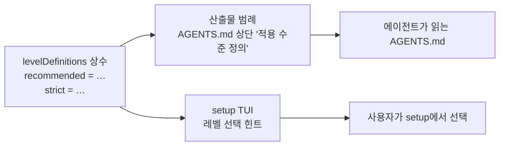
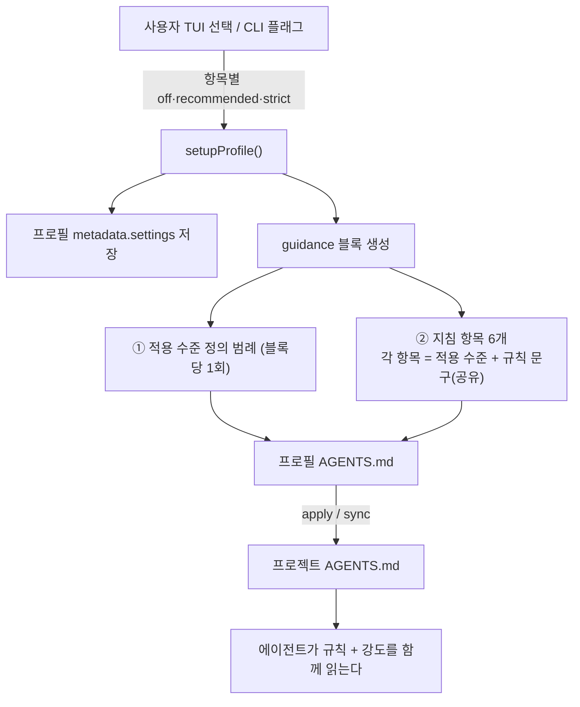

# 지침 적용 수준(off/recommended/strict)의 의미 정의

**상태:** Implemented

## 제안 요약

### 목적과 이유

| 항목 | 내용 |
| --- | --- |
| 제안 목표 | setup으로 고른 `recommended`/`strict`가 "무엇을 어느 강도로 지키라는 것"인지, 산출물 `AGENTS.md`와 setup TUI 양쪽에 정의로 노출한다. |
| 제안 이유 | 지금 산출물에는 `적용 수준: strict`라는 라벨만 있고 그 뜻이 어디에도 없다. 사람은 무엇을 고르는지, 에이전트는 무엇을 지켜야 하는지 판단할 근거가 없다. |

### 범위와 우선순위

| 항목 | 내용 |
| --- | --- |
| 대상 계층 | 사용자 · agctx CLI/TUI · 프로필 `AGENTS.md` |
| 결정할 것 | 레벨 정의 문구, 정의의 저장 위치(단일 정본), 산출물 범례 위치, TUI 노출 방식 |
| 비범위 | 지침 6개의 규칙 문구 변경, 레벨별로 다른 규칙 문구 생성, 새 레벨 추가, 새 CLI 명령 |
| 중요도 | Medium — 산출물 계약을 넓히지만 기존 선택 모델(항목별 3단계)은 그대로 둔다. |

### 의존성과 실행 순서

| 항목 | 내용 |
| --- | --- |
| 선행 작업 | [setup과 지침 옵션](setup-and-guidance.md)의 항목별 3단계(off/recommended/strict) 구현 |
| 선행 제안 | [setup과 지침 옵션](setup-and-guidance.md) (Implemented) |
| 후속 제안 | 없음 — 확정 시 ADR로 승격 |
| 연관 제안 | [프로젝트 적용](project-application.md), [관리 산출물 안전](managed-artifact-safety.md) |
| 후속 작업 | 확정 시 ADR 기록, `docs/contributing/architecture.md`·`docs/getting-started/quick-start.md`·`CHANGELOG.md` 정합화 |
| 권장 다음 작업 | 레벨 정의 문구 확정 → 실패 평가 추가 → 최소 구현 → `pnpm run check` |

## 목차

1. 현재 동작과 빈 곳
2. 제안: 레벨 정의를 단일 정본으로
3. 산출물 범례
4. TUI 노출
5. 데이터 흐름
6. 대안과 판단
7. 검증 계획
8. 영향과 문서 정합화
9. 구현 기록

---

## 1. 현재 동작과 빈 곳

`agctx profile setup`은 항목마다 `off`/`recommended`/`strict`를 받아 프로필 `AGENTS.md`의 guidance 블록을 만든다. 그런데 레벨을 바꿔도 산출물에서 바뀌는 것은 `적용 수준:` 라벨 한 줄뿐이고, 그 아래 규칙 문구는 두 레벨에서 동일하다.

실제로 `보안`을 strict와 recommended로 각각 생성해 비교하면 라벨 줄만 다르다.

```text
## 보안                          ## 보안

- 적용 수준: strict        vs    - 적용 수준: recommended
- 비밀값을 출력·커밋하지 않고,     - 비밀값을 출력·커밋하지 않고,
  외부 변경과 권한이 필요한         외부 변경과 권한이 필요한
  작업은 사용자 승인을 받는다.       작업은 사용자 승인을 받는다.
```

여섯 항목 전체의 diff도 `적용 수준` 줄만 바뀐다.

```text
< - 적용 수준: strict
---
> - 적용 수준: recommended
   (× 6항목, 규칙 문구는 전부 동일)
```

문제는 규칙 문구가 같다는 것 자체가 아니다. 같은 규칙을 다른 강도로 적용하는 모델은 타당하다. 진짜 빈 곳은 **`recommended`와 `strict`가 각각 무엇을 뜻하는지 정의가 산출물·템플릿 어디에도 없다**는 것이다. `templates/`를 전수 검색해도 두 단어의 정의는 나오지 않는다. 그래서 사람은 setup 화면에서 형용사만 보고 고르고, 에이전트는 `AGENTS.md`에서 형용사만 받아 스스로 해석한다.

| 관점 | 지금 받는 것 | 없는 것 |
| --- | --- | --- |
| setup을 고르는 사람 | `Recommended (일반적으로 권장되는 수준)` 힌트 | recommended와 strict가 실제로 무엇을 다르게 요구하는지 |
| `AGENTS.md`를 읽는 에이전트 | `적용 수준: strict` 라벨 | strict가 요구하는 행동 기준 |

## 2. 제안: 레벨 정의를 단일 정본으로

레벨의 뜻을 코드 한 곳(`agentic.mjs`의 `levelDefinitions` 상수)에 두고, **산출물 범례와 TUI 힌트가 둘 다 이 상수를 참조**한다. 문구를 고칠 곳이 하나가 되어 두 경로가 어긋나지 않는다.



레벨 문구를 고칠 곳은 상수 한 곳이다. 산출물 범례와 TUI 힌트가 같은 값을 읽기 때문에, 사용자가 고를 때 본 뜻과 에이전트가 읽는 뜻이 같아진다.

제안하는 정의(확정 대상):

| 레벨 | 뜻 |
| --- | --- |
| `recommended` | 기본값. 일반적으로 지키되, 합당한 이유가 있으면 예외를 두고 그 이유를 기록한다. |
| `strict` | 예외 없이 항상 적용한다. 위반을 발견하면 작업을 멈추고 해결한 뒤 진행한다. |
| `off` | 이 지침을 프로필에 포함하지 않는다. (산출물 블록에서 항목 자체가 빠지므로 범례에서는 생략) |

## 3. 산출물 범례

guidance 블록 맨 위, 첫 지침 항목 앞에 정의를 한 번 넣는다. 항목 6개는 지금처럼 규칙 문구를 공유한다.

```text
<!-- agctx:guidance:start -->

## 적용 수준 정의

- recommended: 기본값. 일반적으로 지키되, 합당한 이유가 있으면 예외를 두고 그 이유를 기록한다.
- strict: 예외 없이 항상 적용한다. 위반을 발견하면 작업을 멈추고 해결한 뒤 진행한다.

아래 각 지침의 `적용 수준`은 이 정의를 따른다.

## 작업 흐름

- 적용 수준: recommended
- …

## 보안

- 적용 수준: strict
- …

<!-- agctx:guidance:end -->
```

`## 적용 수준 정의`는 `##` 헤딩이지만 지침 항목명(`## 보안` 등)과 겹치지 않는다. 기존 평가(`evals/core.test.mjs`)가 확인하는 `## TDD` 존재와 `off` 항목(`## 리뷰`) 부재는 그대로 성립한다.

## 4. TUI 노출

지금 레벨 선택 화면의 힌트 자리(`일반적으로 권장되는 수준`)를 위 정의로 교체한다. 고르는 순간 각 레벨이 무엇을 뜻하는지 그 자리에서 보인다.

```text
◆  보안 — 비밀값 보호와 외부 변경 승인에 관한 규칙
   ○ Off        (이 지침을 프로필에 포함하지 않음)
 ● Recommended  (기본값 · 이유 있으면 예외 허용, 이유 기록)
   ○ Strict     (예외 없이 항상 적용 · 위반 시 작업 중단)
```

## 5. 데이터 흐름



레벨 값은 프로필 metadata와 guidance 블록 두 곳에 기록된다. 범례는 포함된 항목이 하나라도 있을 때 블록 맨 위에 한 번만 들어가며 프로젝트에는 `apply`·`sync`로 전달된다.

## 6. 대안과 판단

| 대안 | 내용 | 판단 |
| --- | --- | --- |
| 항목별 레벨 문구 | 지침 6개마다 recommended/strict의 구체 차이를 따로 작성 | 기각. 문구 6×2벌을 유지해야 하고, "같은 규칙, 강도만 선택"이라는 제품 모델과 어긋난다. |
| 산출물 범례만 | 에이전트 기준은 채우지만 사람의 선택 화면은 그대로 | 부분 채택. 범례는 넣되 TUI 힌트도 같은 정의로 채워 두 경로를 맞춘다. |
| **범례 1회 + TUI 힌트 (채택)** | 정의를 상수 한 곳에 두고 산출물·TUI가 공유 | 채택. 문구 유지 지점이 하나, 사람·에이전트 양쪽 커버. |

약한 곳을 먼저 짚는다. 레벨 정의는 규범 문장이라 에이전트가 **얼마나 다르게** 행동할지는 모델 해석에 달려 있다. 이 제안은 "무엇을 뜻하는지"를 명시할 뿐, 강제(빌드 차단 등)까지는 하지 않는다. 강제 수준은 이 저장소 밖 각 프로젝트 하네스의 몫이며 비범위다.

## 7. 검증 계획

1. **실패 평가 먼저.** `evals/core.test.mjs`에 추가: setup 산출물에 `## 적용 수준 정의`와 두 레벨 정의 문장이 있는지, 정의가 상수 단일 정본을 따르는지(범례 문구 == 레벨 상수) 확인.
2. 기존 평가(항목 선택·`off` 제외·TUI·경계 보존) green 유지.
3. `pnpm run check`(syntax → docs → test) 통과.

## 8. 영향과 문서 정합화

| 대상 | 변경 |
| --- | --- |
| `bin/agentic.mjs` | `levelDefinitions` 상수 추가, `setupProfile` 범례 삽입, TUI 힌트를 상수 참조로 교체 |
| `docs/adr/` | 산출물 계약 확장이므로 신규 ADR(`0002-*`) 기록 |
| `docs/contributing/architecture.md` | 채택 후 guidance 블록에 범례가 포함된다는 현재 사실 반영 |
| `docs/getting-started/quick-start.md` | setup 결과 설명에 레벨 정의 노출 반영(요약 + 이 문서 링크) |
| `CHANGELOG.md` | `Unreleased`에 사용자 영향(산출물·TUI에 레벨 정의 노출) 기록 |
| `setup-and-guidance.md` | 이 제안으로 링크 |

## 9. 구현 기록

#### 구현 기록: 적용 수준 정의를 산출물과 TUI에 노출

**상태 승격:** Proposed → Implemented (2026-09-14).

- `bin/i18n.mjs`에 `levelDefinitions` 상수와 `guidanceLevelDefinitions(locale)`를 추가했다. recommended·strict의 뜻을 한 곳에 둔다.
- `setupProfile`(`bin/agentic.mjs`)이 guidance 블록 맨 위에 "## 적용 수준 정의" 범례를 넣는다. 포함된 항목이 하나라도 있을 때만 넣는다.
- setup TUI의 레벨 힌트가 같은 상수를 읽는다. 사람과 에이전트가 같은 정의를 본다.
- 평가: `evals/profile.test.mjs`가 범례 존재와 "범례 문구 == 상수"를 확인한다.
- 채택한 정의는 [ADR 0005](../../../adr/0005-guidance-level-semantics.md)에 기록했다. 현재 사실은 [지침 카탈로그](../../../reference/guidance-catalog.md)에 반영했다.

#### 구현 기록: 세 수준을 켜고 끄는 두 값으로 줄임

**2026-09-18.** 상태는 Implemented 그대로다.

- 제안과 달라진 점이 결정 그 자체다. 이 문서는 세 수준의 **정의를 노출하는** 계약이었고, [ADR 0028](../../../adr/0028-guidance-on-off.md)이 그 가운데 두 수준을 없앴다. 제안 본문은 결정 이력이므로 그대로 둔다.
- 없앤 이유는 둘이다. 첫째, ADR 0026으로 다시 쓴 배포 문구에 예외를 열면 안 되는 규칙(승인·비밀값·테스트 무결성)이 많은데 `recommended`가 "이유를 적으면 예외를 둔다"는 길을 붙였다. 둘째, 두 수준이 에이전트 행동을 다르게 만든다는 근거가 없다. 이 문서와 ADR 0005 어디에도 왜 나누는지를 판단한 기록이 없었다.
- `GuidanceLevel`이 `'off' | 'on'`이 됐다. `levelDefinitions`·`guidanceLevelDefinitions`와 메시지 키 `setup.block.level`·`setup.legend.title`·`setup.legend.intro`를 지웠다. 산출물에서 범례와 항목마다 붙던 `적용 수준:` 줄이 빠졌다.
- 저장된 값은 `storedLevel`(`src/profile/setup.ts:39-42`)이 `recommended`·`strict`를 `on`으로 읽어 기존 프로필이 그대로 동작한다. CLI로 옛 값을 넘기면 사용법 오류(64)다.
- 평가: `evals/guidance-levels.test.ts`가 두 값 계약, 옛 값의 사용법 오류, 저장된 옛 값의 `on` 읽기, 범례와 수준 줄의 부재를 검사한다. 범례를 검사하던 `evals/profile.test.ts`의 평가는 요구가 바뀌어 지웠다.
- 실측: 모든 항목을 켠 블록이 한국어 56줄 9,077바이트 → 39줄 8,476바이트, 영어 56줄 8,175바이트 → 39줄 7,680바이트다.
