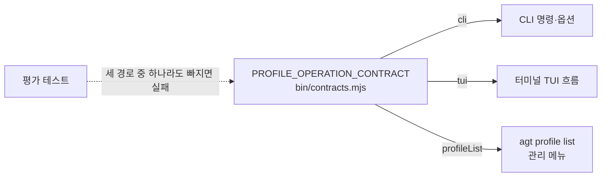

# 구현 계약 및 문서 규칙

**상태:** Active process

## 구현 단계 계약

### 인터페이스 동등성

새 사용자 기능은 공통 기능 레이어를 기준으로 다음 세 경로를 모두 제공해야 한다.

1. CLI 명령과 옵션
2. 터미널 TUI의 선택·입력 흐름
3. `agt profile list`에서 프로필을 선택한 뒤 실행하는 관리 메뉴

예외는 전역 도움말, 저장소 개발 전용 검사처럼 특정 프로필에 귀속되지 않는 기능뿐이다. 기능 registry와 평가 테스트에서 세 경로의 등록 누락을 실패로 처리한다.



기능을 하나 추가하면 registry의 한 항목에 세 경로를 함께 적는다. 평가가 registry를 기준으로 세 경로를 확인하므로 한 경로만 구현한 기능은 검사에서 걸린다.

각 단계는 다음 순서를 따른다.

1. 목표·범위·비범위를 문서에 기록한다.
2. 공개 CLI·파일 형식·소유권을 결정한다.
3. 실패하는 평가를 먼저 추가한다.
4. 최소 구현 후 전체 평가를 실행한다.
5. 코드·템플릿·README·제품 방향·workflow를 같은 변경에서 정합화한다.
6. 장기적이고 되돌리기 어려운 결정은 ADR로 기록한다.

## 문서 위치

| 내용 | 정본 |
| --- | --- |
| 제품 목표·범위·용어 | `docs/product-direction.md` |
| 현재 구현 | `docs/architecture/` |
| 미구현 계약·단계 계획 | `docs/discussion/architecture/` |
| 외부 근거 | `docs/references.md` |
| 사용 흐름의 설명·문제 해결 | `docs/usage-guide.md` |
| 사용 절차 요약·명령 소유권 | `docs/workflow.md` |
| CLI 명령·옵션·TUI 문법 | `docs/cli-reference.md` |
| 결정 이력 | `docs/adr/` |

같은 사실을 여러 문서에서 다시 정의하지 않는다. 요약이 필요한 문서는 정본으로 링크한다.

## 단계 완료 기록

```markdown
#### 단계 완료: <단계 이름>

* **결정:** 공개 계약과 선택한 정책
* **구현:** 코드·템플릿·문서
* **평가:** 추가·수정한 평가와 결과
* **제약:** 아직 지원하지 않는 범위
* **다음 단계:** 선행 조건
```
