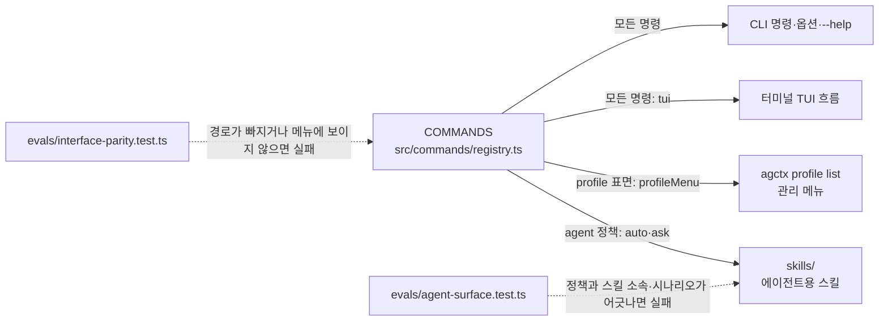
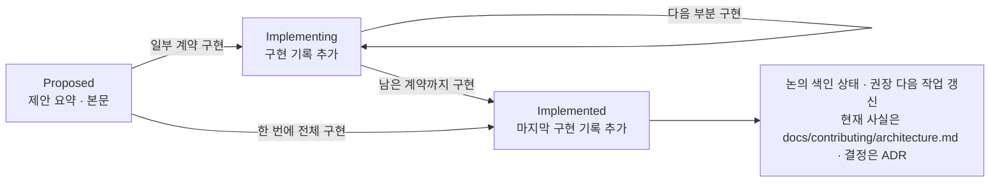

# 구현 계약 및 문서 규칙

**상태:** Active process

## 구현 단계 계약

### 인터페이스 동등성

모든 명령은 CLI와 TUI에서 실행할 수 있어야 하고, 프로필 관리 메뉴까지 필요한지는 명령 등록부(`src/commands/registry.ts`)에 적는 표면(surface)이 정한다([ADR 0025](../../../adr/0025-every-command-in-cli-and-tui.md), 등록부 계약은 [ADR 0016](../../../adr/0016-command-contract.md)).

| 표면 | 대상 | 필수 경로 |
| --- | --- | --- |
| `profile` | 특정 프로필을 다루는 기능(create·setup·apply·sync·clone·pull 등) | CLI 명령·옵션, 터미널 TUI, `agctx profile list`에서 프로필을 고른 뒤의 관리 메뉴 |
| `repository` | 저장소나 CI를 다루는 기능(`check`·`explain`·`verify`·`repos`) | CLI 명령·옵션, 터미널 TUI(첫 화면의 프로젝트 점검·여러 저장소 메뉴) |
| `global` | 전역 도움말·언어 설정 | CLI 명령·옵션, 터미널 TUI(첫 화면) |



기능을 추가하면 등록부에 항목을 하나 넣고 표면과 TUI 항목(`tui`)을 정한다. `tui`는 필수 필드라 빠뜨리면 형식 검사가 실패한다. 평가는 그 키가 첫 화면·프로필 관리·프로젝트 점검·여러 저장소 메뉴 가운데 한 곳에 보이는지, 메뉴 항목마다 동작이 연결됐는지, `profile` 명령이 관리 메뉴에 있는지 확인한다. TUI가 옵션을 질문으로 받는 흐름은 `evals/tui-commands.test.ts`가 답과 CLI 옵션이 같은지 검사한다.

**에이전트도 같은 계약 아래 둔다.** 등록부의 `agent` 정책(`auto`·`ask`·`never`)이 어느 스킬이 그 명령을 싣는지 정한다. 정책은 `changes`에서 유도되므로 새 명령이 정책 없이 존재할 수 없고, `evals/agent-surface.test.ts`가 정책에 맞는 스킬 소속과 「Pick the command」 시나리오 덮음을 검사한다. 노출만으로는 부족한 이유는 에이전트가 스킬 `description`만 보고 호출을 정하기 때문이다([ADR 0029](../../../adr/0029-agent-surface-contract.md)).

| 정책 | 담는 스킬 | 대상 |
| --- | --- | --- |
| `auto` | `skills/agctx` (모델이 스스로 부름) | `changes: 'none'`인 읽기 전용 명령 |
| `ask` | `skills/agctx-author` (이름으로 부를 때만) | 프로필 보관함·저장소·원격을 바꾸는 명령 |
| `never` | 없음 | `profile remove`·`config lang`·`help` |

TUI에는 `--json`, `--yes`, 단독 `--dry-run`, 한 번만 쓰는 `--lang`을 요구하지 않는다. 사람이 화면을 보며 답하는 경로라 계획을 보여 준 뒤 확인을 묻고 결과의 뜻을 보여 주는 것으로 대신한다. TUI로 옮길 수 없는 명령이 생기면 새 ADR로 예외와 이유를 정한다.

각 단계는 다음 순서를 따른다.

1. 목표·범위·비범위를 문서에 기록한다.
2. 공개 CLI·파일 형식·소유권을 결정한다.
3. 실패하는 평가를 먼저 추가한다.
4. 최소 구현 후 전체 평가를 실행한다.
5. 코드·템플릿·README·제품 방향·workflow를 같은 변경에서 정합화한다.
6. 장기적이고 되돌리기 어려운 결정은 ADR로 기록한다.

## 문서 위치

| 내용 | 정본 |
| --- | --- |
| 제품 목표·범위·용어 | `docs/contributing/product-direction.md` |
| 현재 구현 | `docs/contributing/architecture.md` |
| 미구현 계약·단계 계획 | `docs/discussion/architecture/` |
| 외부 근거 | `docs/references.md` |
| 설치·상황별 사용 절차·동작 원리 | `docs/getting-started/`, `docs/guides/`, `docs/concepts/` |
| 사용 흐름 요약·명령 소유권 | `docs/README.md`, `docs/concepts/why-agctx.md` |
| CLI 명령·옵션·종료 코드·파일 형식 | `docs/reference/` |
| 결정 이력 | `docs/adr/` |

같은 사실을 여러 문서에서 다시 정의하지 않는다. 요약이 필요한 문서는 정본으로 링크한다.

## 구현 기록

논의 문서의 계약을 구현하면 같은 변경에서 그 논의 문서에 결과를 기록한다. 제안 본문은 결정 이력으로 남기고, 실제로 무엇이 구현됐고 제안과 무엇이 달라졌는지는 구현 기록으로 더한다. 그래야 논의 문서만 읽어도 제안에서 구현까지의 경로를 따라갈 수 있다.



구현이 한 단계 진행될 때마다 논의 문서에 기록이 하나씩 쌓인다. 상태를 바꾸는 변경과 기록을 추가하는 변경은 같은 커밋이나 PR에 들어간다.

| 시점 | 논의 문서에서 갱신할 것 |
| --- | --- |
| 일부 계약을 구현했을 때 | 상태를 `Implementing`으로 바꾸고 구현한 범위마다 구현 기록을 하나 추가한다. 논의 색인의 상태와 제안 요약의 `권장 다음 작업`을 남은 계약 기준으로 고친다. |
| 남은 계약까지 모두 구현했을 때 | 상태를 `Implemented`로 바꾸고 마지막 구현 기록을 추가한다. 논의 색인의 상태를 맞추고 현재 사실은 `docs/contributing/architecture.md`에, 되돌리기 어려운 결정은 ADR에 옮긴다. |
| 구현하면서 계약이 제안과 달라졌을 때 | 제안 본문을 지우지 않는다. 달라진 내용과 이유를 구현 기록의 `계획과 달라진 점`에 적는다. |

```markdown
#### 구현 기록: <구현한 범위>

* **결정:** 공개 계약과 선택한 정책
* **구현:** 코드·템플릿·문서
* **평가:** 추가·수정한 평가와 실행 결과
* **계획과 달라진 점:** 제안과 다르게 구현한 부분과 이유. 없으면 "없음"
* **제약:** 아직 지원하지 않는 범위
* **다음 단계:** 남은 계약과 선행 조건
```

- 제목은 `#### 구현 기록: <구현한 범위>` 형식으로 쓴다. `pnpm run check`의 `check:docs`는 상태가 `Implemented`인 문서에 이 형식의 제목이 코드 블록 밖에 하나 이상 있는지 검사한다. 기록 내용이 정확한지는 검사하지 않으므로 리뷰에서 확인한다.
- `Implementing` 문서도 같은 규칙을 따르지만 아직 검사로 강제하지 않는다. 구현 기록이 없는 `Implementing` 문서가 남아 있기 때문이며, 모두 기록을 갖추면 검사 대상에 넣는다.
- 이 형식보다 먼저 쓴 기록은 항목 구성이 달라도 그대로 둔다. 새로 추가하는 기록부터 위 항목을 채운다.
