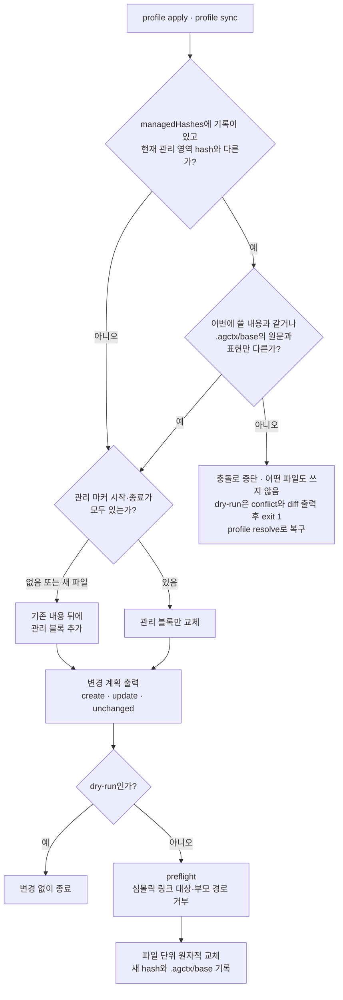
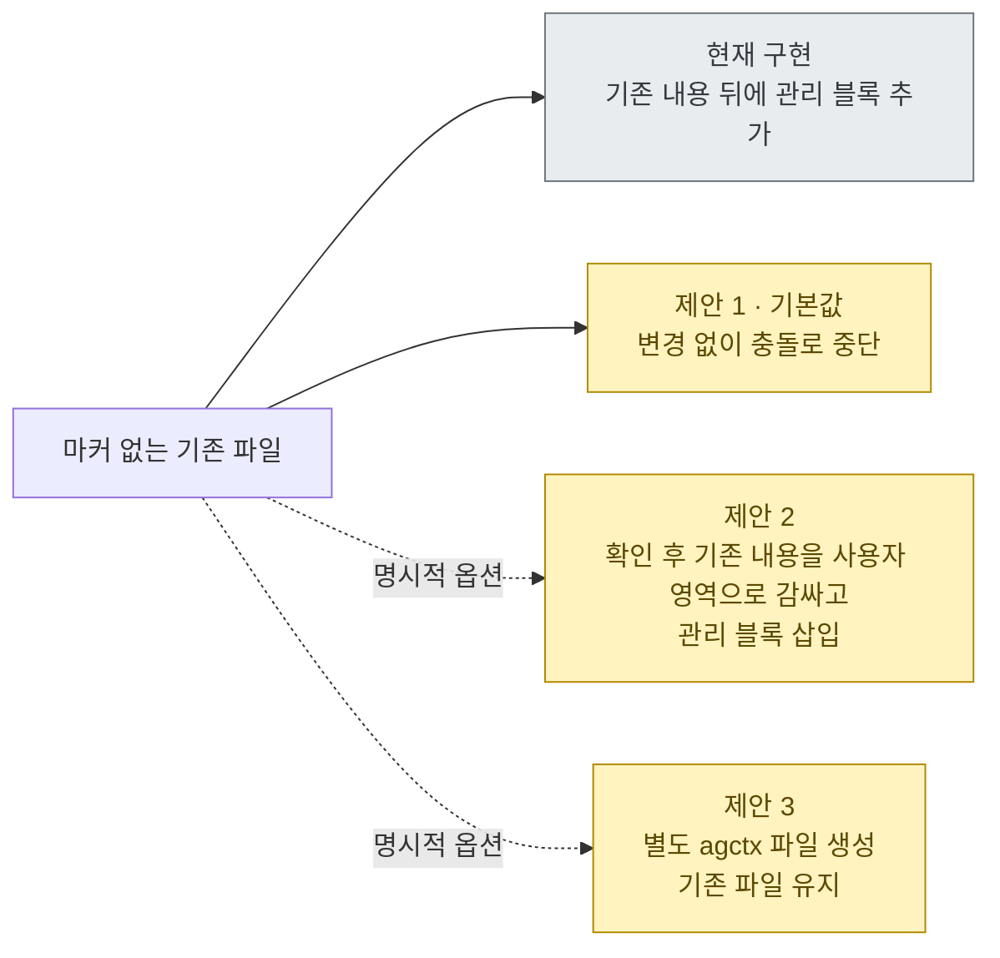
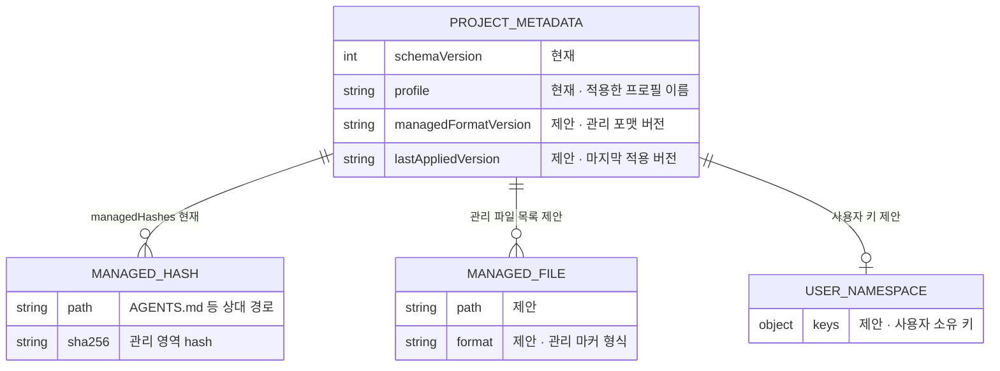
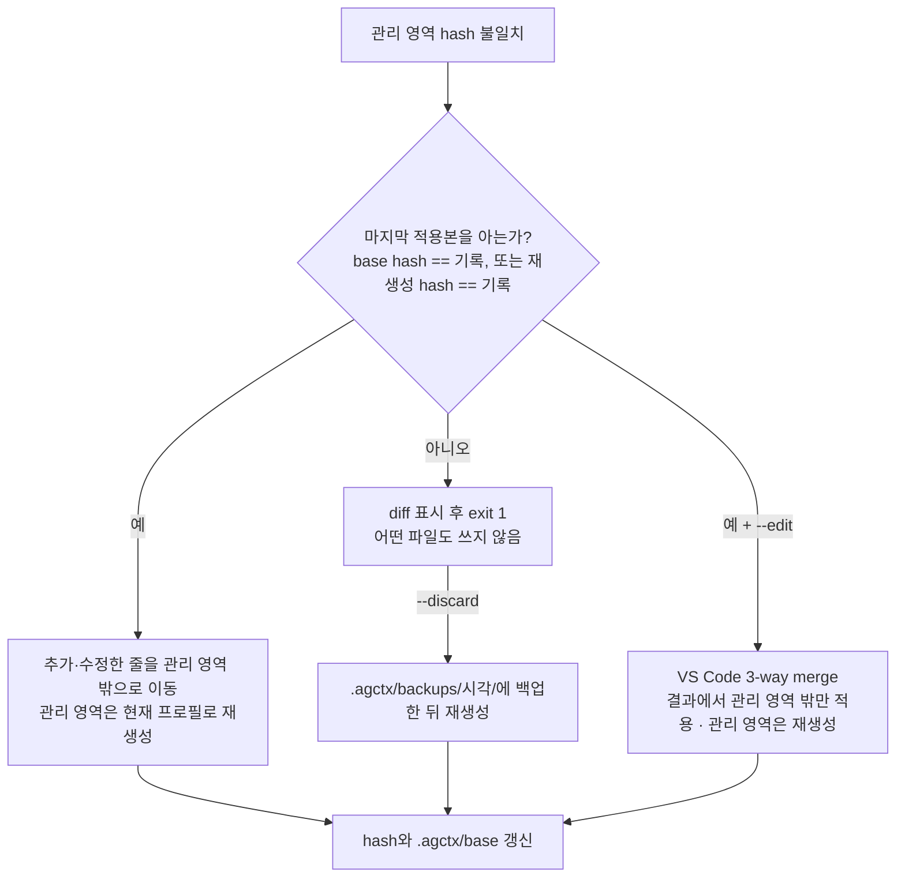

# agctx 관리 산출물의 안전한 동기화

<!-- agctx:generated:status:start -->
**상태:** Implementing
<!-- agctx:generated:status:end -->

## 제안 요약

### 목적과 이유

| 항목 | 내용 |
| --- | --- |
| 제안 목표 | `profile apply`·`profile sync`가 agctx 관리 영역만 갱신하고 사용자 작성 지침과 수동 변경을 안전하게 보존하도록 한다. |
| 제안 이유 | 현재 `AGENTS.md`는 프로필 소유 영역과 프로젝트 확장 영역을 구분하고, 에이전트별 산출물은 관리 블록과 사용자 영역을 구분하며, dry-run과 관리 영역 hash 충돌 감지를 제공한다. 충돌 시각화와 마지막 적용본 기반 복구(`profile resolve`)는 [ADR 0008](../../../adr/0008-managed-conflict-recovery.md)로 구현했지만 마커 손상 진단·마커 없는 파일 정책·여러 파일 롤백은 아직 부족하다. 사용자가 관리 영역을 직접 수정하거나 마커가 없는 기존 파일을 업그레이드할 때 안전한 중단·복구 계약이 필요하다. |

### 범위와 우선순위

| 항목 | 내용 |
| --- | --- |
| 대상 계층 | agctx CLI/TUI·프로필·대상 프로젝트의 `AGENTS.md`·에이전트별 지침 산출물 |
| 결정할 것 | 관리 마커 형식, 사용자 영역 보존 규칙, 마커 없는 기존 파일 처리, dry-run·승인·백업·충돌 정책, 프로젝트 메타데이터의 관리 파일 기록 방식 |
| 중요도 | Critical — 동기화의 신뢰성과 사용자 파일 보존에 직접 영향을 주는 데이터 안전 경계 |

### 의존성과 실행 순서

| 항목 | 내용 |
| --- | --- |
| 선행 작업 | 프로필·프로젝트 적용·에이전트 산출물의 현재 소유권과 재생성 계약 확인 |
| 선행 제안 | [프로필 모델과 저장소](profile-model.md), [프로젝트 적용](project-application.md), [에이전트 산출물 동기화](agent-sync.md) |
| 후속 제안 | 비대화형 실행·충돌 결과 계약, 버전 업그레이드와 복구 정책 |
| 연관 제안 | [자연어 요청을 통한 agctx 사용](agent-mediated-usage.md), [구현 계약 및 문서 규칙](implementation-contracts.md) |
| 후속 작업 | 관리 파일 manifest·마커 없는 파일 정책·여러 파일 롤백을 추가하고, 기존 프로젝트 업그레이드 경로를 검증한다. |
| 권장 다음 작업 | 관리 영역의 경계 표시와 포매터 차이 판정은 [ADR 0034](../../../adr/0034-managed-end-marker-in-agents-md.md)로 확정해 구현했다. 남은 것은 마커가 없는 기존 파일을 자동으로 덮어쓰지 않는 기본 정책과, 파일별 소유권을 `agctx.project.json`에 기록하는 일이다. |

## 목차

- [현재 동작과 위험](#현재-동작과-위험)
- [보존 범위](#보존-범위)
- [권장 설계](#권장-설계)
- [동기화 시나리오](#동기화-시나리오)
- [비범위와 금지할 접근](#비범위와-금지할-접근)
- [결정·검증 항목](#결정검증-항목)

## 현재 동작과 위험

현재 `profile apply`과 `profile sync`는 다음과 같이 동작한다.

- 프로필의 공통 지침을 프로젝트 `AGENTS.md`에 적용한다.
- 기존 `AGENTS.md`의 프로젝트 지침은 확장 영역으로 보존한다.
- `CLAUDE.md`, `.agents/rules/`는 agctx 관리 마커 내부만 갱신하고, 기존 사용자 내용은 보존한다.
- `agctx.project.json`에는 선택된 프로필을 기록한다.

따라서 기존 `AGENTS.md`와 에이전트별 산출물의 사용자 내용은 현재 구현에서 보존된다. `AGENTS.md`는 프로필 소유 영역의 hash를, 에이전트별 산출물은 관리 블록의 hash를 기록하며, 기록된 영역을 직접 수정하면 충돌로 중단한다. 충돌이 나면 `--dry-run`이 diff를 보여 주고 `profile resolve`가 복구한다. 마커 손상에 대한 세분화된 진단은 아직 구현되지 않았다.

`profile sync`를 여러 번 실행할 수 있다는 점도 중요하다. 첫 적용 이후 사용자가 파일을 수정했을 때, 현재 구현은 관리 마커 밖의 내용을 보존하고 기록된 관리 영역의 hash를 비교해 수동 수정이면 중단한다. 충돌 내용은 dry-run diff로 보여 주고 `profile resolve`로 복구한다([구현 기록](#구현-기록-충돌-표시와-resolve)). 단순히 “포인터 파일이므로 덮어쓴다”고 문서화하는 것만으로는 안전한 업그레이드 계약이 되지 않는다.

현재 구현이 에이전트별 산출물 하나를 판정하는 순서는 다음과 같다.



쓰기 전에 모든 대상의 hash를 먼저 비교하므로 한 파일이라도 충돌하면 어떤 파일도 바뀌지 않는다. 한쪽 마커만 남은 파일은 hash 기록이 있으면 불일치로 중단된다. 기록이 없으면 마커가 없는 파일처럼 관리 블록이 덧붙는다. `AGENTS.md`는 파일 처음부터 `<!-- agctx:managed:end -->`까지를 관리 영역으로 보고, 그 마커가 없는 파일에서만 프로젝트 확장 헤딩으로 경계를 찾는다([ADR 0034](../../../adr/0034-managed-end-marker-in-agents-md.md)). hash 비교 순서는 두 경우 모두 같다.

## 보존 범위

| 대상 | agctx가 갱신할 수 있는 영역 | 사용자 보존 영역 |
| --- | --- | --- |
| `AGENTS.md` | 프로필 공통 지침 영역 | 프로젝트 도메인 지침과 기존 사용자 지침 |
| `CLAUDE.md` | agctx 공통 지침 블록 | Claude 전용 추가 지침 |
| `.agents/rules/agctx.md` | agctx 블록 | 같은 파일의 사용자 블록 또는 별도 사용자 파일 |
| `agctx.project.json` | agctx 메타데이터 | 사용자 소유 키를 둘 경우 별도 네임스페이스로 보존 |

이 표의 관리 영역·사용자 보존 원칙·dry-run·관리 영역 수정 감지는 현재 구현에 반영되어 있다. 관리 마커가 없는 에이전트별 파일은 기존 내용을 보존한 뒤 관리 블록을 추가한다. `AGENTS.md`는 기존 확장 영역을 보존하면서 프로필 영역 hash를 기록한다. 충돌 시각화·복구는 `profile resolve`로 구현했다.

## 권장 설계

### 관리 영역과 사용자 영역의 명시적 분리

agctx가 생성하는 파일에는 안정적인 시작·종료 마커를 둔다.

```md
<!-- agctx:managed:start -->
agctx가 프로필에서 생성한 내용
<!-- agctx:managed:end -->

<!-- agctx:user:start -->
사용자가 직접 작성한 내용
<!-- agctx:user:end -->
```

`profile sync`는 관리 마커 내부만 갱신한다. 마커 밖의 내용은 agctx가 해석하거나 정리하지 않고 그대로 보존한다. 파일 형식상 주석을 허용하지 않거나 여러 파일을 구성하는 도구는 동일한 소유권을 표현할 수 있는 별도 agctx 파일과 사용자 파일 분리 방식을 검토한다.

### 마커 없는 파일은 자동 덮어쓰지 않음

기존 파일에 agctx 마커가 없으면 다음 중 하나를 선택하도록 해야 한다.

1. 변경하지 않고 충돌로 중단한다.
2. 사용자의 확인을 받은 뒤 기존 내용을 사용자 영역으로 감싸고 관리 블록을 삽입한다.
3. 새 agctx 파일을 별도로 만들고 기존 파일은 건드리지 않는다.

기본값은 1번처럼 보수적으로 중단하는 것이 안전하다. 기존 프로젝트의 관례와 도구별 파일 우선순위에 따라 2번 또는 3번을 선택할 수 있도록 명시적인 옵션을 제공할 수 있다.



현재 구현은 확인 없이 관리 블록을 덧붙인다. 제안은 기본 동작을 중단으로 바꾼다. 감싸기와 별도 파일 생성은 사용자가 옵션으로 고를 때만 허용한다.

### dry-run과 변경 증거

`profile apply`·`profile sync`·향후 삭제나 마이그레이션은 실제 변경 전에 다음 정보를 보여줘야 한다.

- 선택된 프로필과 대상 프로젝트
- 생성·갱신·보존·충돌 파일
- 각 파일에서 agctx가 변경할 관리 영역
- 사용자 승인 여부와 승인하지 않았을 때의 결과

`--dry-run`은 파일을 변경하지 않고 이 계획만 출력해야 한다. 자동화 환경에서는 안정적인 종료 코드와 기계 판독 가능한 결과 형식을 함께 제공해야 한다.

### 충돌 중단과 복구

관리 마커가 손상되었거나, 관리 영역을 사용자가 수정했거나, 파일 형식이 예상과 다르면 자동 동기화를 중단한다. 변경 전 백업 또는 원자적 임시 파일 교체를 사용하고, 실패 시 원래 파일을 복원할 수 있어야 한다. 충돌을 무시하고 `--force`로 덮어쓰는 기능은 기본 경로가 될 수 없으며, 명시적 대상·경고·승인을 요구해야 한다.

### 메타데이터 추적

`agctx.project.json`에는 선택 프로필뿐 아니라 agctx가 관리하는 파일, 관리 포맷 버전, 마지막 적용 버전을 기록하는 방안을 검토한다. 사용자 정의 키가 허용될 경우 agctx 네임스페이스와 사용자 네임스페이스를 구분해 메타데이터 자체의 덮어쓰기도 방지한다.



지금 `agctx.project.json`에 기록되는 값은 `schemaVersion`, `profile`, `managedHashes`다. `제안`으로 표시한 필드와 엔터티는 검토 중이며 이름도 확정되지 않았다. 현재 구현은 모르는 키를 지우지 않고 다시 기록하지만 사용자 네임스페이스를 따로 구분하지는 않는다.

## 동기화 시나리오

| 상황 | 권장 동작 |
| --- | --- |
| agctx가 처음 만든 파일 | 관리 블록을 만들고 사용자 확장 위치를 안내한다. |
| 마커가 있는 정상 에이전트 파일 또는 정상 프로필 영역 | 관리 영역만 최신 프로필로 갱신하고 사용자 영역은 보존한다. |
| 마커가 없는 기존 파일 | 자동 덮어쓰지 않고 dry-run·충돌·사용자 선택을 제공한다. |
| 관리 마커가 일부만 존재 | 동기화를 중단하고 파일 복구 또는 마이그레이션을 요구한다. |
| 사용자가 관리 블록을 수정 | diff와 충돌을 표시하고 기본적으로 중단한다. 구현됨: `--dry-run` diff 표시, `profile resolve`가 편집을 관리 영역 밖으로 옮기고 다시 생성 |
| 마지막 적용본을 모르는 상태에서 프로필도 바뀐 충돌 | 멈추고 diff를 보인다. 구현됨: `profile resolve --discard`가 `.agctx/backups/`에 백업한 뒤 다시 생성 |
| 프로필이 삭제되었지만 프로젝트는 남아 있음 | 이미 적용된 프로젝트 파일은 삭제하지 않고, 다음 sync 실패 원인을 안내한다. |
| 동기화 중 알려진 위험 또는 개별 파일 쓰기 실패 | 쓰기 전 모든 대상의 심볼릭 링크 여부를 preflight하고, 파일 단위 원자적 임시 파일 교체로 깨진 파일을 남기지 않는다. 여러 파일 전체의 롤백은 후속 작업이다. |

## 비범위와 금지할 접근

- 사용자 영역까지 정규식으로 재작성하거나 “비슷해 보이는” 내용을 자동 병합하지 않는다.
- 현재 템플릿과 같다는 이유만으로 사용자 파일 전체를 안전하다고 간주하지 않는다.
- `--force`를 일반적인 업그레이드 방법으로 문서화하지 않는다.
- 프로필 삭제를 프로젝트 파일 삭제로 연결하지 않는다.
- 관리 마커 도입을 에이전트 런타임 래핑이나 TUI 자동 조작의 근거로 사용하지 않는다.

## 결정·검증 항목

채택 전에 다음을 확정하고 평가한다.

- 지원하는 파일 형식별 관리 마커와 사용자 확장 방식
- 마커 없는 기존 파일의 기본 처리와 명시적 마이그레이션 옵션
- 관리 블록 수동 수정 감지 기준
- `--dry-run`의 현재 출력 계약을 안정화하고, 종료 코드·JSON 스키마·승인 규칙을 확정
- 백업 위치·보존 기간·파일 단위 원자적 쓰기·여러 파일 부분 실패 복구 방식
- `agctx.project.json`의 파일 소유권·포맷 버전·사용자 키 보존 규칙
- 첫 `profile apply` 이후 사용자 수정, 반복 `profile sync`, 프로필 변경, 프로필 삭제를 포함한 격리 평가
- TUI·CLI·`agctx profile list`에서 동일한 안전 정책에 접근할 수 있는지 여부

이 논의가 채택되면 현재 아키텍처, CLI Reference, 사용자 문서, 관련 ADR을 같은 변경에서 갱신한다. 현재는 사용자 영역 보존·관리 영역 갱신·dry-run·수동 관리 영역 수정 중단·대상 preflight·파일 단위 원자적 교체·충돌 diff 표시·`profile resolve` 복구까지 구현되어 있으며, 여러 파일 전체 롤백과 마커 없는 파일 정책은 아직 사용자 문서에서 제공 기능으로 표현하지 않는다.

#### 구현 기록: 충돌 표시와 resolve



자동으로 풀 수 있는지는 마지막 적용본을 아는지로 갈린다. 모르면 사용자 편집과 프로필 변경이 섞여 있어 명시적인 `--discard`가 있을 때만 백업 후 다시 만든다.

* **결정:** 마지막으로 쓴 관리 영역 원문을 `.agctx/base/`에 저장하고, 이를 기준으로 관리 영역 안의 편집을 밖으로 옮긴다. 근거는 [ADR 0008](../../../adr/0008-managed-conflict-recovery.md)이다.
* **구현:** `bin/project-plan.mjs`가 충돌을 throw하지 않고 모으고, `bin/conflicts.mjs`가 편집 추출·재배치·diff를, `bin/merge-editor.mjs`가 VS Code 3-way merge를 맡는다. `profile resolve`를 CLI·`profile list` 관리 메뉴·TUI 충돌 흐름에 등록했다.
* **평가:** `evals/conflicts.test.mjs`, `evals/conflict-resolve.test.mjs`.
* **제약:** 템플릿 줄을 고친 편집은 비슷한 문장이 두 번 남을 수 있다. base가 없는 기존 프로젝트는 다음 성공한 적용부터 base가 생긴다. 실제 VS Code 창, Windows `code.cmd`, 대화형 TUI 조작은 자동 평가하지 않는다.
* **정정:** 실제 VS Code 확인에서 저장 시 포매터(Prettier)가 관리 블록을 바꿔 `--edit` 결과가 항상 거부되는 문제가 드러났다. `--edit`은 결과에서 관리 영역 밖만 가져오고 관리 영역은 다시 만들도록 바꿨다. 근거는 [ADR 0010](../../../adr/0010-edit-merge-regenerates-managed-area.md)이다.
* **다음 단계:** 마커 없는 파일 정책, 마커 손상 진단, 여러 파일 전체 롤백, 관리 파일 manifest.

#### 구현 기록: APM 생성 파일 보호와 모노레포 연결 파일 (2026-09-16)

* **결정:** [ADR 0020](../../../adr/0020-apm-coexistence-and-monorepo-links.md). APM이 기본 모드에서 통째로 다시 만드는 `AGENTS.md`·`CLAUDE.md`에는 관리 영역을 더하지 않고 멈춘다. `AGENTS.md`의 APM `managed_section` 블록은 프로젝트 영역의 내용으로 보고 그대로 둔다. 하위 폴더의 `AGENTS.md`마다 옆에 관리 블록만 담은 `CLAUDE.md` 연결 파일을 만들고, 사람이 둔 `CLAUDE.md`는 건드리지 않는다.
* **구현:** `src/project/apm.ts`(생성 표시 판정), `src/project/links.ts`(하위 `AGENTS.md` 찾기·사람이 둔 연결 확인), `src/project/plan.ts`(연결 파일 계획과 경고), `templates/CLAUDE.link.md`, `src/repos/sync.ts`(연결 파일도 커밋하지 않은 변경 검사에 포함). 사용법은 [CLI Reference](../../../reference/cli.md#profile-apply)에 있다.
* **평가:** `evals/apm-coexistence.test.ts` 3개, `evals/monorepo-links.test.ts` 3개. 실제 apm-cli 0.30.0과 함께 두 적용 순서를 실행했다([외부 근거](../../../references.md#apm과-함께-쓰기-근거)).
* **계획과 달라진 점:**
  - "마커 없는 파일은 자동 덮어쓰지 않음"은 다른 도구가 통째로 다시 만드는 파일부터 적용했다. 사람이 쓴 루트 `CLAUDE.md`에 관리 블록을 덧붙이는 기존 동작은 그대로다.
  - 연결 파일은 사람이 둔 `CLAUDE.md`·`.claude/CLAUDE.md`·심볼릭 링크를 사용자 소유로 보고 쓰지 않는다. 그 파일이 `AGENTS.md`를 가져오지 않으면 경고만 한다.
  - 하위 `AGENTS.md`가 없어진 연결 파일은 지우지 않고 관리 기록에서만 뺀다.
* **제약:** APM 말고 다른 도구의 생성 파일은 알아보지 않는다. 연결 파일은 Claude Code만을 위한 것이다. 하위 폴더에서 시작한 Claude Code가 루트 `CLAUDE.md`의 `@AGENTS.md`를 읽으려면 여전히 한 번 승인해야 하고, Antigravity는 하위 폴더 `AGENTS.md`를 세션 시작에 받지 않는다.
* **다음 단계:** 사람이 쓴 마커 없는 루트 파일의 기본 처리, 마커 손상 진단, 여러 파일 전체 롤백, 관리 파일 manifest.

#### 구현 기록: AGENTS.md의 경계 마커와 포매터 차이 판정 (2026-09-21)

* **결정:** [ADR 0034](../../../adr/0034-managed-end-marker-in-agents-md.md). 프로젝트 `AGENTS.md`의 관리 영역은 파일 처음부터 `<!-- agctx:managed:end -->`까지이고, 마커 아래는 확장 섹션 제목과 그 아래 안내 한 줄까지 전부 사용자 것이다. 마커가 없는 파일은 지금까지처럼 확장 섹션 제목으로 경계를 찾되 이 경로는 마이그레이션 전용이며, `profile sync` 한 번이면 마커가 들어간다. 관리 영역이 마지막으로 쓴 원문과 표현만 다르면 사람이 고친 것으로 보지 않는다.
* **구현:** 경계 상수는 `src/project/conflicts.ts`의 `MANAGED_END`이고, 그 마커로 관리 영역을 자르고 아래를 보존하는 판정은 `src/project/analyzer.ts`의 `extractAgentsManagedDocument`와 `mergeAgentsMd`가 한다. 표현 차이를 평탄화해 비교하는 것은 같은 파일의 `formatterNormalized`이며, 포매터가 다시 쓸 줄을 찾아내는 것은 `formatterUnstableLines`다. 마커를 넣고 프로필 전용 표지 `<!-- agctx:guidance:start/end -->` 두 줄을 빼는 곳은 `src/profile/apply.ts`의 `renderProfileAgents`다. 충돌 여부는 `src/project/plan.ts`의 `planProject`가 정하고, `src/check.ts`의 `checkProject`는 프로필이 보관함에 있으면 같은 계획을 만들어 `sync`와 같은 기준으로 판정한다. `templates/CLAUDE.md`와 `templates/antigravity-rules/agctx.md`의 목록 기호와 제목 뒤 빈 줄도 포매터가 바꾸지 않는 형태로 맞췄다.
* **평가:** `evals/formatter-stability.test.ts` 11개를 새로 넣어 템플릿과 `renderProfileAgents`의 출력이 포매터를 통과해도 바뀌지 않는지, 표현만 다른 관리 영역이 충돌이 아닌지, 낱말이 바뀌면 여전히 충돌인지 검사한다. `evals/sync-merge.test.ts`에 마커가 경계를 정하는 경우와 마커가 없는 파일이 제목으로 경계를 찾는 경우 5개를 더했다. `pnpm run check`로 평가 246개와 문서 검사가 통과한다.
* **측정:** 제보된 프로젝트의 사본에서 `agctx check`가 `conflict`(2)에서 `behind`(1)로 바뀌어 `profile sync` 한 번에 풀렸다. `npx prettier@3 --prose-wrap always`로 포맷한 프로젝트도 같았고, 같은 파일에서 낱말 하나를 바꾸자 다시 `conflict`(2)로 멈췄다([근거](../../../references.md#포매터가-관리-영역을-바꾸는-범위)).
* **계획과 달라진 점:** [권장 설계](#관리-영역과-사용자-영역의-명시적-분리)는 시작과 종료 마커를 쌍으로 두자고 제안했으나, 프로젝트 `AGENTS.md`에는 종료 마커만 뒀다. 이 파일은 첫 줄부터 관리 영역이라 시작을 적을 곳이 없고, 표지를 둘 두면 사용자가 쓸 수 있는 자리가 위아래로 갈리기 때문이다. 포인터 파일의 마커 쌍은 그대로다.
* **제약:** 마커를 지우면 제목 탐지로 되돌아가고, 제목까지 없으면 파일 전체가 관리 영역이 되어 충돌한다. 표현 차이 판정은 `.agctx/base/`에 마지막으로 쓴 원문이 있을 때만 쓸 수 있고, 원문을 알 수 없으면 지금까지처럼 해시만 비교한다. 마커 손상에 대한 세분화된 진단과 여러 파일 전체 롤백은 여전히 없다.
* **다음 단계:** 마커가 없는 기존 파일의 기본 처리를 [제안 1·2·3](#마커-없는-파일은-자동-덮어쓰지-않음) 가운데 하나로 확정하고, 관리 파일 manifest를 `agctx.project.json`에 기록해 파일별 소유권을 남긴다.
