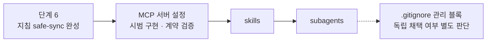
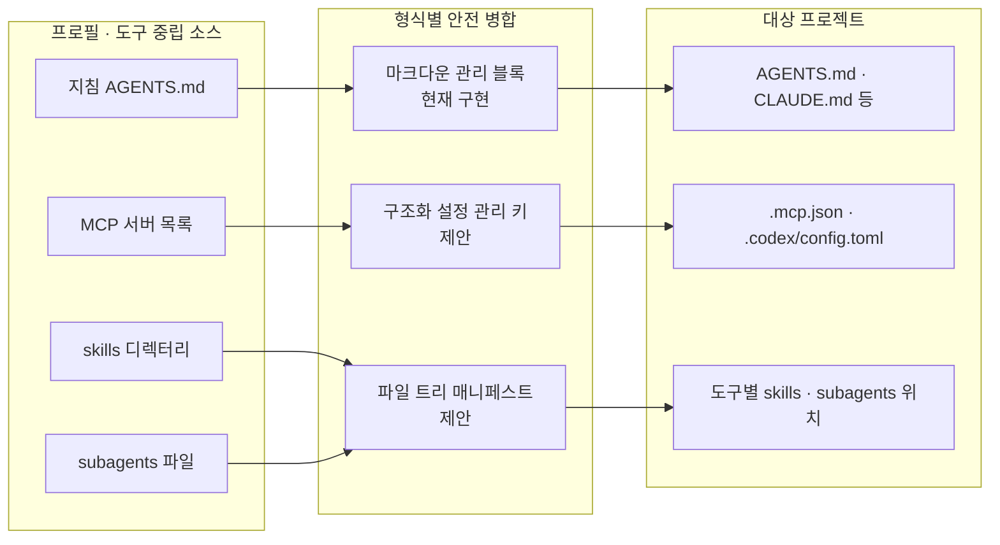

# 프로필 설정 표면 확장 (지침 → 지침·MCP·skills·subagents·hooks)

**상태:** Proposed

## 제안 요약

### 목적과 이유

| 항목 | 내용 |
| --- | --- |
| 제안 목표 | 프로필이 담는 대상을 지침 텍스트에서 MCP 서버 설정·skills·subagents·hooks까지 넓힌다. 팀이 "같은 규칙"만이 아니라 "같은 에이전트 환경"을 프로필 하나로 공유·적용·동기화하게 한다. |
| 제안 이유 | 지금 프로필은 지침 텍스트 한 종류만 담는다(제품 방향 「범위와 경계」). 그러나 팀이 실제로 통일하고 싶은 것은 규칙뿐 아니라 각 에이전트가 무는 MCP 서버, 공유 skills, subagents, 규칙을 강제하는 hooks까지다. 이들이 프로필 밖에 있으면 "개발자·팀·에이전트가 달라도 기준은 하나"라는 명제가 규칙 텍스트에서만 성립하고, 정작 도구·역량 설정은 개발자마다 갈린다. 경쟁 도구 ruler는 이미 이 설정 표면 전체(규칙·MCP·skills·subagents·gitignore)를 30여 개 도구에 뿌린다. 다만 ruler에는 프로필·스코프 개념이 없고, 대상 파일을 병합하지 않고 통째로 재생성해 덮어쓴다. |

> 이 제안은 "타깃 도구 수를 늘린다"(넓이)가 아니라 "프로필 하나가 담는 설정 표면을 넓힌다"(깊이)이다. 넓이 확장(더 많은 에이전트 지원)은 이 제안의 명시적 비범위다.

### 범위와 우선순위

| 항목 | 내용 |
| --- | --- |
| 대상 계층 | 사용자·AI 에이전트·agctx CLI/TUI·대상 프로젝트 |
| 결정할 것 | 프로필이 담을 아티팩트 종류의 정본 목록, 각 아티팩트의 소스 형식(프로필 내부)과 타깃 위치·형식(프로젝트), 관리 영역 병합·충돌 정지·보존 계약을 JSON·TOML 설정으로 확장하는 방법, 이 확장이 제품 범위·경계와 이름·포지셔닝에 주는 변화 |
| 중요도 | Critical — 제품의 범위와 정체성을 바꾸는 결정이고, 안전 병합 계약을 데이터 형식별로 확장하는 새 안전 경계를 연다. |

### 의존성과 실행 순서

| 항목 | 내용 |
| --- | --- |
| 선행 작업 | 현재 산출물 매핑·파일 소유 경계, 관리 영역 병합 계약 |
| 선행 제안 | [agctx 관리 산출물의 안전한 동기화](managed-artifact-safety.md)(단계 6, Implementing) — 지침 안전 동기화가 먼저 굳어야 한다. [프로젝트 적용](project-application.md), [에이전트 산출물 동기화](agent-sync.md), [적용할 에이전트와 대상 종류 고르기](apply-selection.md)(에이전트별 설정 파일을 이 선택대로 쓴다) |
| 후속 제안 | 아티팩트별 병합 어댑터(MCP → skills → subagents, hooks의 자리는 미정), 도구별 설정 위치 레지스트리 |
| 연관 제안 | [에이전트 규칙 위치 탐지](agent-rule-discovery.md)의 기존 설정 스캔, [자연어 요청을 통한 agctx 사용](agent-mediated-usage.md)의 비대화형 경로 |
| 후속 작업 | 아티팩트 종류별 소스·타깃·병합 난이도 표를 확정하고, MCP부터 실패 평가와 최소 구현을 붙인다. |
| 권장 다음 작업 | 2026-09-16 제품 소유자 결정으로 다음 구현은 [에이전트 고르기](apply-selection.md) → MCP 순서다. 지침 safe-sync(단계 6) 완성을 선행으로 못박고, MCP 하나만 안전 병합으로 시범 구현해 계약을 검증한 뒤 skills·subagents로 넓힌다. [ADR 0022](../../../adr/0022-profile-scope-hooks.md)로 범위에 들어온 hooks는 구현 순서와 적용 전 확인 방식을 정한다. |

## 목차

- [현재 범위와 격차](#현재-범위와-격차)
- [확장의 두 축: 넓이와 깊이](#확장의-두-축-넓이와-깊이)
- [ruler와의 실제 대비](#ruler와의-실제-대비)
- [프로필이 담을 설정 표면 후보](#프로필이-담을-설정-표면-후보)
- [안전 병합 계약의 멀티포맷 확장](#안전-병합-계약의-멀티포맷-확장)
- [정체성과 포지셔닝 변화](#정체성과-포지셔닝-변화)
- [계층별 책임](#계층별-책임)
- [비범위와 금지할 접근](#비범위와-금지할-접근)
- [결정·검증 항목](#결정검증-항목)

## 현재 범위와 격차

현재 agctx의 프로필은 지침 텍스트만 담는다. 제품 방향의 「범위와 경계」는 "지침의 생성·설정·동기화·적용을 담당한다"고 못박고, 모델 호출·인증·세션·런타임 오케스트레이션을 비범위로 둔다. MCP 서버 설정, skills, subagents는 이 경계 어느 쪽에도 명시돼 있지 않았다. [ADR 0021](../../../adr/0021-profile-scope-skills-mcp-subagents.md)이 이 셋을 규칙과 함께 프로필이 담을 확정 범위로 정했고, [ADR 0022](../../../adr/0022-profile-scope-hooks.md)가 hooks를 더했다. 이 문서는 그 구현 순서와 안전 병합 계약을 다룬다. 런타임 오케스트레이션은 아니지만 지침 텍스트도 아닌, 지금 프로필이 다루지 않는 설정 영역이다.

격차는 여기서 나온다. 팀이 프로필로 통일하려는 대상이 규칙 문서 하나로 끝나지 않는다.

- 같은 프로젝트를 여는 모두의 Claude가 같은 MCP 서버(예: 사내 검색·이슈 트래커)를 물어야 협업이 균질하다.
- 팀이 정한 공유 skills·subagents가 각 개발자 환경에 똑같이 깔려야 "같은 방식"이 성립한다.
- 팀이 규칙으로 정한 검증·보안 동작을 hooks로 강제한다면, 그 hooks도 모두에게 같아야 규칙이 실제로 지켜진다.
- 지금은 이 설정이 프로필 밖 각자 손에 있어, 프로필은 규칙 텍스트만 맞추고 도구·역량은 사람마다 갈린다.

즉 "기준은 하나"라는 제품 명제가 지금은 지침 텍스트 계층에서만 참이다. 프로필이 담는 표면을 넓히면 그 명제가 에이전트 환경 전체로 확장된다.

## 확장의 두 축: 넓이와 깊이

"경쟁 도구가 하는 것까지 커버한다"는 서로 반대인 두 방향으로 갈린다. 이 제안은 둘째만 채택한다.

- **넓이 축 — 지원 도구 수를 늘린다(5 → 30여 개).** 각 도구의 설정 포맷을 영원히 추적하는 유지보수 경주다. 기여자가 많은 선발 도구에 유리하고, 작은 프로젝트가 들어가면 폭에서 지면서 웨지도 희석된다. **비범위로 둔다.**
- **깊이 축 — 프로필 하나가 담는 설정 표면을 넓힌다(지침 → 지침·MCP·skills·subagents·hooks).** 프로필을 더 값진 단위로 만드는 방향이고, 프로필·스코프 모델과 안전 병합이라는 기존 웨지를 약화시키지 않고 오히려 강화한다. **이 제안의 대상이다.**

두 축을 가르는 판정 기준: 어떤 기능이 "이미 우리를 고른 사용자의 프로필을 더 잘 도달시키는가", 아니면 "범용 설정 동기화 도구를 비교 중인 사람에게만 의미가 있는가". 앞이면 채택, 뒤면 비범위다.

## ruler와의 실제 대비

ruler README 기준으로, ruler가 중앙화하는 대상은 규칙 텍스트만이 아니다.

| 대상 | ruler | 지금의 agctx |
| --- | --- | --- |
| 지침 텍스트 | `.ruler/*.md`를 모아 각 도구 파일로 | 프로필 `AGENTS.md` → 도구별 포인터·산출물 |
| MCP 서버 설정 | `[mcp_servers.*]`를 각 도구의 네이티브 위치로 merge/overwrite | 없음 |
| skills | `.ruler/skills/` → `.claude/skills/` 등(실험적) | 없음 |
| subagents | `.ruler/agents/` → 도구별 위치(실험적) | 없음 |
| .gitignore | 관리 블록으로 생성물 무시 | 없음 |
| 프로필·스코프 | 없음(`ruler.toml` 우회) | Personal·Company·Team·Workspace |
| 재적용 방식 | 통째 재생성·덮어씀, `.bak` 백업 | 관리 영역만 병합, 사용자 편집 보존, 충돌 시 정지 |
| 로케일 | 영어 전용 | 한국어 우선(기본 `ko`) |

핵심은 이것이 기능 개수 대결이 아니라 **철학 대결**이라는 점이다. ruler는 "매번 통째 재생성, 손댄 것은 덮어씀"이고, agctx는 "관리 블록만 원자적 교체, 편집 보존, 충돌 시 정지"다. 그래서 깊이 확장의 목표는 ruler의 덮어쓰기 모델을 흡수하는 것이 아니다. **ruler가 뿌리는 것들을, ruler가 못 하는 프로필 스코프와 안전 병합으로 뿌리는 것**이다.

## 프로필이 담을 설정 표면 후보

우선순위는 공유 가치와 병합 난이도로 정한다.

1. **MCP 서버 설정 — 우선 대상.** 팀 공유 가치가 가장 크다(모두가 같은 서버를 문다). 타깃은 도구마다 형식이 다르다(예: `.mcp.json`은 JSON, `.codex/config.toml`은 TOML). 프로필은 도구 중립 소스로 서버 목록을 갖고, 적용 시 각 타깃 형식으로 번역해 관리 영역만 병합한다.
2. **skills — 다음.** 소스는 프로필 안의 skill 디렉터리, 타깃은 도구별 skills 위치. 파일 집합 복사에 가깝지만, 사용자가 직접 넣은 skill을 지우지 않도록 소유 경계가 필요하다.
3. **subagents — 다음.** skills와 구조가 비슷하다. 소스 파일에 이름·설명 머리말을 요구하고, 도구별 위치로 하나씩 쓴다. 고아 파일 정리 정책을 별도 결정으로 둔다.
4. **hooks — 순서 미정.** 규칙을 강제하는 동작이라 팀 공유 가치가 크지만, 다른 개발자의 컴퓨터에서 실행될 동작을 나눠 주는 일이다. [ADR 0022](../../../adr/0022-profile-scope-hooks.md)의 조건대로 적용·동기화 전에 실행될 내용을 보여 주고 확인받으며, 사람이 둔 hooks를 보존한다. 에이전트별 설정 위치와 형식은 확인한 뒤 아래 표에 채운다.
5. **.gitignore(생성물 무시) — 보조.** 위 아티팩트를 생성하면 프로젝트에 생성물이 늘어난다. 관리 블록으로 무시 목록을 유지하는 것은 부수 기능이며, 독립 채택 여부를 따로 판단한다.

각 후보는 「소스 형식 → 타깃 위치·형식 → 병합 방식 → 소유 경계 → 충돌 판정」을 한 줄씩 채운 표로 확정한 뒤 구현에 들어간다.

실선은 선행 조건이다. 지침 safe-sync가 굳은 뒤 MCP 하나로 형식별 병합 계약을 검증하고 그 계약을 skills와 subagents로 넓힌다. `.gitignore` 관리 블록은 생성물이 생긴 뒤에 필요해지는 보조 기능이라 점선으로 두었다. hooks는 범위에 들어왔지만 순서를 아직 정하지 않아 그림에 넣지 않았다.

## 안전 병합 계약의 멀티포맷 확장

이 제안의 진짜 난이도이자 웨지가 겹치는 지점이다.

지금의 안전 병합은 마크다운 관리 영역을 대상으로 한다. `mergeManagedDocument`가 관리 블록만 교체하고 마커 없는 기존 파일은 보존하며, 기록된 관리 영역을 수동 수정하면 중단한다. `mergeAgentsMd`는 프로필 영역과 프로젝트 확장 영역을 나눈다. 이 계약은 이미 평가로 고정돼 있다.

MCP·skills·subagents로 넓히면 대상이 마크다운 텍스트에서 구조화 설정(JSON·TOML)과 파일 트리로 바뀐다. 그래서 계약을 형식별로 다시 정의해야 한다.

지금 동작하는 경로는 지침의 마크다운 관리 블록 하나다. MCP는 관리 키로, skills·subagents는 매니페스트로 관리 영역을 새로 정의해야 하며 형식마다 보존·충돌 정지 계약을 따로 세워야 한다.

| 형식 | 관리 영역 | 보존할 사용자 영역 | 충돌 판정 |
| --- | --- | --- | --- |
| 마크다운 지침 (현재) | 관리 마커 사이 블록, `AGENTS.md`는 프로필 소유 영역 | 마커 밖 내용, 프로젝트 확장 영역 | 기록한 관리 영역 hash와 현재 hash가 다른가 |
| 구조화 설정 (MCP) | agctx가 넣은 서버 항목 같은 특정 키 집합 | 사용자가 손수 넣은 서버·설정 | 이전에 기록한 관리 키의 값이 그 뒤 수동으로 바뀌었는가 |
| 파일 트리 (skills·subagents) | 생성 출처를 매니페스트에 기록한 agctx 생성 파일 | 사용자가 직접 만든 파일 | 미정. 정리는 고아가 된 관리 파일로 한정한다 |

ruler는 이 어려움을 덮어쓰기로 회피했다(그래서 `.bak`). agctx는 회피할 수 없다. 안전 병합이 정체성이기 때문이다. 그러므로 깊이 확장은 "파일 복사 기능 추가"가 아니라 **핵심 난제(안전 병합)를 형식 수만큼 곱하는 일**이다. 여기서 잘하면 멀티포맷 안전 병합으로 ruler를 결정적으로 앞서고, 각 아티팩트에 관리 영역·충돌 정지 계약을 붙이지 않고 그냥 뿌리면 ruler의 열등한 복제가 된다.

## 정체성과 포지셔닝 변화

깊이 확장은 카테고리를 바꾼다: **"공유 개발 지침 관리" → "공유 AI 에이전트 셋업 관리(지침·도구·skills)".** 더 큰 일이고 가치가 더 뚜렷할 수 있지만, 되돌리기 어려운 방향 전환이므로 의식적으로 정해야 한다.

- **이름과의 정합:** "agentic"이 모호하게 느껴진 원인은 이름이 아니라 스코프가 이름보다 좁았던 데 있다. 스코프를 에이전트 셋업 전체로 넓히면 이름이 스코프를 따라잡는다. 이 방향으로 가면 이름은 그대로 두는 편이 맞고, 좁은 대체명(예: rule 계열)은 넓힌 스코프를 도로 담지 못한다. 이후 2026-09-15에 제품 소유자가 이름을 Agent Context Manager(명령 `agctx`)로 바꾸기로 정했다([ADR 0013](../../../adr/0013-rename-agent-context-manager.md)).
- **포지셔닝 순서:** 이 스코프 결정이 이름·헤드라인보다 상위다. 확장을 채택하면 현재 README 헤드라인의 "지침" 표현은 좁아지므로, 채택 시 헤드라인·제품 방향을 같은 변경에서 넓힌다.

## 계층별 책임

- **사용자:** 프로필에 담을 아티팩트를 선택하고, 적용·동기화 전 `--dry-run` 계획과 충돌 보고를 확인한다.
- **AI 에이전트:** 비대화형 CLI로 명시적 인자를 넘긴다. 대상·범위·파괴적 승인 여부를 추측하지 않는다.
- **agctx CLI/TUI:** 아티팩트별 병합 어댑터를 호출해 관리 영역만 갱신하고 사용자 영역을 보존하며, 충돌 시 중단하고 보고한다.
- **대상 프로젝트:** 도메인 설정과 사용자가 직접 넣은 서버·skill·subagent·hook을 소유한다. 프로필은 이를 역으로 덮어쓰지 않는다.

## 비범위와 금지할 접근

- **타깃 도구 수를 30여 개로 늘리는 넓이 경주.** 수요 기반으로 소수만 추가하고, 목록 맞추기를 목표로 삼지 않는다.
- **ruler식 통째 덮어쓰기 모드 도입.** 안전 병합이 정체성이므로, 덮어쓰기는 기능 추가가 아니라 정체성 포기다.
- **런타임 오케스트레이션.** 모델 호출·인증·세션·에이전트 실행은 계속 비범위다. MCP는 "설정을 배치"할 뿐, 서버를 실행·프록시하지 않는다. hooks도 설정을 배치할 뿐 agctx가 실행하지 않는다.
- **각 아티팩트의 안전 병합 계약 없이 파일만 뿌리는 구현.** 관리 영역·충돌 정지·보존 없이는 채택하지 않는다.

## 결정·검증 항목

승격(ADR·제품 방향 반영) 전에 다음을 확정한다.

- 아티팩트 종류는 [ADR 0021](../../../adr/0021-profile-scope-skills-mcp-subagents.md)·[ADR 0022](../../../adr/0022-profile-scope-hooks.md)로 정해졌다. 남은 것은 우선순위(MCP 우선 여부, hooks의 자리)다.
- 각 아티팩트의 소스 형식(프로필 내부)과 타깃 위치·형식(프로젝트) 매핑.
- 형식별 안전 병합 계약: 구조화 설정의 "관리 키" 정의와 충돌 판정, 파일 트리의 생성 매니페스트와 고아 정리 정책.
- 이 확장이 제품 방향 「범위와 경계」에 주는 변경 문구와, 이름·헤드라인 포지셔닝의 조정 여부.
- MCP 시범 구현에 대한 실패 평가 시나리오(보존·충돌 정지·`--dry-run` 계획).
- hooks의 에이전트별 설정 위치·형식, 적용·동기화 전에 실행될 내용을 보여 주고 확인받는 방식, 받은 hooks의 숨은 문자 검사.
- 지침 safe-sync(단계 6)의 완성 기준 — 이 확장의 선행 조건으로 명시한다.
