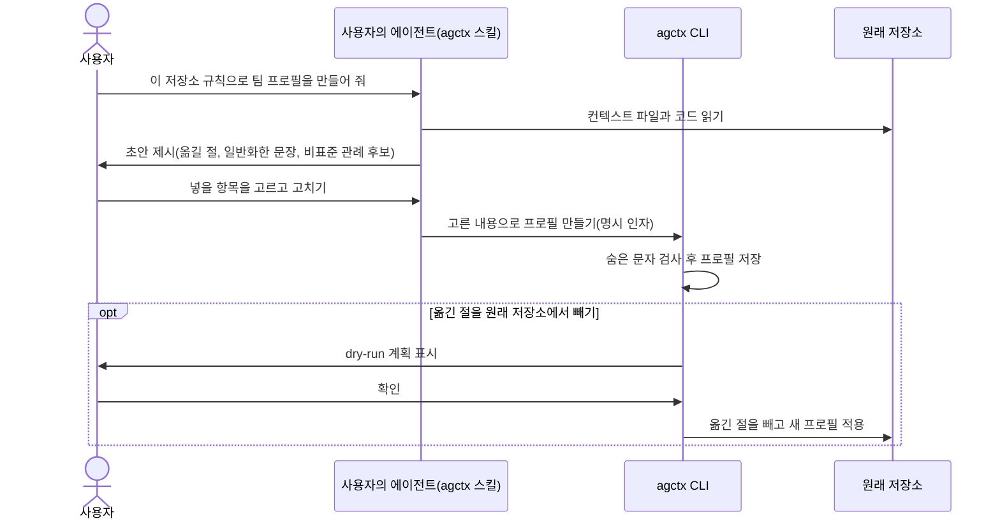

# 기존 저장소에서 프로필 만들기

**상태:** Proposed

## 제안 요약

### 목적과 이유

| 항목 | 내용 |
| --- | --- |
| 제안 목표 | 이미 규칙을 써 둔 저장소의 컨텍스트 파일에서 고른 부분으로 새 프로필을 만든다. agctx는 복사·검사·저장만 하고, 어느 부분을 옮기고 어떻게 일반화할지의 초안은 사용자의 에이전트가 agctx 스킬 안내로 만든다. |
| 제안 이유 | 여러 저장소를 쓰는 사용자는 대개 한 저장소에 이미 규칙을 써 두었다. 지금 `profile create`는 제목과 설명 한 줄뿐인 기본 템플릿을 만들므로(`src/profile/store.ts:63`~`64`) 그 규칙을 손으로 옮겨야 한다. 게다가 그 저장소에 새 프로필을 적용하면 기존 `AGENTS.md` 전체가 `## Existing project guidance` 아래에 남아(`src/project/analyzer.ts:24`~`25`), 프로필로 옮긴 규칙이 한 파일에 두 번 들어간다. |

### 범위와 우선순위

| 항목 | 내용 |
| --- | --- |
| 대상 계층 | 사용자·AI 에이전트(agctx 스킬)·agctx CLI/TUI·프로필 보관함·원래 저장소 |
| 결정할 것 | 읽을 컨텍스트 파일 목록, 나누는 단위, 명령 형태, 원래 저장소에서 옮긴 부분을 빼는 방식과 확인, agctx가 이미 적용된 저장소의 처리, 스킬 안내 문구와 저장 경로, 숨은 문자·비밀값 처리 |
| 중요도 | Medium: 기존 프로필 모델에 만드는 경로를 하나 더한다. 다만 원래 저장소의 사람 영역을 고치는 선택지와 에이전트 초안을 받는 경로에는 확인 계약이 필요하다. |

### 의존성과 실행 순서

| 항목 | 내용 |
| --- | --- |
| 선행 작업 | `profile create`, `AGENTS.md`의 프로필 영역과 프로젝트 영역 분리(`src/project/analyzer.ts`), 숨은 문자 검사 |
| 선행 제안 | [프로필 모델과 저장소](profile-model.md), [프로젝트 적용](project-application.md), [자연어 요청을 통한 agctx 사용](agent-mediated-usage.md)(스킬 배포) |
| 후속 제안 | 스킬·MCP·subagents·hooks 가져오기: [프로필 설정 표면 확장](profile-config-surface.md)의 대상이 구현된 뒤 |
| 연관 제안 | [에이전트 규칙 위치 탐지](agent-rule-discovery.md)(`explain`의 파일 탐색과 중복 경고), [적용할 에이전트와 대상 종류 고르기](apply-selection.md) |
| 후속 작업 | 제목 단위 선택, 원래 파일에서 옮긴 절 빼기, 관리 영역 복원의 실패 평가를 먼저 작성한다. |
| 권장 다음 작업 | 규칙만 대상으로 명령 형태와 나누는 단위를 확정한다. 초안을 누가 만드는지는 [ADR 0023](../../../adr/0023-profile-drafting-through-agent-skill.md)으로 정했다. 이 기능의 구현 순서는 아직 정하지 않았고, 다음 구현은 에이전트 고르기 → MCP다(2026-09-16 제품 소유자 결정). |

## 목차

- [현재 동작](#현재-동작)
- [만드는 흐름](#만드는-흐름)
- [에이전트 초안의 범위](#에이전트-초안의-범위)
- [풀어야 할 문제](#풀어야-할-문제)
- [계층별 책임](#계층별-책임)
- [비범위](#비범위)
- [결정·검증 항목](#결정검증-항목)

## 현재 동작

`profile create`는 원천을 받지 않고 기본 템플릿으로 프로필을 만든다. 아래는 0.3.1에서 한국어 설정으로 실제로 실행한 출력과 만들어진 파일 전체다.

```bash
$ agctx profile create team-backend --scope team
프로필을 만들었습니다: team-backend (team)
```

```md
# Profile: team-backend

이 프로필의 공통 에이전틱 개발 지침을 관리한다.
```

규칙은 이후 `profile setup`이나 직접 편집으로 채운다. 이미 `공통 작업 원칙`과 `빌드와 실행` 절이 있는 저장소에 이 프로필을 적용하면, 기존 파일 전체가 프로젝트 영역 아래로 옮겨진다. 아래는 적용한 뒤 `AGENTS.md`의 제목을 실제 파일에서 옮긴 것이다.

```md
# Profile: team-backend
…
## Project context
…
## 4. 프로젝트 규칙 확장 (SSOT)
…
## Existing project guidance
…
## 공통 작업 원칙
…
## 빌드와 실행
…
```

사용자가 `공통 작업 원칙`을 프로필로 손수 옮겼다면, 그 절은 위쪽 프로필 영역과 아래쪽 `Existing project guidance`에 한 번씩 들어간다.

## 만드는 흐름



에이전트는 읽고 제안하는 데까지만 하고, 저장은 사용자가 고른 내용을 받은 agctx가 한다. 에이전트 없이 사람이 직접 절을 골라 복사하는 경로도 같은 명령으로 둔다.

제안 예시(옵션 이름은 가칭):

```bash
# 사람이 직접 원래 저장소의 절을 골라 복사한다
agctx profile create team-backend --from ./payments-api --section "공통 작업 원칙"
# 에이전트와 사용자가 확정한 초안 파일을 넘겨 저장한다
agctx profile create team-backend --from-file ./draft/AGENTS.md
```

제안 예시(TUI):

```text
? payments-api에서 프로필에 넣을 절을 고르세요
  ◼ AGENTS.md › 공통 작업 원칙
  ◻ AGENTS.md › 빌드와 실행
  ◼ CLAUDE.md › 리뷰 규칙
? 옮긴 절을 payments-api의 AGENTS.md에서 빼고 새 프로필을 적용할까요? 먼저 계획을 보여 줍니다.
```

## 에이전트 초안의 범위

초안의 범위는 [ADR 0023](../../../adr/0023-profile-drafting-through-agent-skill.md)이 정한다.

- **제안하는 것:** 이미 있는 컨텍스트 파일에서 다른 저장소에도 쓸 절, 저장소 이름·경로를 일반적인 표현으로 바꾼 문장, 코드를 읽어 찾은 비표준 관례와 함정 후보.
- **제안하지 않는 것:** 저장소 개요, 디렉터리 구조, 의존성 목록처럼 에이전트가 코드를 읽어 스스로 알 수 있는 내용. 연구에서 저장소 개요는 과제 성공률을 높이지 못했고, 컨텍스트 파일은 비표준 관례를 지정할 때 유용했다([프로젝트 지침 자동 생성에 관한 근거](../../../references.md#프로젝트-지침-자동-생성에-관한-근거)).
- **하지 않는 일:** 초안을 스스로 프로필에 저장하기, `profile push`·`repos pr` 실행하기. 스킬은 저장 명령 전에 사용자 확인을 받게 안내한다.

프로젝트 지침(`AGENTS.md`의 프로젝트 규칙 확장 영역) 초안은 이 기능의 대상이 아니다. 계속 각 에이전트의 `/init`에 맡긴다([ADR 0006](../../../adr/0006-no-codebase-analysis-guidance.md)).

## 풀어야 할 문제

1. **섞인 내용:** 저장소 파일에는 다른 저장소에도 쓸 규칙과 그 저장소에만 해당하는 도메인 규칙(빌드 명령, 폴더 구조)이 섞여 있다. 통째로 복사하면 도메인 규칙이 다른 저장소로 퍼지므로 제목 단위로 고르게 한다.
2. **원래 저장소의 중복:** [현재 동작](#현재-동작)처럼 원래 저장소에 새 프로필을 적용하면 옮긴 절이 두 번 들어간다. 옮긴 절을 원래 파일에서 빼는 선택지를 두되, 사람 영역을 고치는 일이므로 dry-run 계획을 보여 주고 확인을 받는다. 터미널이 아닌 곳에서는 `--yes` 없이 진행하지 않는다.
3. **여러 파일:** `CLAUDE.md`가 `@AGENTS.md`만 불러오는 연결 파일이면 가져오지 않고, 같은 절이 두 파일에 있으면 한 번만 넣는다. `explain`이 에이전트마다 읽는 파일과 중복 경고를 이미 계산하므로(`src/explain.ts:324`) 그 결과를 재료로 쓴다.
4. **agctx가 이미 적용된 저장소:** `AGENTS.md`의 프로필 영역(`src/project/analyzer.ts:44`)이 곧 프로필 본문이다. 그 영역만 가져오면 Git 원격 없이도 프로필을 되살릴 수 있고, 프로젝트 확장 영역은 가져오지 않는다.
5. **믿을 수 없는 입력:** 원래 저장소 파일과 에이전트 초안은 `profile clone`과 같은 숨은 문자 검사를 통과해야 저장한다. 나중에 MCP·hooks를 가져올 때는 설정에 인증 토큰 같은 값이 들어 있을 수 있으므로 값을 프로필에 옮기지 않는다. 프로필은 Git으로 push되기 때문이다.
6. **다른 도구의 파일:** 지원하지 않는 규칙 파일(`.cursorrules` 등, `src/explain.ts:59`)도 원천으로 읽을지, 설계안이 검증 후로 둔 ruler·rulesync에서 옮겨 오기를 이 경로로 합칠지 정한다.

## 계층별 책임

- **사용자:** 프로필에 넣을 내용을 확정하고, 원래 파일에서 옮긴 절을 뺄지 정하며, push 전에 프로필을 검토한다.
- **AI 에이전트(agctx 스킬):** 컨텍스트 파일과 코드를 읽어 초안을 제시한다. 저장소 개요를 쓰지 않고, 저장·push·`repos pr`을 스스로 실행하지 않는다.
- **agctx CLI/TUI:** 고른 내용을 복사·검사·저장하고, 요청하면 원래 파일에서 옮긴 절을 빼는 계획을 보여 준 뒤 실행한다. 모델을 호출하거나 에이전트를 실행하지 않는다.
- **원래 저장소:** 도메인 규칙을 소유한다.

## 비범위

- agctx가 모델을 호출하거나 에이전트 CLI를 실행해 초안을 만드는 일. [ADR 0023](../../../adr/0023-profile-drafting-through-agent-skill.md)이 버린 대안이다.
- 코드베이스를 분석해 프로젝트 지침을 작성하는 일([ADR 0006](../../../adr/0006-no-codebase-analysis-guidance.md)).
- 확인 없이 원래 저장소의 파일을 고치는 일.
- 여러 저장소의 규칙을 한 번에 합쳐 프로필 하나를 만드는 일. 첫 단계는 저장소 하나에서 만든다.

## 결정·검증 항목

- 읽을 컨텍스트 파일 목록과 읽는 순서.
- 나누는 단위(`##` 제목)와 제목 없는 앞부분의 처리.
- 명령 형태(`profile create --from`·`--from-file` 가칭 또는 별도 명령)와 CLI·TUI·프로필 관리 메뉴의 세 경로.
- 원래 파일에서 옮긴 절 빼기: dry-run 표시, 확인, 되돌리는 방법.
- agctx가 적용된 저장소에서 프로필 영역을 복원할 때 프로필 이름·scope·원천을 어떻게 기록할지.
- 스킬 안내 문구: 초안 범위와 저장 전 사용자 확인.
- 숨은 문자와 비밀값 처리.
- ruler·rulesync 원천을 같은 경로로 합칠지.
