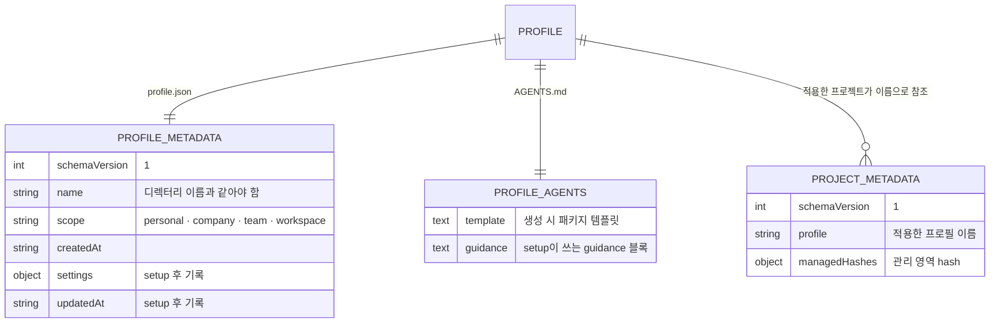

# 프로필 모델과 저장소

<!-- agctx:generated:status:start -->
**상태:** Implemented
<!-- agctx:generated:status:end -->

## 제안 요약

### 목적과 이유

| 항목 | 내용 |
| --- | --- |
| 제안 목표 | 용도별 공통 지침 저장소를 생성·식별·선택할 수 있게 한다. |
| 제안 이유 | 하나의 내장 템플릿만으로는 개인·회사·팀·workspace별 공통 정책을 독립적으로 관리할 수 없다. |

### 범위와 우선순위

| 항목 | 내용 |
| --- | --- |
| 대상 계층 | 사용자·조직, agctx CLI, 프로필 저장소 |
| 결정할 것 | 프로필 경로, 이름 규칙, scope metadata, 기본 프로필, 여러 프로필 선택 방식 |
| 중요도 | Critical — 모든 후속 CLI와 프로젝트 적용의 기반 |

### 의존성과 실행 순서

| 항목 | 내용 |
| --- | --- |
| 선행 작업 | 제품 용어·소유권 확정 |
| 선행 제안 | 없음 |
| 후속 제안 | [setup과 지침 옵션](setup-and-guidance.md), [프로젝트 적용](project-application.md), [Git 기반 프로필 관리](git-profile-management.md) |
| 연관 제안 | [에이전트 산출물 동기화](agent-sync.md), [Git 기반 프로필 관리](git-profile-management.md) |
| 후속 작업 | [Git 기반 프로필 관리](git-profile-management.md)에서 조직 공유 프로필의 등록·업데이트 계약과 다중 사용자 충돌 정책을 확정 |
| 권장 다음 작업 | 최소 `ProfileMetadata`와 저장 경로 계약을 평가로 고정 |

## 목표 계약

프로필은 사용자 또는 조직이 소유하는 공통 지침 저장소다. `Personal`, `Company`, `Team`, `Workspace`는 고정된 시스템 종류가 아니라 프로필의 용도 또는 metadata다.

권장 기본 경로는 `~/.agctx/profiles/<name>`이며([ADR 0007](../../../adr/0007-profile-home-layout.md)), 조직 프로필은 사용자가 관리하는 별도 Git 저장소도 선택할 수 있어야 한다. 패키지 설치·업데이트는 프로필 파일을 자동 변경하지 않는다.

```text
~/.agctx/
├── config.json               # 언어 설정
└── profiles/<name>/
    ├── AGENTS.md             # 프로필 공통 지침 정본
    └── profile.json  # 이름·용도·schema metadata
```



프로필은 디렉터리 하나에 metadata와 지침 정본을 둔다. 프로젝트는 `agctx.project.json`에 프로필 이름만 기록한다. 그래서 프로필을 삭제해도 이미 적용된 프로젝트 파일은 남지만 다음 `profile sync`는 프로필을 찾지 못해 실패한다.

프로필 생성은 프로젝트를 변경하지 않는다. 프로필을 선택해 프로젝트에 적용하는 작업은 별도의 명령과 승인 흐름으로 둔다.

#### 구현 기록: 프로필 생성·목록

* **결정:** 사용자 홈의 `.agentic-profiles/<name>`에 프로필을 저장하고 `personal`, `company`, `team`, `workspace` scope를 metadata로 기록한다. 저장 위치는 이후 [ADR 0007](../../../adr/0007-profile-home-layout.md)에 따라 `~/.agctx/profiles/<name>`으로 옮겼다.
* **구현:** `agctx profile create`, scope별 `agctx profile list`와 프로필 관리 메뉴, TUI 프로필 선택·삭제, `agctx profile remove`, `profile.json`, 프로필 `AGENTS.md` 생성.
* **평가:** `evals/core.test.mjs`에서 생성·목록·이름·scope·metadata를 확인.
* **제약:** 조직 원격 Git 등록·동기화는 아직 지원하지 않는다.
* **다음 단계:** [Git 기반 프로필 관리](git-profile-management.md)에서 조직 원격 등록·업데이트와 다중 사용자 충돌 정책을 확정한다.
