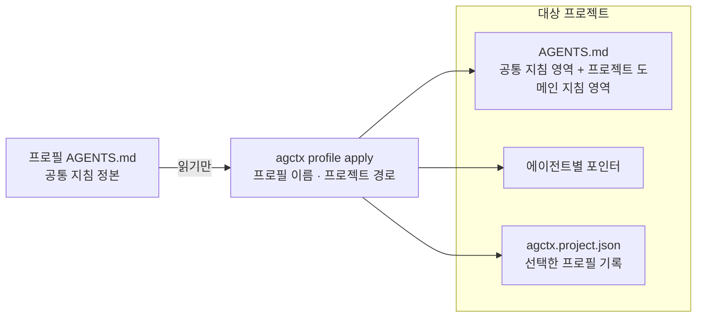

# 프로젝트 적용

**상태:** Implemented

## 제안 요약

### 목적과 이유

| 항목 | 내용 |
| --- | --- |
| 제안 목표 | 사용자가 선택한 프로필의 공통 지침을 프로젝트에 적용하고 프로젝트 도메인 지침을 독립적으로 보존한다. |
| 제안 이유 | 공통 정책과 제품별 규칙을 한 파일에 무분별하게 섞으면 프로필 재사용과 프로젝트 자율성이 깨진다. |

### 범위와 우선순위

| 항목 | 내용 |
| --- | --- |
| 대상 계층 | 사용자·agctx CLI·프로필·대상 프로젝트 |
| 결정할 것 | 적용 명령, 대상 파일, 기존 `AGENTS.md` 병합, 승인·dry-run, 프로필 선택 기록 |
| 중요도 | Critical — 실제 사용자 프로젝트를 변경하는 가장 큰 경계 |

### 의존성과 실행 순서

| 항목 | 내용 |
| --- | --- |
| 선행 작업 | 프로필 모델·setup 옵션 계약 |
| 선행 제안 | [프로필 모델과 저장소](profile-model.md), [setup과 지침 옵션](setup-and-guidance.md) |
| 후속 제안 | [에이전트 산출물 동기화](agent-sync.md) |
| 연관 제안 | 없음 |
| 후속 작업 | `agctx profile apply <name> <project>`와 병합·dry-run 평가 |
| 권장 다음 작업 | 기존 도메인 규칙을 보존하는 최소 병합 규칙 확정 |

## 목표 계약

적용은 선택한 프로필의 공통 `AGENTS.md`를 프로젝트에 주입하고, 프로젝트의 도메인 지침은 프로젝트 쪽 확장 영역에 둔다. 프로필의 원본은 변경하지 않는다.

적용은 프로필을 읽기만 하고 프로젝트 쪽 파일에만 쓴다. 프로젝트 도메인 지침은 `AGENTS.md`의 확장 영역에 남으며 프로필로 역동기화되지 않는다.

적용 전에는 변경 파일과 기존 사용자 내용의 보존 여부를 보여 준다. 기존 프로젝트 파일을 자동으로 덮어쓰거나 프로필에 프로젝트 지침을 역동기화하지 않는다.

#### 구현 기록: 프로필 프로젝트 적용

* **결정:** `agctx profile apply <name> <project>`가 선택 프로필을 프로젝트에 적용하고 `agctx.project.json`에 선택을 기록한다.
* **구현:** 공통 `AGENTS.md`, 에이전트별 포인터, 프로젝트 확장 영역 병합.
* **평가:** 프로필 적용·재동기화·프로필 원본 불변·존재하지 않는 프로필의 무변경 실패를 확인.
* **제약:** 복잡한 충돌 시각화·백업 기반 복구·관리 파일 manifest는 후속 작업이다.
* **다음 단계:** 충돌 시각화·백업 기반 복구·여러 파일 전체 롤백 계약.
