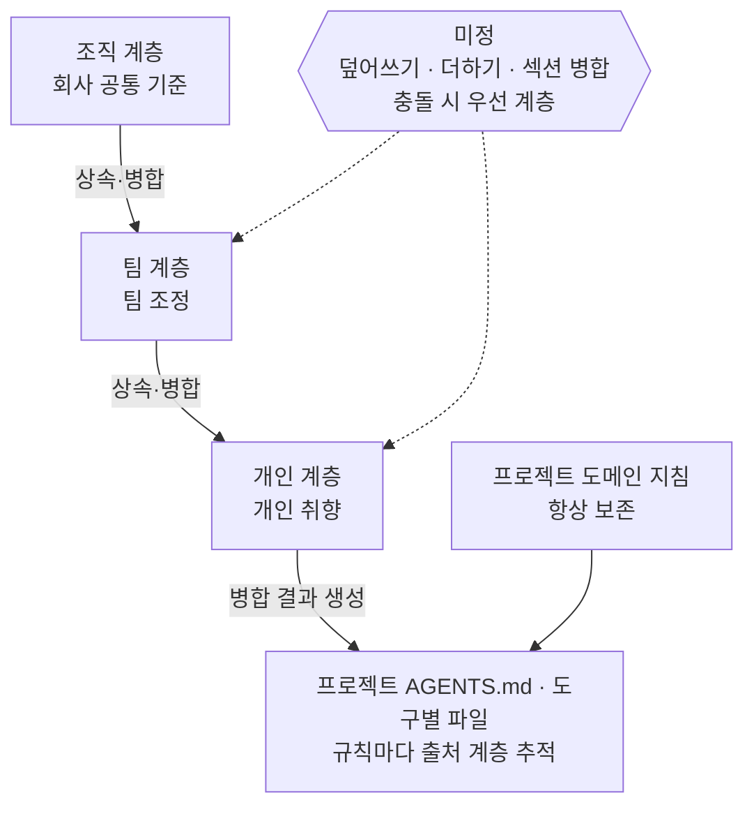

# 스코프 확장과 지침 합성

**상태:** Proposed

## 제안 요약

### 목적과 이유

| 항목 | 내용 |
| --- | --- |
| 제안 목표 | 고정된 네 개의 scope를 사용자·조직이 정의·공유하는 지침 계층으로 확장한다. 프로젝트는 여러 계층을 상속·병합해 최종 지침을 구성한다. |
| 제안 이유 | 현재 scope는 CLI 코드에서 `personal·company·team·workspace` 네 값으로 고정돼 프로필의 라벨로만 쓰인다. [프로필 모델과 저장소](profile-model.md)는 scope를 "고정된 종류가 아니라 용도·metadata"로 규정하는데 코드가 이를 좁혔다. 프로필은 단일 정본이라 조직 공통·팀 조정·개인 취향을 겹쳐 쓰는 구성이 없다. 그래서 세 기준을 한 프로필에 몰아넣거나 프로필을 복제해야 하고 복제는 이 패키지가 없애려던 드리프트를 다시 만든다. |

### 범위와 우선순위

| 항목 | 내용 |
| --- | --- |
| 대상 계층 | 사용자·조직, Agentic CLI/TUI, 프로필·scope 저장소, 대상 프로젝트 |
| 결정할 것 | scope의 정의 단위와 이름 규칙, scope와 프로필의 관계, 계층 상속·병합 순서와 충돌 규칙, scope 공유·갱신 저장소 형식, 세 인터페이스 동등성 |
| 중요도 | Medium — 기존 프로필 모델을 폐기하지 않고 그 위에 얹는 확장이다. 채택되면 차별점을 키우지만 검증 전 착수는 금지한다. |

### 의존성과 실행 순서

| 항목 | 내용 |
| --- | --- |
| 선행 작업 | 계획된 Git 프로필 공유의 최소 구현과 실사용 검증 |
| 선행 제안 | [프로필 모델과 저장소](profile-model.md), [프로젝트 적용](project-application.md), [Agentic 관리 산출물의 안전한 동기화](managed-artifact-safety.md) |
| 후속 제안 | 합성 결과의 안전 동기화 계약 |
| 연관 제안 | [에이전트 산출물 동기화](agent-sync.md), [setup과 지침 옵션](setup-and-guidance.md), [프로필 설정 표면 확장](profile-config-surface.md) |
| 후속 작업 | 계층 병합·충돌 정책 평가, scope 공유 저장소 형식과 다중 사용자 갱신 정책 평가 |
| 권장 다음 작업 | 먼저 검증으로 수요를 확인한다. 수요가 있으면 합성을 최소 형태로 프로토타이핑한다. |

## 목차

- [현재 상태와 한계](#현재-상태와-한계)
- [확장의 목적과 방향](#확장의-목적과-방향)
- [세 가지 아이디어와 평가](#세-가지-아이디어와-평가)
- [계층 합성 모델](#계층-합성-모델)
- [경계와 지키는 원칙](#경계와-지키는-원칙)
- [검증 우선과 착수 조건](#검증-우선과-착수-조건)
- [결정·검증 항목](#결정검증-항목)

## 현재 상태와 한계

현재 Agentic에서 scope는 프로필을 분류하는 라벨이다. CLI 코드에 `personal·company·team·workspace` 네 값으로 고정돼 있다. 프로필의 `agentic-profile.json`에 metadata로 기록되며 목록과 그룹핑에 쓰인다.

[프로필 모델과 저장소](profile-model.md)는 scope를 "고정된 시스템 종류가 아니라 프로필의 용도·metadata"로 규정한다. 코드는 이 규정보다 좁게 네 값으로 굳어 있다. 문서가 그린 모델과 실제 코드 사이에 간극이 있다.

더 큰 한계는 합성의 부재다. 프로필은 단일 정본이고 한 프로젝트는 하나의 프로필을 골라 적용한다. 조직 공통 기준 위에 팀 조정을 얹고 그 위에 개인 취향을 더하는 계층 구성이 없다. 세 기준을 함께 쓰려면 한 프로필에 전부 몰아넣거나 비슷한 프로필을 여러 개 복제해야 한다. 복제는 이 패키지가 없애려던 드리프트를 다시 만든다.

## 확장의 목적과 방향

목적은 scope를 라벨에서 "공유·재사용하는 지침 계층"으로 올리는 것이다. 그리고 프로젝트가 여러 계층을 상속·병합해 최종 지침을 구성하게 하는 것이다.

방향은 두 부분이다. 하나는 scope를 사용자 정의로 열고 공유·갱신할 수 있게 하는 것이고 다른 하나는 프로젝트가 여러 계층을 병합하는 합성을 지원하는 것이다. 둘 중 값의 무게는 합성 쪽에 있다.

이 방향으로 가치가 커지는 이유는 시장 상황에 있다. AGENTS.md 표준이 "한 파일을 여러 도구가 읽는" 문제를 대부분 흡수했고 rulesync·ruler 같은 도구도 단일 소스에서 여러 산출물을 뽑는다. 이들이 공통으로 약한 지점이 계층 합성이다. 여러 출처를 겹쳐 하나의 프로젝트 지침으로 병합하는 기능은 단일 소스 모델로는 어렵다. 여기가 "그냥 AGENTS.md 하나 쓰면 되잖아"라는 반문을 이기는 자리다. 외부 도구와의 상세 비교는 [references.md](../../../references.md)에서 관리한다.

## 세 가지 아이디어와 평가

이 확장은 세 조각으로 나뉜다. 값과 비용이 서로 다르므로 구분해 둔다.

| 아이디어 | 하는 일 | 비용·난이도 | 값 |
| --- | --- | --- | --- |
| 1. 사용자 정의 scope (CRUD) | 고정 enum을 사용자 값으로 연다. 문서가 규정한 "scope=용도·metadata" 모델에 코드를 맞추는 정합화에 가깝다. | 낮다. | 낮다. 단독으로는 활용도를 크게 올리지 못한다. 컨설팅사가 `client-acme` 같은 라벨을 만드는 유연함 정도다. |
| 2. scope 공유·갱신 (Git) | scope를 공유하는 단위로 만든다. [프로필 모델과 저장소](profile-model.md)의 계획은 "프로필" 공유까지이므로 그보다 넓은 새 범위다. | 새 범위다. scope가 여러 프로필을 담는 컨테이너가 되어야 의미가 산다. | 단독으로는 작다. |
| 3. 계층 합성 (composition) | 프로젝트가 조직·팀·개인 계층을 상속·병합한다. | 가장 높다. 병합·충돌·우선순위 규칙을 정해야 한다. | 진짜 차별점이다. |

평가: 1과 2만으로는 라벨과 동기화 대상이 늘 뿐 사용자가 얻는 값이 작다. 목적의 핵심은 3이다. 1과 2는 3을 담는 그릇으로서 의미가 있다.

## 계층 합성 모델

합성의 기본 그림은 계층을 순서대로 겹치는 것이다.

세 계층은 위에서 아래로 겹친다. 프로젝트 도메인 지침은 계층 병합의 대상이 아니며 결과에 그대로 합류한다. 점선으로 연결한 병합 규칙이 아직 정해지지 않은 부분이다.

정해야 할 병합 규칙이 이 모델의 핵심이다. 하위 계층이 상위를 덮어쓰는지 더하는지 섹션 단위로 병합하는지 정한다. 충돌하면 어느 계층을 우선할지 정한다. 프로젝트가 소유한 도메인 지침은 병합에서 항상 보존하고 상위 계층이 이를 덮지 못하게 한다.

산출물의 형태는 지금과 같다. 병합 결과를 `AGENTS.md`와 도구별 파일로 생성한다. 다만 각 규칙이 어느 계층에서 왔는지 추적할 수 있어야 사용자가 최종 결과를 이해하고 되돌릴 수 있다.

안전 계약은 새로 만들지 않고 넓힌다. [Agentic 관리 산출물의 안전한 동기화](managed-artifact-safety.md)의 관리 블록·hash·dry-run을 다계층 병합에도 적용한다.

## 경계와 지키는 원칙

이 확장도 패키지의 기존 경계를 벗어나지 않는다.

- 프로필과 scope는 지침의 소유 경계다. 에이전트가 자연어를 이해하게 만드는 프롬프트 저장소가 아니다.
- 외부 에이전트 런타임을 실행·파싱·래핑하지 않는다. 담당은 지침 파일의 생성·동기화까지다.
- 프로젝트 도메인 지침은 병합에서 항상 보존한다. 상위 계층이 정본을 오염시키지 않는다.
- 공통 기능은 인터페이스 동등성을 지킨다. scope CRUD·공유·합성도 CLI·TUI·`agt profile list` 관리 메뉴 세 경로에 제공한다. 비대화형 전용 표현은 [구현 계약 및 문서 규칙](implementation-contracts.md)의 예외로 둔다.

## 검증 우선과 착수 조건

이 제안은 검증에 종속된다. 현재 프로필 모델과 계획된 Git 프로필 공유가 실사용으로 값을 증명한 뒤에 착수한다.

이유는 분명하다. "쓸모가 있나"라는 의심이 남은 상태에서 합성 엔진을 먼저 만들면 검증되지 않은 코어 위에 추상화를 쌓는 것이다. 이는 이 저장소의 코딩 규칙(YAGNI, speculative generality 회피, 최소 변경)과 정면으로 부딪힌다.

착수 조건은 다음을 모두 만족할 때다.

1. 계획된 Git 프로필 공유가 최소 형태로 배포되어 팀 사용 사례가 하나 이상 돈다.
2. 실제 사용자 서넛이 그 기능을 반복해서 쓴다.
3. 그 사용자들이 "여러 계층을 겹쳐 쓰고 싶다"는 요구를 실제로 표출한다.

세 조건이 서기 전에는 이 문서를 설계 기록으로만 두고 코드를 만들지 않는다.

## 결정·검증 항목

채택 전에 다음을 별도 계약과 평가로 확정한다.

- scope의 정의 단위와 프로필과의 관계: 포함인가 참조인가 별개 개념인가
- 계층 상속·병합·충돌 우선순위 규칙과 도메인 지침 보존 보장
- scope 공유 저장소 형식과 다중 사용자 갱신·충돌 정책
- 병합 결과의 출처 추적과 안전 동기화(관리 블록·hash·dry-run) 확장 범위
- 세 인터페이스(CLI·TUI·관리 메뉴)의 기능 동등성과 비대화형 예외
- 검증 착수 조건의 충족 여부를 판단하는 지표

이 논의가 채택되면 ADR로 결정을 남기고 [프로필 모델과 저장소](profile-model.md)와 `docs/product-direction.md`, README를 같은 변경에서 정합화한다. 채택 전에는 이 기능을 현재 제공 기능으로 표현하지 않는다.
