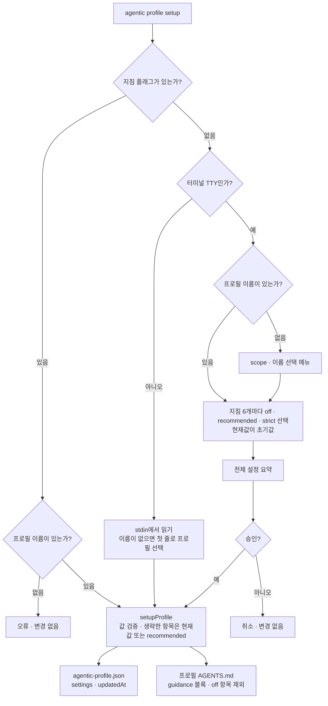

# setup과 지침 옵션

**상태:** Implemented

## 제안 요약

### 목적과 이유

| 항목 | 내용 |
| --- | --- |
| 제안 목표 | 프로필 생성 후 필요한 에이전틱 개발 지침을 선택해 재현 가능한 정본을 만든다. |
| 제안 이유 | 모든 사용자에게 동일한 TDD·리뷰·문서화 정책을 강제하지 않으면서 안정적인 기본값을 제공해야 한다. |

### 범위와 우선순위

| 항목 | 내용 |
| --- | --- |
| 대상 계층 | 사용자·Agentic CLI·프로필 `AGENTS.md` |
| 결정할 것 | preset 목록, 기본값, 옵션 schema, 대화형·비대화형 동작, 재실행·삭제 정책 |
| 중요도 | High — 프로필의 실제 정책을 결정하는 사용자 경계 |

### 의존성과 실행 순서

| 항목 | 내용 |
| --- | --- |
| 선행 작업 | [프로필 모델과 저장소](profile-model.md) |
| 선행 제안 | [프로필 모델과 저장소](profile-model.md) |
| 후속 제안 | [프로젝트 적용](project-application.md) |
| 연관 제안 | [에이전트 산출물 동기화](agent-sync.md), [지침 적용 수준의 의미 정의](guidance-level-semantics.md) |
| 후속 작업 | 옵션 schema·preset 템플릿·설정 diff 평가 |
| 권장 다음 작업 | `tdd`, `review`, `verification`, `documentation`, `security`의 최소 값과 기본값 확정 |

## 목표 계약

`agentic profile setup <name>`은 프로필의 설정만 변경한다. 프로젝트 파일이나 프로젝트의 도메인 `AGENTS.md`는 변경하지 않는다. 세부 옵션을 생략하면 현재 설정을 기본값으로 보여 주는 TUI에서 항목별 수준을 입력한다.

권장 옵션은 `recommended`, `strict`, `off`처럼 의미가 명확한 값으로 제공한다. 외부 연구는 선택 근거로 사용하되, 연구 결과를 보편적 성공 보장처럼 표현하지 않는다.

예상 예시:

```bash
agentic profile setup company \
  --tdd recommended \
  --review recommended \
  --verification recommended \
  --documentation recommended \
  --security strict
```

setup은 기존 선택을 보여 주고 사용자의 승인 없이 정책을 제거하거나 약화하지 않는다. 옵션 이름과 기본값은 구현 전 평가로 확정한다.

#### 구현 기록: 프로필 setup

* **결정:** 지침 항목별 `off`, `recommended`, `strict`를 사용하며 기본값은 `recommended`다.
* **구현:** `agentic profile setup [<name>]`이 프로필 metadata와 `AGENTS.md`를 갱신한다. 프로필을 생략하면 scope·이름을 함께 표시하는 선택 메뉴를 사용하고, 세부 플래그를 생략하면 설명·현재값·적용 수준을 보여 주는 지침별 TUI를 사용한다. 전체 설정 요약을 승인한 뒤 저장하며, `off` 항목은 프로필 지침에서 제외한다.
* **평가:** `evals/core.test.mjs`에서 선택·제외·scope 분류·TUI·프로필 경계 보존을 확인.
* **제약:** TUI는 터미널 환경에서만 활성화되며, CI·스크립트에서는 비대화형 flags 또는 stdin 입력을 사용한다.
* **다음 단계:** preset 파일 분리와 사용자 승인 diff의 세분화.

구현된 setup의 입력 경로는 다음과 같다.



플래그를 하나라도 주면 TUI를 거치지 않고 바로 저장한다. 어느 경로든 바뀌는 파일은 프로필 디렉터리의 두 파일뿐이며 프로젝트 파일은 건드리지 않는다.
