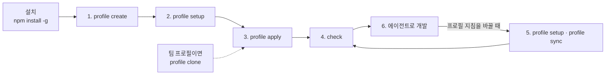

# 빠른 시작

<!-- agctx-doc-sources: src/profile, src/project, src/check.ts, src/commands, templates, src/i18n/messages-en.ts -->
<!-- agctx-doc-sources-sha256: c956f3036b90a8de58406c787e2d7b421781de837f15a25d26094c0df90383fe -->

프로필을 하나 만들어 저장소에 적용하고, 저장소가 프로필과 맞는지 확인하는 최소 흐름이다. 설치는 [설치](installation.md), 개념은 [프로필과 적용](../concepts/profiles.md), 상황별 사용법은 [목적별 가이드](../README.md#목적별-가이드)에 있다.

전체 흐름은 다음과 같다.



프로필을 만들고 설정한 뒤 한 번 적용하면, 그 뒤로는 개발과 동기화를 반복한다. 팀이 공유하는 프로필은 만들지 않고 Git 원격에서 받는다([팀과 Git으로 공유하기](../guides/team-sharing.md)). 프로필을 지우는 방법은 [프로필과 적용](../concepts/profiles.md#프로필-삭제)에 있다.

아래 예시는 빈 작업 폴더 `/work`에서 실제로 실행한 출력이며, `evals/doc-examples.test.ts`가 격리한 폴더에서 다시 실행해 문서와 대조한다.

## 1. 프로필 만들기

```bash
$ agctx profile create team-backend --scope team
Created profile: team-backend (team)
```

이름을 생략하면 TUI에서 이름과 scope를 입력한다. 이름은 소문자·숫자·하이픈 1-64자다. scope는 프로필의 용도 분류이며 `personal`·`company`·`team`·`workspace` 중 하나다.

## 2. 지침 설정

프로필에 담을 공통 지침 수준을 정한다. 항목은 하네스 동작·TDD·변경 검토·검증·문서화·보안 6개이고 각 항목은 `off`·`recommended`·`strict` 중 하나다.

```bash
$ agctx profile setup team-backend --tdd strict --security strict
Configured profile: team-backend
```

옵션을 생략하면 TUI에서 항목마다 설명·현재값을 보고 고른다. `setup`은 시작점이며 더 두터운 지침은 프로필의 `AGENTS.md`를 직접 편집해 채운다. 배포되는 6개 항목의 정본은 [지침 카탈로그](../contributing/guidance-catalog.md)에 있다.

## 3. 프로젝트에 적용

선택한 프로필을 프로젝트에 처음 적용하거나 다른 프로필로 전환할 때 쓴다. 터미널에서 실행하면 바뀔 파일 계획을 먼저 출력하고 적용할지 묻는다. 스크립트·CI처럼 터미널이 아닌 환경에서는 묻지 않으므로 `--yes`를 붙여야 파일을 쓴다. 계획만 보려면 `--dry-run`을 붙인다.

```bash
$ mkdir shop
$ agctx profile apply team-backend shop --yes
Plan: 8 file(s) to change.
  create    AGENTS.md
  create    CLAUDE.md
  create    .agents/rules/agctx.md
  create    .agctx/base/AGENTS.md.base
  create    .agctx/base/CLAUDE.md.base
  create    .agctx/base/.agents/rules/agctx.md.base
  create    .agctx/.gitignore
  create    agctx.project.json
Applied profile team-backend to /work/shop
```

만들어지는 파일:

```text
대상 프로젝트/
├── AGENTS.md                        # 공통 지침 + 프로젝트 도메인 지침
├── agctx.project.json             # 적용한 프로필·버전과 관리 hash 기록
├── .agctx/base/                   # 마지막으로 적용한 관리 영역 원문(충돌 해결 기준, 커밋)
├── .agctx/.gitignore              # 충돌 해결 백업 폴더 backups/를 커밋에서 제외
├── CLAUDE.md                        # Claude Code 포인터
├── .agents/rules/agctx.md         # Antigravity 포인터
└── services/payments/CLAUDE.md      # 하위 AGENTS.md가 있는 폴더마다 Claude Code 연결 파일
```

프로젝트의 도메인 규칙은 `AGENTS.md`의 프로젝트 규칙 확장 섹션 아래에 쓴다. agctx가 다시 만드는 곳과 사람이 쓰는 곳의 경계는 [관리 영역과 확장 영역](../concepts/managed-and-extension-areas.md)에 있다. 생성된 파일은 모두 커밋한다.

## 4. 저장소 확인하기

`check`는 파일을 바꾸지 않고 저장소가 기록한 프로필 버전과 맞는지 확인한다.

```bash
$ agctx check shop
/work/shop matches its recorded profile version.
```

## 5. 프로필 갱신과 동기화

프로필 지침을 바꾸면 `check`가 뒤처짐(종료 코드 1)을 알린다. `sync`로 관리 영역만 다시 적용하면 다시 맞는다.

```bash
$ agctx profile setup team-backend --review strict
Configured profile: team-backend

$ agctx check shop
behind            AGENTS.md  differs from the current profile; run agctx profile sync

$ agctx profile sync shop --yes
Plan: 3 file(s) to change.
  update    AGENTS.md
  unchanged CLAUDE.md
  unchanged .agents/rules/agctx.md
  update    .agctx/base/AGENTS.md.base
  unchanged .agctx/base/CLAUDE.md.base
  unchanged .agctx/base/.agents/rules/agctx.md.base
  unchanged .agctx/.gitignore
  update    agctx.project.json
Applied profile team-backend to /work/shop

$ agctx check shop
/work/shop matches its recorded profile version.
```

`sync`는 프로젝트에 바인딩된 프로필만 다시 적용하고 프로필을 바꾸지 않는다. 다른 프로필로 바꾸려면 `apply`를 쓴다. 동기화는 관리 영역만 갱신하고 사용자가 쓴 부분은 그대로 둔다.

## 6. 에이전트로 개발

적용이 끝나면 평소 쓰는 에이전트(Codex·Claude Code·Antigravity)에 작업을 맡긴다. 에이전트는 프로젝트의 `AGENTS.md`와 포인터 파일을 읽고 그 지침대로 작업한다. agctx는 에이전트의 작업을 통제하지 않는다. 각 에이전트가 실제로 어떤 파일을 읽는지는 [에이전트가 읽는 지침 파일](../concepts/agent-loading.md)에 있다.

## 다음 단계

- 저장소가 여럿이면 [성격이 다른 저장소 여럿에 프로필 나눠 쓰기](../guides/multi-repo-individual.md)
- 팀과 함께 쓰면 [팀과 Git으로 공유하기](../guides/team-sharing.md)
- CI에서 확인하려면 [CI와 자동화에서 쓰기](../guides/ci.md)
