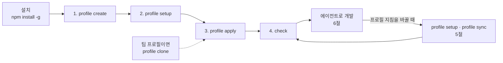

# 빠른 시작


agctx를 설치하고, 프로필을 하나 만들어 저장소에 적용하고, 저장소가 프로필과 맞는지 확인하는 최소 흐름이다. 개념은 [프로필과 적용](../concepts/profiles.md)에, 상황별 사용법은 [목적별 가이드](../README.md#목적별-가이드)에 있다.

## 목차

- [설치](#설치)
- [1. 프로필 만들기](#1-프로필-만들기)
- [2. 지침 설정](#2-지침-설정)
- [3. 프로젝트에 적용](#3-프로젝트에-적용)
- [4. 저장소 확인하기](#4-저장소-확인하기)
- [5. 프로필 갱신과 동기화](#5-프로필-갱신과-동기화)
- [6. 에이전트로 개발](#6-에이전트로-개발)
- [업데이트와 삭제](#업데이트와-삭제)
- [다음 단계](#다음-단계)

전체 흐름은 다음과 같다.



- 프로필을 만들고 설정한 뒤 한 번 적용하면, 그 뒤로는 에이전트로 개발하다가 지침을 바꿀 때마다 동기화하는 일을 반복한다.
- 팀이 이미 Git 원격에 올려 둔 프로필을 쓴다면 1·2단계 대신 `profile clone`으로 받아서 3단계부터 한다([팀과 Git으로 공유하기](../guides/team-sharing.md)).
- 프로필을 지우는 방법은 [프로필과 적용](../concepts/profiles.md#프로필-삭제)에 있다.

## 설치

<!-- agctx-doc-sources: package.json -->
<!-- agctx-doc-sources-sha256: 5121b6818053c7fec722d0ded83cc15cb0977c6e2592438316d74ce7ab3b2c3b -->

agctx는 npm 패키지 `agent-context-manager`로 배포되고, 설치하면 `agctx` 명령이 생긴다. Node.js 22 이상이 필요하다.

```bash
npm install -g agent-context-manager
agctx install
```

- `agctx install`은 패키지에 든 에이전트용 스킬을 이 컴퓨터에 설치된 Claude Code·Codex·Antigravity의 스킬 폴더에 복사한다. 스킬이 있으면 에이전트에게 agctx 일을 말로 맡길 수 있다. 쓰지 않으면 건너뛰어도 되고, 자세한 내용은 [에이전트에게 agctx를 맡기기](../guides/agent-skills.md)에 있다. CLI를 업데이트한 뒤에는 다시 실행한다.
- 명령 목록은 `agctx help`로 본다.
- 설치하지 않고 한 번만 쓰려면 `npx agent-context-manager <명령>`으로 실행한다. CI에서 쓰는 예시는 [CI와 자동화에서 쓰기](../guides/ci.md)에 있다.
- 터미널에서 인자 없이 `agctx`를 실행하면 메인 TUI(명령을 외우지 않고 메뉴에서 골라 진행하는 터미널 화면)가 열린다. 프로필 만들기·설정·적용을 메뉴로 진행할 수 있다. 아래 단계마다 같은 일을 하는 TUI 메뉴를 적었고, 화면과 조작 방법은 [TUI로 쓰기](../guides/tui.md)에 있다.
- Git 프로필 명령과 `check --refresh`에는 `git`이 필요하다. `repos pr`이 PR까지 열려면 GitHub CLI `gh`가 필요하다.
- 표시 언어는 영어가 기본이다. 한국어는 `--lang ko`, `AGCTX_LANG=ko`, `agctx config lang ko` 가운데 하나로 고른다.
- `command not found: agctx`가 나오면 전역 bin 경로가 PATH에 없다. `npm prefix -g`로 위치를 확인해 PATH에 더한다.

## 1. 프로필 만들기

<!-- agctx-doc-sources: src/profile -->
<!-- agctx-doc-sources-sha256: 513d93023a8978f8b170efe06c6cac97b3bd8846bab82a7f7f999ed5134b2da3 -->

1~5절의 명령 예시는 빈 작업 폴더 `/work`에서 실제로 실행한 출력이다. 저장소 테스트(`evals/doc-examples.test.ts`)가 같은 명령을 다시 실행해 출력이 문서와 같은지 확인하므로, 지금 버전의 실제 출력과 같다.

```bash
$ agctx profile create team-backend --scope team
Created profile: team-backend (team)
```

이름을 생략하면 TUI에서 이름과 scope를 입력한다. 이름은 소문자·숫자·하이픈 1-64자다. scope는 프로필의 용도 분류이며 `personal`·`company`·`team`·`workspace` 중 하나다.

TUI에서는 첫 화면의 **Create a new profile**을 고르고 이름과 용도를 입력한다.

## 2. 지침 설정

<!-- agctx-doc-sources: src/commands, src/i18n/messages-en.ts -->
<!-- agctx-doc-sources-sha256: b655d940431ecb7b33462633ac910cff5837238d8ea93e0e12289784f36b12ba -->

프로필에 담을 공통 지침을 고른다. 항목은 작업 흐름·맥락 관리·TDD·변경 검토·검증·지침 파일·문서화·보안·믿을 수 없는 입력·응답 언어 10개이고, 항목마다 `on`과 `off` 중 하나다. 응답 언어만 기본값이 `off`이고 나머지는 `on`이다.

- `on`(기본값): 그 지침을 프로필에 넣는다.
- `off`: 넣지 않는다.

```bash
$ agctx profile setup team-backend --tdd on --security on
Configured profile: team-backend
```

옵션을 하나라도 넘기면 넘긴 항목만 바꾸고, 넘기지 않은 항목은 이전에 고른 값을 그대로 쓴다(처음이면 `on`). 수준 옵션을 하나도 넘기지 않으면 TUI가 열려 항목마다 설명과 현재값을 보고 고른다. 이름까지 생략하면 TUI에서 프로필도 고른다(`src/commands/handlers.ts`의 `profile.setup` 처리기). 첫 화면의 **Configure profile guidance**도 같은 화면을 연다.

`setup`이 쓰는 것은 항목마다 짧은 기본 문장뿐이다. 팀 규칙을 더 넣으려면 `~/.agctx/profiles/team-backend/AGENTS.md`에서 `<!-- agctx:guidance:start -->` 블록 밖에 직접 쓴다. 블록 안은 `setup`을 다시 실행하면 새로 만들어진다. 10개 항목에 들어가는 문장의 정본은 [지침 카탈로그](../reference/guidance-catalog.md)에 있다.

## 3. 프로젝트에 적용

<!-- agctx-doc-sources: src/project, templates -->
<!-- agctx-doc-sources-sha256: 9eec9304b3fb91dd592e9bf06b16d2d5603c16c0e42e21349d75a407c9286432 -->

선택한 프로필을 프로젝트에 처음 적용하거나 다른 프로필로 전환할 때 쓴다. 터미널에서 실행하면 바뀔 파일 계획을 먼저 출력하고 적용할지 묻는다. 스크립트·CI처럼 터미널이 아닌 환경에서는 묻지 않으므로 `--yes`를 붙여야 파일을 쓴다. 계획만 보려면 `--dry-run`을 붙인다.

TUI에서는 **Manage profiles** > 프로필 > **Apply to a project**를 고르고 프로젝트 폴더를 고른다. 파일을 쓰기 전 확인 질문은 No가 기본이므로, `←`로 **Yes**를 고른 뒤 `Enter`를 누른다. 프로필이 Git 저장소면 그 전에 프로젝트를 커밋에 고정할지 한 번 더 묻는다([TUI로 쓰기](../guides/tui.md#프로젝트에-적용하기)).

```bash
$ mkdir shop
$ agctx profile apply team-backend shop --yes
Plan: 8 file(s) to change.
  create    AGENTS.md
  create    CLAUDE.md
  create    .agents/rules/agctx.md
  create    .agctx/base/AGENTS.md.base
  create    .agctx/base/CLAUDE.md.base
  create    .agctx/base/.agents/rules/agctx.md.base
  create    .agctx/.gitignore
  create    agctx.project.json
Applied profile team-backend to /work/shop
```

만들어지는 파일:

```text
대상 프로젝트/
├── AGENTS.md                        # 프로필의 공통 지침 + 그 아래 프로젝트 도메인 지침을 쓰는 확장 섹션
├── agctx.project.json             # 적용한 프로필·버전과, 관리 영역이 바뀌었는지 비교할 해시
├── .agctx/base/                   # 마지막으로 적용한 관리 영역 원문(충돌을 풀 때 기준)
├── .agctx/.gitignore              # 충돌을 풀 때 만드는 백업 폴더 backups/를 커밋에서 뺌
├── CLAUDE.md                        # Claude Code가 AGENTS.md를 읽도록 @AGENTS.md로 가져오는 파일
├── .agents/rules/agctx.md         # Antigravity가 작업을 시작할 때 AGENTS.md를 읽도록 지시하는 규칙
└── services/payments/CLAUDE.md      # 모노레포에서 하위 폴더에 AGENTS.md가 있을 때만 생기는 연결 파일
```

`CLAUDE.md`와 `.agents/rules/agctx.md`처럼 `AGENTS.md`를 읽으라고 알려 주는 짧은 파일을 포인터 파일이라고 부른다. Claude Code는 `AGENTS.md`를 직접 읽지 않기 때문에 필요하다.

프로젝트의 도메인 규칙은 `AGENTS.md`의 프로젝트 규칙 확장 섹션 아래에 쓴다. 그 위의 공통 지침 부분(관리 영역)은 `apply`·`sync`가 다시 만든다. 그래서 관리 영역 안을 고치면, 다음 `apply`·`sync`가 고친 내용을 지우지 않으려고 파일을 쓰지 않고 멈춘다. 두 영역의 경계와 멈췄을 때 푸는 법은 [관리 영역과 확장 영역](../concepts/managed-and-extension-areas.md)에 있다.

확장 섹션에 규칙을 계속 더해 `AGENTS.md`가 200줄을 넘거나 24 KiB 이상이 되면 `apply`·`sync`가 `Warning: AGENTS.md will be 230 lines after this run.`처럼 경고한다. 에이전트가 긴 지침을 덜 따르거나 뒷부분을 읽지 않을 수 있다는 안내이며, 파일은 그대로 쓰고 종료 코드도 바뀌지 않는다. 기준은 [CLI Reference](../reference/cli.md#profile-apply)에 있다.

생성된 파일은 `.agctx/base/`까지 모두 커밋한다. 그래야 저장소를 받는 팀원이 agctx 없이도 같은 지침을 받고, CI의 `check`가 기록한 버전과 비교할 수 있다.

## 4. 저장소 확인하기

<!-- agctx-doc-sources: src/check.ts -->
<!-- agctx-doc-sources-sha256: 25e68e746ba4b29583a787af5cadde2f30b5d512c69a8ca20735115bd5b23645 -->

`check`는 파일을 바꾸지 않고 저장소가 기록한 프로필 버전과 맞는지 확인한다. TUI에서는 첫 화면의 **Check a project** > **Profile version**을 고른다.

```bash
$ agctx check shop
/work/shop matches its recorded profile version.
```

## 5. 프로필 갱신과 동기화

프로필 지침을 바꾸면 저장소 파일이 프로필보다 뒤처지므로 `check`가 뒤처짐(종료 코드 1)을 알린다. `sync`로 관리 영역만 다시 적용하면 다시 맞는다. 아래 예시는 변경 검토 지침을 빼고 동기화한다.

```bash
$ agctx profile setup team-backend --review off
Configured profile: team-backend

$ agctx check shop
behind            AGENTS.md  differs from the current profile; run agctx profile sync

$ agctx profile sync shop --yes
Plan: 3 file(s) to change.
  update    AGENTS.md
  unchanged CLAUDE.md
  unchanged .agents/rules/agctx.md
  update    .agctx/base/AGENTS.md.base
  unchanged .agctx/base/CLAUDE.md.base
  unchanged .agctx/base/.agents/rules/agctx.md.base
  unchanged .agctx/.gitignore
  update    agctx.project.json
Applied profile team-backend to /work/shop

$ agctx check shop
/work/shop matches its recorded profile version.
```

`sync`는 `agctx.project.json`에 기록된 프로필을 다시 적용할 뿐, 다른 프로필로 바꾸지 않는다. 다른 프로필로 바꾸려면 `apply`를 쓴다. 동기화는 관리 영역만 갱신하고, 확장 섹션처럼 사용자가 쓴 부분은 그대로 둔다. 적용할 때 `--pin`으로 커밋에 고정했다면 `sync`로는 새 지침을 받지 않는다([갱신 방식 고르기](../guides/update-policies.md)). TUI에서는 **Manage profiles** > 프로필 > **Sync a project**로 동기화한다.

## 6. 에이전트로 개발

적용이 끝나면 평소 쓰는 에이전트(Codex·Claude Code·Antigravity)에 작업을 맡긴다. 에이전트는 프로젝트의 `AGENTS.md`와 포인터 파일을 읽고 그 지침대로 작업한다. agctx는 지침 파일을 만들 뿐, 에이전트가 지침을 지키는지 감시하거나 강제하지 않는다. 각 에이전트가 실제로 어떤 파일을 읽는지는 [에이전트가 읽는 지침 파일](../concepts/agent-loading.md)에 있다.

## 업데이트와 삭제

새 버전으로 올리려면 같은 설치 명령에 `@latest`를 붙여 다시 설치한다. 설치된 버전은 `npm ls -g`로 확인한다.

```bash
npm install -g agent-context-manager@latest
npm ls -g agent-context-manager
```

agctx를 지우려면 전역 패키지를 삭제한다.

```bash
npm uninstall -g agent-context-manager
```

패키지를 지워도 아래 두 가지는 남는다. 필요 없으면 직접 지운다.

- **프로필 보관함과 설정:** `~/.agctx` 폴더(`AGCTX_HOME`을 설정했다면 그 폴더)에 프로필, 표시 언어 설정, 적용한 저장소 목록이 있다.
- **프로젝트에 적용한 파일:** `AGENTS.md`·`CLAUDE.md`·`.agents/rules/agctx.md`·`agctx.project.json`·`.agctx/`는 저장소의 파일이라 그대로 남고, 에이전트도 계속 읽는다. agctx 없이 이 파일들을 직접 관리해도 된다.

## 다음 단계

- 저장소가 여럿이면 [성격이 다른 저장소 여럿에 프로필 나눠 쓰기](../guides/multi-repo-individual.md)
- 팀과 함께 쓰면 [팀과 Git으로 공유하기](../guides/team-sharing.md)
- CI에서 확인하려면 [CI와 자동화에서 쓰기](../guides/ci.md)
- 명령 대신 메뉴로 쓰려면 [TUI로 쓰기](../guides/tui.md)
- 명령이 멈추거나 오류가 나면 [문제 해결](../reference/troubleshooting.md)
