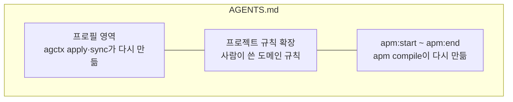

# APM과 함께 쓰기


Microsoft APM으로 지침 패키지를 설치하는 저장소에서도 agctx를 함께 쓸 수 있다. 두 도구가 `AGENTS.md`를 함께 쓰므로, APM이 `AGENTS.md`의 정해진 블록만 고치도록(`managed_section`) 설정한다. 근거와 실측은 [외부 근거](../references.md#apm과-함께-쓰기-근거)에 있다.

## 목차

- [준비 사항](#준비-사항)
- [두 도구가 나눠 쓰는 영역](#두-도구가-나눠-쓰는-영역)
- [함께 쓰도록 설정하기](#함께-쓰도록-설정하기)
- [APM 기본 모드가 이미 파일을 만든 경우](#apm-기본-모드가-이미-파일을-만든-경우)
- [같은 규칙이 두 번 들어가는지 확인하기](#같은-규칙이-두-번-들어가는지-확인하기)
- [다음 단계](#다음-단계)

## 준비 사항

- **agctx와 APM:** 두 도구가 모두 설치되어 있어야 한다. agctx 설치는 [빠른 시작](../getting-started/quick-start.md#설치)에 있다. 이 문서의 절차와 출력은 APM 0.31.0에서 실제로 실행해 확인했다([외부 근거](../references.md#apm과-함께-쓰기-근거)).
- **APM 설정 파일:** 저장소에 `apm.yml`이 있어야 한다. 없으면 `apm init`으로 만든다.

## 두 도구가 나눠 쓰는 영역

<!-- agctx-doc-sources: src/project/apm.ts -->
<!-- agctx-doc-sources-sha256: 7aaf1248319c5b090a300074e7c24fea812bd7cb057edb86f9294d5b12de11b6 -->



agctx는 프로필 영역(적용한 프로필 지침이 들어가는 부분, [관리 영역과 확장 영역](../concepts/managed-and-extension-areas.md))만, APM은 `apm:start`·`apm:end` 표지 사이만 다시 만든다. 두 영역이 겹치지 않으므로 어느 쪽을 먼저 갱신해도 서로의 내용이 남는다.

## 함께 쓰도록 설정하기

1. agctx를 먼저 적용한다: `agctx profile apply <프로필> <프로젝트>`
2. `apm.yml`에 아래 설정을 둔다.

   ```yaml
   compilation:
     agents_md:
       mode: managed_section
   ```

3. `AGENTS.md`의 프로젝트 규칙 확장 아래쪽(파일 끝)에 표지 두 줄을 넣고 `apm compile`을 실행한다. APM 규칙이 두 표지 사이에 들어간다.

   ```md
   <!-- apm:start -->
   <!-- apm:end -->
   ```

   > [!NOTE]
   > `apm compile`이 `Protected CLAUDE.md: hand-authored file will not be overwritten.`라고 경고할 수 있다. agctx가 만든 `CLAUDE.md`를 APM이 사람이 쓴 파일로 보고 건드리지 않았다는 뜻이다. 경고에서 권하더라도 `CLAUDE.md`를 지우지 않는다. 지우면 Claude Code가 `AGENTS.md`를 읽지 못한다.

4. 확인한다. agctx 쪽에서 바꿀 파일이 없고(`0 file(s) to change`), `check`가 기록한 버전과 같다고 알리면 두 도구가 서로의 영역을 건드리지 않은 것이다. 아래는 실제 출력에서 경로만 바꾼 것이다.

   ```bash
   $ agctx profile sync --dry-run .
   Dry-run: 0 file(s) to change.
     unchanged AGENTS.md
     unchanged CLAUDE.md
     …
   Dry-run: no files were changed.
   $ agctx check .
   /work/shop matches its recorded profile version.
   ```

   계획에 `conflict`가 나오면 관리 영역이 바뀐 것이다. 표지를 프로필 영역 안에 넣지는 않았는지 확인하고, [관리 영역을 고쳐서 멈췄을 때](../concepts/managed-and-extension-areas.md#관리-영역을-고쳐서-멈췄을-때)의 순서로 푼다. 같은 규칙이 두 경로로 들어가는지는 아래 [같은 규칙이 두 번 들어가는지 확인하기](#같은-규칙이-두-번-들어가는지-확인하기)에서 본다.

## APM 기본 모드가 이미 파일을 만든 경우

APM 기본 모드는 다음 `apm compile`에서 `AGENTS.md`를 덮어쓴다. 그래서 기본 모드가 이미 `AGENTS.md`를 만든 저장소에서는 agctx가 파일을 쓰지 않고 멈춘다. `Next:` 줄의 순서대로 `managed_section`으로 바꾸고 APM이 만든 파일을 옮긴 뒤 다시 적용한다.

```bash
$ agctx profile apply team-backend . --dry-run
Error: APM generated AGENTS.md in its default mode, so the next apm compile would overwrite what agctx writes there.
Next: Set compilation.agents_md.mode: managed_section in apm.yml, move AGENTS.md aside, and run agctx profile apply again. Then put <!-- apm:start --> and <!-- apm:end --> below the project rule extensions heading and run apm compile.
```

## 같은 규칙이 두 번 들어가는지 확인하기

<!-- agctx-doc-sources: src/explain.ts, src/i18n/messages-en.ts -->
<!-- agctx-doc-sources-sha256: 75d0bf0b407a85e0dac813b95e20a9e5d37511741da99918fb229ca533905777 -->

`apm install`은 같은 규칙을 `.claude/rules/`에도 넣으므로 Claude Code에는 두 경로로 들어간다. 에이전트마다 읽는 지침 파일을 보여 주는 `agctx explain`이 이런 중복을 경고한다. 아래는 APM 지침 파일에 규칙 세 줄을 두고 `apm install`과 `apm compile`을 실행한 저장소에서 실제로 실행한 결과다.

```bash
$ agctx explain --agent claude .
Claude Code · started in the project root
  read         CLAUDE.md  start folder or a folder above it, read at launch
  conditional  .claude/rules/api.md  rule with paths, read when Claude reads a matching file
  read         AGENTS.md  imported by CLAUDE.md
  warning      AGENTS.md and .claude/rules/api.md share 3 lines, so the same rules reach this agent twice. Keep them in one file.
```

- `conditional` 줄은 APM이 넣은 규칙 파일에 적용 경로(`paths`) 조건이 있다는 뜻이다. Claude Code는 조건에 맞는 파일을 읽을 때 이 규칙을 읽는다.
- `warning` 줄은 종료 코드를 바꾸지 않는다(0).
- 규칙을 `AGENTS.md`의 APM 블록에만 두려면 `apm.yml`의 `targets`에서 `claude`를 빼고 `apm install`과 `apm compile`을 다시 실행한다. APM이 `.claude/rules/api.md`를 지우고, Claude Code는 `CLAUDE.md`가 가져오는 `AGENTS.md`로 같은 규칙을 계속 받는다. 다시 실행한 `explain`에는 `.claude/rules/api.md` 줄과 `warning` 줄이 없다.

## 다음 단계

- agctx가 다시 만드는 영역과 사람이 쓰는 영역의 경계는 [관리 영역과 확장 영역](../concepts/managed-and-extension-areas.md)에 있다.
- 적용이나 동기화가 멈추면 [문제 해결](../reference/troubleshooting.md)을 본다.
