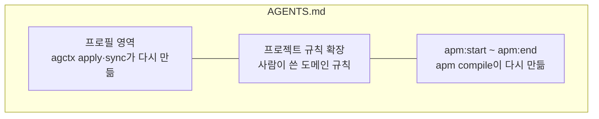

# APM과 함께 쓰기

<!-- agctx-doc-sources: src/project/apm.ts, src/explain.ts, src/i18n/messages-en.ts -->
<!-- agctx-doc-sources-sha256: 1e901dc8c8e792d2906aacc01e3555d6ff640737ee7ac3ed0adbcae0777fb724 -->

Microsoft APM으로 지침 패키지를 설치하는 저장소에서도 agctx를 함께 쓸 수 있다. 두 도구가 `AGENTS.md`를 함께 쓰므로, APM이 `AGENTS.md`의 정해진 블록만 고치도록(`managed_section`) 설정한다. 근거와 실측은 [외부 근거](../references.md#apm과-함께-쓰기-근거)에 있다.



agctx는 프로필 영역만, APM은 표지 사이만 다시 만든다. 두 영역이 겹치지 않으므로 어느 쪽을 먼저 갱신해도 서로의 내용이 남는다.

1. agctx를 먼저 적용한다: `agctx profile apply <프로필> <프로젝트>`
2. `apm.yml`에 아래 설정을 둔다.

   ```yaml
   compilation:
     agents_md:
       mode: managed_section
   ```

3. `AGENTS.md`의 프로젝트 규칙 확장 아래, 파일 끝에 표지 두 줄을 넣고 `apm compile`을 실행한다.

   ```md
   <!-- apm:start -->
   <!-- apm:end -->
   ```

APM 기본 모드가 이미 `AGENTS.md`를 만든 저장소에서는 agctx가 파일을 쓰지 않고 멈춘다. `Next:` 줄의 순서대로 `managed_section`으로 바꾸고 APM이 만든 파일을 옮긴 뒤 다시 적용한다.

```bash
$ agctx profile apply team-backend . --dry-run
Error: APM generated AGENTS.md in its default mode, so the next apm compile would overwrite what agctx writes there.
Next: Set compilation.agents_md.mode: managed_section in apm.yml, move AGENTS.md aside, and run agctx profile apply again. Then put <!-- apm:start --> and <!-- apm:end --> below the project rule extensions heading and run apm compile.
```

APM은 같은 규칙을 `.claude/rules/`에도 넣을 수 있어 Claude Code에는 두 경로로 들어간다. `agctx explain`이 이런 중복을 경고한다. 아래는 규칙 세 줄을 `AGENTS.md`와 `.claude/rules/team.md`에 함께 둔 저장소의 결과이며, 줄인 곳은 `…`로 표시했다.

```bash
$ agctx explain --agent claude .
Claude Code · started in the project root
  read         CLAUDE.md  start folder or a folder above it, read at launch
  read         .claude/rules/team.md  rule without paths, read at launch
  read         AGENTS.md  imported by CLAUDE.md
  …
  warning      AGENTS.md and .claude/rules/team.md share 3 lines, so the same rules reach this agent twice. Keep them in one file.
```
