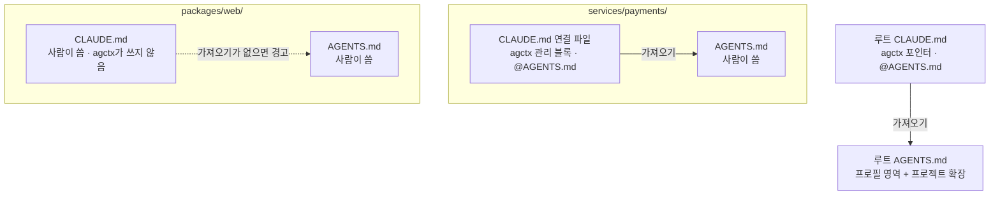

# 모노레포에서 쓰기

<!-- agctx-doc-sources: src/project/links.ts, src/project/plan.ts, templates/CLAUDE.link.md, src/i18n/messages-en.ts -->
<!-- agctx-doc-sources-sha256: aeba30f43d1c7c29c122a3ed353d32734641b5ab32b3a7c8fc0976ef32ad7d6e -->

모노레포는 흔히 루트 `AGENTS.md`에 공통 지침을 두고, 패키지 폴더마다 그 패키지의 지침만 담은 `AGENTS.md`를 둔다. 프로필은 루트에 적용하고 하위 `AGENTS.md`는 사람이 쓴다. agctx는 Claude Code가 하위 파일을 받도록 연결 파일을 챙긴다. 결정과 근거는 [ADR 0020](../adr/0020-apm-coexistence-and-monorepo-links.md)에 있다.



agctx는 사람이 쓴 `CLAUDE.md`가 없는 폴더에만 연결 파일을 만든다. 사람이 쓴 파일은 그대로 두고 `AGENTS.md`를 가져오지 않을 때만 알려 준다.

```bash
$ agctx profile apply team-backend . --dry-run
packages/web/CLAUDE.md does not import AGENTS.md, so Claude Code never reads packages/web/AGENTS.md. Add an import of it, such as @AGENTS.md.
Dry-run: 12 file(s) to change.
  create    AGENTS.md
  create    CLAUDE.md
  create    .agents/rules/agctx.md
  create    services/orders/CLAUDE.md
  create    services/payments/CLAUDE.md
  …
Dry-run: no files were changed.
```

- 적용한 뒤에 만든 하위 `AGENTS.md`는 다음 `agctx profile sync`에서 연결된다. 하위 `AGENTS.md`를 지우면 연결 파일은 남기고 관리 기록에서만 빼며 알려 준다.
- Git 저장소면 `.gitignore`로 무시한 폴더는 보지 않는다. `node_modules`·`dist`·`build`·`vendor` 같은 폴더와 그 안의 다른 Git 저장소도 건너뛴다.
- 연결 파일도 관리 블록이므로 블록 안을 고치면 다른 관리 파일처럼 `sync`가 충돌로 멈춘다. 그 폴더만의 Claude Code 지침은 블록 밖에 쓴다.
- 에이전트마다 하위 `AGENTS.md`를 받는 조건이 다르다. Codex는 그 폴더에서 시작할 때, Claude Code는 연결 파일이 있을 때 받는다. 하위 폴더에서 시작한 Claude Code가 루트 `AGENTS.md`를 받으려면 프로젝트마다 한 번 승인해야 하고, Antigravity는 실측에서 하위 `AGENTS.md`를 세션 시작에 받지 않았다. 폴더마다 `agctx explain <폴더>`로 확인한다.
