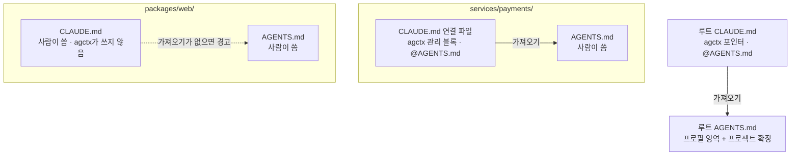

# 모노레포에서 쓰기

<!-- agctx-doc-sources: src/project/links.ts, src/project/plan.ts, templates/CLAUDE.link.md, src/explain.ts, src/i18n/messages-en.ts -->
<!-- agctx-doc-sources-sha256: 49dfc130df5635c92702e14e77cc4bd43d9c2d613a297f83700c34ddfee1afb1 -->

모노레포는 흔히 루트 `AGENTS.md`에 공통 지침을 두고, 패키지 폴더마다 그 패키지의 지침만 담은 `AGENTS.md`를 둔다. 프로필은 루트에 적용하고 하위 `AGENTS.md`는 사람이 쓴다. agctx는 Claude Code가 하위 파일을 받도록 연결 파일(그 폴더의 `AGENTS.md`를 `@AGENTS.md`로 가져오는 `CLAUDE.md`)을 챙긴다. Claude Code는 `AGENTS.md`를 직접 읽지 않기 때문이다. 결정과 근거는 [ADR 0020](../adr/0020-apm-coexistence-and-monorepo-links.md)에 있다.

## 목차

- [준비 사항](#준비-사항)
- [설정하기](#설정하기)
- [연결 파일 구조](#연결-파일-구조)
- [적용 결과 보기](#적용-결과-보기)
- [확인하기](#확인하기)
- [알아 둘 점](#알아-둘-점)
- [다음 단계](#다음-단계)

## 준비 사항

- **agctx와 프로필:** 설치와 프로필 만들기는 [빠른 시작](../getting-started/quick-start.md)에 있다.
- **저장소 루트:** 모노레포의 루트 폴더(보통 `.git`이 있는 폴더)에 적용한다. Git 저장소면 `.gitignore`로 무시한 폴더는 살펴보지 않는다.
- **하위 `AGENTS.md`:** 패키지마다 지침을 따로 둘 폴더를 정한다. 이미 있는 파일은 그대로 두고, 없으면 적용한 뒤에 만들어도 된다.

## 설정하기

1. 저장소 루트에서 프로필을 적용한다. 하위 폴더에 이미 `AGENTS.md`가 있으면 연결 파일도 함께 만든다. TUI에서는 **Manage profiles** > 프로필 > **Apply to a project**에서 저장소 루트를 고른다.

   ```bash
   agctx profile apply <프로필> .
   ```

2. 패키지 폴더마다 그 패키지의 지침을 `AGENTS.md`에 쓴다. 적용한 뒤에 만든 `AGENTS.md`는 `agctx profile sync .`를 실행해야 연결 파일이 생긴다.
3. 에이전트를 시작할 폴더마다 `agctx explain <폴더>`를 실행해 `missing` 없이 끝나는지 확인한다. 출력 읽는 법은 아래 [확인하기](#확인하기)에 있다.
4. 새로 생긴 연결 파일(`<폴더>/CLAUDE.md`)도 다른 적용 파일과 함께 커밋한다.

## 연결 파일 구조



agctx는 사람이 쓴 `CLAUDE.md`가 없는 폴더에만 연결 파일을 만든다. 사람이 쓴 파일은 그대로 두고 `AGENTS.md`를 가져오지 않을 때만 알려 준다.

## 적용 결과 보기

`--dry-run`은 파일을 쓰지 않고 적용 계획만 보여 준다.

```bash
$ agctx profile apply team-backend . --dry-run
packages/web/CLAUDE.md does not import AGENTS.md, so Claude Code never reads packages/web/AGENTS.md. Add an import of it, such as @AGENTS.md.
Dry-run: 12 file(s) to change.
  create    AGENTS.md
  create    CLAUDE.md
  create    .agents/rules/agctx.md
  create    services/orders/CLAUDE.md
  create    services/payments/CLAUDE.md
  …
Dry-run: no files were changed.
```

적용한 뒤에 하위 `AGENTS.md`를 새로 만들었다면 `sync`가 그 폴더의 연결 파일을 만든다. 아래는 `services/billing/AGENTS.md`를 더한 뒤 실행한 결과에서 바뀌지 않는 줄(`unchanged`)을 뺀 것이다.

```bash
$ agctx profile sync . --dry-run
Dry-run: 3 file(s) to change.
  create    services/billing/CLAUDE.md
  create    .agctx/base/services/billing/CLAUDE.md.base
  update    agctx.project.json
Dry-run: no files were changed.
```

## 확인하기

에이전트를 시작할 폴더마다 `agctx explain <폴더>`를 실행한다. 한 에이전트만 보려면 `--agent`를 붙인다. TUI에서는 첫 화면의 **Check a project** > **Instruction files each agent reads**에서 폴더와 에이전트를 고른다. 아래 출력은 위 예시 저장소에서 실제로 실행한 결과다.

사람이 둔 `packages/web/CLAUDE.md`가 `AGENTS.md`를 가져오지 않으면 `missing` 줄이 나오고 종료 코드 4로 끝난다.

```bash
$ agctx explain packages/web --agent claude
Claude Code · started in packages/web
  read         CLAUDE.md  start folder or a folder above it, read at launch
  read         packages/web/CLAUDE.md  start folder or a folder above it, read at launch
  conditional  AGENTS.md  imported by CLAUDE.md from outside the start folder; read only after external imports are approved
  not-read     packages/web/AGENTS.md  Claude Code reads CLAUDE.md, not AGENTS.md, and no CLAUDE.md imports this file
  warning      CLAUDE.md imports AGENTS.md from outside the start folder. Claude Code reads it only after someone approves external imports for this project once in an interactive session; starting at the project root needs no approval.
  missing      Claude Code never reads packages/web/AGENTS.md because packages/web/CLAUDE.md does not import it. Add @AGENTS.md to packages/web/CLAUDE.md.
$ echo $?
4
```

`missing` 줄의 안내대로 `packages/web/CLAUDE.md`에 `@AGENTS.md` 줄을 더하고 다시 실행하면, 같은 줄이 `read … imported by packages/web/CLAUDE.md`로 바뀌고 종료 코드 0으로 끝난다.

```bash
$ agctx explain packages/web --agent claude
Claude Code · started in packages/web
  …
  read         packages/web/AGENTS.md  imported by packages/web/CLAUDE.md
  …
$ echo $?
0
```

- `conditional AGENTS.md`와 `warning` 줄은 하위 폴더에서 시작했기 때문에 나온다. 루트 `AGENTS.md`가 시작 폴더 밖에 있어서, Claude Code는 그 프로젝트에서 처음 한 번 가져오기를 승인해야 읽는다. 저장소 루트에서 시작하면 승인이 필요 없다.
- `--agent`를 빼면 Codex와 Antigravity 판정도 함께 나온다. Antigravity는 하위 `AGENTS.md`마다 `conditional`과 `warning`을 보여 준다. 세션 시작에 받지 않는다고 실험으로 확인했기 때문이며, 이 경고는 종료 코드를 바꾸지 않는다. 모든 작업에 필요한 규칙은 루트 `AGENTS.md`에 둔다.
- 판정 기호의 뜻은 [에이전트가 읽는 지침 파일](../concepts/agent-loading.md)에, 종료 코드는 [종료 코드](../reference/exit-codes.md)에 있다.

## 알아 둘 점

- **나중에 만든 하위 `AGENTS.md`:** 적용한 뒤에 만든 하위 `AGENTS.md`는 다음 `agctx profile sync`에서 연결 파일이 생긴다.
- **하위 `AGENTS.md`를 지웠을 때:** 연결 파일은 지우지 않고 남긴다. `agctx.project.json`의 관리 기록에서만 빼고 그 사실을 알려 준다.
- **살펴보지 않는 폴더:** Git 저장소면 `.gitignore`로 무시한 폴더는 보지 않는다. `node_modules`·`dist`·`build`·`vendor` 같은 폴더와 그 안에 있는 다른 Git 저장소도 건너뛴다.
- **연결 파일을 고칠 때:** 연결 파일의 내용은 관리 블록(`<!-- agctx:managed:start -->`와 `<!-- agctx:managed:end -->` 사이, agctx가 다시 만드는 부분)이다. 블록 안을 고치면 다른 관리 파일처럼 `sync`가 충돌로 멈추므로, 그 폴더만의 Claude Code 지침은 블록 밖에 쓴다([관리 영역과 확장 영역](../concepts/managed-and-extension-areas.md)).
- **에이전트마다 다른 조건:** 하위 `AGENTS.md`를 받는 조건은 에이전트마다 다르다.
  - Codex는 그 하위 폴더에서 시작할 때 받는다.
  - Claude Code는 연결 파일이 있을 때 받는다. 하위 폴더에서 시작하면 루트 `AGENTS.md`가 시작 폴더 밖의 파일이 되므로, 프로젝트마다 처음 한 번 승인해야 받는다.
  - Antigravity는 직접 실험했을 때 하위 `AGENTS.md`를 세션 시작에 받지 않았다.

  에이전트를 시작하는 폴더마다 `agctx explain <폴더>`로 확인한다.

## 다음 단계

- 에이전트마다 어떤 파일을 왜 읽는지는 [에이전트가 읽는 지침 파일](../concepts/agent-loading.md)에 있다.
- 경고나 오류가 나면 [문제 해결](../reference/troubleshooting.md)을 본다.
