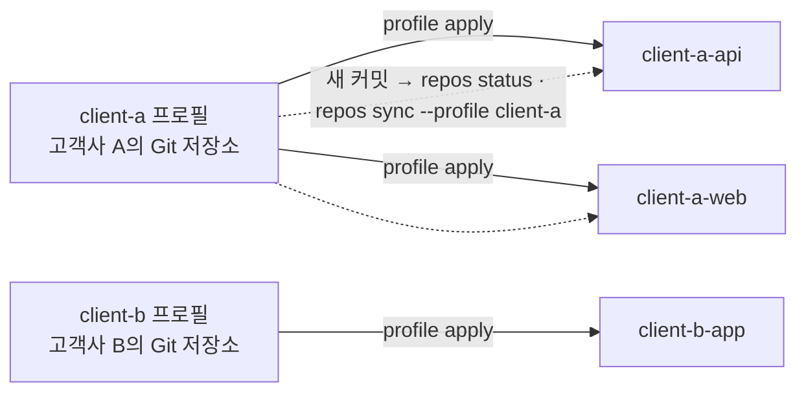

# 고객사 여러 곳의 규칙 따로 쓰기

<!-- agctx-doc-sources: src/repos, src/profile/git-profile.ts -->
<!-- agctx-doc-sources-sha256: 0e188647ec31822de18b1d3951272144fbd2131ec4ef893fc809a1d8cc705f7c -->

고객사 A와 B가 각자 규칙을 Git 저장소로 관리하고, 고객사 A가 규칙을 바꾸면 A의 저장소들에만 반영해야 하는 경우다.



고객사 프로필은 고객사가 관리하는 Git 저장소에서 받고, 새 커밋이 오면 그 프로필을 쓰는 저장소만 골라 한 번에 맞춘다.

## 1. 고객사 프로필 받기

```bash
agctx profile clone https://git.client-a.example/rules.git
agctx profile clone https://git.client-b.example/rules.git
```

`clone`은 받은 저장소에 `profile.json`과 `AGENTS.md`가 있는지, 사람에게 보이지 않는 문자가 섞였는지 검사한 뒤에만 보관함에 등록한다. 프로필 이름은 받은 `profile.json`의 이름을 쓴다.

## 2. 고객사 저장소에 적용

```bash
agctx profile apply client-a ~/work/client-a-api
agctx profile apply client-a ~/work/client-a-web
agctx profile apply client-b ~/work/client-b-app
```

적용한 커밋은 각 저장소의 `agctx.project.json`에 기록되고, 저장소는 이 컴퓨터의 저장소 목록에 자동으로 등록된다.

## 3. 고객사가 규칙을 바꾸면

```bash
agctx profile pull client-a
agctx repos status --profile client-a
agctx repos sync --profile client-a --dry-run
agctx repos sync --profile client-a
```

- `--profile client-a`로 거르므로 client-b 저장소는 건드리지 않는다.
- `repos sync`는 모든 대상의 계획을 보여 준 뒤 한 번 묻는다. 쓴 파일의 커밋은 저장소마다 사람이 한다.
- 고객사 팀과 함께 쓰는 저장소라 리뷰를 거쳐야 하면 `repos pr`로 저장소마다 PR을 연다([갱신 방식 고르기](update-policies.md)).

출력 예시는 [성격이 다른 저장소 여럿에 프로필 나눠 쓰기](multi-repo-individual.md#여러-저장소를-한-번에-맞추기)와 [CLI Reference](../reference/cli.md#repos-status)에 있다.
