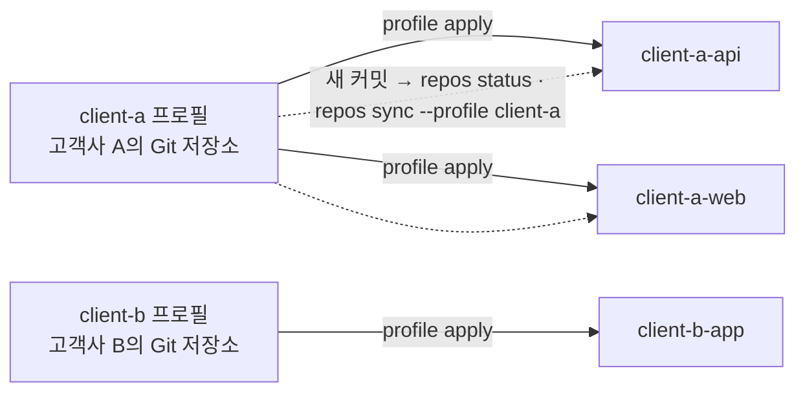

# 고객사 여러 곳의 규칙 따로 쓰기


고객사 A와 B가 각자 규칙을 Git 저장소로 관리하고, 고객사 A가 규칙을 바꾸면 A의 저장소들에만 반영해야 하는 경우다.



고객사 프로필은 고객사가 관리하는 Git 저장소에서 받고, 새 커밋이 오면 그 프로필을 쓰는 저장소만 골라 한 번에 다시 적용한다.

## 목차

- [준비 사항](#준비-사항)
- [1. 고객사 프로필 받기](#1-고객사-프로필-받기)
- [2. 고객사 저장소에 적용](#2-고객사-저장소에-적용)
- [3. 고객사가 규칙을 바꾸면](#3-고객사가-규칙을-바꾸면)
- [4. 확인하기](#4-확인하기)
- [다음 단계](#다음-단계)

## 준비 사항

- **agctx:** 설치는 [빠른 시작](../getting-started/quick-start.md#설치)에 있다.
- **고객사 저장소 접근 권한:** 고객사마다 `git ls-remote <주소>`가 오류 없이 끝나는지 확인한다.
- **TUI:** 1·2단계는 **Clone a profile**과 **Apply to a project**로, 3·4단계의 `repos` 명령은 **Repositories** 메뉴에서 프로필로 `client-a`를 골라 실행할 수 있다([TUI로 쓰기](tui.md#여러-저장소-다루기)).

## 1. 고객사 프로필 받기

<!-- agctx-doc-sources: src/profile/git-profile.ts -->
<!-- agctx-doc-sources-sha256: 89add602fa8c1c917f883d31e0ef3475aa490a8a9b20a7c11fe55d8c145eed96 -->

```bash
agctx profile clone https://git.client-a.example/rules.git
agctx profile clone https://git.client-b.example/rules.git
```

`clone`은 받은 저장소에 `profile.json`과 `AGENTS.md`가 있는지, 사람에게 보이지 않는 문자가 섞여 있는지 검사한 뒤에만 이 컴퓨터의 프로필 보관함(`~/.agctx/profiles`)에 등록한다([프로필 보관함](../concepts/profiles.md#프로필-보관함)). 프로필 이름은 받은 `profile.json`의 이름을 쓴다.

## 2. 고객사 저장소에 적용

<!-- agctx-doc-sources: src/repos -->
<!-- agctx-doc-sources-sha256: e41b1ee2304f6b07599f42eea59de52647e4bf806fdd49f2e170bf79bf394a80 -->

```bash
agctx profile apply client-a ~/work/client-a-api
agctx profile apply client-a ~/work/client-a-web
agctx profile apply client-b ~/work/client-b-app
```

적용한 커밋은 각 저장소의 `agctx.project.json`에 기록되고, 저장소는 이 컴퓨터의 저장소 목록(`~/.agctx/repos.json`)에 자동으로 등록된다. 다음 단계의 `repos` 명령은 이 목록에 있는 저장소를 한 번에 다룬다. 적용한 파일은 저장소마다 커밋한다([빠른 시작](../getting-started/quick-start.md#3-프로젝트에-적용)).

## 3. 고객사가 규칙을 바꾸면

```bash
agctx profile pull client-a
agctx repos status --profile client-a
agctx repos sync --profile client-a --dry-run
agctx repos sync --profile client-a
```

- `profile pull`은 고객사 저장소의 새 커밋을 보관함으로 받는다. `repos status`는 목록의 저장소가 그 버전보다 뒤처졌는지 보여 주고, `repos sync`는 뒤처진 저장소에 한 번에 다시 적용한다. `--dry-run`은 파일을 쓰지 않고 계획만 보여 준다.
- `--profile client-a`로 거르므로 client-b 저장소는 건드리지 않는다.
- `repos sync`는 모든 대상의 계획을 보여 준 뒤 한 번 묻는다. 바뀐 파일을 커밋하는 일은 저장소마다 사람이 한다.
- 고객사 팀과 함께 쓰는 저장소라 리뷰를 거쳐야 하면 `repos pr`로 저장소마다 PR을 연다([갱신 방식 고르기](update-policies.md)).

출력 예시는 [성격이 다른 저장소 여럿에 프로필 나눠 쓰기](multi-repo-individual.md#여러-저장소를-한-번에-맞추기)와 [CLI Reference](../reference/cli.md#repos-status)에 있다.

## 4. 확인하기

`agctx repos status --profile client-a`를 실행해 그 고객사의 저장소가 모두 `ok`인지 본다. 줄마다 적힌 값의 뜻은 [뒤처진 저장소 보기](multi-repo-individual.md#뒤처진-저장소-보기)에 있다.

## 다음 단계

- 고객사 저장소를 PR로만 갱신하려면 [갱신 방식 고르기](update-policies.md)를 본다.
- 동기화가 저장소를 건너뛰거나 멈추면 [문제 해결](../reference/troubleshooting.md)을 본다.
