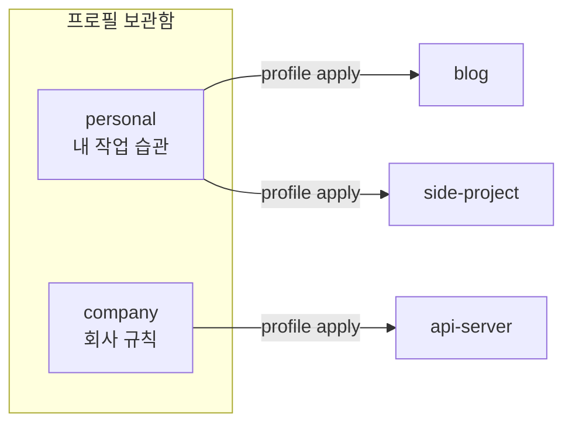
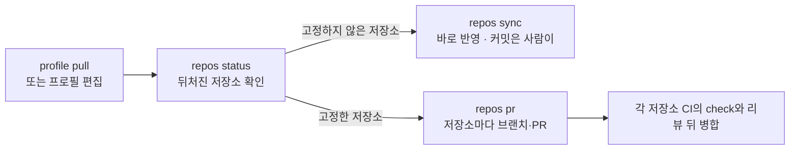

# 성격이 다른 저장소 여럿에 프로필 나눠 쓰기

<!-- agctx-doc-sources: src/repos, src/profile/git-profile.ts, src/i18n/messages-en.ts -->
<!-- agctx-doc-sources-sha256: ba70e00041c8788c8e1be91e81853dd3800e1838ebfe1a0f9ec39fbe07ae6a76 -->

개인 블로그와 사이드 프로젝트에는 내 작업 습관을, 회사 API 서버에는 회사 규칙을 적용하는 경우다. 사용자 수준 지침 파일(`~/.claude/CLAUDE.md` 등)은 저장소를 구분하지 못하므로, 저장소마다 프로필을 골라 적용한다.



같은 사람이라도 저장소마다 다른 프로필을 쓴다. 개인 규칙은 개인 저장소에만, 회사 규칙은 회사 저장소에만 들어간다.

## 목차

- [준비 사항](#준비-사항)
- [저장소마다 프로필 적용](#저장소마다-프로필-적용)
- [여러 저장소를 한 번에 맞추기](#여러-저장소를-한-번에-맞추기)
  - [뒤처진 저장소 보기](#뒤처진-저장소-보기)
  - [고정하지 않은 저장소 동기화](#고정하지-않은-저장소-동기화)
  - [동기화 결과 확인하기](#동기화-결과-확인하기)
- [다른 컴퓨터에서 같은 프로필 쓰기](#다른-컴퓨터에서-같은-프로필-쓰기)
- [다음 단계](#다음-단계)

## 준비 사항

- **agctx:** 설치는 [빠른 시작](../getting-started/quick-start.md#설치)에 있다.
- **프로필:** 아래 예시는 `company` 프로필을 이미 만들었거나 `profile clone`으로 받았다고 가정한다.
- **TUI:** 프로필 만들기와 적용은 **Manage profiles**에서, `repos` 명령은 첫 화면의 **Repositories** 메뉴에서 실행할 수 있다([TUI로 쓰기](tui.md#여러-저장소-다루기)).

## 저장소마다 프로필 적용

```bash
agctx profile create personal --scope personal
agctx profile setup personal
agctx profile apply personal ~/work/blog
agctx profile apply personal ~/work/side-project
agctx profile apply company ~/work/api-server
```

프로젝트의 도메인 규칙은 저장소마다 `AGENTS.md`의 확장 섹션(agctx가 다시 만들지 않는 사람 소유 영역) 아래에 쓴다([관리 영역과 확장 영역](../concepts/managed-and-extension-areas.md), [빠른 시작](../getting-started/quick-start.md)).

## 여러 저장소를 한 번에 맞추기

프로필 하나를 여러 저장소가 쓰면, 프로필이 바뀔 때마다 저장소를 하나씩 열지 않고 `repos` 명령으로 한 번에 맞춘다. `profile apply`·`profile sync`를 실행한 저장소는 이 컴퓨터의 목록(`~/.agctx/repos.json`)에 자동으로 기록된다. 결정과 안전 계약은 [ADR 0018](../adr/0018-multi-repository-sync.md)에 있다.



고정한 저장소는 `profile apply --pin`으로 적용해 프로필의 특정 커밋에 묶어 둔 저장소다([갱신 방식 고르기](update-policies.md)). 고정하지 않은 저장소는 이 컴퓨터의 프로필 보관함(`~/.agctx/profiles`)을 따라 바로 바뀌고, 고정한 저장소는 PR을 검토하고 병합해야 새 버전을 쓴다.

### 뒤처진 저장소 보기

```bash
$ agctx repos status
behind            personal         -      -               /work/blog
ok                client-a         -      -               /work/client-a-api
behind            personal         -      -               /work/notes
Next: agctx repos sync --profile personal
```

위 출력은 실제 실행 결과에서 경로만 바꿨다. 한 줄은 왼쪽부터 상태, 프로필, 고정 여부, `기록한 커밋→새 커밋`, 경로 순서다. 상태 `behind`는 저장소가 보관함의 프로필보다 뒤처졌다는 뜻이고, `ok`는 맞는다는 뜻이다. 옮기거나 지운 폴더는 `missing`으로 나오고, `agctx repos list --prune`으로 목록에서 지운다. 마지막 `Next:` 줄은 뒤처진 저장소를 맞출 명령이다.

### 고정하지 않은 저장소 동기화

```bash
agctx repos sync --profile personal --dry-run
agctx repos sync --profile personal
```

`--dry-run`은 파일을 쓰지 않고 계획만 보여 준다. `repos sync`는 모든 저장소의 계획을 보여 준 뒤 한 번만 묻는다. 고정한 저장소(`pinned`), 관리 파일에 커밋하지 않은 변경이 있는 저장소(`dirty`), 관리 영역을 밖에서 고친 저장소(`conflict`)는 건너뛰고 나머지를 계속한다. 쓴 파일의 커밋은 저장소마다 사람이 한다.

### 동기화 결과 확인하기

동기화한 뒤 `agctx repos status`를 다시 실행해 줄이 `ok`로 바뀌었는지 본다. 고정한 저장소는 `repos sync`가 건너뛰므로 `behind`로 남는다. 아래는 고정하지 않은 `web-app`과 고정한 `orders-api`를 함께 둔 실제 출력에서 경로만 바꾼 것이다.

```bash
$ agctx repos status
behind            team-backend     pinned ab35396→c61bea6 /work/orders-api
ok                team-backend     -      c61bea6         /work/web-app
Next: agctx profile pull team-backend, then agctx repos pr --profile team-backend
```

고정한 저장소를 새 버전으로 옮기는 방법은 [갱신 방식 고르기](update-policies.md#고정한-저장소를-pr로-갱신)에 있다.

## 다른 컴퓨터에서 같은 프로필 쓰기

프로필 보관함은 어떤 저장소에도 커밋되지 않는다. 컴퓨터를 옮겨도 같은 개인 프로필을 쓰려면 프로필 자체를 내 Git 저장소에 올린다.

1. 보관함의 `personal` 폴더에서 `git init`과 첫 커밋을 만든 뒤 `agctx profile connect personal <내 Git 저장소 주소>`와 `agctx profile push personal`을 실행한다. 커밋은 사람이 하고 agctx는 원격 연결과 push만 한다.
2. 새 컴퓨터에서 `agctx profile clone <내 Git 저장소 주소>`를 실행한다. 프로필 이름은 받은 `profile.json`의 이름을 쓴다.
3. 이미 적용한 저장소는 커밋된 파일로 규칙을 받는다. 이후 프로필을 고치면 `agctx profile pull personal` 뒤 `agctx repos sync --profile personal`로 맞춘다.

원격 연결과 push·pull의 자세한 절차와 출력은 [팀과 Git으로 공유하기](team-sharing.md)에 있다.

## 다음 단계

- 팀과 프로필을 나눠 쓰려면 [팀과 Git으로 공유하기](team-sharing.md)를 본다.
- CI에서 저장소가 뒤처졌는지 자동으로 확인하려면 [CI와 자동화에서 쓰기](ci.md)를 본다.
- `repos sync`가 저장소를 건너뛰면 [문제 해결](../reference/troubleshooting.md)을 본다.
