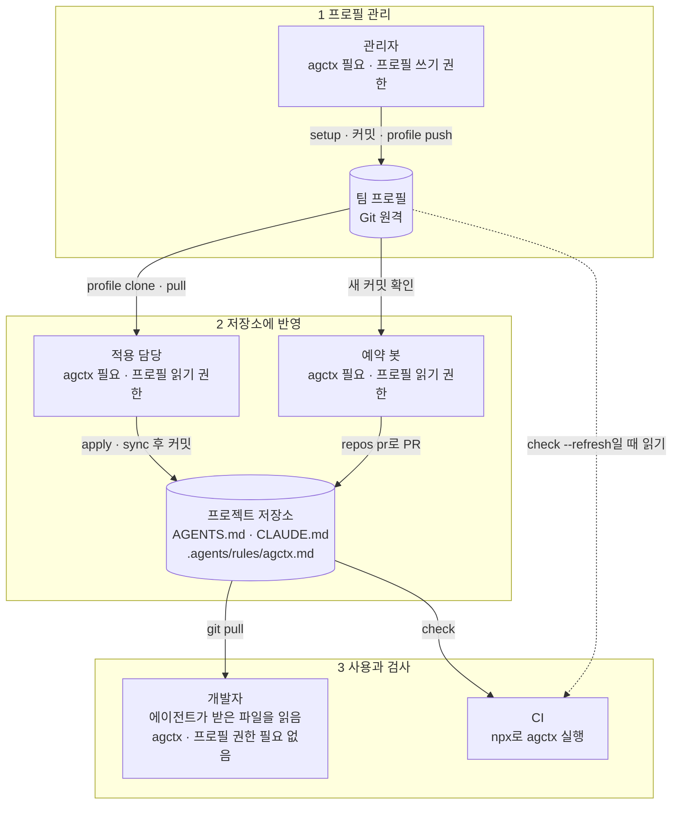
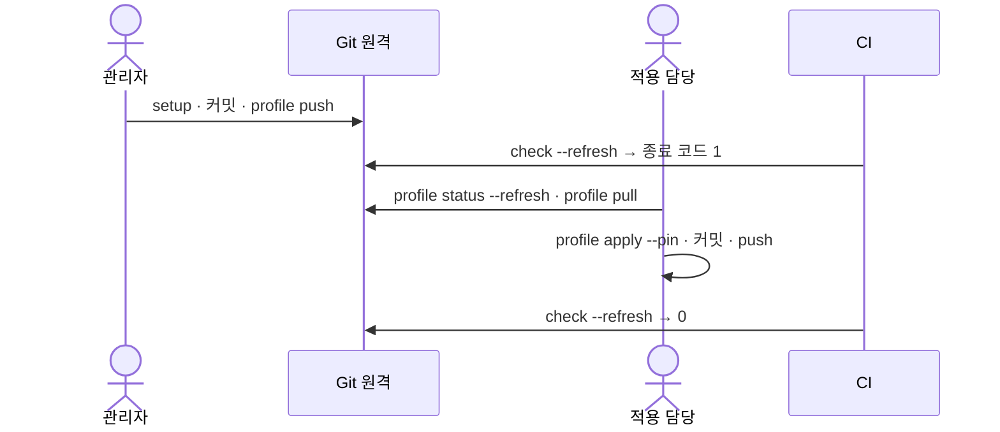

# 팀과 Git으로 공유하기


팀·조직 프로필은 표준 Git 원격(GitHub·GitLab 등)에 두고 주고받는다. 권한·리뷰·변경 이력은 Git 호스트가 맡고, agctx는 사용자의 Git 인증으로 `git`을 실행할 뿐이다. `clone`·`status`·`pull`·`push`·`connect`는 프로필만 다루고 프로젝트 파일은 건드리지 않는다. 결정과 안전 계약은 [ADR 0017](../adr/0017-git-profile-sharing.md)에 있다.

## 목차

- [누가 무엇을 하나](#누가-무엇을-하나)
- [시작하기 전에](#시작하기-전에)
- [관리자: 팀 프로필 올리기](#관리자-팀-프로필-올리기)
  - [1. 프로필 만들기](#1-프로필-만들기)
  - [2. 지침 고르기](#2-지침-고르기)
  - [3. 첫 커밋 만들기](#3-첫-커밋-만들기)
  - [4. 원격에 연결하고 올리기](#4-원격에-연결하고-올리기)
  - [5. 올라갔는지 확인하기](#5-올라갔는지-확인하기)
- [기존 저장소를 프로필로 쓰기](#기존-저장소를-프로필로-쓰기)
- [적용 담당: 저장소에 적용하기](#적용-담당-저장소에-적용하기)
  - [1. 프로필 받기](#1-프로필-받기)
  - [2. 갱신 방식 고르기](#2-갱신-방식-고르기)
  - [3. 적용하기](#3-적용하기)
  - [4. 커밋하고 올리기](#4-커밋하고-올리기)
  - [5. 적용됐는지 확인하기](#5-적용됐는지-확인하기)
- [프로필이 바뀌었을 때](#프로필이-바뀌었을-때)
  - [1. 관리자: 고쳐서 올리기](#1-관리자-고쳐서-올리기)
  - [2. CI: 뒤처짐 알리기](#2-ci-뒤처짐-알리기)
  - [3. 적용 담당: 받아서 반영하기](#3-적용-담당-받아서-반영하기)
- [개발자: 저장소 받기](#개발자-저장소-받기)
- [다음 단계](#다음-단계)

## 누가 무엇을 하나

| 역할 | 하는 일 | agctx | 프로필 저장소 권한 |
| --- | --- | --- | --- |
| 관리자 | 프로필을 만들고 고쳐서 원격에 올린다 | 필요 | 쓰기 |
| 적용 담당 | 프로필을 받아 저장소에 적용·동기화하고 결과를 커밋한다 | 필요 | 읽기 |
| [예약 봇](update-policies.md#예약-봇으로-pr-열기) | 정해진 시간마다 CI에서 `repos pr`을 실행해, 고정한 저장소(`--pin`으로 프로필 커밋에 묶어 둔 저장소)마다 새 버전 PR을 연다 | 필요 | 읽기 |
| 개발자 | 저장소를 받아 평소처럼 에이전트를 쓴다 | 필요 없음 | 필요 없음 |
| CI | 저장소가 기록한 프로필 버전과 지금 파일이 맞는지 검사한다 | 필요(`npx`로 실행) | 프로필 원격 저장소의 최신 커밋과도 비교하는 `check --refresh`를 쓸 때 읽기 |



프로필 내용은 적용 담당이나 예약 봇이 반영할 때 프로젝트 저장소의 파일로 들어가고, 개발자의 에이전트는 그 파일을 직접 읽는다. 그래서 agctx와 프로필 저장소 권한이 필요한 쪽은 1·2단계와 CI뿐이고, 저장소를 받기만 하는 개발자는 아무것도 설치하지 않아도 된다.

- 한 사람이 관리자와 적용 담당을 함께 맡아도 된다.
- 에이전트가 어떤 파일을 읽는지는 시작한 폴더에 따라 다르다. 개발자가 하위 폴더에서 에이전트를 시작한다면 [에이전트가 읽는 지침 파일](../concepts/agent-loading.md)을 확인한다.
- 예약 봇의 토큰 권한은 [갱신 방식 고르기](update-policies.md#예약-봇으로-pr-열기)에, CI 설정은 [CI와 자동화에서 쓰기](ci.md)에 있다.

## 시작하기 전에

1. 관리자와 적용 담당은 agctx를 설치한다. 설치 명령은 [빠른 시작](../getting-started/quick-start.md#설치)에 있다.
2. Git 호스트에 프로필을 둘 저장소를 README·라이선스 파일 없이 빈 저장소로 만든다. 원격에 커밋이 이미 있으면 첫 `push`가 `The remote of profile team-backend has commits you do not have.`로 멈춘다. 규칙을 이미 Git 저장소에 두고 있으면 새로 만들지 말고 [기존 저장소를 프로필로 쓰기](#기존-저장소를-프로필로-쓰기)로 간다.
3. 관리자와 적용 담당은 그 저장소에 Git으로 접근할 수 있는지 확인한다. 빈 저장소에서는 아무것도 출력하지 않고 오류 없이 끝나면 된다.

   ```bash
   git ls-remote git@github.com:acme/team-backend-profile.git
   ```

4. 명령 대신 메뉴로 진행하려면, 아래 단계의 명령마다 같은 일을 하는 TUI 메뉴를 [TUI로 쓰기](tui.md#메뉴와-명령-대응표)에서 찾는다. 고정 적용(`--pin`)은 **Apply to a project**에서 고정 질문에 **Yes**를 고르는 것과 같다.

아래 출력은 모두 로컬 Git 원격을 두고 실제로 실행한 결과에서 경로와 원격 주소만 바꿨다.

## 관리자: 팀 프로필 올리기

<!-- agctx-doc-sources: src/profile/setup.ts, src/profile/git-profile.ts -->
<!-- agctx-doc-sources-sha256: 759faba2335b833f804bc230b528af8d98c47115cc7864d6f04f08692a3305fc -->

### 1. 프로필 만들기

```bash
$ agctx profile create team-backend --scope team
Created profile: team-backend (team)
```

`--scope`는 프로필의 용도(`personal`·`company`·`team`·`workspace`)다. 프로필은 이 컴퓨터의 프로필 보관함인 `~/.agctx/profiles/team-backend` 폴더에 만들어진다([프로필 보관함](../concepts/profiles.md#프로필-보관함)).

### 2. 지침 고르기

```bash
$ agctx profile setup team-backend --tdd on --security on
Configured profile: team-backend
```

작업 흐름·맥락 관리·TDD·변경 검토·검증·지침 파일·문서화·보안·믿을 수 없는 입력·응답 언어 10개 항목마다 `on`과 `off` 중에서 고른다. 옵션으로 넘기지 않은 항목은 이전에 고른 값을 그대로 쓰고, 처음 설정하는 프로필이면 응답 언어는 `off`, 나머지는 `on`이 된다(`src/profile/setup.ts`의 `guidanceDefaults`<!--s:b4d095fe641d-->·`setupProfile`<!--s:605737432754-->). 뜻은 [지침 항목 켜고 끄기](../concepts/profiles.md#지침-항목-켜고-끄기)에, 옵션은 [CLI Reference](../reference/cli.md#profile-setup)에 있다.

### 3. 첫 커밋 만들기

agctx는 커밋을 대신 만들지 않으므로 프로필 폴더를 Git 저장소로 만들고 첫 커밋을 직접 만든다. 커밋에는 `AGENTS.md`와 `profile.json`이 들어간다.

```bash
git -C ~/.agctx/profiles/team-backend init -b main
git -C ~/.agctx/profiles/team-backend add -A
git -C ~/.agctx/profiles/team-backend commit -m "Add team-backend profile"
```

이 단계를 건너뛰고 `profile connect`를 먼저 실행하면, 위 세 명령을 안내하고 멈춘다.

### 4. 원격에 연결하고 올리기

```bash
$ agctx profile connect team-backend git@github.com:acme/team-backend-profile.git
Connected profile team-backend to git@github.com:acme/team-backend-profile.git (branch main).
Next: agctx profile push team-backend

$ agctx profile push team-backend
1 commit(s) of profile team-backend will go to git@github.com:acme/team-backend-profile.git:
  e0caeb1 Add team-backend profile
Pushed profile team-backend.
```

`push`는 보낼 커밋을 보여 준 뒤 `Push 1 commit(s) of profile team-backend?`로 확인을 묻는다. 위 출력에서는 확인 질문 줄을 뺐다.

### 5. 올라갔는지 확인하기

```bash
$ agctx profile status --refresh team-backend
team-backend	git@github.com:acme/team-backend-profile.git main@e0caeb1	clean	ahead 0, behind 0
```

`clean`과 `ahead 0, behind 0`이 보이면 로컬 프로필과 원격이 같다.

## 기존 저장소를 프로필로 쓰기

<!-- agctx-doc-sources: src/profile/link.ts, src/profile/git-profile.ts, src/profile/store.ts, src/i18n/messages-en.ts -->
<!-- agctx-doc-sources-sha256: 03a3b0c5eabfe1b8615fab0b12cd8e08e91d5a234e71fb918c363a8b95f45d14 -->

규칙을 이미 Git 저장소에 두고 있으면 새 프로필을 만들어 올리지 않는다. 관리자는 그 저장소 폴더를 `profile link`로 보관함에 잇고, 팀과 나눌 때는 그 폴더에 생긴 `profile.json`을 커밋해 올린다. 위의 `profile create` → `connect` → `push` 순서는 빈 원격을 전제하므로, 커밋이 있는 저장소에 쓰면 첫 `push`와 그다음 `pull`이 모두 멈춘다.

1. **저장소 루트에서 연결한다.** `profile link`가 규칙 파일을 찾아 `profile.json`을 만들고, 보관함에는 그 폴더를 가리키는 포인터만 둔다. 커밋은 하지 않는다.

   ```bash
   $ cd /work/team-rules
   $ agctx profile link --yes
   Plan:
     create    /work/team-rules/profile.json  (name team-rules, scope personal, rules templates/AGENTS.md)
     link      ~/.agctx/profiles/team-rules -> /work/team-rules
   Linked profile team-rules to /work/team-rules.
   Next: agctx profile apply team-rules <project> to try it. To share it, commit profile.json in that folder and push; teammates run agctx profile clone <git-url>.
   ```

   규칙 파일은 루트의 `AGENTS.md`를 먼저 쓰고, 없으면 폴더 안에 하나뿐인 `AGENTS.md`를 쓴다. 여럿이면 후보를 보여 주며 멈추므로 `--instructions <경로>`로 고른다. 이름과 용도는 `--name`·`--scope`로 준다. `--yes` 없이 터미널에서 실행하면 계획을 보여 준 뒤 확인을 묻는다.

   규칙이 저장소 안의 하위 폴더에 있어도 하위 폴더가 아니라 저장소 루트를 연결하고, 규칙 파일을 `--instructions <하위 폴더>/AGENTS.md`로 준다. 하위 폴더를 주면 루트를 쓰라는 명령을 알려 주며 멈춘다. 고정과 `clone`이 저장소 루트를 기준으로 동작하기 때문이다. 규칙 파일이 심볼릭 링크(예: `AGENTS.md -> CLAUDE.md`)면 링크가 가리키는 파일을 `--instructions`로 준다.

2. **적용해 본다.** `agctx profile apply team-rules <project>`는 그 폴더의 규칙 파일을 바로 읽으므로 커밋하지 않은 수정도 들어간다. 그 상태로 적용하면 `agctx.project.json`에 `uncommitted: true`가 남고 `--pin`은 거부된다.

3. **팀과 나눈다.** 그 폴더에서 `profile.json`을 커밋해 저장소의 평소 방식대로 올린다. 적용 담당은 [1. 프로필 받기](#1-프로필-받기)처럼 받는다.

   ```bash
   $ agctx profile clone git@github.com:acme/team-rules.git
   Cloned profile team-rules at commit 1df750b.
   Next: agctx profile apply team-rules <project>
   ```

`profile link` 없이 `profile.json`을 직접 써도 된다. 규칙 파일이 루트의 `AGENTS.md`면 `schemaVersion` 1로 `name`과 `scope`만 적고, 하위 폴더에 있으면 파일을 옮기지 말고 `instructions`로 가리킨다.

```text
team-rules/
├── profile.json              ← 더하는 파일
├── docs/policy.md
└── templates/AGENTS.md       ← instructions가 가리킨다
```

```json
{
  "schemaVersion": 2,
  "name": "team-rules",
  "scope": "company",
  "instructions": "templates/AGENTS.md"
}
```

`profile.json`이 없는 저장소를 받으면 무엇을 더할지 알려 주고 멈춘다.

```bash
$ agctx profile clone git@github.com:acme/team-rules.git
Error: git@github.com:acme/team-rules.git is not a profile repository: profile.json is missing at its root.
Next: Add profile.json at the repository root, for example {"schemaVersion": 1, "name": "team-backend", "scope": "team"}. The rules file is AGENTS.md at the root; if it is elsewhere, use "schemaVersion": 2 and add "instructions": "<path to the .md file>". To start from nothing, run agctx profile create and push it with Git.
```

- 프로필에 들어가는 규칙은 `instructions`가 가리킨 파일 하나다. 저장소의 다른 파일은 프로젝트로 옮기지 않는다.
- `profile setup`은 가리킨 파일에 지침 구역을 쓰고 루트에 `AGENTS.md`를 만들지 않는다. 연결한 프로필이면 그 폴더의 파일이 바로 바뀌므로 `git status`에 드러난다.
- 연결한 프로필에서는 `profile pull`·`push`·`connect`가 멈추고, 그 폴더에서 git으로 받고 올리라고 안내한다. `profile status --refresh`도 그 폴더에서 받아 오지 않는다. `clone`으로 받은 프로필은 지금처럼 `profile pull`로 받고, 보관함의 프로필 폴더에서 고치고 커밋한 뒤 `profile push`로 올릴 수도 있다.
- 연결한 폴더를 옮기거나 지우거나, 그 폴더에서 커밋하지 않은 `profile.json`이나 규칙 파일이 없어지면 `profile list`에 끊긴 링크로 나온다. 되살릴 때는 안내에 나온 대로 `profile remove`로 링크를 지운 뒤, 연결할 때의 이름·용도·규칙 파일을 준 `profile link`로 다시 연결한다. `profile remove`는 포인터만 지우므로 폴더는 그대로다. 멀쩡한 링크를 다른 폴더로 옮길 때도 같다.
- `instructions`로 쓸 수 있는 경로와 옛 버전의 동작은 [파일 형식](../reference/file-formats.md#profilejson)에, 명령의 옵션은 [CLI Reference](../reference/cli.md#profile-link)에 있다.

## 적용 담당: 저장소에 적용하기

<!-- agctx-doc-sources: src/profile/apply.ts -->
<!-- agctx-doc-sources-sha256: 99565cbc1a1103db34b29024b720132a2d7b930637c53461380630f9eba0647c -->

### 1. 프로필 받기

```bash
$ agctx profile clone git@github.com:acme/team-backend-profile.git
Cloned profile team-backend at commit e0caeb1.
Next: agctx profile apply team-backend <project>
```

`clone`은 받은 저장소에 `profile.json`과 그것이 가리키는 규칙 파일(기본 `AGENTS.md`)이 있는지, 사람에게 보이지 않는 문자가 섞여 있는지 검사한 뒤에만 이 컴퓨터의 프로필 보관함에 등록한다.

### 2. 갱신 방식 고르기

적용할 때 `--pin`을 붙일지 정한다. 차이는 나중에 프로필에 새 커밋이 생긴 뒤 `profile sync`(저장소에 기록한 프로필로 다시 적용하는 명령)를 실행했을 때 드러난다.

```text
프로필 커밋:  ab35396 (변경 검토: on)      ──pull──→ c61bea6 (변경 검토: off)   

고정하지 않은 저장소   sync → c61bea6 내용으로 바뀐다     (변경 검토: off)   
고정한 저장소          sync → ab35396 내용 그대로 남는다  (변경 검토: on)     
                      apply --pin 또는 repos pr로 옮겨야 c61bea6이 된다
```

| 방식 | 적용 명령 | 프로필이 바뀐 뒤 `sync`하면 | 새 버전으로 옮기는 법 | 어울리는 경우 |
| --- | --- | --- | --- | --- |
| 고정하지 않음 | `profile apply team-backend <project>` | 보관함의 최신 내용으로 바뀐다 | `profile pull` 뒤 `profile sync` | 바뀐 지침을 바로 따라가도 되는 저장소 |
| 고정 | `profile apply team-backend <project> --pin` | 적용할 때 기록한 커밋의 내용 그대로 남는다 | `apply --pin` 다시 실행, 또는 `repos pr`로 연 PR 병합 | 새 지침을 PR로 리뷰한 뒤 들이려는 저장소 |

그림은 실제로 두 저장소를 나란히 두고 실행한 결과를 줄인 것이다. 실행 출력은 [갱신 방식 고르기](update-policies.md#두-방식의-차이-확인하기)에 있다. 아래는 고정하는 예다.

### 3. 적용하기

```bash
$ agctx profile apply team-backend /path/to/orders-api --pin
Plan: 8 file(s) to change.
  create    AGENTS.md
  create    CLAUDE.md
  create    .agents/rules/agctx.md
  create    .agctx/base/AGENTS.md.base
  create    .agctx/base/CLAUDE.md.base
  create    .agctx/base/.agents/rules/agctx.md.base
  create    .agctx/.gitignore
  create    agctx.project.json
Applied profile team-backend to /path/to/orders-api
```

계획을 보여 준 뒤 `Write 8 file(s) in /path/to/orders-api?`로 확인을 묻는다. 위 출력에서는 확인 질문 줄을 뺐다. 파일을 쓰지 않고 계획만 보려면 `--dry-run`을 붙인다.

만들어지는 파일은 세 종류다.

- `AGENTS.md`·`CLAUDE.md`·`.agents/rules/agctx.md`: 에이전트가 읽는 지침 파일이다. agctx가 다시 만드는 관리 영역과 사람이 쓰는 영역이 나뉘어 있다([관리 영역과 확장 영역](../concepts/managed-and-extension-areas.md)).
- `agctx.project.json`: 이 저장소에 적용한 프로필과 버전(원격·브랜치·커밋)을 기록한다. CI의 `check`가 이 기록을 기준으로 검사한다.
- `.agctx/base/`: 마지막으로 적용한 관리 영역 원문이다. 관리 영역 충돌을 풀 때 기준이 된다.

### 4. 커밋하고 올리기

적용한 파일을 프로젝트 저장소에 커밋해야 다른 팀원과 CI가 같은 규칙과 버전 기록을 받는다. 프로젝트 폴더에서 새로 생긴 파일을 확인한다.

```bash
$ git status --short --untracked-files=all
?? .agctx/.gitignore
?? .agctx/base/.agents/rules/agctx.md.base
?? .agctx/base/AGENTS.md.base
?? .agctx/base/CLAUDE.md.base
?? .agents/rules/agctx.md
?? AGENTS.md
?? CLAUDE.md
?? agctx.project.json
```

이 파일들을 커밋하고, 저장소의 평소 방식대로 push하거나 PR을 연다.

```bash
git add AGENTS.md CLAUDE.md .agents agctx.project.json .agctx
git commit -m "Apply team-backend profile"
```

모노레포에서 하위 폴더 연결 파일(`CLAUDE.md`)이 함께 생겼다면 그 파일도 커밋한다([모노레포에서 쓰기](monorepo.md)).

### 5. 적용됐는지 확인하기

`check`는 저장소 파일이 기록한 프로필 버전과 맞는지 검사하고, `explain`은 에이전트마다 어떤 지침 파일을 왜 읽는지 보여 준다. 둘 다 파일을 바꾸지 않는다. 프로젝트 폴더에서 실행한다.

```bash
$ agctx check .
/path/to/orders-api matches its recorded profile version.

$ agctx explain .
Codex · started in the project root
  …
  read         AGENTS.md  one file per folder from the project root to the start folder
Claude Code · started in the project root
  …
  read         CLAUDE.md  start folder or a folder above it, read at launch
  read         AGENTS.md  imported by CLAUDE.md
Antigravity · started in the project root
  …
  read         AGENTS.md  workspace root file (measured)
  read         .agents/rules/agctx.md  trigger: always_on
```

`check`가 오류 없이 끝나고, `explain`에서 세 에이전트가 모두 `AGENTS.md`를 읽으면 된다. `…`는 사용자 수준 지침 파일처럼 컴퓨터마다 달라지는 줄을 생략한 자리다.

## 프로필이 바뀌었을 때

<!-- agctx-doc-sources: src/check.ts -->
<!-- agctx-doc-sources-sha256: 76a20cc928278b1f28b2c37fc7da4455b2d9810e02d3b786a2aff582057e046a -->



관리자가 올린 변경은 적용 담당이 받아 반영하기 전까지 프로젝트에 들어가지 않는다. 그 사이에 저장소가 뒤처진 것은 CI의 `check --refresh`가 알려 준다.

### 1. 관리자: 고쳐서 올리기

```bash
$ agctx profile setup team-backend --tdd on --security on
Configured profile: team-backend

$ git -C ~/.agctx/profiles/team-backend add -A
$ git -C ~/.agctx/profiles/team-backend commit -m "Make TDD strict"

$ agctx profile push team-backend
1 commit(s) of profile team-backend will go to git@github.com:acme/team-backend-profile.git:
  ab35396 Make TDD strict
Pushed profile team-backend.
```

`profile setup` 대신 프로필 폴더의 `AGENTS.md`를 직접 고쳐도 순서는 같다. 커밋하지 않은 변경이 있거나 원격보다 뒤처졌으면 `push`가 멈추고 무엇을 먼저 할지 알려 준다.

### 2. CI: 뒤처짐 알리기

```bash
$ agctx check --refresh .
behind            -  the source repository has a newer commit (ab35396)
```

`--refresh`는 `agctx.project.json`에 기록한 프로필 원격 저장소의 최신 커밋을 읽어 기록과 비교한다. 더 최근 커밋이 있으면 뒤처진 것으로 보고 종료 코드 1로 끝나므로 CI 작업이 실패로 표시된다. 종료 코드의 뜻은 [종료 코드](../reference/exit-codes.md)에, 설정 방법은 [CI와 자동화에서 쓰기](ci.md#ci에서-확인하기)에 있다.

### 3. 적용 담당: 받아서 반영하기

```bash
$ agctx profile status --refresh team-backend
team-backend	git@github.com:acme/team-backend-profile.git main@e0caeb1	clean	ahead 0, behind 1
  Next: agctx profile pull team-backend

$ agctx profile pull team-backend
Pulled 1 commit(s) into profile team-backend:
  ab35396 Make TDD strict
Next: run agctx profile sync <project> in projects that use team-backend. A project pinned with --pin stays on its commit until you run agctx profile apply team-backend <project> --pin.

$ agctx profile apply team-backend /path/to/orders-api --pin
Plan: 3 file(s) to change.
  update    AGENTS.md
  unchanged CLAUDE.md
  unchanged .agents/rules/agctx.md
  update    .agctx/base/AGENTS.md.base
  unchanged .agctx/base/CLAUDE.md.base
  unchanged .agctx/base/.agents/rules/agctx.md.base
  unchanged .agctx/.gitignore
  update    agctx.project.json
Applied profile team-backend to /path/to/orders-api
```

- 고정하지 않은 저장소는 마지막 명령 대신 `agctx profile sync /path/to/orders-api`를 실행한다.
- `pull`은 fast-forward(로컬 프로필 뒤에 원격의 새 커밋만 이어 붙이는 방식)로만 받는다. 프로필 폴더에 커밋하지 않은 수정이 있거나 로컬과 원격이 갈라졌으면 받지 않고 멈춘다.
- 반영한 뒤 바뀐 파일(`AGENTS.md`, `.agctx/base/AGENTS.md.base`, `agctx.project.json`)을 커밋하고 올린다. 그다음 `check --refresh`가 오류 없이 끝나면 최신이다.
- 저장소가 여럿이면 [갱신 방식 고르기](update-policies.md)에 있는 명령으로 한 번에 처리한다. `repos sync`는 고정하지 않은 저장소들을 한 번에 다시 적용하고, `repos pr`은 고정한 저장소마다 새 버전 PR을 연다. `repos pr`은 예약 봇에 맡길 수도 있다.

## 개발자: 저장소 받기

<!-- agctx-doc-sources: src/explain.ts, src/i18n/messages-en.ts -->
<!-- agctx-doc-sources-sha256: 5730cd71f4dd514c49c2f245edbaf19b51303e406870be00620237591df20671 -->

개발자는 agctx를 설치하지 않는다. 적용 담당이 올린 커밋을 받으면 된다.

```bash
git pull
```

받은 뒤에는 에이전트를 새로 시작한다. 예를 들어 Claude Code는 `explain` 출력의 `read at launch`처럼 지침 파일을 시작할 때 읽으므로, 이미 열어 둔 세션에는 바뀐 규칙이 바로 들어가지 않을 수 있다.

## 다음 단계

- 서비스 저장소가 여럿이면 [갱신 방식 고르기](update-policies.md)의 `repos pr`로 저장소마다 PR을 연다.
- 저장소 CI에 [`agctx check`](ci.md#ci에서-확인하기)를 넣어 뒤처진 저장소를 찾아낸다.
- `push`·`pull`이 멈추거나 CI의 `check`가 실패하면 [문제 해결](../reference/troubleshooting.md)을 본다.
