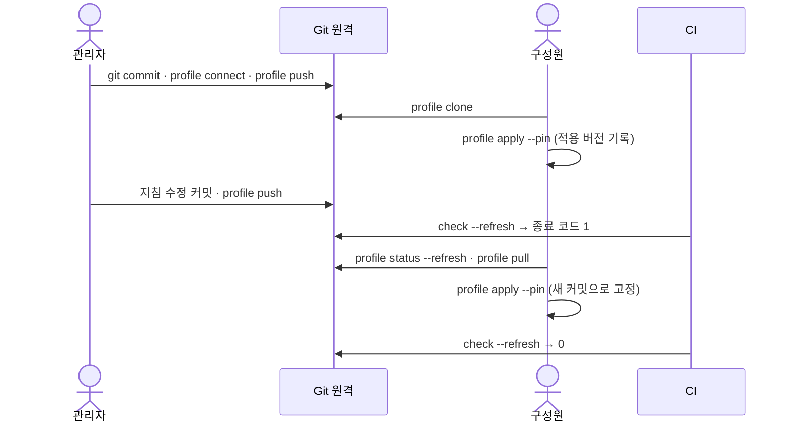

# 팀과 Git으로 공유하기

<!-- agctx-doc-sources: src/profile/git-profile.ts, src/profile/apply.ts, src/i18n/messages-en.ts -->
<!-- agctx-doc-sources-sha256: 99289bd4195507a70f92a769d138259eb4c0cf8e091b22cfcd1732db6bcfe268 -->

팀·조직 프로필은 표준 Git 원격(GitHub·GitLab 등)에 두고 주고받는다. 권한·리뷰·변경 이력은 Git 호스트가 맡고, agctx는 사용자의 Git 인증으로 `git`을 실행할 뿐이다. `clone`·`status`·`pull`·`push`·`connect`는 프로필만 다루고 프로젝트 파일은 건드리지 않는다. 결정과 안전 계약은 [ADR 0017](../adr/0017-git-profile-sharing.md)에 있다.



관리자가 올린 변경은 구성원이 받아 적용하기 전까지 프로젝트에 들어가지 않는다. CI의 `check`가 그 사이의 뒤처짐을 드러낸다.

## 관리자: 프로필을 원격에 올리기

프로필을 만들고 설정한 뒤 프로필 폴더를 Git 저장소로 만든다. agctx는 커밋을 대신 만들지 않으므로, 연결을 먼저 시도하면 필요한 명령을 알려 준다.

```bash
$ agctx profile create team-backend --scope team
Created profile: team-backend (team)

$ agctx profile connect team-backend git@github.com:acme/team-backend-profile.git
Error: Profile team-backend is not a Git repository yet.
Next: Create the first commit, then connect again:
  git -C "/Users/me/.agctx/profiles/team-backend" init -b main
  git -C "/Users/me/.agctx/profiles/team-backend" add -A
  git -C "/Users/me/.agctx/profiles/team-backend" commit -m "Add team-backend profile"
```

위 출력은 실제 실행 결과에서 경로와 원격 주소만 바꿨다. 안내대로 커밋한 뒤 다시 연결하고 올린다.

```bash
agctx profile connect team-backend git@github.com:acme/team-backend-profile.git
agctx profile push team-backend
```

`push`는 보낼 커밋을 보여 주고 확인을 받는다. 지침을 고칠 때마다 `profile setup`이나 직접 편집 → 프로필 폴더에서 `git commit` → `agctx profile push team-backend` 순서로 반복한다. 커밋하지 않은 변경이 있거나 원격보다 뒤처졌으면 `push`가 멈추고 무엇을 먼저 할지 알려 준다.

## 구성원: 받아서 적용하기

```bash
agctx profile clone git@github.com:acme/team-backend-profile.git
agctx profile apply team-backend /path/to/orders-api --pin
```

`clone`은 받은 저장소에 `profile.json`과 `AGENTS.md`가 있는지, 사람에게 보이지 않는 문자가 섞였는지 검사한 뒤에만 등록한다. 적용할 때는 두 방식 중 하나를 고른다.


고정하지 않으면 프로필을 따라 바로 바뀌고, `--pin`으로 고정하면 PR을 검토한 뒤에만 바뀐다. 어느 쪽을 고를지는 [갱신 방식 고르기](update-policies.md)에 있다.

어느 방식이든 `agctx.project.json`에 원격 주소·브랜치·커밋이 기록되므로 팀원과 CI가 같은 버전을 확인할 수 있다. 이 파일과 `.agctx/base/`를 커밋한다.

## 갱신 받기

```bash
$ agctx profile status --refresh team-backend
team-backend	git@github.com:acme/team-backend-profile.git main@39ca6e1	clean	ahead 0, behind 1
  Next: agctx profile pull team-backend

$ agctx profile pull team-backend
Pulled 1 commit(s) into profile team-backend:
  ddf3742 Make TDD strict
Next: run agctx profile sync <project> in projects that use team-backend. A project pinned with --pin stays on its commit until you run agctx profile apply team-backend <project> --pin.
```

위 출력도 실제 실행 결과에서 원격 주소만 바꿨다. `pull`은 fast-forward만 하며, 프로필 폴더에 커밋하지 않은 수정이 있거나 로컬과 원격이 갈라졌으면 받지 않고 멈춘다. 받은 뒤 고정하지 않은 프로젝트는 `agctx profile sync <project>`, 고정한 프로젝트는 `agctx profile apply team-backend <project> --pin`으로 반영한다.

## 다음 단계

- 서비스 저장소가 여럿이면 [갱신 방식 고르기](update-policies.md)의 `repos pr`로 저장소마다 PR을 연다.
- 저장소 CI에 [`agctx check`](ci.md#ci에서-확인하기)를 넣어 뒤처진 저장소를 잡는다.
