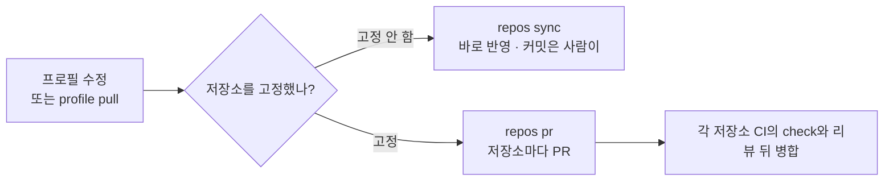

# 갱신 방식 고르기: 고정과 예약 봇

<!-- agctx-doc-sources: src/repos/pr.ts, src/repos/sync.ts, src/profile/apply.ts -->
<!-- agctx-doc-sources-sha256: f98648d103f961c37fc1258a874635fab490f91eeeaf64b8c592032ff0737a62 -->

프로필이 바뀌었을 때 저장소가 새 지침을 받는 방식은 두 가지다.

| 방식 | 명령 | 프로필이 바뀌었을 때 | 어울리는 경우 |
| --- | --- | --- | --- |
| 고정하지 않음(기본) | `profile apply <name> <project>` | `profile pull` 후 `profile sync`로 새 지침을 반영 | 개인 프로필, 지침 변경을 바로 따라가도 되는 팀 |
| 고정 | `profile apply <name> <project> --pin` | `sync`해도 기록한 커밋에 머물고, `apply --pin`을 다시 실행해야 옮겨 감 | 검토한 버전만 쓰고 저장소마다 PR로 올리는 팀 |



고정하지 않은 저장소는 보관함을 따라 바뀌고, 고정한 저장소는 PR을 검토하고 병합해야 새 버전을 쓴다. 어느 방식이든 사람이 버전을 찾아 파일을 옮겨 붙이는 단계는 없다.

## 고정하지 않은 저장소

프로필을 고치거나 `profile pull`로 받은 뒤 `agctx repos sync --profile <이름>`을 실행한다. 절차와 출력은 [성격이 다른 저장소 여럿에 프로필 나눠 쓰기](multi-repo-individual.md#여러-저장소를-한-번에-맞추기)에 있다.

## 고정한 저장소를 PR로 갱신

```bash
agctx profile pull team-backend
agctx repos pr --profile team-backend --dry-run
agctx repos pr --profile team-backend
```

`repos pr`은 사용자의 작업 폴더를 건드리지 않는다. 저장소마다 원격 base 브랜치를 임시 worktree에 꺼내 새 커밋으로 다시 고정하고, `agctx/<프로필>-<커밋>` 브랜치로 push한 뒤 `gh`로 PR을 연다. 같은 브랜치에 열린 PR이 있거나 그 브랜치가 이미 원격에 있으면 새로 만들지 않는다. `gh`가 없거나 GitHub가 아닌 원격이면 push까지 하고 PR을 직접 열도록 안내한다. 옵션과 실제 출력은 [CLI Reference](../reference/cli.md#repos-pr)에 있다.

## 예약 봇으로 PR 열기

봇은 저장소 목록 대신 `--targets` 파일을 쓴다. 파일에는 한 줄에 저장소 하나씩 clone URL이나 경로를 적고, 봇이 실행될 때마다 임시 폴더에 clone해 처리한다. 프로필에 새 커밋이 없으면 아무것도 바꾸지 않고, 이미 연 PR은 다시 만들지 않는다.

```text
# repos.txt: team-backend 프로필을 쓰는 저장소
https://github.com/acme/orders-api.git
https://github.com/acme/billing-api.git
```

아래는 GitHub Actions 예약 워크플로 예시다. 이 저장소에서 실행해 본 설정은 아니다.

```yaml
name: agctx profile update
on:
  schedule:
    - cron: '0 1 * * *'
  workflow_dispatch:
jobs:
  update:
    runs-on: ubuntu-latest
    env:
      GH_TOKEN: ${{ secrets.AGCTX_BOT_TOKEN }}
    steps:
      - uses: actions/checkout@v4
      - uses: actions/setup-node@v4
        with:
          node-version: 22
      - run: |
          gh auth setup-git
          git config --global user.name "agctx-bot"
          git config --global user.email "agctx-bot@users.noreply.github.com"
      - run: npx --yes agent-context-manager profile clone https://github.com/acme/team-backend-profile.git
      - run: npx --yes agent-context-manager repos pr --targets repos.txt --profile team-backend --yes
```

- 토큰은 프로필 저장소를 읽고 대상 저장소에 브랜치를 push하고 PR을 열 수 있어야 한다. `GH_TOKEN`은 gh가 인증에 쓰는 토큰이고, `gh auth setup-git`은 git이 gh를 인증 도우미로 쓰게 설정한다([외부 근거](../references.md#cli-계약과-지침-공급망-근거)). `GH_TOKEN`만 둔 환경에서 `gh auth setup-git`이 성공하는지는 직접 확인하지 못했으므로, 처음 적용할 때 `workflow_dispatch`로 한 번 실행해 확인한다.
- 커밋 작성자는 실행 환경의 Git 설정을 따르므로 봇 이름과 메일을 설정한다.
- 봇이 연 PR은 각 저장소의 CI에서 `agctx check`로 검사한 뒤 리뷰해 병합한다([CI에서 확인하기](ci.md#ci에서-확인하기)).

## 고정하거나 풀기

- 처음 고정하거나 새 커밋으로 옮기려면 `agctx profile apply <이름> <프로젝트> --pin`을 실행한다. Git에 연결했고 커밋하지 않은 수정이 없는 프로필이어야 한다.
- 고정한 프로젝트에 `--pin` 없이 `apply`하면 고정이 풀린다는 경고를 먼저 출력한다.
- 고정한 프로젝트의 `sync`는 기록한 커밋의 지침으로 다시 만들므로 보관함을 `pull`해도 바뀌지 않는다. 옵션과 출력은 [CLI Reference](../reference/cli.md#profile-apply)에 있다.
