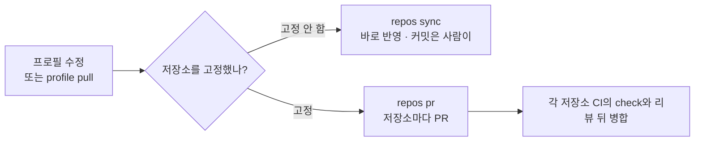

# 갱신 방식 고르기: 고정과 예약 봇


프로필이 바뀌었을 때 저장소가 새 지침을 받는 방식은 두 가지다. 적용할 때 `--pin`을 붙이면 고정이고, 붙이지 않으면 고정하지 않은 상태다. 차이는 프로필에 새 커밋이 생긴 뒤 `sync`를 실행했을 때 드러난다.

- **고정하지 않음:** 저장소가 프로필의 최신 내용을 따라간다. `sync`하면 이 컴퓨터 보관함에 있는 최신 프로필로 바뀐다.
- **고정:** 저장소가 적용할 때 기록한 프로필 커밋에 머문다. 보관함이 최신이 되어도 `sync`는 그 커밋의 내용을 그대로 다시 쓴다. 새 커밋으로 옮기려면 `apply --pin`을 다시 실행하거나 `repos pr`로 연 PR을 병합한다.

```text
프로필 커밋:  ab35396 (변경 검토: on)      ──pull──→ c61bea6 (변경 검토: off)   

고정하지 않은 저장소   sync → c61bea6 내용으로 바뀐다     (변경 검토: off)   
고정한 저장소          sync → ab35396 내용 그대로 남는다  (변경 검토: on)     
                      apply --pin 또는 repos pr로 옮겨야 c61bea6이 된다
```

위 그림은 아래 [두 방식의 차이 확인하기](#두-방식의-차이-확인하기)에서 실제로 실행한 결과를 줄인 것이다.

| 방식 | 적용 명령 | 프로필이 바뀐 뒤 `sync`하면 | 새 버전으로 옮기는 법 | 어울리는 경우 |
| --- | --- | --- | --- | --- |
| 고정하지 않음(기본) | `profile apply <name> <project>` | 보관함의 최신 내용으로 바뀐다 | `profile pull` 뒤 `profile sync`, 저장소가 여럿이면 `repos sync` | 개인 프로필, 바뀐 지침을 바로 따라가도 되는 팀 |
| 고정 | `profile apply <name> <project> --pin` | 기록한 커밋의 내용 그대로 남는다 | `apply --pin` 다시 실행, 저장소가 여럿이면 `repos pr`로 저장소마다 PR | 저장소마다 새 지침을 리뷰한 뒤 들이려는 팀 |



- `profile pull`은 원격 프로필 저장소의 새 커밋을 이 컴퓨터의 프로필 보관함(`~/.agctx/profiles`)으로 받는다.
- `profile sync`는 저장소에 기록한 프로필로 관리 영역(agctx가 다시 만드는 부분)만 다시 적용한다([관리 영역과 확장 영역](../concepts/managed-and-extension-areas.md)).
- `repos sync`는 적용한 저장소 목록에서 고정하지 않은 저장소를 한 번에 다시 적용하고, `repos pr`은 고정한 저장소마다 새 버전 브랜치를 push하고 PR을 연다.

고정하지 않은 저장소는 보관함을 따라 바뀌고, 고정한 저장소는 PR을 검토하고 병합해야 새 버전을 쓴다. 어느 방식이든 사람이 버전을 찾아 파일을 옮겨 붙이는 단계는 없다.

## 목차

- [준비 사항](#준비-사항)
- [두 방식의 차이 확인하기](#두-방식의-차이-확인하기)
- [고정하지 않은 저장소](#고정하지-않은-저장소)
- [고정한 저장소를 PR로 갱신](#고정한-저장소를-pr로-갱신)
- [예약 봇으로 PR 열기](#예약-봇으로-pr-열기)
- [고정하거나 풀기](#고정하거나-풀기)
- [다음 단계](#다음-단계)

## 준비 사항

- **고정하려면:** 프로필이 Git 원격에 연결되어 있고, 프로필 폴더에 커밋하지 않은 수정이 없어야 한다.
- **`repos pr`로 PR까지 열려면:** GitHub CLI `gh`가 설치되어 있고 로그인되어 있어야 한다. 없으면 브랜치 push까지만 하고 PR은 직접 열도록 안내한다.
- **TUI:** 동기화는 TUI의 **Sync a project**로, 고정 적용은 **Apply to a project**에서 고정 질문에 **Yes**를 골라서도 할 수 있다. 여러 저장소의 `repos sync`·`repos pr`은 첫 화면의 **Repositories** 메뉴에서 실행한다([TUI로 쓰기](tui.md#여러-저장소-다루기)).

## 두 방식의 차이 확인하기

<!-- agctx-doc-sources: src/check.ts, src/i18n/messages-en.ts -->
<!-- agctx-doc-sources-sha256: f96658d53566a6ba4540b0b59287fa283be0d5b456fe2878990a6f951fa29f7f -->

두 저장소에 같은 프로필 커밋 `ab35396`을 적용하되, `web-app`은 고정하지 않고 `orders-api`는 `--pin`으로 고정했다. 그 뒤 관리자가 변경 검토 수준을 `strict`로 바꿔 올린 커밋 `c61bea6`을 `profile pull`로 받고, 두 저장소에서 `check`와 `sync`를 차례로 실행했다. 아래 출력은 실제 실행 결과에서 경로만 바꿨다.

고정하지 않은 `web-app`은 `sync`로 새 커밋의 내용을 받는다.

```bash
$ cd /path/to/web-app && agctx check .
behind            AGENTS.md  differs from the current profile; run agctx profile sync

$ agctx profile sync /path/to/web-app
Plan: 3 file(s) to change.
  update    AGENTS.md
  unchanged CLAUDE.md
  unchanged .agents/rules/agctx.md
  update    .agctx/base/AGENTS.md.base
  unchanged .agctx/base/CLAUDE.md.base
  unchanged .agctx/base/.agents/rules/agctx.md.base
  unchanged .agctx/.gitignore
  update    agctx.project.json
Applied profile team-backend to /path/to/web-app
```

고정한 `orders-api`는 `check`가 새 커밋이 있다고 알려 주지만, `sync`는 기록한 커밋의 내용으로 다시 만들기 때문에 바뀌는 파일이 없다.

```bash
$ cd /path/to/orders-api && agctx check .
behind            -  the profile store has a newer commit (c61bea6)

$ agctx profile sync /path/to/orders-api
Plan: 0 file(s) to change.
  unchanged AGENTS.md
  unchanged CLAUDE.md
  unchanged .agents/rules/agctx.md
  unchanged .agctx/base/AGENTS.md.base
  unchanged .agctx/base/CLAUDE.md.base
  unchanged .agctx/base/.agents/rules/agctx.md.base
  unchanged .agctx/.gitignore
  unchanged agctx.project.json
/path/to/orders-api is already up to date.
```

실행 뒤 `AGENTS.md`의 변경 검토 수준은 `web-app`이 `strict`, `orders-api`가 `recommended`였다. 두 저장소 모두 `check`는 종료 코드 1(뒤처짐)로 끝났다. 고정한 저장소도 새 버전이 나왔다는 사실은 알 수 있다. 다만 새 커밋으로 옮기는 일은 아래 [고정한 저장소를 PR로 갱신](#고정한-저장소를-pr로-갱신)이나 `apply --pin`으로만 한다. 바꿀 파일이 있으면 터미널에서는 쓰기 전에 확인을 묻는다.

## 고정하지 않은 저장소

<!-- agctx-doc-sources: src/repos/sync.ts -->
<!-- agctx-doc-sources-sha256: c3f99d7b8f253fd2582c2f5537aeaa7b759821d9f1ab20b01d31d49f24518652 -->

프로필을 고치거나 `profile pull`로 받은 뒤 `agctx repos sync --profile <이름>`을 실행한다. 절차와 출력은 [성격이 다른 저장소 여럿에 프로필 나눠 쓰기](multi-repo-individual.md#여러-저장소를-한-번에-맞추기)에 있다.

## 고정한 저장소를 PR로 갱신

<!-- agctx-doc-sources: src/repos/pr.ts -->
<!-- agctx-doc-sources-sha256: f877fb6eaac0f635a0f03be5f94da84c8dd598b3cfd7b598de5d9c9ef5294dbb -->

```bash
agctx profile pull team-backend
agctx repos pr --profile team-backend --dry-run
agctx repos pr --profile team-backend
```

`repos pr`은 사용자의 작업 폴더를 건드리지 않는다. 저장소마다 원격 base 브랜치를 임시 worktree(작업 폴더와 별도로 만든 임시 체크아웃)에 받아 와 새 커밋으로 다시 고정하고, `agctx/<프로필>-<커밋>` 브랜치로 push한 뒤 `gh`(GitHub CLI)로 PR을 연다. 같은 브랜치에 열린 PR이 있거나 그 브랜치가 이미 원격에 있으면 새로 만들지 않는다. `gh`가 없거나 GitHub가 아닌 원격이면 push까지 하고 PR을 직접 열도록 안내한다. 옵션과 실제 출력은 [CLI Reference](../reference/cli.md#repos-pr)에 있다.

## 예약 봇으로 PR 열기

예약 봇은 CI의 예약 실행(GitHub Actions의 `schedule` 등)으로 정해진 시간마다 `repos pr`을 돌리는 작업이다. 사람이 저장소마다 PR을 열지 않아도 프로필에 새 커밋이 생기면 PR이 열린다.

봇은 이 컴퓨터의 저장소 목록 대신 `--targets` 파일을 쓴다. 파일에는 한 줄에 저장소 하나씩 clone URL이나 경로를 적고, 봇이 실행될 때마다 임시 폴더에 clone해 처리한다. 프로필에 새 커밋이 없으면 아무것도 바꾸지 않고, 이미 연 PR은 다시 만들지 않는다.

```text
# repos.txt: team-backend 프로필을 쓰는 저장소
https://github.com/acme/orders-api.git
https://github.com/acme/billing-api.git
```

아래는 GitHub Actions 예약 워크플로 예시다. 이 저장소에서 실행해 본 설정은 아니다.

```yaml
name: agctx profile update
on:
  schedule:
    - cron: '0 1 * * *'
  workflow_dispatch:
jobs:
  update:
    runs-on: ubuntu-latest
    env:
      GH_TOKEN: ${{ secrets.AGCTX_BOT_TOKEN }}
    steps:
      - uses: actions/checkout@v4
      - uses: actions/setup-node@v4
        with:
          node-version: 22
      - run: |
          gh auth setup-git
          git config --global user.name "agctx-bot"
          git config --global user.email "agctx-bot@users.noreply.github.com"
      - run: npx --yes agent-context-manager profile clone https://github.com/acme/team-backend-profile.git
      - run: npx --yes agent-context-manager repos pr --targets repos.txt --profile team-backend --yes
```

- 토큰은 프로필 저장소를 읽고 대상 저장소에 브랜치를 push하고 PR을 열 수 있어야 한다. `GH_TOKEN`은 gh가 인증에 쓰는 토큰이고, `gh auth setup-git`은 git이 gh를 인증 도우미로 쓰게 설정한다([외부 근거](../references.md#cli-계약과-지침-공급망-근거)). `GH_TOKEN`만 둔 환경에서 `gh auth setup-git`이 성공하는지는 직접 확인하지 못했으므로, 처음 적용할 때 `workflow_dispatch`로 한 번 실행해 확인한다.
- 커밋 작성자는 실행 환경의 Git 설정을 따르므로 봇 이름과 메일 주소를 설정한다.
- 봇이 연 PR은 각 저장소의 CI에서 `agctx check`로 검사한 뒤 리뷰해 병합한다([CI에서 확인하기](ci.md#ci에서-확인하기)).

## 고정하거나 풀기

<!-- agctx-doc-sources: src/profile/apply.ts -->
<!-- agctx-doc-sources-sha256: 023714cf31133646043c71ab1d99851d64ca90ef6748ca2e214524c5b4c54bba -->

- 처음 고정하거나 새 커밋으로 옮기려면 `agctx profile apply <이름> <프로젝트> --pin`을 실행한다. Git에 연결했고 커밋하지 않은 수정이 없는 프로필이어야 한다.
- 고정한 프로젝트에 `--pin` 없이 `apply`하면 고정이 풀린다는 경고를 먼저 출력한다.
- TUI의 **Apply to a project**는 Git 프로필이면 고정할지 묻는다. 이미 고정한 프로젝트는 **Yes**가 미리 선택되어 있으므로 `Enter`만 누르면 고정을 유지한 채 지금 프로필 커밋으로 옮기고, **No**를 고르면 고정이 풀린다([TUI로 쓰기](tui.md#프로젝트에-적용하기)).
- 고정한 프로젝트의 `sync`는 기록한 커밋의 지침으로 다시 만들므로 보관함을 `pull`해도 바뀌지 않는다. 옵션과 출력은 [CLI Reference](../reference/cli.md#profile-apply)에 있다.

## 다음 단계

- 봇이 연 PR과 저장소를 CI에서 검사하려면 [CI와 자동화에서 쓰기](ci.md)를 본다.
- `repos pr`이 `branch-exists`나 `pushed`로 끝나면 [문제 해결](../reference/troubleshooting.md)을 본다.
