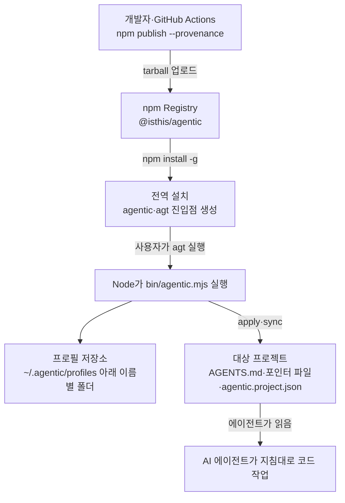
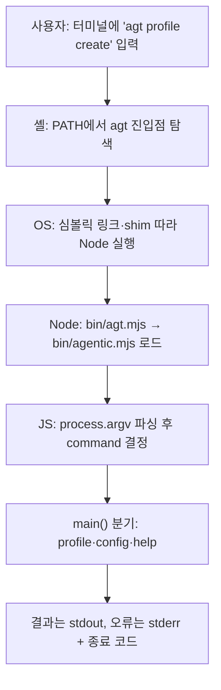
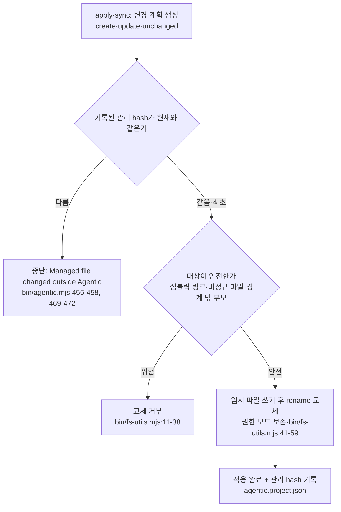
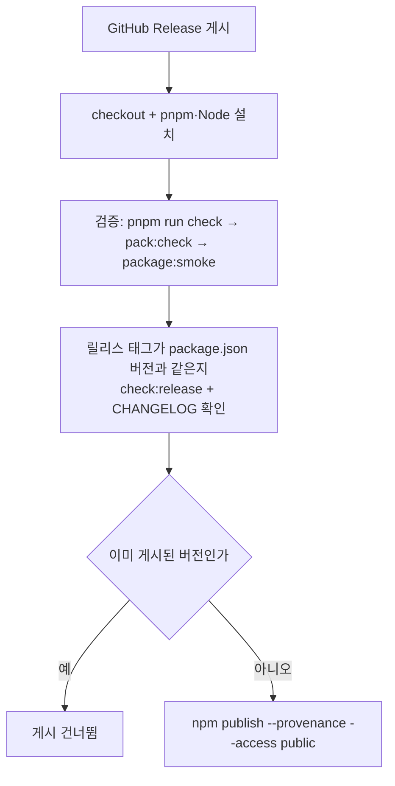
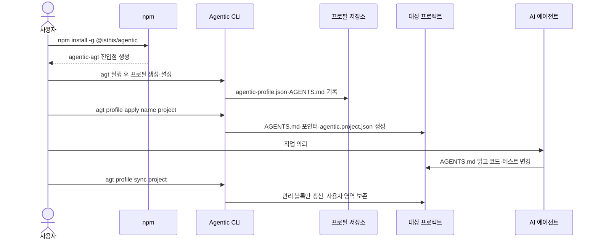

# 구현 원리

**문서 유형:** 생태계 원리 해설 (입문자·기여자용). npm·Node.js·CLI 일반 원리를 이 패키지 구현에 연결해 전체 그림을 설명한다. 현재 구현된 각 기능의 내부 로직은 [기능 구현 메커니즘](architecture/implementation-mechanics.md)이 정본이다. 이 문서는 원리와의 연결에 필요한 만큼만 인용한다.

**작성·검증 기준:** `@isthis/agentic` `0.2.0` · 2026-09-14 · 아래 소스 해시 마커가 가리키는 소스

> 이 문서는 코드의 `파일:줄` 위치를 다수 인용한다(예: `bin/agentic.mjs:585-605`). 줄 번호는 **아래 마커의 해시를 마지막으로 기록한 시점의 소스 기준**이며 코드가 바뀌면 어긋날 수 있다. 인용을 신뢰하기 전에 현재 코드에서 직접 확인하라. 다른 문서는 줄 번호 대신 절 링크로 인용한다. 이 문서는 항상 **현재 구현**을 설명하는 단일 정본이며, 과거 버전의 설명은 git 이력에서 확인한다. 코드가 바뀌면 이 문서와 위 기준선을 같은 변경에서 갱신한다. 인용한 소스가 바뀌면 `pnpm run check`가 실패하도록 소스 해시 게이트가 걸려 있다([공개 저장소 운영](repository-operations.md)의 "문서 소스 해시 게이트" 참고).

<!-- agentic-doc-sources: bin/agentic.mjs, bin/agt.mjs, bin/analyzer.mjs, bin/contracts.mjs, bin/fs-utils.mjs, bin/i18n.mjs, package.json, tools/package-smoke.mjs, tools/check-syntax.mjs, .github/workflows/ci.yml, .github/workflows/publish.yml, evals/package-contents.test.mjs -->
<!-- agentic-doc-sources-sha256: 1d105500e81fd8b91f212a7d2a3afdbc87244ea15266d8a97137f269662f4c74 -->

이 문서는 `@isthis/agentic`이 **왜 이렇게 동작하는지**를 설명한다. 제품 사용법이 아니라, npm·Node.js·CLI의 일반 원리와 이 저장소의 실제 구현을 연결해 전체 그림을 이해하도록 돕는 것이 목적이다.

읽는 방법:

- **일반 원리**와 **Agentic의 실제 구현**을 각 항목에서 명확히 구분한다. 일반 원리는 Node.js·npm 생태계 전반의 이야기이고, `이 패키지에서의 적용 예시`만 이 저장소의 실제 코드를 근거로 한다.
- 코드로 확인되지 않는 값(설치 경로 등 환경마다 달라지는 것)은 **“현재 저장소에서 확인되지 않음”**으로 표시한다.
- 명령을 실행하는 주체가 **사용자**인지, 처리하는 주체가 **Agentic 내부 코드**인지 구분해서 적는다.
- 사용자·워크플로·아키텍처의 정본은 [사용자 워크플로](workflow.md), [CLI Reference](cli-reference.md), [현재 아키텍처](architecture/), [제품 방향](product-direction.md)이다. 이 문서는 그 계약을 다시 정의하지 않고, 원리 설명에 필요한 만큼만 인용한다.

배포되는 것과 저장소에만 있는 것의 구분은 이 문서 전반의 전제다. npm tarball에 담기는 것은 `package.json`의 `files`에 적힌 `bin/`, `templates/`, `README.md`, `LICENSE`와 npm이 메타데이터로 항상 넣는 `package.json`이다(`package.json:19-24`). 런타임 의존성(`@clack/prompts`)은 tarball 파일이 아니라 설치 시 별도로 내려받아 구성된다. `docs/`(이 문서 포함), `evals/`, `tools/`, GitHub 워크플로는 저장소에만 있고 npm 사용자에게는 설치되지 않는다.

## 한눈에 보는 전체 그림

아래 그림은 이 문서가 다루는 흐름을 게시에서 프로젝트 적용까지 하나로 잇는다. 각 단계의 상세 원리는 이어지는 번호 항목에서 다룬다.



---

## 1. npm Registry에 패키지가 저장·배포되는 원리

### 핵심 원리

npm Registry는 패키지 이름과 버전을 키로 하는 공개 저장소다. 개발자가 `npm publish`로 압축된 패키지(tarball)를 올리면, 이후 누구나 `npm install <name>`으로 그 버전을 내려받을 수 있다. 같은 `이름@버전`은 원칙적으로 한 번만 게시된다.

### 실행 또는 데이터 흐름

1. 게시자가 패키지를 tarball(`.tgz`)로 묶는다. 무엇이 들어갈지는 `package.json`의 `files`와 `.gitignore`/`.npmignore` 규칙이 결정한다.
2. `npm publish`가 tarball을 Registry에 업로드하고, `name`·`version`·`bin` 같은 메타데이터를 함께 등록한다.
3. 사용자가 `npm install`을 실행하면 Registry가 해당 tarball을 돌려주고, npm이 이를 풀어 설치한다.

### 이 패키지에서의 적용 예시

- 패키지 이름과 버전은 `package.json:2-3`에 있다(`"@isthis/agentic"`, `"0.2.0"`). `@isthis/`는 스코프(scope)이고, `publishConfig.access`가 `public`이라 스코프 패키지를 공개로 게시한다(`package.json:52-54`).
- 실제 게시는 GitHub Actions가 수행한다. `release`가 게시되면 `.github/workflows/publish.yml`이 검증을 돌린 뒤 `npm publish --provenance --access public`을 실행한다(`.github/workflows/publish.yml:48-50`). 자세한 배포 원리는 [15번](#15-github-actions에서-npm으로-자동-배포되는-원리)에서 다룬다.
- 같은 버전 중복 게시를 막기 위해, 워크플로는 게시 전에 Registry에 이미 그 버전이 있는지 확인하고 있으면 건너뛴다(`.github/workflows/publish.yml:37-50`).

### 사용자가 알아야 할 주의점

- 한 번 게시된 버전은 사실상 되돌릴 수 없다. 잘못 올리면 새 버전을 올려 바로잡는다.
- `files`에 없는 파일은 Registry로 올라가지 않는다. 배포에 필요한 파일이 빠지면 설치 후 실행이 깨질 수 있다([12번](#12-packagejson의-files-설정과-실제-배포-파일-범위) 참고).

---

## 2. npm install이 패키지를 다운로드하고 저장하는 위치

### 핵심 원리

설치에는 두 종류가 있다. **로컬 설치**는 현재 프로젝트의 `node_modules/`에 넣고, **전역 설치**(`-g`/`--global`)는 시스템 공용 위치에 넣어 어느 디렉터리에서나 명령을 쓸 수 있게 한다.

### 실행 또는 데이터 흐름

1. `npm install`이 Registry에서 tarball을 받아 압축을 푼다.
2. 로컬 설치면 프로젝트의 `node_modules/<name>/`에, 전역 설치면 npm의 전역 prefix 아래(`npm root -g`가 가리키는 곳)에 파일을 둔다.
3. 패키지에 `bin`이 있으면, 실행 파일에 대한 링크(또는 Windows용 shim)를 만든다. 위치는 [3번](#3-packagejson의-bin-설정이-터미널-명령어가-되는-과정)에서 이어 설명한다.

### 이 패키지에서의 적용 예시

- 권장 설치는 전역 설치다. [README](../README.md)의 시작하기와 [CLI Reference](cli-reference.md#설치와-실행) 모두 `npm install -g @isthis/agentic`을 안내한다.
- 이 저장소 자체를 개발할 때는 설치 없이 `node bin/agentic.mjs`로 직접 실행한다([CLI Reference](cli-reference.md#설치와-실행)).
- 설치와 실행을 실제로 재현하는 근거는 `tools/package-smoke.mjs`다. 이 스크립트는 tarball을 임시 소비자 디렉터리에 **로컬 설치**하고(`tools/package-smoke.mjs:37`), `node_modules/.bin/`에 생긴 실행 파일을 직접 호출해 동작을 확인한다(`tools/package-smoke.mjs:38-47`).

### 사용자가 알아야 할 주의점

- 전역 설치의 정확한 파일 경로는 OS·Node 설치 방식(시스템 Node, Homebrew, nvm 등)에 따라 다르다. **특정 절대 경로는 현재 저장소에서 확인되지 않으며**, 자신의 환경에서는 `npm root -g`와 `npm prefix -g`로 확인한다.
- 전역 설치는 시스템 공용 위치에 쓰므로 환경에 따라 권한이 필요할 수 있다. 별도 프로필 데이터 저장 위치는 이와 다르다([6번](#6-javascript가-nodejs-api로-파일폴더에-접근하는-원리) 참고).

---

## 3. package.json의 bin 설정이 터미널 명령어가 되는 과정

### 핵심 원리

`package.json`의 `bin`은 “명령어 이름 → 실행할 스크립트 파일” 매핑이다. 설치 시 npm이 이 매핑을 읽어, 명령어 이름으로 PATH에서 찾을 수 있는 실행 진입점을 만들어 준다.

### 실행 또는 데이터 흐름

1. npm이 `bin`의 각 항목을 읽는다.
2. 전역 설치면 npm의 전역 bin 디렉터리에, 로컬 설치면 `node_modules/.bin/`에 실행 진입점을 만든다. macOS/Linux에서는 대상 스크립트로의 심볼릭 링크, Windows에서는 `.cmd`/`.ps1` 같은 shim이 생긴다([9번](#9-macoslinux와-windows의-실행-파일path-처리-차이) 참고).
3. 사용자가 명령어를 입력하면 셸이 PATH에서 그 진입점을 찾아 실행하고, 진입점이 대상 스크립트를 Node로 실행한다.

### 이 패키지에서의 적용 예시

- 이 패키지는 두 개의 명령을 노출한다: `agentic → ./bin/agentic.mjs`, `agt → ./bin/agt.mjs`(`package.json:15-18`).

  ```json
  "bin": {
    "agentic": "./bin/agentic.mjs",
    "agt": "./bin/agt.mjs"
  }
  ```
- `agt`는 `agentic`의 짧은 별칭이다. `bin/agt.mjs`는 한 줄로 본체를 불러올 뿐이다: `import './agentic.mjs';`(`bin/agt.mjs:3`).
- 두 이름 중 무엇으로 실행했는지는 코드가 스스로 판별한다. `bin/agentic.mjs:19`이 `process.argv[1]`의 파일 이름으로 `invokedAs`를 정하고, 도움말 출력의 명령어 이름을 그에 맞춰 바꾼다(`bin/agentic.mjs:545-546`).
- 설치된 실행 진입점이 실제로 만들어지는지는 `tools/package-smoke.mjs:38`이 `node_modules/.bin/agt`(Windows에서는 `agt.cmd`)를 호출해 확인한다.

### 사용자가 알아야 할 주의점

- 명령어가 “없음(command not found)”으로 뜨면 대개 전역 bin 디렉터리가 PATH에 없는 것이다. 패키지 문제가 아니라 PATH 설정 문제일 때가 많다.
- `bin` 매핑을 바꾸면 새로 설치해야 진입점이 갱신된다.

---

## 4. Shebang과 Node.js 실행 원리

### 핵심 원리

Unix 계열에서 스크립트 첫 줄의 `#!`(shebang)는 “이 파일을 어떤 프로그램으로 실행할지”를 OS에 알려 준다. `#!/usr/bin/env node`는 PATH에서 `node`를 찾아 이 파일을 넘긴다는 뜻이다.

### 실행 또는 데이터 흐름

1. 사용자가 실행 파일을 직접 실행한다.
2. OS가 첫 줄의 shebang을 읽어 지정된 인터프리터(`node`)를 찾는다.
3. 그 인터프리터가 파일 내용을 JavaScript로 실행한다.

### 이 패키지에서의 적용 예시

- 두 진입점 모두 첫 줄이 `#!/usr/bin/env node`다(`bin/agentic.mjs:1`, `bin/agt.mjs:1`).
- 두 진입점은 확장자가 `.mjs`이므로 `package.json` 설정과 무관하게 Node가 항상 ES 모듈로 실행한다. 그래서 `import` 문법이 그대로 동작한다(`bin/agentic.mjs:5-11`). `package.json:14`의 `"type": "module"`은 별개로, 확장자가 `.js`인 파일을 ES 모듈로 해석하게 하는 설정이다.

### 사용자가 알아야 할 주의점

- Windows에는 shebang 개념이 없다. 대신 npm이 만든 shim이 Node로 실행되게 연결하므로, shebang은 주로 macOS/Linux에서 의미가 있다([9번](#9-macoslinux와-windows의-실행-파일path-처리-차이) 참고).
- shebang이 동작하려면 PATH에 `node`가 있어야 한다. 이 패키지는 Node 24 이상을 요구한다(`package.json:55-57`).

---

## 5. 터미널 → 운영체제 → Node.js → JavaScript 실행 흐름

### 핵심 원리

터미널에 입력한 명령 한 줄은 여러 층을 거친다. 셸이 명령을 해석하고, OS가 실행 진입점을 찾고, Node가 스크립트를 로드하고, 그 안의 JavaScript가 실제 작업을 수행한다.

### 실행 또는 데이터 흐름

`agt profile create` 예로 본 흐름:

1. **터미널/셸**: `agt`를 PATH에서 찾아 실행하고, 나머지 토큰(`profile`, `create`)을 인자로 넘긴다.
2. **OS**: 진입점(심볼릭 링크 또는 shim)을 따라 실제 스크립트를 Node로 실행한다.
3. **Node.js**: `bin/agt.mjs`를 로드하고, 그것이 `bin/agentic.mjs`를 불러온다.
4. **JavaScript**: `process.argv.slice(2)`로 인자를 읽어(`bin/agentic.mjs:15-18`) `command`를 정하고, `main()`이 명령에 맞는 함수로 분기한다(`bin/agentic.mjs:585-605`).



### 이 패키지에서의 적용 예시

- 인자가 없고 표준 입력이 터미널(TTY)이면 대화형 메인 TUI를 연다(`bin/agentic.mjs:596-597`). 이때 화면 구성은 의존성 `@clack/prompts`가 담당한다(`package.json:58-60`, `bin/agentic.mjs:7`).
- 명령별 분기: `profile` 하위 명령(`create/list/view/remove/setup/apply/sync`)과 `config lang`, 그 외에는 도움말. `profile`은 `runProfileCommand()`가 다시 하위 명령으로 분기한다.
- 오류가 나면 `main().catch`가 메시지를 출력하고 종료 코드 1로 끝낸다(`bin/agentic.mjs:607-610`). 종료 코드 이야기는 [14번](#14-dry-run-검증-종료-코드-로그의-필요성)에서 이어진다.

### 사용자가 알아야 할 주의점

- 같은 명령이라도 TTY 여부에 따라 동작이 달라진다. 터미널에서는 TUI가, 파이프·CI에서는 비대화형 경로가 쓰인다(예: `bin/agentic.mjs:84-88`의 stdin 입력 처리, `142` 이하의 `isTTY` 분기).
- 인자를 잘못 주면 도움말이나 오류로 빠진다. 자동화 시에는 CLI Reference의 옵션 규칙을 따른다([CLI Reference](cli-reference.md)).

---

## 6. JavaScript가 Node.js API로 파일·폴더에 접근하는 원리

### 핵심 원리

브라우저 JavaScript와 달리, Node.js는 표준 라이브러리로 파일 시스템에 직접 접근한다. 파일 읽기·쓰기·존재 확인·디렉터리 생성 같은 작업을 `node:fs` 모듈이 제공한다.

### 실행 또는 데이터 흐름

1. 코드가 대상 경로를 만든다(대개 `path`로 조립).
2. `fs.existsSync`/`fs.readFileSync` 등으로 상태를 확인하거나 내용을 읽는다.
3. 쓰기는 임시 파일에 쓴 뒤 이름을 바꾸는 방식으로 안전하게 교체한다([13번](#13-cli의-파일-수정-시-보안권한백업심볼릭-링크-위험) 참고).

### 이 패키지에서의 적용 예시

- 프로필 데이터의 기준 위치는 `profileHome()`(`bin/i18n.mjs`)이 정한다: `process.env.AGENTIC_HOME`이 있으면 그 아래, 없으면 사용자 홈 디렉터리 아래의 `.agentic/profiles`다. 언어 설정 `config.json`은 그 위 `.agentic/`에 둔다. 이전 `.agentic-profiles`나 `.agentic-cores`가 있으면 최초 접근 때 `.agentic/profiles`로 한 번 이관한다.
- 프로필 하나는 디렉터리 하나이며, 그 안에 메타데이터 `agentic-profile.json`과 지침 `AGENTS.md`가 있다(`readProfile` `bin/agentic.mjs:55-69`, `createProfile` `:71-81`).
- 프로젝트에 적용할 때는 대상 디렉터리에 `AGENTS.md`, 도구별 포인터 파일, `agentic.project.json`을 만든다(`bin/agentic.mjs:438-495`). 생성되는 파일 목록의 정본 설명은 [현재 아키텍처](architecture/)에 있다.

### 사용자가 알아야 할 주의점

- `AGENTIC_HOME` 환경변수로 프로필 저장 위치를 바꿀 수 있다(테스트·스모크가 이를 사용한다: `tools/package-smoke.mjs:39`). 이 값이 실제로 적용됐는지는 저장 경로를 직접 확인해야 한다.
- 프로필 데이터는 기본적으로 사용자 홈 아래(`AGENTIC_HOME`이 설정되면 그 경로 아래)의 `.agentic/profiles`에 있고 전역 설치 위치와 다르다(`bin/i18n.mjs:61-73`). 프로필을 삭제해도 이미 프로젝트에 적용된 파일은 지우지 않는다(`bin/agentic.mjs:252-256`, [사용 가이드 6절](usage-guide.md#6-프로필-삭제)).

---

## 7. fs, path, os, child_process의 역할

### 핵심 원리

Node 표준 모듈은 역할이 나뉜다. `fs`는 파일 입출력, `path`는 OS에 맞는 경로 조립, `os`는 홈 디렉터리·플랫폼 같은 시스템 정보, `child_process`는 외부 프로그램 실행을 담당한다.

| 모듈            | 일반 역할                | 이 저장소에서 (배포 `bin/` 기준)                                                                          |
| --------------- | ------------------------ | --------------------------------------------------------------------------------------------------------- |
| `fs`            | 파일 읽기·쓰기·존재 확인 | 프로필·프로젝트 파일 입출력 (`bin/agentic.mjs:5`)                                                           |
| `path`          | OS별 경로 조립           | 모든 경로를 조립해 `/`·`\` 차이 흡수 (`bin/agentic.mjs:6`)                                                |
| `os`            | 홈 디렉터리·플랫폼 정보  | `os.homedir()`로 프로필 기준 위치 (`bin/i18n.mjs:10`, `46`)                                               |
| `child_process` | 외부 프로그램 실행       | **배포 `bin/`에서는 안 씀.** 저장소 도구에서만 사용 (`tools/check-syntax.mjs`, `tools/package-smoke.mjs`) |

> `crypto`도 쓰인다: 임시 파일 이름의 `randomUUID`(`bin/fs-utils.mjs:3`), 관리 영역 hash의 `createHash`(`bin/analyzer.mjs:1`).

### 실행 또는 데이터 흐름

- `path.join`/`path.resolve`로 경로를 만들고 → `fs`로 읽고 쓰고 → `os.homedir()`로 사용자별 기준 위치를 얻는다.
- 외부 명령이 필요하면 `child_process`로 실행하고 결과를 받는다.

### 이 패키지에서의 적용 예시

- **배포되는 CLI(`bin/`)**는 `fs`·`os`·`path`를 쓴다(`bin/agentic.mjs:5-6`). 경로 구분자 차이를 흡수하려고 항상 `path`로 경로를 조립하고, `os.homedir()`로 프로필 기준 위치를 잡는다(`bin/i18n.mjs:46`).
- 이 밖에 `bin/fs-utils.mjs`와 `bin/analyzer.mjs`는 `node:crypto`를 쓴다. 원자적 교체용 임시 파일 이름에 `randomUUID`(`bin/fs-utils.mjs:3,52`), 관리 영역 무결성 확인에 `createHash`(`bin/analyzer.mjs:1,56-58`)를 사용한다.
- **`child_process`는 배포되는 `bin/`에서는 쓰이지 않는다.** 저장소 개발 도구에서만 쓴다: 문법 검사가 `node --check`를 자식 프로세스로 실행하고(`tools/check-syntax.mjs:5,21`), 패키지 스모크가 `npm`을 실행한다(`tools/package-smoke.mjs:7,24-29`).

### 사용자가 알아야 할 주의점

- 런타임 CLI가 외부 명령을 실행하지 않는다는 점은 안전성 측면에서 의미가 있다. 사용자가 설치해 쓰는 코드 경로에는 임의 셸 실행이 없다.
- `child_process`를 쓰는 파일들은 npm 배포에 포함되지 않으므로(`tools/`, `evals/`), 일반 사용자 설치본에는 존재하지 않는다.

---

## 8. Node.js CLI와 브라우저 JavaScript의 차이

### 핵심 원리

같은 JavaScript 언어라도 실행 환경이 다르다. 브라우저는 DOM·`window`·네트워크 중심이고 파일 시스템 접근이 막혀 있다. Node CLI는 파일 시스템·프로세스·표준 입출력에 접근하지만 DOM이 없다.

### 실행 또는 데이터 흐름

- 브라우저: 페이지 로드 → 이벤트(클릭 등) → DOM 조작.
- Node CLI: 프로세스 시작 → 인자(`process.argv`)·표준 입력 읽기 → 파일·출력 수행 → 종료 코드 반환.

### 이 패키지에서의 적용 예시

- 입력은 DOM 이벤트가 아니라 명령행 인자와 표준 입력이다: `process.argv.slice(2)`(`bin/agentic.mjs:15`), 비대화형에서는 `fs.readFileSync(0, 'utf8')`로 stdin을 읽는다(`bin/agentic.mjs:85`, `317`).
- 출력은 화면 DOM이 아니라 표준 출력/오류다: `console.log`로 결과를, `console.error`로 오류를 낸다(`bin/agentic.mjs:80`, `608`).
- “화면”이 필요한 대화형 흐름은 브라우저 UI가 아니라 터미널 UI(`@clack/prompts`)로 그린다(`bin/agentic.mjs:7`, `89-109`).

### 사용자가 알아야 할 주의점

- 이 패키지는 웹 페이지가 아니라 터미널 도구다. 브라우저에서는 동작하지 않는다.
- TTY가 아닌 환경(파이프·CI)에서는 TUI 대신 인자·stdin 기반 경로를 써야 한다([5번](#5-터미널-운영체제-nodejs-javascript-실행-흐름) 참고).

---

## 9. macOS/Linux와 Windows의 실행 파일·PATH 처리 차이

### 핵심 원리

`bin` 진입점을 만드는 방식이 OS마다 다르다. macOS/Linux는 심볼릭 링크와 shebang에 의존하고, Windows는 shebang이 없어 `.cmd`/`.ps1` shim으로 Node 실행을 연결한다. 경로 구분자도 `/`와 `\`로 다르다.

### 실행 또는 데이터 흐름

- macOS/Linux: PATH의 bin 디렉터리에 심볼릭 링크 → shebang이 `node`를 지정 → Node 실행.
- Windows: PATH의 bin 디렉터리에 shim(`agt.cmd` 등) → shim이 Node로 대상 스크립트 실행.

| 구분             | macOS / Linux                           | Windows                                                                     |
| ---------------- | --------------------------------------- | --------------------------------------------------------------------------- |
| 진입점 형태      | 대상 스크립트로의 심볼릭 링크           | `.cmd`/`.ps1` shim                                                          |
| shebang          | `#!/usr/bin/env node`로 인터프리터 지정 | 개념 없음. shim이 Node 실행을 연결                                          |
| 경로 구분자      | 슬래시                                  | 역슬래시                                                                    |
| 이 저장소의 대응 | `path`로 경로 조립                      | `npm.cmd`·`agt.cmd`, `cmd.exe` 경유 (`tools/package-smoke.mjs:16-18`, `38`) |

### 이 패키지에서의 적용 예시

- 코드가 경로를 문자열로 이어 붙이지 않고 항상 `path`로 조립해 OS 차이를 흡수한다(예: `bin/agentic.mjs:13`, `57`).
- OS 분기를 명시적으로 다루는 곳은 저장소 도구다. `tools/package-smoke.mjs`는 Windows면 `npm.cmd`와 `agt.cmd`를 쓰고, 그 외에는 `npm`·`agt`를 쓴다(`tools/package-smoke.mjs:16-18`, `38`). Windows용 인자 인용 처리와 `cmd.exe` 경유 실행도 여기서 처리한다(`tools/package-smoke.mjs:19-29`).
- CI는 실제로 세 OS(ubuntu·macos·windows)에서 검증을 돌려 이 차이를 확인한다(`.github/workflows/ci.yml:22-31`).

### 사용자가 알아야 할 주의점

- Windows에서 명령이 안 잡히면 전역 npm bin 경로가 PATH에 있는지, PowerShell 실행 정책이 shim 실행을 막지 않는지 확인한다.
- 파일 줄바꿈은 `.gitattributes`가 관리한다(현재 저장소에 존재: `.gitattributes`). 세부 규칙은 이 문서의 범위가 아니다.

---

## 10. 전역 설치와 로컬 설치의 차이

### 핵심 원리

전역 설치는 시스템 공용 위치에 한 번 설치해 어느 폴더에서나 명령을 쓰게 한다. 로컬 설치는 특정 프로젝트의 `node_modules/`에만 넣어 그 프로젝트에 묶는다.

### 실행 또는 데이터 흐름

- 전역: `npm install -g` → 전역 prefix에 설치 → 전역 bin 디렉터리에 진입점 → 어디서나 실행.
- 로컬: `npm install`(프로젝트 안) → `node_modules/`에 설치 → `node_modules/.bin/`에 진입점 → 프로젝트 스크립트·`npx`로 실행.

### 이 패키지에서의 적용 예시

- 이 도구는 여러 프로젝트에 지침을 적용하는 성격이라 **전역 설치**를 기본으로 안내한다([CLI Reference](cli-reference.md#설치와-실행)).
- 로컬 설치도 가능함은 스모크 테스트가 보여 준다. tarball을 소비자 폴더에 로컬 설치하고 `node_modules/.bin/agt`로 실행한다(`tools/package-smoke.mjs:37-38`).
- 저장소 개발 시에는 아예 설치하지 않고 `node bin/agentic.mjs`로 실행한다([CLI Reference](cli-reference.md#설치와-실행)).

### 사용자가 알아야 할 주의점

- 전역 설치본과 프로젝트별 지침 파일은 별개다. 전역 도구는 “실행기”이고, 각 프로젝트의 `AGENTS.md`·포인터 파일은 그 도구가 “적용한 결과물”이다.
- 어느 버전을 쓰는지 헷갈리면 전역/로컬 설치가 섞였을 수 있다. `agt help`로 동작을, 설치 경로로 출처를 확인한다.

---

## 11. npm, pnpm, npx의 역할과 차이

### 핵심 원리

`npm`과 `pnpm`은 모두 패키지 매니저(설치·스크립트 실행 담당)이고, `npx`는 패키지의 실행 파일을 (필요하면 임시로 받아) 실행하는 도구다. `pnpm`은 의존성을 공유 저장소에 두고 링크해 디스크와 설치 시간을 아낀다.

### 실행 또는 데이터 흐름

- `npm install`/`pnpm install`: 의존성을 받아 `node_modules/`를 구성한다.
- `pnpm run <script>`/`npm run <script>`: `package.json`의 스크립트를 실행한다.
- `npx <bin>`: 현재 프로젝트의 `node_modules/.bin`에서 실행 파일을 먼저 찾고 없으면 Registry에서 임시로 받아 실행한다(전역 설치본을 탐색하는 흐름이 아니다).

| 도구   | 역할                                                                   | 이 저장소에서                                                       |
| ------ | ---------------------------------------------------------------------- | ------------------------------------------------------------------- |
| `npm`  | 패키지 매니저(설치·스크립트). 사용자 설치 안내에 사용                  | `npm install -g @isthis/agentic` (README 시작하기)                  |
| `pnpm` | 패키지 매니저. 공유 저장소 링크로 디스크·시간 절약. 저장소 개발에 고정 | `packageManager: pnpm@10.15.0` (`package.json:4`), `pnpm run check` |
| `npx`  | 실행 파일을 찾아(없으면 임시로 받아) 실행                              | 이 저장소가 요구하는 흐름은 현재 저장소에서 확인되지 않음           |

### 이 패키지에서의 적용 예시

- **저장소 개발**은 고정된 pnpm 버전을 쓴다. `package.json:4`에 `"packageManager": "pnpm@10.15.0"`이 있고, 검증 스크립트도 `pnpm run ...`으로 묶여 있다(`package.json:25-35`). CI·배포 워크플로 역시 pnpm 10.15.0을 설치해 쓴다(`.github/workflows/ci.yml:37-40`, `.github/workflows/publish.yml:19-22`).
- **일반 사용자 설치**는 배포 호환성을 위해 `npm install`을 안내한다([CLI Reference](cli-reference.md#설치와-실행)). 즉 “개발은 pnpm, 사용자 설치 안내는 npm”으로 역할이 나뉜다.
- `npx`를 이 저장소가 요구하는 흐름은 **현재 저장소에서 확인되지 않는다.** README·CLI Reference의 사용 예시는 전역 설치 후 `agt`/`agentic` 실행을 전제로 한다.

### 사용자가 알아야 할 주의점

- 저장소에 기여할 때는 pnpm을 쓴다. 락파일(`pnpm-lock.yaml`)이 pnpm 기준이라 npm으로 설치하면 잠금이 어긋날 수 있다.
- 사용자는 pnpm이 없어도 된다. `npm install -g`만으로 설치·실행이 가능하다.

---

## 12. package.json의 files 설정과 실제 배포 파일 범위

### 핵심 원리

`files`는 “패키지에 포함할 파일·폴더의 허용 목록”이다. 여기에 없는 것은(README·LICENSE 등 일부 항상 포함되는 파일을 빼면) tarball에 들어가지 않는다. 저장소에 있는 파일과 배포되는 파일은 다르다.

### 실행 또는 데이터 흐름

1. `npm pack`/`npm publish`가 `files`와 무시 규칙을 읽는다.
2. 허용된 파일만 tarball에 담는다.
3. 사용자는 그 tarball에 든 파일만 설치받는다.

### 이 패키지에서의 적용 예시

- tarball에 담기는 파일은 `files`에 적힌 `bin`, `templates`, `README.md`, `LICENSE`이며(`package.json:19-24`) 여기에 npm이 `package.json`을 메타데이터로 항상 함께 넣는다. 런타임 의존성(`@clack/prompts`)은 tarball 안의 파일이 아니라 설치 시 별도로 내려받아 구성된다(`package.json:58-60`).

  ```json
  "files": ["bin", "templates", "README.md", "LICENSE"]
  ```
- 따라서 `docs/`(이 문서 포함), `evals/`, `tools/`, GitHub 워크플로는 **배포되지 않고 저장소에만 있다.** [현재 아키텍처](architecture/README.md#저장소-파일-구조)도 같은 사실을 명시한다.
- 이 경계는 테스트로 강제된다. `evals/package-contents.test.mjs`는 tarball에 `README.md`·`bin/`·`templates/`가 있고 `docs/`·`evals/`가 없음을 단언한다(`evals/package-contents.test.mjs:23-27`).

### 사용자가 알아야 할 주의점

- 같은 테스트가 **README의 링크 형태**까지 강제한다. README에서 `docs/` 등으로 시작하는 상대 링크를 금지하고(`evals/package-contents.test.mjs:32`), 대신 `https://github.com/IsthisLee/agentic/blob/main/docs/...` 형태의 절대 링크를 요구한다(`evals/package-contents.test.mjs:33`). 이는 배포된 README에는 저장소 문서 파일이 함께 있지 않기 때문이다. 그래서 이 문서로 향하는 README 링크도 GitHub 절대 URL로 추가한다.
- 배포 파일을 바꾸려면 `files`를 수정하고 `npm pack --dry-run`(`package.json:31`의 `pack:check`)으로 결과를 확인한다.

---

## 13. CLI의 파일 수정 시 보안·권한·백업·심볼릭 링크 위험

### 핵심 원리

프로젝트 파일을 수정하는 CLI는 잘못 쓰면 엉뚱한 파일을 덮어쓰거나 링크를 따라 경계를 벗어날 수 있다. 그래서 쓰기 전에 대상을 검사하고, 원자적으로 교체하며, 관리 영역과 사용자 영역을 분리하는 안전장치가 필요하다.

### 실행 또는 데이터 흐름

1. 변경 계획을 먼저 만든다(생성·갱신·변경 없음).
2. 쓰기 직전에 각 대상이 안전한지(심볼릭 링크·비정상 파일·경계 밖 링크 부모 아닌지) 검사한다.
3. 임시 파일에 쓴 뒤 이름을 바꿔 교체해, 중간 실패 시에도 원본이 반쯤 망가지지 않게 한다.

### 이 패키지에서의 적용 예시

각 관문이 코드에서 어떻게 도는지는 [기능 구현 메커니즘](architecture/implementation-mechanics.md)의 6·7·9절이 정본이다. 여기서는 일반 원리와 연결되는 지점만 요약한다.

- **심볼릭 링크·비정규 파일 거부**: `assertSafeTextTarget`이 대상이 심볼릭 링크면 교체를 거부하고, 일반 파일이 아니어도 거부한다(`bin/fs-utils.mjs:11-18`). 경계(`boundary`)가 주어지면, 대상의 부모 디렉터리들을 경계까지 거슬러 올라가며 심볼릭 링크 부모가 섞여 있지 않은지 확인한다(`bin/fs-utils.mjs:21-38`).
- **원자적 교체**: `writeTextAtomic`이 같은 폴더에 임시 파일(`.<이름>.agentic-<uuid>.tmp`)을 쓰고 `rename`으로 교체하며 기존 파일의 권한 모드를 임시 파일 생성 옵션으로 전달한다(`bin/fs-utils.mjs:41-59`). 다만 `fs.writeFileSync`는 생성 시 umask를 적용하므로 권한 비트가 항상 그대로 보존된다는 보장은 아니다.
- **경계 검사 적용**: 프로젝트 적용 시 실제 쓰기 전에 대상마다 `assertSafeTextTarget(change.target, targetDir)`로 프로젝트 폴더를 경계로 검사한다(`bin/agentic.mjs:490`).
- **관리 영역 무결성**: 사용자 영역과 Agentic 관리 영역을 분리하고, 관리 영역의 hash를 `agentic.project.json`에 기록한다(`bin/agentic.mjs:475-482`). 다음 적용/동기화 때 기록된 hash와 현재 내용이 다르면 “Managed file changed outside Agentic” 오류로 동기화를 멈춘다(`bin/agentic.mjs:455-458`, `469-472`). 병합·추출·hash 로직은 `bin/analyzer.mjs`에 있다.
- 이 안전장치들은 테스트로 검증된다: 심볼릭 링크 거부·디렉터리 대상 거부·임시 파일 잔여물 없음(`evals/file-safety.test.mjs`), 관리 영역 hash가 프로젝트 확장부를 제외하고 프로필 영역 편집을 감지함(`evals/sync-merge.test.mjs`의 관련 케이스).

파일 하나를 쓸 때 통과하는 관문을 그림으로 보면 이렇다.



### 사용자가 알아야 할 주의점

- **백업·롤백 관련**: 파일 단위 원자적 교체는 “한 파일이 반쯤 쓰이는 상태”를 막는다. 여러 파일에 걸친 전체 롤백·충돌 시각화·자동 백업은 아직 구현되지 않았다. 진행 상태의 정본은 [관리 산출물의 안전한 동기화 논의](discussion/architecture/topics/managed-artifact-safety.md)다.
- 관리 영역을 손으로 고치면 동기화가 중단된다. 프로젝트 도메인 규칙은 `AGENTS.md`의 프로젝트 확장 섹션 아래에 두어야 보존된다([사용 가이드 3절](usage-guide.md#3-프로젝트에-적용)). 중단을 푸는 절차도 [사용 가이드](usage-guide.md#관리-영역을-고쳐서-멈췄을-때)에 있다.
- 권한: 대상 파일에 쓰기 권한이 없으면 교체가 실패한다. 프로필 데이터와 프로젝트 파일은 각자 위치의 파일 권한을 따른다.

---

## 14. dry-run, 검증, 종료 코드, 로그의 필요성

### 핵심 원리

파일을 바꾸는 도구는 “바꾸기 전에 무엇이 바뀔지 미리 보여 주고(dry-run)”, “결과를 사람·스크립트가 읽을 수 있게 출력하고(로그)”, “성공/실패를 종료 코드로 알리는(exit code)” 것이 안전하다. 이래야 자동화와 검토가 가능하다.

### 실행 또는 데이터 흐름

1. 변경 계획을 만들고 목록으로 출력한다.
2. `--dry-run`이면 여기서 멈추고 파일을 건드리지 않는다.
3. 실제 실행이면 검사 후 파일을 교체하고 결과를 출력한다.
4. 오류가 나면 오류 메시지를 내고 0이 아닌 종료 코드로 끝낸다.

### 이 패키지에서의 적용 예시

- **dry-run**: `profile apply`/`profile sync`에 `--dry-run`을 주면 계획만 출력하고 파일을 바꾸지 않는다(`bin/agentic.mjs:484-489`). TUI에서도 실제 변경 전에 “계획만 확인”을 선택할 수 있다(`bin/agentic.mjs:219-224`).
- **로그**: 각 변경의 상태(create/update/unchanged)를 한 줄씩 출력한다(`bin/agentic.mjs:484-485`).
- **종료 코드**: 최상위 `catch`가 오류 메시지를 내고 `process.exit(1)`로 끝낸다(`bin/agentic.mjs:607-610`). 성공하면 기본 종료 코드 0이다.
- **검증 명령**: 저장소 자체 검증은 `pnpm run check`다. 이는 문법 검사 → 문서 계약 검사 → 테스트를 순서대로 실행한다(`package.json:29`). 문법 검사는 `bin`·`tools`·`evals`의 `.mjs`를 `node --check`로 검사하고(`tools/check-syntax.mjs`), 문서 검사는 링크·앵커·ADR·discussion·README 계약을 검사하며(`tools/check-docs.mjs`), 테스트는 `evals/**/*.test.mjs`를 `node --test`로 돌린다(`package.json:26`).

### 사용자가 알아야 할 주의점

- `pnpm run check`는 **Agentic 자체**의 문법·문서·CLI 평가를 확인하는 것이지, 대상 프로젝트의 품질이나 에이전트가 생성한 코드의 정확성을 보증하는 명령이 아니다. 이 경계는 README의 "검증의 범위"와 [현재 아키텍처](architecture/README.md#패키지-내부-검증)에 명시돼 있다.
- 자동화에서는 되돌리기 어려운 작업 전에 `--dry-run`으로 계획을 먼저 확인하는 것이 안전하다.

---

## 15. GitHub Actions에서 npm으로 자동 배포되는 원리

### 핵심 원리

GitHub Actions는 저장소 이벤트(예: 릴리스 게시)에 반응해 정해진 단계를 자동 실행하는 CI/CD 도구다. 배포 워크플로는 검증을 먼저 통과시키고, 그 뒤에만 `npm publish`를 실행하도록 구성한다.

### 실행 또는 데이터 흐름

1. GitHub에서 `release`가 게시된다(트리거).
2. 워크플로가 코드를 체크아웃하고 pnpm·Node를 설치한다.
3. 검증을 돌린다: `check` → `pack:check` → `package:smoke`, 그리고 릴리스 태그가 패키지 버전과 일치하는지 확인한다.
4. 이미 게시된 버전이면 건너뛰고, 아니면 게시한다.

### 이 패키지에서의 적용 예시

- 트리거는 릴리스 게시다(`.github/workflows/publish.yml:3-5`).
- 게시 전 검증: `pnpm run check && pnpm run pack:check && pnpm run package:smoke`(`.github/workflows/publish.yml:31-32`).
- 릴리스 버전 계약: `check:release`가 태그(`v0.1.0` 등)에서 버전을 뽑아 `package.json`의 버전과 같은지, `CHANGELOG.md`에 해당 버전 항목이 있는지 확인한다(`.github/workflows/publish.yml:33-34`, `tools/check-release.mjs`).
- 중복 게시 방지: Registry에 같은 버전이 있으면 게시 단계를 건너뛴다(`.github/workflows/publish.yml:37-50`).
- CI 워크플로는 배포와 별개로 `main` 브랜치 push와 모든 PR에서 검증한다(`.github/workflows/ci.yml:3-5`). 조합은 Ubuntu(Node 24·26)·macOS(Node 24)·Windows(Node 24)로 총 4가지이며 여섯 조합을 모두 도는 것은 아니다(`.github/workflows/ci.yml:22-31`).

게시 워크플로의 단계 순서는 이렇다.



### 사용자가 알아야 할 주의점

- 일반 사용자는 이 과정을 직접 실행하지 않는다. 배포는 저장소 관리자와 자동화의 몫이고, 사용자는 그 결과인 게시된 버전을 설치할 뿐이다.
- 게시가 되려면 태그·버전·CHANGELOG가 맞아야 하고 모든 검증을 통과해야 한다. 하나라도 어긋나면 워크플로가 실패한다.

---

## 16. OIDC Trusted Publishing과 npm 토큰의 차이

### 핵심 원리

npm에 게시하려면 게시자 신원을 증명해야 한다. 전통적 방식은 장기 유효한 **npm 토큰**을 CI 비밀로 저장해 쓴다. **OIDC Trusted Publishing**은 토큰을 저장하지 않고, CI가 발급받은 단기 신원 토큰(OIDC)으로 그 자리에서 인증한다. 저장된 비밀이 없으니 유출 위험이 줄고, provenance(출처 증명)를 붙일 수 있다.

### 실행 또는 데이터 흐름

- 토큰 방식: 사전에 발급한 npm 토큰을 CI 비밀에 저장 → 게시 시 그 토큰으로 인증.
- OIDC 방식: 워크플로에 `id-token: write` 권한 부여 → CI가 단기 OIDC 토큰 발급 → npm이 이를 검증해 게시 허용 → `--provenance`로 출처 정보 첨부.

| 구분          | npm 토큰 방식                  | OIDC Trusted Publishing (이 저장소)                        |
| ------------- | ------------------------------ | ---------------------------------------------------------- |
| 자격 증명     | 장기 토큰을 CI 비밀로 저장     | 저장 안 함. CI가 단기 OIDC 토큰 발급                       |
| 유출 위험     | 저장된 비밀이 새면 오래 유효   | 저장된 비밀이 없음                                         |
| 워크플로 설정 | `NODE_AUTH_TOKEN` 등 토큰 주입 | `id-token: write` + `--provenance`                         |
| 근거          | 해당 없음                      | `.github/workflows/publish.yml:7-9`, `50` (토큰 참조 없음) |

### 이 패키지에서의 적용 예시

- 이 저장소의 배포 워크플로는 **OIDC 방식으로 구성돼 있다.** 근거는 세 가지다:
  1. 잡 권한에 `id-token: write`가 있다(`.github/workflows/publish.yml:7-9`).
  2. 게시 단계가 `npm publish --provenance --access public`이다(`.github/workflows/publish.yml:50`).
  3. 워크플로 어디에도 `NODE_AUTH_TOKEN`/`NPM_TOKEN`/`secrets.*` 같은 저장된 npm 토큰 참조가 없다(전체 검색 결과 토큰 관련 참조는 `id-token: write` 한 줄뿐).
- 즉 “저장된 토큰으로 인증”이 아니라 “워크플로 신원으로 인증”하도록 돼 있다.

### 사용자가 알아야 할 주의점

- OIDC Trusted Publishing이 실제로 동작하려면 npm 쪽 패키지 설정에 이 저장소·워크플로를 신뢰 게시자로 등록해 두어야 한다. **그 등록 상태는 저장소 파일만으로는 보장되지 않으며 현재 저장소에서 확인되지 않는다.** npm 프로젝트 설정에서 별도로 확인해야 한다(공개 저장소 운영 정본: [repository-operations.md](repository-operations.md)).
- 일반 사용자에게는 인증 방식이 보이지 않는다. 다만 provenance가 붙은 패키지는 어느 저장소·워크플로에서 나왔는지 출처를 확인할 수 있다는 이점이 있다.

---

## 17. 사용자가 이 패키지를 실행할 때의 전체 흐름

### 핵심 원리

앞의 원리들이 하나로 이어지면, “설치 → 명령 실행 → 프로필 관리 → 프로젝트 적용”이라는 사용자 여정이 된다. 이 절은 그 전체를 한눈에 잇는다.

### 실행 또는 데이터 흐름

명령을 실행하는 **사용자**와 처리하는 **Agentic 내부**를 구분해 적는다.

1. **(사용자)** `npm install -g @isthis/agentic` → **(npm)** tarball을 받아 전역 설치하고 `agentic`·`agt` 진입점을 만든다([2·3번](#2-npm-install이-패키지를-다운로드하고-저장하는-위치)).
2. **(사용자)** `agt` 입력 → **(셸/OS)** 진입점을 찾아 Node로 `bin/agentic.mjs` 실행 → **(Agentic)** TTY면 메인 TUI를 연다(`bin/agentic.mjs:596-597`).
3. **(사용자)** 프로필 생성·설정 선택 → **(Agentic)** `~/.agentic/profiles/<name>/`(기본 위치이며 `AGENTIC_HOME`으로 바뀔 수 있다. [6번](#6-javascript가-nodejs-api로-파일폴더에-접근하는-원리) 참고)에 `agentic-profile.json`과 `AGENTS.md`를 만들고(`bin/agentic.mjs:71-81`), `profile setup`은 지침 블록을 `AGENTS.md`에 기록한다(`bin/agentic.mjs:287-313`).
4. **(사용자)** `agt profile apply <name> <project>` → **(Agentic)** 관리 영역 hash를 검사하고, 변경 계획을 만들고, 안전 검사 후 원자적으로 파일을 교체한다. 필요하면 사용자가 먼저 `--dry-run`으로 검토한다(`bin/agentic.mjs:438-495`, [13·14번](#13-cli의-파일-수정-시-보안권한백업심볼릭-링크-위험)).
5. **(사용자)** 이후 평소 쓰는 AI 에이전트에 작업을 의뢰 → **(에이전트)** 프로젝트의 `AGENTS.md`와 지침을 읽고 작업. Agentic은 에이전트 런타임을 실행하지 않는다([사용 가이드 4절](usage-guide.md#4-에이전트로-개발), [제품 방향의 범위와 경계](product-direction.md#범위와-경계)).
6. **(사용자)** 프로필을 바꾼 뒤 `agt profile sync <project>` → **(Agentic)** 관리 블록만 다시 적용하고 사용자 영역은 보존한다(`bin/agentic.mjs:502-517`).

주체별로 누가 무엇을 하는지 시퀀스로 보면 이렇다.



### 이 패키지에서의 적용 예시

- 이 전체 여정이 실제로 이어지는지는 스모크 테스트가 한 번에 재현한다: help 출력 확인 → `profile create` → `profile setup` → `profile apply` → `profile sync` → 결과 파일 존재 확인(`tools/package-smoke.mjs:40-52`).
- 사용자·Agentic·에이전트·대상 프로젝트의 책임 구분 정본은 [사용자 워크플로의 “명령의 소유권” 표](workflow.md)와 [제품 방향의 범위·경계](product-direction.md)에 있다.

### 사용자가 알아야 할 주의점

- Agentic은 **지침을 만들고 적용·동기화하는 도구**이지, 코드를 대신 작성하거나 에이전트를 실행하는 도구가 아니다([제품 방향의 범위와 경계](product-direction.md#범위와-경계)).
- 어떤 단계가 실제로 구현됐고 무엇이 후속 작업인지는 [제품 방향의 단계표](product-direction.md)와 [아키텍처 구현 계획](discussion/architecture/)이 정본이다. 이 문서는 이미 구현된 동작만 “현재 동작”으로 설명하고, 미확정 항목은 그렇게 표시한다.

---

## 관련 문서

- [제품 방향](product-direction.md) — 목표·범위·단계별 완료 기준의 정본
- [현재 아키텍처](architecture/) — 현재 구현된 구조와 소유권
- [사용자 워크플로](workflow.md) — 프로필 생성부터 프로젝트 적용까지의 사용 흐름
- [CLI Reference](cli-reference.md) — 명령어·옵션·TUI·자동화 방식
- [공개 저장소 운영](repository-operations.md) — 품질 게이트·릴리스·보안 정책
- [아키텍처 구현 계획](discussion/architecture/) — 단계별 계약과 미구현 기능
