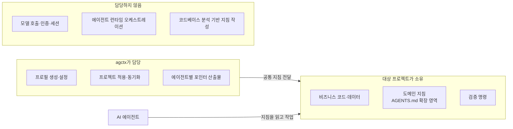

# Agent Context Manager Product Direction

**상태:** 확정된 제품 방향
**최종 확인일:** 2026-09-14

> **Agent Context Manager: 사람과 AI 에이전트가 함께 따르는 개발 기준.**
>
> agctx는 개인·조직별 에이전틱 개발 지침을 프로필로 생성·설정하고, 이를 로컬 또는 Git 기반으로 관리하며 프로젝트와 여러 AI 에이전트에 안전하게 적용·동기화하는 패키지다.

## 목표

### Goal 1: 여러 개발자와 에이전트가 같은 공통 지침을 사용한다

- **Goal 1-1:** 다양한 개발자가 동일한 에이전틱 개발 지침으로 협업한다.
- **Goal 1-2:** Personal·Company·Team·Workspace 등 용도별 **프로필(공통 지침 저장소)**를 생성·관리하고, 프로젝트마다 적절한 프로필을 선택해 적용한다.
- **Goal 1-3:** 여러 에이전트가 동일한 공통 지침을 기준으로 작업하도록 한다.
- **Why:** 개발자와 에이전트마다 달라지는 작업 방식·지침·검증 기준을 줄여 일관된 개발 경험과 협업 기준을 유지하기 위해서다.
- **개인 사용 가치:** 개인 개발자도 프로젝트별 `Personal` 프로필을 재사용하고 AI 도구가 바뀌어도 같은 지침을 유지해, 반복 설정과 프로젝트 사이의 규칙 드리프트를 줄인다.
- **How:** 프로필의 공통 지침을 단일 정본으로 관리하고, 에이전트별 지침 파일에는 이를 참조하는 동기화 산출물을 제공한다.
- **How:** 선택한 프로필의 공통 지침을 프로젝트에 적용하고, 프로젝트는 자신의 `AGENTS.md`에 도메인 지침을 별도로 추가한다.

### Goal 2: 프로필의 개발 지침을 사용자가 선택해 구성한다

- **Why:** 안정적인 기본 환경을 제공하면서도 회사·팀·프로젝트에 필요한 지침만 선택할 수 있도록 하기 위해서다.
- **How:** `agctx profile create <name>`으로 프로필을 생성한 뒤 `agctx profile setup <name>`에서 하네스 동작, TDD, 변경 검토, 검증, 문서화, 보안 지침을 선택하고 프로필의 `AGENTS.md`에 반영한다.

외부 연구와 사례는 [`references.md`](references.md)에서 검토한다. 외부 자료는 선택의 근거이며, 실제 기본 지침의 정본은 프로필의 `AGENTS.md`와 패키지 템플릿이다. 외부 자료는 링크한 문서에서 주장을 확인한 날짜와 함께 기록한다.

## 범위와 경계

agctx는 지침의 생성·설정·동기화·적용을 담당한다. 모델 호출, 인증, 세션, CLI 스트리밍, 에이전트 런타임 오케스트레이션은 담당하지 않는다. 프로젝트의 비즈니스 코드·데이터·도메인 지침은 대상 프로젝트가 소유한다.

agctx는 공통 지침을 프로젝트까지 전달하는 데서 멈춘다. 에이전트는 프로젝트 파일을 직접 읽고 오른쪽의 기능은 에이전트나 다른 도구가 맡는다.

코드베이스를 분석해 프로젝트 지침을 작성하는 일도 담당하지 않는다. 초안이 필요하면 각 에이전트의 `/init`으로 만들고 프로젝트가 다듬어 소유한다. 결정과 근거는 [ADR 0006](adr/0006-no-codebase-analysis-guidance.md)과 [`references.md`](references.md#프로젝트-지침-자동-생성에-관한-근거)에 있다.

프로필의 공통 지침과 프로젝트의 도메인 지침은 서로 다른 소유 영역이다. 선택한 프로필을 적용해 생성된 프로젝트 `AGENTS.md`는 에이전트가 읽는 최종 파일이지만, 프로젝트 지침이 프로필에 역으로 기록되지는 않는다.

현재 프로필의 저장·관리는 로컬 범위다. 조직 프로필의 Git 공유·갱신은 제품 방향에는 부합하지만, 구현 전까지 현재 기능으로 설명하지 않는다. 해당 결정과 완료 기준은 아키텍처 논의 문서에서 관리한다.

## 로케일 정책

CLI와 생성 지침은 영어(en)·한국어(ko)를 지원한다. 기본은 `en`이고 한국어는 `--lang ko`·`AGCTX_LANG=ko`·`agctx config lang ko`로 고른다. 로케일을 정하는 순서와 명령은 [CLI Reference](cli-reference.md#config-lang)에, 근거와 대안은 [ADR 0002](adr/0002-locale-i18n.md)와 [ADR 0014](adr/0014-default-locale-english.md)에 있다.

## 단계별 구현 목표

| 단계 | 목표 | 완료 기준 |
| --- | --- | --- |
| 0 | 문서·계약 정리 | 이 문서와 `discussion/architecture/`에 제품 용어·범위·파일 소유권이 정리됨 |
| 1 | 프로필 생성·setup | 이름 있는 프로필 생성, 지침 옵션 선택, 프로필 `AGENTS.md` 생성·재현 |
| 2 | 프로필 적용 | 프로젝트가 프로필을 선택해 공통 지침과 도구별 포인터를 생성 |
| 3 | 동기화·보존 | 프로필 변경을 프로젝트에 안전하게 동기화하고 프로젝트 도메인 지침을 보존 |
| 4 | 운영 안정화 | dry-run·관리 영역 hash·대상 preflight·파일 단위 원자적 교체 구현; 충돌 시각화·복구·여러 파일 전체 롤백 및 패키지·프로필 업데이트 경계는 후속 확정 |

단계가 완료되기 전에는 해당 기능을 README나 현재 아키텍처에서 제공 기능으로 표현하지 않는다.

문서 변경과 논의 문서의 구현 기록은 [구현 계약 및 문서 규칙](discussion/architecture/topics/implementation-contracts.md)을 따른다. 이 저장소의 개발 명령은 고정된 pnpm 환경에서 실행한다.
