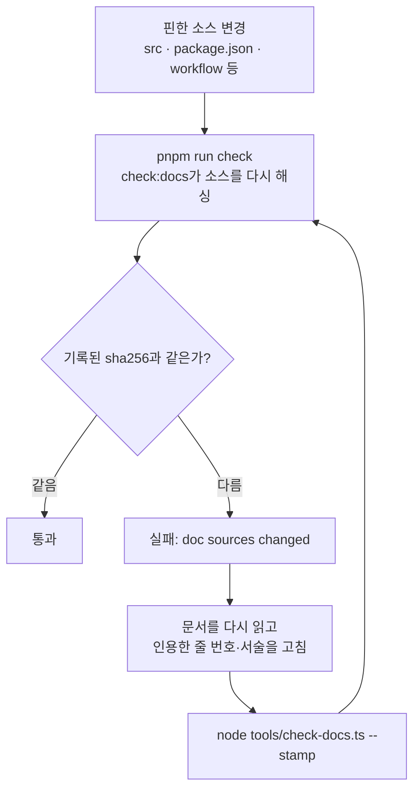
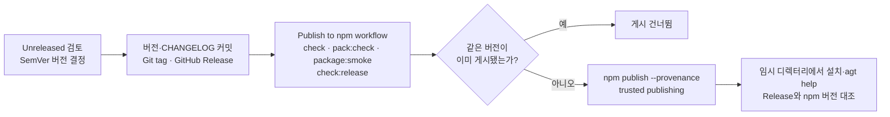

# 공개 저장소 운영

이 문서는 Agentic 저장소를 공개 npm 패키지 프로젝트로 관리하는 현재 운영 계약이다. 제품 기능의 정본은 [`product-direction.md`](product-direction.md), 현재 코드 구조의 정본은 [`architecture/`](architecture/), 외부 근거는 [`references.md`](references.md)에 둔다. 문서 변경 절차는 [구현 계약 및 문서 규칙](discussion/architecture/topics/implementation-contracts.md)을 따른다.

<!-- agentic-doc-sources: package.json, tsconfig.json, .github/workflows, .github/dependabot.yml, .github/CODEOWNERS, tools/build.ts, tools/check-docs.ts, tools/package-smoke.ts -->
<!-- agentic-doc-sources-sha256: 22ee4313e8784eb227130025398bbd08d4f12509f0b658216f9f4073c8a94dc3 -->

`@isthis/agentic`은 공개 GitHub 저장소와 npm registry에 배포된 패키지다. 이 문서는 이후 릴리스도 같은 품질·보안 계약으로 운영하기 위한 기준이다.

## 품질 게이트

모든 변경은 CI와 같은 순서로 확인한다.

```bash
pnpm install --frozen-lockfile
pnpm run check
pnpm run pack:check
pnpm run package:smoke
pnpm run audit
```

`pnpm run check`는 TypeScript 형식 검사(`tsc -p tsconfig.json`, strict), 문서 계약 검사, Node.js 테스트 러너 기반 평가를 실행한다. 형식 검사는 `src`·`evals`·`tools`를 모두 대상으로 하고 파일을 만들지 않는다. `pnpm run pack:check`는 `prepack`으로 `src/`를 `dist/`에 컴파일한 뒤 npm tarball에 들어갈 파일 목록을 확인해 개발 문서·평가·로컬 파일이 배포물에 섞이지 않는지 검토한다. 배포물에 포함되는 README의 저장소 문서 링크는 GitHub 절대 링크를 사용해 npm 페이지에서도 깨지지 않도록 유지한다. 이 검사는 패키지 동작과 저장소 문서 계약을 확인하지만 모든 제품 요구사항·보안·사용자 경험을 증명하지는 않는다.
`pnpm run package:smoke`는 실제 npm tarball을 임시 소비자 프로젝트에 설치하고 설치된 `agt help`, 프로필 생성·설정, 프로젝트 `profile apply`·`profile sync`까지 실행한다. 저장소 소스가 아니라 배포 산출물의 설치와 핵심 실행 경로를 확인하는 검사다. 적용·동기화 기능이 현재 무엇을 보장하는지는 [현재 아키텍처](architecture/)가 정본이다.
`pnpm run audit`는 의존성 취약점이 high 이상으로 보고되는 경우 실패한다. 이 검사는 알려진 취약점 신호이며 악성 코드·설정 오류·런타임 전체의 안전을 보증하지 않는다.

### 문서 소스 해시 게이트

현재 코드 동작을 서술하는 문서는 인용·서술하는 소스 파일 목록과 그 sha256을 문서 상단 HTML 주석 마커로 고정한다. `pnpm run check`의 `check:docs`가 마커의 소스를 다시 해싱해 기록된 값과 다르면 실패한다. 현재 대상은 `implementation-principles.md`, `architecture/implementation-mechanics.md`, `architecture/README.md`, `architecture/guidance-catalog.md`, `usage-guide.md`, `cli-reference.md`, `workflow.md`, 이 문서, 그리고 루트 `README.md`·`README.en.md`이다. 제품 방향·논의·ADR·변경 이력·기여 정책처럼 코드에 매이지 않는 문서와 배포·생성되는 산출물(`templates/`, `.agents/`, `.github/` 등)은 대상이 아니다.



게이트는 소스가 바뀌었다는 사실만 알린다. 문서를 고치는 단계를 건너뛰고 `--stamp`만 실행해도 다시 통과하므로, 문서가 정확한지는 사람이 확인해야 한다.

- 마커는 `<!-- agentic-doc-sources: <쉼표로 구분한 경로> -->`와 `<!-- agentic-doc-sources-sha256: <64자리 hex> -->` 두 줄이다. 경로에는 파일뿐 아니라 디렉터리도 넣을 수 있다. 디렉터리를 넣으면 그 아래 모든 파일을 해싱하므로 안에서 파일이 추가·삭제·수정되면 목록을 고치지 않아도 게이트가 걸린다.
- 해시가 어긋나면 문서를 다시 읽어 드리프트를 고친 뒤 `node tools/check-docs.ts --stamp`로 해시를 다시 기록한다. 이 갱신이 재검증했다는 표시다.
- 인용하는 소스가 늘거나 줄면 마커의 목록도 같은 변경에서 갱신한다. 다만 디렉터리로 고정한 범위 안에서 파일이 늘거나 줄면 목록 갱신 없이 자동 반영된다.
- stamp만 다시 기록한 변경을 자동으로 잡아내는 리뷰는 아직 구현되지 않았다. 계획은 [문서 정확성 자동 리뷰 논의](discussion/architecture/topics/doc-accuracy-review.md)에 있다.

### 문서 근거 게이트

외부 사실의 출처가 언제 확인됐는지 남기고, 새 결정이 근거를 밝히도록 `check:docs`가 두 가지를 검사한다. 검사 로직은 `tools/doc-evidence.ts`에 있다.

- **확인일:** `docs/references.md`에서 코드 블록 밖의 외부 링크(`http`·`https`)가 들어 있는 줄은 같은 줄에 `확인일: YYYY-MM-DD`가 있어야 한다. 목록 항목은 줄 끝에, 표 행은 마지막 칸 안에 붙인다.
- **ADR 근거:** 번호가 0009 이상인 ADR은 머리말에 `* **근거:**`(또는 `* **Evidence:**`)가 있어야 한다. 값에는 링크를 두거나, 외부 사실에 기대지 않는 결정이면 `외부 근거 없음: <이유>`(또는 `No external evidence: <reason>`)를 적는다. 0008 이전 ADR은 검사하지 않는다.

게이트는 형식만 확인한다. 링크한 문서에 그 주장이 실제로 있는지는 확인일을 붙이는 사람이 직접 열어 확인해야 하며, 외부 링크가 살아 있는지도 검사하지 않는다.

GitHub Actions의 `CI`는 `main` push와 모든 PR에서 Ubuntu의 Node.js 24 LTS·26 Current, macOS와 Windows의 Node.js 24 LTS 조합을 고정된 pnpm 버전으로 검증한다. 저장소 루트의 `.nvmrc`는 기여자의 기본 로컬 런타임을 Node.js 24로 맞춘다. PR은 CI가 실패한 상태로 병합하지 않는다. 의존성·워크플로 변경은 보안 영향을 함께 검토한다.

저장소 루트의 `.editorconfig`와 `.gitattributes`는 편집기·운영체제에 따른 인코딩, 줄바꿈, 공백 차이를 줄이는 기본 파일 형식 계약이다.

## 릴리스

### 릴리스 전 점검

- GitHub repository가 Public이며 README·License·Contributing·Code of Conduct·Security가 실제 화면에서 노출되는지 확인한다.
- `repository.url`이 실제 공개 저장소 URL과 일치하는지 확인한다.
- npm에서 패키지 이름·scope 소유권과 public package 게시 권한을 확인한다.
- npm trusted publisher가 정확한 저장소와 `.github/workflows/publish.yml`에 연결되어 있는지 확인한다.
- 배포 전에 `pnpm run check`, `pnpm run pack:check`, `pnpm run package:smoke`, `pnpm run audit`를 실행한다.
- `npm publish` 자체도 `prepublishOnly`에서 `pnpm run check`와 `pnpm run pack:check`를 실행하므로, 검증되지 않은 로컬 게시를 기본적으로 차단한다.
- Release tag가 `package.json` 버전 및 `CHANGELOG.md` 항목과 일치하는지 `pnpm run check:release -- v<version>`으로 확인한다.

이 항목은 workflow 파일만으로 자동 완료되지 않는다. GitHub·npm 관리 화면의 실제 설정과 최초 게시 결과를 릴리스 기록에 남긴다.



Release를 게시하면 workflow가 검증을 다시 실행하고 같은 버전이 없을 때만 provenance와 함께 게시한다. 게시 뒤 확인은 사람이 한다.

1. 변경 내용을 `CHANGELOG.md`의 `Unreleased`에서 검토하고 버전을 Semantic Versioning에 맞게 결정한다.
2. 버전·변경 이력을 커밋하고 해당 버전의 Git tag와 GitHub Release를 만든다.
3. Release가 published 상태가 되면 `Publish to npm` workflow가 `check`·`pack:check`·`package:smoke`와 릴리스 버전 계약 `check:release`를 다시 실행한다.
4. 검사가 통과하고 같은 버전이 registry에 없으면 npm trusted publishing과 provenance를 사용해 `@isthis/agentic`을 public으로 배포한다.
5. 배포 후 `npm install -g @isthis/agentic`와 `agt help`을 별도 임시 디렉터리에서 확인하고, GitHub Release와 npm 버전이 일치하는지 확인한다.

배포 workflow에는 장기 npm 토큰을 저장하지 않는다. npm trusted publishing을 사용할 수 없는 환경에서는 별도 보안 검토 없이 토큰 방식을 추가하지 않는다.

## 의존성과 보안

- Dependabot은 npm 의존성과 GitHub Actions 참조를 주기적으로 확인한다.
- 공개 저장소의 PR에는 Dependency Review를 활성화하고, 취약한 의존성 도입 여부를 검토한다.
- CodeQL workflow는 JavaScript 변경을 security-extended 쿼리로 분석한다.
- OpenSSF Scorecard workflow는 공급망 보안 지표를 주기적으로 계산해 결과를 code scanning에 업로드하고 OpenSSF API에 게시하며 README의 자동 계산 점수 뱃지를 갱신한다. 뱃지는 기본 브랜치에서 workflow가 처음 성공적으로 게시된 뒤에 값을 표시한다.
- GitHub의 secret scanning, push protection, code scanning을 저장소 설정에서 활성화한다.
- `SECURITY.md`의 비공개 신고 절차를 통해 취약점을 접수한다.
- GitHub Actions는 필요한 최소 권한만 선언한다. 배포 workflow와 Scorecard workflow가 `id-token: write`를 사용한다(각각 npm trusted publishing과 결과 게시).
- 모든 외부 GitHub Action은 검토한 버전의 불변 commit SHA로 고정하고 버전 주석을 함께 둔다. 모든 checkout 단계에서 `persist-credentials: false`를 사용해 workflow 작업 공간에 GitHub token을 유지하지 않는다.
- [`CODEOWNERS`](../.github/CODEOWNERS)는 기본 브랜치와 저장소 자동화 변경의 기본 검토 소유자를 지정한다. 실제 병합 보호와 required review 적용은 GitHub 저장소 설정에서 별도로 활성화한다.

## 기여와 변경 관리

기여자는 [`CONTRIBUTING.md`](../CONTRIBUTING.md), [`CODE_OF_CONDUCT.md`](../CODE_OF_CONDUCT.md), [`SECURITY.md`](../SECURITY.md)를 따른다. 사용자에게 보이는 CLI·TUI·파일 형식·설치·보안 변경은 README, 관련 정본 문서, `CHANGELOG.md`를 같은 변경에서 갱신한다. 되돌리기 어려운 공개 계약은 [`docs/adr/`](adr/)에 기록한다.

## 운영상 한계

GitHub 저장소 설정(브랜치 보호, required status checks, secret scanning, code scanning, npm trusted publisher 연결)은 파일만으로 완성되지 않으며 저장소 관리자 설정이 필요하다. workflow 파일은 그 설정을 사용할 수 있는 실행 경로를 제공하지만 설정이 실제로 켜졌다는 증거는 GitHub 저장소 상태에서 별도로 확인해야 한다. 특히 CI의 `pnpm run check` 실패가 병합을 실제로 막으려면 브랜치 보호에서 이 검사를 required status check로 지정해야 한다.
