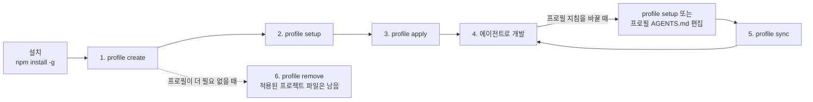
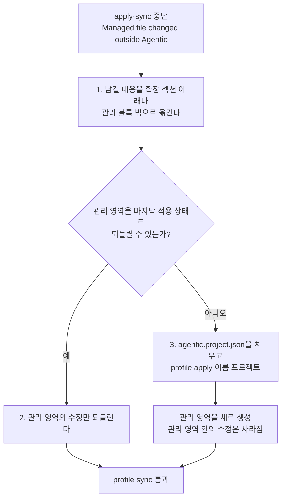

# 사용 가이드

**문서 유형:** 사용 가이드 (사용자용). 설치부터 프로필 생성·설정·적용·동기화까지 `@isthis/agentic`을 쓰는 전체 흐름을 처음부터 끝까지 한 문서로 설명한다. 명령·옵션의 전체 목록은 [CLI Reference](cli-reference.md)가 정본이고, 순서와 소유권 요약은 [사용자 워크플로](workflow.md)에, 현재 구조는 [현재 아키텍처](architecture/)에 있다.

**작성·검증 기준:** `@isthis/agentic` `0.2.0` · 2026-09-14 · 아래 소스 해시 마커가 가리키는 소스

> 이 가이드는 CLI 동작을 서술하므로 소스 해시 게이트가 걸려 있다([공개 저장소 운영](repository-operations.md)의 "문서 소스 해시 게이트" 참고). 명령·옵션의 세부 규칙은 [CLI Reference](cli-reference.md)가 정본이며 여기서는 흐름 설명에 필요한 만큼만 인용한다.

<!-- agentic-doc-sources: bin/agentic.mjs, bin/agt.mjs, bin/analyzer.mjs, bin/contracts.mjs, bin/fs-utils.mjs, bin/i18n.mjs -->
<!-- agentic-doc-sources-sha256: 40020b89f67e96757d366128da33af014fd7bf1f9a686c6ed35910c320e2ce11 -->

> [!TIP]
> 명령만 빠르게 실행하려면 [사용자 워크플로](workflow.md)의 절차 요약을 보세요. 이 가이드는 개념과 설명까지 처음부터 끝까지 다룹니다.

## Agentic이 하는 일

Agentic은 개발 지침을 **프로필**로 모아 두고, 그 프로필을 여러 프로젝트와 여러 AI 에이전트에 **적용·동기화**하는 도구다. 코드를 대신 쓰거나 에이전트를 실행하지는 않는다. 지침을 만들고 배포하는 역할만 한다.

핵심 개념 네 가지:

- **프로필**: 공통 개발 지침을 담는 폴더. `~/.agentic-profiles/<이름>` 아래에 지침 `AGENTS.md`와 메타데이터가 있다. scope(`personal`·`company`·`team`·`workspace`)로 용도를 나눈다.
- **적용(apply)**: 프로필의 지침을 대상 프로젝트에 복사해 `AGENTS.md`와 에이전트별 포인터 파일을 만든다.
- **관리 영역**: 적용된 파일에서 Agentic이 관리하는 부분. 사용자가 직접 쓴 부분과 분리돼 있어 동기화 때 사용자 내용은 보존된다.
- **동기화(sync)**: 프로필을 고친 뒤 그 변경을 이미 적용한 프로젝트에 다시 반영한다. 관리 영역만 갱신한다.

전체 흐름은 다음과 같다.



프로필을 만들고 설정한 뒤 한 번 적용하면, 그 뒤로는 개발과 동기화를 반복한다. 삭제는 프로필 원본만 지우므로 이미 적용한 프로젝트에는 영향을 주지 않는다.

## 설치

일반 사용자는 전역 설치한다.

```bash
npm install -g @isthis/agentic
agt help
```

`agentic`과 짧은 별칭 `agt`를 모두 쓸 수 있다. 저장소를 직접 개발한다면 설치 없이 `node bin/agentic.mjs`로 실행한다.

## 1. 프로필 만들기

터미널에서 인자 없이 실행하면 메인 TUI가 열린다. 프로필 생성·설정·적용을 메뉴로 진행할 수 있다.

```bash
agt
```

명령으로 바로 만들려면 이름과 scope를 넘긴다.

```bash
agt profile create company --scope company
```

이름을 생략하면 TUI에서 이름과 scope를 입력한다. 이름은 소문자·숫자·하이픈 1-64자다. scope는 프로필의 용도 분류이며 `personal`·`company`·`team`·`workspace` 중 하나다.

## 2. 지침 설정

프로필에 담을 공통 지침 수준을 정한다. 항목은 하네스 동작·TDD·리뷰·검증·문서화·보안 6개이고 각 항목은 `off`·`recommended`·`strict` 중 하나다.

```bash
agt profile setup company --tdd strict --security strict
```

옵션을 생략하면 TUI에서 항목마다 설명·현재값을 보고 고른다. `setup`은 시작점이며 더 두터운 지침은 프로필의 `AGENTS.md`를 직접 편집해 채운다. 배포되는 6개 항목의 정본은 [지침 카탈로그](architecture/guidance-catalog.md)에 있다.

## 3. 프로젝트에 적용

선택한 프로필을 프로젝트에 처음 적용하거나 다른 프로필로 전환할 때 쓴다.

```bash
agt profile apply company /path/to/project
```

만들어지는 파일:

```text
대상 프로젝트/
├── AGENTS.md                        # 공통 지침 + 프로젝트 도메인 지침
├── agentic.project.json             # 적용한 프로필과 관리 hash 기록
├── CLAUDE.md                        # Claude Code 포인터
├── .agents/rules/agentic.md         # Antigravity 포인터
├── .cursor/rules/agentic.mdc        # Cursor 포인터
└── .github/copilot-instructions.md  # GitHub Copilot 포인터
```

바꾸기 전에 계획만 보려면 `--dry-run`을 붙인다.

```bash
agt profile apply company --dry-run /path/to/project
```

적용된 파일은 Agentic이 다시 만드는 영역과 사용자가 소유하는 영역으로 나뉜다.


Agentic이 다시 만드는 곳은 `AGENTS.md`의 프로필 영역과 포인터 파일의 관리 블록뿐이다. 사용자 내용은 확장 섹션 아래나 관리 블록 밖에 두어야 동기화 뒤에도 남는다.

프로젝트의 도메인 규칙은 `AGENTS.md`의 프로젝트 확장 섹션 아래에 직접 쓴다. 확장 섹션의 제목은 한국어 로케일에서 `## 4. 프로젝트 규칙 확장 (SSOT)`, 영어 로케일에서 `## 4. Project rule extensions (SSOT)`이며 Agentic은 두 제목을 모두 인식한다.

Agentic은 코드베이스를 분석해 이 섹션을 채우지 않는다. 초안이 필요하면 Claude Code나 Codex의 `/init`으로 만든 뒤 사람이 다듬어 이 확장 섹션으로 옮긴다. 여러 에이전트가 공통으로 읽는 표준은 `AGENTS.md`이므로 함께 따를 규칙은 여기에 둔다. `CLAUDE.md`에 남기려면 `<!-- agentic:managed:start -->`와 `<!-- agentic:managed:end -->` 사이의 관리 블록 밖에 둔다. 관리 영역 안을 고치면 다음 `apply`·`sync`가 `Managed file changed outside Agentic`으로 멈추고 어떤 파일도 쓰지 않는다. 푸는 방법은 [문제 해결](#관리-영역을-고쳐서-멈췄을-때)에 있다. 지침에 무엇을 둘지와 그 근거는 [ADR 0006](adr/0006-no-codebase-analysis-guidance.md)에 있다.

## 4. 에이전트로 개발

적용이 끝나면 평소 쓰는 에이전트(Codex·Claude Code·Antigravity·Cursor·Copilot)에 작업을 맡긴다. 에이전트는 프로젝트의 `AGENTS.md`와 포인터 파일을 읽고 그 지침대로 작업한다. Agentic은 에이전트를 실행하거나 통제하지 않는다.

## 5. 프로필 갱신과 동기화

프로필 지침을 바꾼 뒤 이미 적용한 프로젝트에 반영한다.

```bash
agt profile setup company --review strict
agt profile sync /path/to/project
```

`sync`는 프로젝트에 바인딩된 프로필만 다시 적용하고 프로필을 바꾸지 않는다. 다른 프로필로 바꾸려면 `apply`를 쓴다. 동기화는 관리 영역만 갱신하고 사용자가 쓴 부분은 그대로 둔다.

## 6. 프로필 삭제

```bash
agt profile remove company --yes
```

삭제되는 것은 프로필 원본과 설정뿐이다. 이미 프로젝트에 적용된 파일은 그대로 남는다. TUI에서는 이름과 `--yes` 없이 골라 확인 후 삭제한다.

## 자동화와 CI에서 쓰기

TUI가 없는 환경에서는 옵션을 플래그로 직접 넘긴다.

```bash
npm install -g @isthis/agentic
agt profile create company --scope company
agt profile setup company --tdd recommended --security strict
agt profile apply company /path/to/project
```

되돌리기 어려운 작업 전에는 `--dry-run`으로 계획을 먼저 확인한다. 표시 언어는 `--lang`·`AGENTIC_LANG`·`config lang`으로 정한다. 프로필 저장 위치는 `AGENTIC_HOME`으로 바꿀 수 있다.

## 문제 해결

### 관리 영역을 고쳐서 멈췄을 때

`apply`·`sync`가 `Managed file changed outside Agentic: <파일>`로 멈추면, Agentic이 마지막으로 쓴 관리 영역과 지금 파일의 관리 영역이 다르다는 뜻이다. 멈춘 시점에는 어떤 파일도 쓰지 않았다. 같은 프로필로 `apply`를 다시 실행하거나 해당 파일을 지워도 같은 검사를 거치므로 풀리지 않는다.



1. 관리 영역 안에 남기고 싶은 내용이 있으면 먼저 `AGENTS.md`의 확장 섹션 아래나 포인터 파일의 관리 블록 밖으로 옮긴다.
2. 관리 영역을 마지막 적용 상태로 되돌린다. Git으로 관리하는 프로젝트라면 `git diff`로 관리 영역의 변경만 확인해 되돌린다. 비교는 hash로 하므로 공백 하나가 달라도 계속 멈춘다. 되돌리면 `agt profile sync <project>`가 통과한다.
3. 되돌릴 원본이 없으면 `agentic.project.json`의 `profile` 값을 확인한 뒤 이 파일을 지우거나 다른 이름으로 옮기고 `agt profile apply <name> <project>`를 실행한다. 관리 영역을 새로 만들며 관리 영역 안에서 고친 내용은 경고 없이 사라진다. 확장 섹션 아래와 관리 블록 밖의 내용은 남는다. 실행 전에 `--dry-run`으로 바뀔 파일을 확인한다.

충돌 내용을 비교해 보여 주거나 자동으로 복구하는 명령은 아직 없다. 이 후속 계약은 [관리 산출물의 안전한 동기화 논의](discussion/architecture/topics/managed-artifact-safety.md#충돌-중단과-복구)에서 다룬다.

### 그 밖의 오류

- **`command not found: agt`**: 전역 bin 경로가 PATH에 없을 때다. `npm prefix -g`로 위치를 확인해 PATH에 추가한다.
- **`profile sync requires a project already applied`**: 아직 `apply`하지 않은 프로젝트다. 먼저 `agt profile apply <name> <project>`를 실행한다.
- **`Profile not found`**: 이름이 틀렸거나 다른 `AGENTIC_HOME`에 있다. `agt profile list`로 확인한다.

## 더 알아보기

- [CLI Reference](cli-reference.md): 모든 명령·옵션·TUI·자동화의 정본
- [사용자 워크플로](workflow.md): 절차 요약과 명령의 소유권
- [지침 카탈로그](architecture/guidance-catalog.md): 배포되는 공통 지침 6개
- [현재 아키텍처](architecture/): 현재 구조와 소유권
- [기능 구현 메커니즘](architecture/implementation-mechanics.md): 각 기능이 코드에서 동작하는 방식
