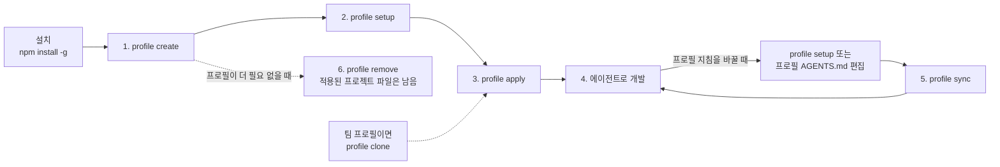
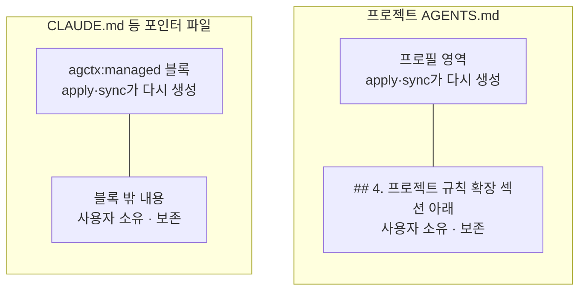
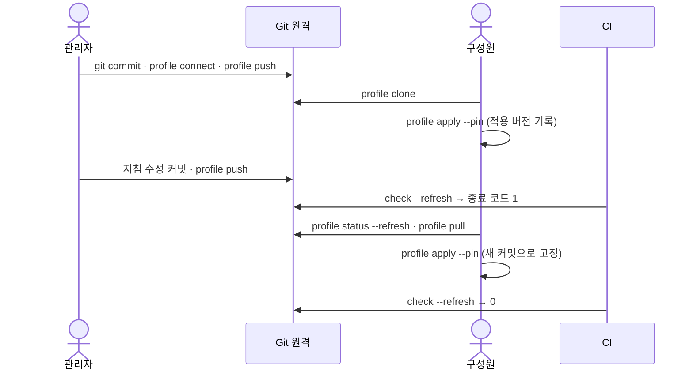
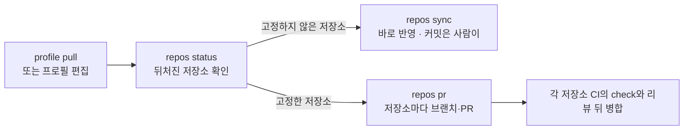
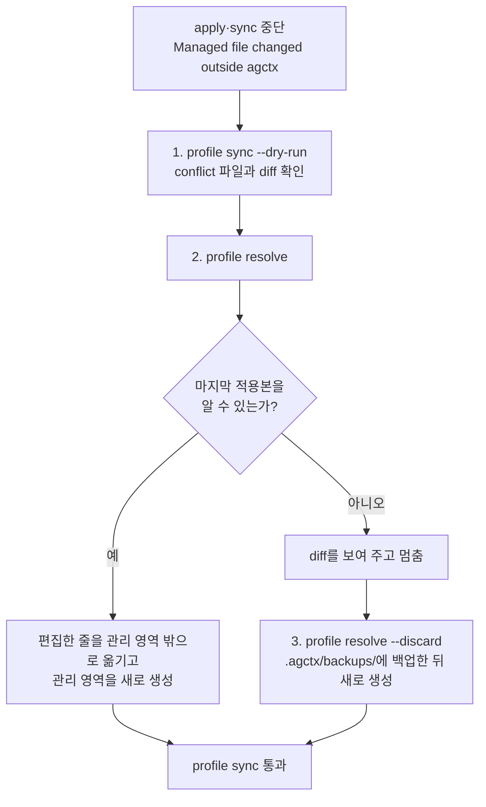

# 사용 가이드

**문서 유형:** 사용 가이드 (사용자용). 설치부터 프로필 생성·설정·적용·동기화, 팀 공유와 CI 확인까지 `agent-context-manager`를 쓰는 전체 흐름을 처음부터 끝까지 한 문서로 설명한다. 명령·옵션의 전체 목록은 [CLI Reference](cli-reference.md)가 정본이고, 순서와 소유권 요약은 [사용자 워크플로](workflow.md)에, 현재 구조는 [현재 아키텍처](architecture/)에 있다.

**작성·검증 기준:** `agent-context-manager`(게시 전) · 2026-09-15 · 아래 소스 해시 마커가 가리키는 소스

> 이 가이드는 CLI 동작을 서술하므로 소스 해시 게이트가 걸려 있다([공개 저장소 운영](repository-operations.md)의 "문서 소스 해시 게이트" 참고). 명령·옵션의 세부 규칙은 [CLI Reference](cli-reference.md)가 정본이며 여기서는 흐름 설명에 필요한 만큼만 인용한다.

<!-- agctx-doc-sources: src -->
<!-- agctx-doc-sources-sha256: 0150abd1bcd86d8cd8cc0f7d14c8bd01df7175e62bfcdf537c5db20eef6ac2cd -->

> [!TIP]
> 명령만 빠르게 실행하려면 [사용자 워크플로](workflow.md)의 절차 요약을 보세요. 이 가이드는 개념과 설명까지 처음부터 끝까지 다룹니다.

## agctx가 하는 일

agctx는 개발 지침을 **프로필**로 모아 두고, 그 프로필을 여러 프로젝트와 여러 AI 에이전트에 **적용·동기화**하는 도구다. 코드를 대신 쓰거나 에이전트를 실행하지는 않는다. 지침을 만들고 배포하는 역할만 한다.

핵심 개념 네 가지:

- **프로필**: 공통 개발 지침을 담는 폴더. `~/.agctx/profiles/<이름>` 아래에 지침 `AGENTS.md`와 메타데이터가 있다. scope(`personal`·`company`·`team`·`workspace`)로 용도를 나눈다.
- **적용(apply)**: 프로필의 지침을 대상 프로젝트에 복사해 `AGENTS.md`와 에이전트별 포인터 파일을 만든다.
- **관리 영역**: 적용된 파일에서 agctx가 관리하는 부분. 사용자가 직접 쓴 부분과 분리돼 있어 동기화 때 사용자 내용은 보존된다.
- **동기화(sync)**: 프로필을 고친 뒤 그 변경을 이미 적용한 프로젝트에 다시 반영한다. 관리 영역만 갱신한다.

전체 흐름은 다음과 같다.



프로필을 만들고 설정한 뒤 한 번 적용하면, 그 뒤로는 개발과 동기화를 반복한다. 팀이 공유하는 프로필은 만들지 않고 Git 원격에서 받는다([팀과 Git으로 공유하기](#팀과-git으로-공유하기)). 삭제는 프로필 원본만 지우므로 이미 적용한 프로젝트에는 영향을 주지 않는다.

## 설치

일반 사용자는 전역 설치한다.

```bash
npm install -g agent-context-manager
agctx help
```

명령 이름은 `agctx`다. 저장소를 직접 개발한다면 설치 없이 `node src/agctx.ts`로 실행한다.

## 1. 프로필 만들기

터미널에서 인자 없이 실행하면 메인 TUI가 열린다. 프로필 생성·설정·적용을 메뉴로 진행할 수 있다.

```bash
agctx
```

명령으로 바로 만들려면 이름과 scope를 넘긴다.

```bash
agctx profile create company --scope company
```

이름을 생략하면 TUI에서 이름과 scope를 입력한다. 이름은 소문자·숫자·하이픈 1-64자다. scope는 프로필의 용도 분류이며 `personal`·`company`·`team`·`workspace` 중 하나다.

## 2. 지침 설정

프로필에 담을 공통 지침 수준을 정한다. 항목은 하네스 동작·TDD·변경 검토·검증·문서화·보안 6개이고 각 항목은 `off`·`recommended`·`strict` 중 하나다.

```bash
agctx profile setup company --tdd strict --security strict
```

옵션을 생략하면 TUI에서 항목마다 설명·현재값을 보고 고른다. `setup`은 시작점이며 더 두터운 지침은 프로필의 `AGENTS.md`를 직접 편집해 채운다. 배포되는 6개 항목의 정본은 [지침 카탈로그](architecture/guidance-catalog.md)에 있다.

## 3. 프로젝트에 적용

선택한 프로필을 프로젝트에 처음 적용하거나 다른 프로필로 전환할 때 쓴다.

```bash
agctx profile apply company /path/to/project
```

터미널에서 실행하면 바뀔 파일 계획을 먼저 출력하고 적용할지 묻는다. 스크립트·CI처럼 터미널이 아닌 환경에서는 묻지 않으므로 `--yes`를 붙여야 파일을 쓴다.

만들어지는 파일:

```text
대상 프로젝트/
├── AGENTS.md                        # 공통 지침 + 프로젝트 도메인 지침
├── agctx.project.json             # 적용한 프로필·버전과 관리 hash 기록
├── .agctx/base/                   # 마지막으로 적용한 관리 영역 원문(충돌 해결 기준, 커밋)
├── .agctx/.gitignore              # 충돌 해결 백업 폴더 backups/를 커밋에서 제외
├── CLAUDE.md                        # Claude Code 포인터
└── .agents/rules/agctx.md         # Antigravity 포인터
```

바꾸기 전에 계획만 보려면 `--dry-run`을 붙인다.

```bash
agctx profile apply company --dry-run /path/to/project
```

적용된 파일은 agctx가 다시 만드는 영역과 사용자가 소유하는 영역으로 나뉜다.



agctx가 다시 만드는 곳은 `AGENTS.md`의 프로필 영역과 포인터 파일의 관리 블록뿐이다. 사용자 내용은 확장 섹션 아래나 관리 블록 밖에 두어야 동기화 뒤에도 남는다. 예외로 `.agents/rules/agctx.md`는 파일 맨 앞에 frontmatter가 없을 때만 템플릿 frontmatter를 넣는다. 에이전트가 첫 줄의 frontmatter로 규칙을 로드하기 때문이며, 이미 있는 frontmatter는 고치지 않는다.

프로젝트의 도메인 규칙은 `AGENTS.md`의 프로젝트 확장 섹션 아래에 직접 쓴다. 확장 섹션의 제목은 한국어 로케일에서 `## 4. 프로젝트 규칙 확장 (SSOT)`, 영어 로케일에서 `## 4. Project rule extensions (SSOT)`이며 agctx는 두 제목을 모두 인식한다.

agctx는 코드베이스를 분석해 이 섹션을 채우지 않는다. 초안이 필요하면 Claude Code나 Codex의 `/init`으로 만든 뒤 사람이 다듬어 이 확장 섹션으로 옮긴다. 여러 에이전트가 공통으로 읽는 표준은 `AGENTS.md`이므로 함께 따를 규칙은 여기에 둔다. `CLAUDE.md`에 남기려면 `<!-- agctx:managed:start -->`와 `<!-- agctx:managed:end -->` 사이의 관리 블록 밖에 둔다. 관리 영역 안을 고치면 다음 `apply`·`sync`가 `Managed file changed outside agctx`로 멈추고 어떤 파일도 쓰지 않는다. `agctx profile resolve <project>`가 그 편집을 관리 영역 밖으로 옮기고 관리 영역을 다시 만들어 푼다. 자세한 절차는 [문제 해결](#관리-영역을-고쳐서-멈췄을-때)에 있다. 지침에 무엇을 둘지와 그 근거는 [ADR 0006](adr/0006-no-codebase-analysis-guidance.md)에 있다.

## 4. 에이전트로 개발

적용이 끝나면 평소 쓰는 에이전트(Codex·Claude Code·Antigravity)에 작업을 맡긴다. 에이전트는 프로젝트의 `AGENTS.md`와 포인터 파일을 읽고 그 지침대로 작업한다. agctx는 에이전트를 실행하거나 통제하지 않는다.

## 5. 프로필 갱신과 동기화

프로필 지침을 바꾼 뒤 이미 적용한 프로젝트에 반영한다.

```bash
agctx profile setup company --review strict
agctx profile sync /path/to/project
```

`sync`는 프로젝트에 바인딩된 프로필만 다시 적용하고 프로필을 바꾸지 않는다. 다른 프로필로 바꾸려면 `apply`를 쓴다. 동기화는 관리 영역만 갱신하고 사용자가 쓴 부분은 그대로 둔다.

## 6. 프로필 삭제

```bash
agctx profile remove company --yes
```

삭제되는 것은 프로필 원본과 설정뿐이다. 이미 프로젝트에 적용된 파일은 그대로 남는다. TUI에서는 이름과 `--yes` 없이 골라 확인 후 삭제한다.

## 팀과 Git으로 공유하기

팀·조직 프로필은 표준 Git 원격(GitHub·GitLab 등)에 두고 주고받는다. 권한·리뷰·변경 이력은 Git 호스트가 맡고, agctx는 사용자의 Git 인증으로 `git`을 실행할 뿐이다. `clone`·`status`·`pull`·`push`·`connect`는 프로필만 다루고 프로젝트 파일은 건드리지 않는다. 결정과 안전 계약은 [ADR 0017](adr/0017-git-profile-sharing.md)에 있다.



관리자가 올린 변경은 구성원이 받아 적용하기 전까지 프로젝트에 들어가지 않는다. CI의 `check`가 그 사이의 뒤처짐을 드러낸다.

### 관리자: 프로필을 원격에 올리기

프로필을 만들고 설정한 뒤 프로필 폴더를 Git 저장소로 만든다. agctx는 커밋을 대신 만들지 않으므로, 연결을 먼저 시도하면 필요한 명령을 알려 준다.

```bash
$ agctx profile create team-backend --scope team
Created profile: team-backend (team)

$ agctx profile connect team-backend git@github.com:acme/team-backend-profile.git
Error: Profile team-backend is not a Git repository yet.
Next: Create the first commit, then connect again:
  git -C "/Users/me/.agctx/profiles/team-backend" init -b main
  git -C "/Users/me/.agctx/profiles/team-backend" add -A
  git -C "/Users/me/.agctx/profiles/team-backend" commit -m "Add team-backend profile"
```

위 출력은 실제 실행 결과에서 경로와 원격 주소만 바꿨다. 안내대로 커밋한 뒤 다시 연결하고 올린다.

```bash
agctx profile connect team-backend git@github.com:acme/team-backend-profile.git
agctx profile push team-backend
```

`push`는 보낼 커밋을 보여 주고 확인을 받는다. 지침을 고칠 때마다 `profile setup`이나 직접 편집 → 프로필 폴더에서 `git commit` → `agctx profile push team-backend` 순서로 반복한다. 커밋하지 않은 변경이 있거나 원격보다 뒤처졌으면 `push`가 멈추고 무엇을 먼저 할지 알려 준다.

### 구성원: 받아서 적용하기

```bash
agctx profile clone git@github.com:acme/team-backend-profile.git
agctx profile apply team-backend /path/to/orders-api --pin
```

`clone`은 받은 저장소에 `profile.json`과 `AGENTS.md`가 있는지, 사람에게 보이지 않는 문자가 섞였는지 검사한 뒤에만 등록한다. 적용할 때는 두 방식 중 하나를 고른다.

| 방식 | 명령 | 프로필이 바뀌었을 때 | 어울리는 경우 |
| --- | --- | --- | --- |
| 고정하지 않음(기본) | `profile apply <name> <project>` | `profile pull` 후 `profile sync`로 새 지침을 반영 | 개인 프로필, 지침 변경을 바로 따라가도 되는 팀 |
| 고정 | `profile apply <name> <project> --pin` | `sync`해도 기록한 커밋에 머물고, `apply --pin`을 다시 실행해야 옮겨 감 | 검토한 버전만 쓰고 저장소마다 PR로 올리는 팀 |

어느 방식이든 `agctx.project.json`에 원격 주소·브랜치·커밋이 기록되므로 팀원과 CI가 같은 버전을 확인할 수 있다. 이 파일과 `.agctx/base/`를 커밋한다.

### 갱신 받기

```bash
$ agctx profile status --refresh team-backend
team-backend	git@github.com:acme/team-backend-profile.git main@39ca6e1	clean	ahead 0, behind 1
  Next: agctx profile pull team-backend

$ agctx profile pull team-backend
Pulled 1 commit(s) into profile team-backend:
  ddf3742 Make TDD strict
Next: run agctx profile sync <project> in projects that use team-backend. A project pinned with --pin stays on its commit until you run agctx profile apply team-backend <project> --pin.
```

위 출력도 실제 실행 결과에서 원격 주소만 바꿨다. `pull`은 fast-forward만 하며, 프로필 폴더에 커밋하지 않은 수정이 있거나 로컬과 원격이 갈라졌으면 받지 않고 멈춘다. 받은 뒤 고정하지 않은 프로젝트는 `agctx profile sync <project>`, 고정한 프로젝트는 `agctx profile apply team-backend <project> --pin`으로 반영한다.

### CI에서 확인하기

`agctx check`는 프로필 보관함이 없는 CI에서도 저장소가 기록한 버전과 맞는지 확인한다. 관리 영역을 밖에서 고쳤으면 2, 숨은 문자가 있으면 3, `--refresh`로 원격에 더 새로운 커밋이 보이면 1로 끝나므로 작업이 실패로 표시된다.

```bash
$ agctx check /path/to/orders-api
/path/to/orders-api matches its recorded profile version.
The profile is not in this machine's profile store; run with --refresh to compare with the source repository.

$ agctx check --refresh /path/to/orders-api
behind            -  the source repository has a newer commit (ddf3742)
```

아래는 GitHub Actions 설정 예시다. 이 저장소의 CI에서 실행해 본 설정은 아니다.

```yaml
name: agctx
on: [pull_request]
jobs:
  check:
    runs-on: ubuntu-latest
    steps:
      - uses: actions/checkout@v4
      - uses: actions/setup-node@v4
        with:
          node-version: 22
      - run: npx --yes agent-context-manager check --refresh .
```

- 프로필 저장소가 비공개면 `--refresh`의 `git ls-remote`가 그 저장소를 읽을 수 있어야 한다. 배포 키나 토큰을 Git 설정으로 제공하지 않으면 종료 코드 69로 끝난다.
- 뒤처짐을 실패가 아니라 알림으로만 쓰려면 이 단계에 `continue-on-error: true`를 둔다. 충돌(2)과 숨은 문자(3)까지 무시하게 되므로 종료 코드를 나눠 처리하려면 `--json` 결과의 `exitCode`를 읽는다.

## 여러 저장소를 한 번에 맞추기

프로필 하나를 여러 저장소가 쓰면, 프로필이 바뀔 때마다 저장소를 하나씩 열지 않고 `repos` 명령으로 한 번에 맞춘다. `profile apply`·`profile sync`를 실행한 저장소는 이 컴퓨터의 목록(`~/.agctx/repos.json`)에 자동으로 기록된다. 결정과 안전 계약은 [ADR 0018](adr/0018-multi-repository-sync.md)에 있다.



고정하지 않은 저장소는 보관함을 따라 바로 바뀌고, 고정한 저장소는 PR을 검토하고 병합해야 새 버전을 쓴다.

### 뒤처진 저장소 보기

```bash
$ agctx repos status
behind            personal         -      -               /work/blog
ok                client-a         -      -               /work/client-a-api
behind            personal         -      -               /work/notes
Next: agctx repos sync --profile personal
```

위 출력은 실제 실행 결과에서 경로만 바꿨다. 옮기거나 지운 폴더는 `missing`으로 나오고 `agctx repos list --prune`으로 목록에서 지운다.

### 고정하지 않은 저장소 동기화

```bash
agctx repos sync --profile personal --dry-run
agctx repos sync --profile personal
```

`repos sync`는 모든 저장소의 계획을 보여 준 뒤 한 번만 묻는다. 고정한 저장소(`pinned`), 관리 파일에 커밋하지 않은 변경이 있는 저장소(`dirty`), 관리 영역을 밖에서 고친 저장소(`conflict`)는 건너뛰고 나머지를 계속한다. 쓴 파일의 커밋은 저장소마다 사람이 한다.

### 고정한 저장소를 PR로 갱신

```bash
agctx profile pull team-backend
agctx repos pr --profile team-backend --dry-run
agctx repos pr --profile team-backend
```

`repos pr`은 사용자의 작업 폴더를 건드리지 않는다. 저장소마다 원격 base 브랜치를 임시 worktree에 꺼내 새 커밋으로 다시 고정하고, `agctx/<프로필>-<커밋>` 브랜치로 push한 뒤 `gh`로 PR을 연다. 같은 브랜치에 열린 PR이 있거나 그 브랜치가 이미 원격에 있으면 새로 만들지 않는다. `gh`가 없거나 GitHub가 아닌 원격이면 push까지 하고 PR을 직접 열도록 안내한다. 옵션과 실제 출력은 [CLI Reference](cli-reference.md#repos-pr)에 있다.

### 예약 봇으로 PR 열기

봇은 저장소 목록 대신 `--targets` 파일을 쓴다. 파일에는 한 줄에 저장소 하나씩 clone URL이나 경로를 적고, 봇이 실행될 때마다 임시 폴더에 clone해 처리한다. 프로필에 새 커밋이 없으면 아무것도 바꾸지 않고, 이미 연 PR은 다시 만들지 않는다.

```text
# repos.txt: team-backend 프로필을 쓰는 저장소
https://github.com/acme/orders-api.git
https://github.com/acme/billing-api.git
```

아래는 GitHub Actions 예약 워크플로 예시다. 이 저장소에서 실행해 본 설정은 아니다.

```yaml
name: agctx profile update
on:
  schedule:
    - cron: '0 1 * * *'
  workflow_dispatch:
jobs:
  update:
    runs-on: ubuntu-latest
    env:
      GH_TOKEN: ${{ secrets.AGCTX_BOT_TOKEN }}
    steps:
      - uses: actions/checkout@v4
      - uses: actions/setup-node@v4
        with:
          node-version: 22
      - run: |
          gh auth setup-git
          git config --global user.name "agctx-bot"
          git config --global user.email "agctx-bot@users.noreply.github.com"
      - run: npx --yes agent-context-manager profile clone https://github.com/acme/team-backend-profile.git
      - run: npx --yes agent-context-manager repos pr --targets repos.txt --profile team-backend --yes
```

- 토큰은 프로필 저장소를 읽고 대상 저장소에 브랜치를 push하고 PR을 열 수 있어야 한다. `GH_TOKEN`은 gh가 인증에 쓰는 토큰이고, `gh auth setup-git`은 git이 gh를 인증 도우미로 쓰게 설정한다([외부 근거](references.md#cli-계약과-지침-공급망-근거)). `GH_TOKEN`만 둔 환경에서 `gh auth setup-git`이 성공하는지는 직접 확인하지 못했으므로, 처음 적용할 때 `workflow_dispatch`로 한 번 실행해 확인한다.
- 커밋 작성자는 실행 환경의 Git 설정을 따르므로 봇 이름과 메일을 설정한다.
- 봇이 연 PR은 각 저장소의 CI에서 `agctx check`로 검사한 뒤 리뷰해 병합한다([CI에서 확인하기](#ci에서-확인하기)).

## 자동화와 CI에서 쓰기

TUI가 없는 환경에서는 옵션을 플래그로 직접 넘긴다. 파일을 바꾸는 명령은 터미널이 아니면 묻지 않으므로 `--yes`를 붙인다.

```bash
npm install -g agent-context-manager
agctx profile create company --scope company
agctx profile setup company --tdd recommended --security strict
agctx profile apply company /path/to/project --dry-run
agctx profile apply company /path/to/project --yes
```

되돌리기 어려운 작업 전에는 `--dry-run`으로 계획을 먼저 확인한다. 스크립트나 에이전트가 결과를 읽어야 하면 `--json`을 붙인다. stdout에는 결과 문서 하나만 나오고, 성공·충돌·뒤처짐은 종료 코드로 구분한다([CLI Reference](cli-reference.md#종료-코드)). 에이전트가 사용자 대신 실행한다면 `--dry-run` 결과를 사용자에게 보여 주고 승인을 받은 뒤 `--yes`를 붙인다. 표시 언어는 `--lang`·`AGCTX_LANG`·`config lang`으로 정한다. agctx 데이터 폴더(기본 `~/.agctx`)는 `AGCTX_HOME`으로 바꿀 수 있다.

## 문제 해결

### 관리 영역을 고쳐서 멈췄을 때

`apply`·`sync`가 `Managed file changed outside agctx: <파일>`로 멈추면, agctx가 마지막으로 쓴 관리 영역과 지금 파일의 관리 영역이 다르다는 뜻이다. 멈춘 시점에는 어떤 파일도 쓰지 않았다. 오류 메시지 아래에 차이를 볼 명령과 푸는 명령이 함께 나온다.



1. `agctx profile sync --dry-run <project>`로 무엇이 달라졌는지 본다. 충돌 파일은 `conflict`로 표시되고 diff가 함께 나오며 종료 코드는 2다.
2. `agctx profile resolve <project>`를 실행한다. 관리 영역 안에서 추가·수정한 줄은 포인터 파일이면 관리 블록 바로 아래로, `AGENTS.md`면 확장 섹션 끝으로 옮겨진다. 관리 영역은 현재 프로필로 새로 만들어진다. 관리 영역 안에서 지운 줄은 되살아나며 몇 줄인지 알려 준다. `--dry-run`을 붙이면 옮길 줄만 보여 주고 파일을 바꾸지 않는다.
3. 마지막 적용본을 알 수 없으면 resolve가 멈춘다. `.agctx/base/`가 없는 상태에서 프로필까지 바뀐 경우다. 남길 내용을 직접 관리 영역 밖으로 옮긴 뒤 `agctx profile resolve --discard <project>`를 실행한다. 현재 파일을 `.agctx/backups/<시각>/`에 복사한 뒤 관리 영역을 새로 만든다.
4. 줄 단위로 직접 고르고 싶으면 `agctx profile resolve --edit <project>`로 VS Code 3-way merge 편집기를 연다. 편집기를 열기 전에 터미널이 아래 확인 순서를 출력한다.
   1. 위쪽 `current-<파일>` 창에서 강조된 영역은 관리 영역 안에서 고쳤던 원래 위치다. 위쪽 두 창은 읽기 전용이고, 수락 버튼은 누르지 않는다.
   2. 아래쪽 Result 창에는 그 줄이 관리 영역 밖(포인터 파일은 `<!-- agctx:managed:end -->` 아래, `AGENTS.md`는 확장 섹션 끝)으로 이미 옮겨져 있다. 남길 내용이 모두 관리 영역 밖에 있는지 확인하고 필요하면 고친 뒤 저장한다.
   3. 탭을 닫을 때 "파일에 처리되지 않은 충돌이 포함되어 있습니다" 경고가 뜨면 Result 창을 다시 확인하고 `충돌과 함께 닫기`(Close with Conflicts)를 누른다. 저장한 결과가 적용된다.

   agctx는 결과에서 관리 영역 밖의 내용만 가져오고 관리 영역은 다시 만들므로, 저장할 때 포매터가 관리 영역을 바꿔도 된다. 관리 영역 안에 남긴 변경은 적용되지 않으며 diff와 merge 결과 파일 경로로 알려 준다. `code` 명령이 PATH에 있어야 한다.

`.agctx/base/`는 마지막으로 적용한 관리 영역 원문이다. git에 커밋해 두면 팀원도 같은 기준으로 충돌을 푼다. 지워도 다음 `apply`·`sync`가 다시 만들지만, 그 전에 프로필까지 바뀐 충돌은 `--discard`로만 풀 수 있다. TUI에서는 `profile list`의 `프로젝트 충돌 해결` 메뉴에서 같은 선택지를 고른다. 결정 근거는 [ADR 0008](adr/0008-managed-conflict-recovery.md)에 있다.

### 그 밖의 오류

- **`command not found: agctx`**: 전역 bin 경로가 PATH에 없을 때다. `npm prefix -g`로 위치를 확인해 PATH에 추가한다.
- **`profile sync requires a project already applied`**: 아직 `apply`하지 않은 프로젝트다. 먼저 `agctx profile apply <name> <project>`를 실행한다.
- **`Profile not found`**: 이름이 틀렸거나 다른 `AGCTX_HOME`을 쓰고 있다. `agctx profile list`로 확인한다.
- **`cannot ask for confirmation here`**: 터미널이 아닌 환경에서 파일을 바꾸는 명령을 `--yes` 없이 실행했다. `--dry-run`으로 계획을 확인한 뒤 `Next:` 줄의 명령을 실행한다.
- **`is not a Git repository yet`**: 로컬 프로필을 원격에 연결하려 했다. `Next:` 줄의 `git init`·`add`·`commit`을 실행한 뒤 다시 `profile connect`한다.
- **`pull`·`push`가 커밋하지 않은 변경으로 멈춤**: 프로필 폴더에서 `git status`로 확인하고 커밋하거나 되돌린 뒤 다시 실행한다.
- **CI의 `check`가 1로 실패**: 프로필 원격에 새 커밋이 있다. `agctx profile pull <name>` 후 고정하지 않은 프로젝트는 `profile sync`, 고정한 프로젝트는 `profile apply <name> <project> --pin`을 실행하고 결과를 커밋한다.
- **`repos sync`가 `dirty`로 건너뜀**: 그 저장소의 관리 파일에 커밋하지 않은 변경이 있다. 커밋하거나 stash한 뒤 다시 실행한다.
- **`repos pr`이 `branch-exists`로 끝남**: 같은 이름의 브랜치가 원격에 남아 있다. PR로 병합하거나, 닫힌 PR의 브랜치라면 지운 뒤 다시 실행한다.
- **`repos pr`이 `pushed`로 끝남**: 브랜치는 올라갔지만 `gh`가 PR을 만들지 못했다. `gh auth status`로 인증을 확인하거나 안내된 브랜치로 PR을 직접 연다.
- **`Git is not installed`**(종료 코드 69): Git 프로필 명령과 `check --refresh`에는 `git`이 필요하다. 로컬 프로필만 쓰면 `git` 없이 동작한다.

## 더 알아보기

- [CLI Reference](cli-reference.md): 모든 명령·옵션·TUI·자동화의 정본
- [사용자 워크플로](workflow.md): 절차 요약과 명령의 소유권
- [지침 카탈로그](architecture/guidance-catalog.md): 배포되는 공통 지침 6개
- [현재 아키텍처](architecture/): 현재 구조와 소유권
- [기능 구현 메커니즘](architecture/implementation-mechanics.md): 각 기능이 코드에서 동작하는 방식
